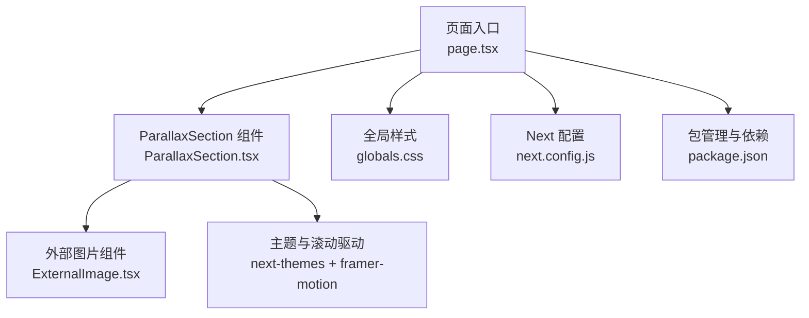
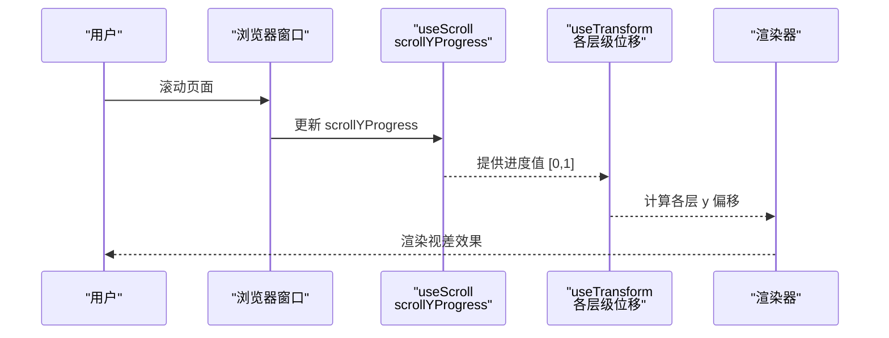
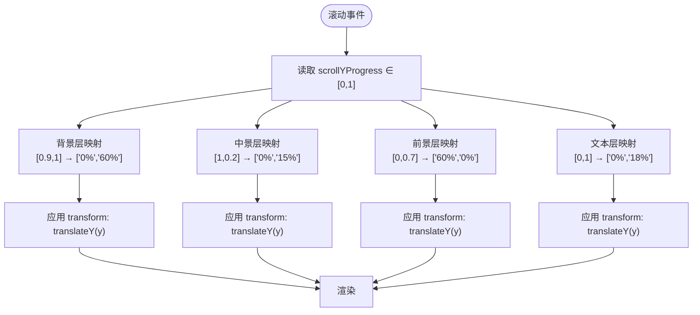
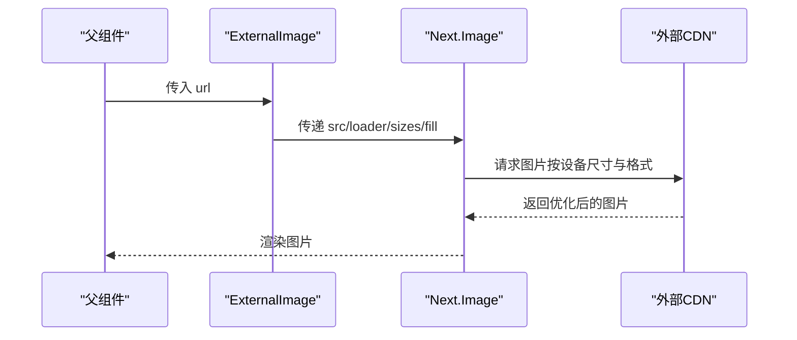
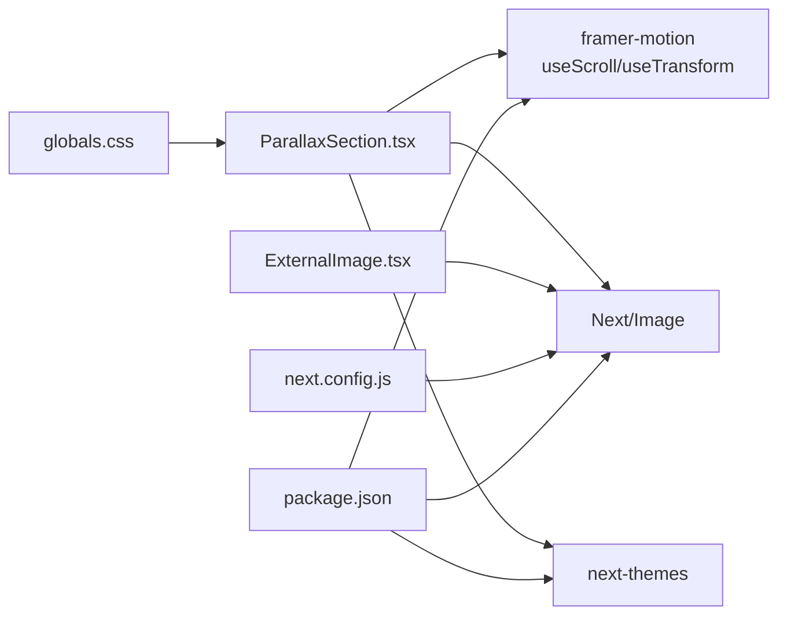

# 视差滚动组件

<cite>
**本文引用的文件**
- [ParallaxSection.tsx](file://blog-system2/frontend/src/components/Home/ParallaxSkeleton/ParallaxSection.tsx)
- [ExternalImage.tsx](file://blog-system2/frontend/src/components/Home/ParallaxSkeleton/ExternalImage.tsx)
- [package.json](file://blog-system2/frontend/package.json)
- [globals.css](file://blog-system2/frontend/src/app/globals.css)
- [layout.tsx](file://blog-system2/frontend/src/app/layout.tsx)
- [page.tsx](file://blog-system2/frontend/src/app/page.tsx)
- [next.config.js](file://blog-system2/frontend/next.config.js)
- [IMAGE_OPTIMIZATION.md](file://blog-system2/frontend/IMAGE_OPTIMIZATION.md)
</cite>

## 目录
1. [简介](#简介)
2. [项目结构](#项目结构)
3. [核心组件](#核心组件)
4. [架构总览](#架构总览)
5. [详细组件分析](#详细组件分析)
6. [依赖关系分析](#依赖关系分析)
7. [性能考量](#性能考量)
8. [故障排查指南](#故障排查指南)
9. [结论](#结论)
10. [附录](#附录)

## 简介
本技术文档围绕视差滚动组件展开，重点解析 ParallaxSection 的滚动监听实现（基于滚动进度驱动的动画）、各层级元素的位移算法、以及 ExternalImage 的懒加载与图片优化策略。文档同时阐述视差效果的数学原理（滚动偏移量计算、transform 矩阵应用）与性能优化技巧，并提供完整的配置项说明、浏览器兼容性与移动端优化建议。

## 项目结构
该组件位于前端工程的 Home 组件骨架下，配合 Next.js 的 Image 优化与 Tailwind 样式体系，形成一套可维护、高性能的视差滚动方案。

图表来源
- [page.tsx:499-504](file://blog-system2/frontend/src/app/page.tsx#L499-L504)
- [ParallaxSection.tsx:1-197](file://blog-system2/frontend/src/components/Home/ParallaxSkeleton/ParallaxSection.tsx#L1-L197)
- [ExternalImage.tsx:1-17](file://blog-system2/frontend/src/components/Home/ParallaxSkeleton/ExternalImage.tsx#L1-L17)
- [globals.css:217-236](file://blog-system2/frontend/src/app/globals.css#L217-L236)
- [next.config.js:20-33](file://blog-system2/frontend/next.config.js#L20-L33)
- [package.json:30-42](file://blog-system2/frontend/package.json#L30-L42)

章节来源
- [page.tsx:499-504](file://blog-system2/frontend/src/app/page.tsx#L499-L504)
- [ParallaxSection.tsx:1-197](file://blog-system2/frontend/src/components/Home/ParallaxSkeleton/ParallaxSection.tsx#L1-L197)
- [globals.css:217-236](file://blog-system2/frontend/src/app/globals.css#L217-L236)
- [next.config.js:20-33](file://blog-system2/frontend/next.config.js#L20-L33)
- [package.json:30-42](file://blog-system2/frontend/package.json#L30-L42)

## 核心组件
- ParallaxSection：负责滚动进度监听、多层级视差位移、主题切换与移动端降级策略。
- ExternalImage：封装 Next/Image 的懒加载与响应式尺寸策略，确保图片在不同设备下的最佳表现。

章节来源
- [ParallaxSection.tsx:9-19](file://blog-system2/frontend/src/components/Home/ParallaxSkeleton/ParallaxSection.tsx#L9-L19)
- [ExternalImage.tsx:3-16](file://blog-system2/frontend/src/components/Home/ParallaxSkeleton/ExternalImage.tsx#L3-L16)

## 架构总览
视差滚动由滚动进度驱动，通过 useScroll 与 useTransform 实现，结合主题与媒体查询进行移动端降级与暗色模式适配。

图表来源
- [ParallaxSection.tsx:34-56](file://blog-system2/frontend/src/components/Home/ParallaxSkeleton/ParallaxSection.tsx#L34-L56)

## 详细组件分析

### ParallaxSection 组件
- 滚动监听与进度计算
  - 使用 useScroll 监听容器滚动，offset 设置为 ["start end","end start"]，使容器顶部进入视口开始触发，底部离开视口结束。
  - scrollYProgress 作为统一进度源，映射到各层位移。
- 视差位移算法
  - 背景层：背景 Y 使用 useTransform，输入范围 [0.9,1] 映射到输出 ["0%","60%"]，移动端固定为 "0%"。
  - 中景层：中景 Y 使用 useTransform，输入范围 [1,0.2] 映射到输出 ["0%","15%"]，移动端固定为 "0%"。
  - 前景层：前景 Y 使用 useTransform，输入范围 [0,0.7] 映射到输出 ["60%","0%"]，移动端固定为 "0%"。
  - 文本层：文本 Y 使用 useTransform，输入范围 [0,1] 映射到输出 ["0%","18%"]，移动端固定为 "0%"。
  - 所有变换均应用自定义缓动曲线 cubicBezier(0.42,0,0.58,1)，保证平滑的非线性加速体验。
- 主题与暗色模式
  - 通过 next-themes 判断当前主题，动态切换背景与滤镜参数，实现明暗两套视觉风格。
- 移动端优化
  - 使用 window.matchMedia 监测断点，移动端直接跳过滚动驱动，采用静态展示或 CSS 过渡，避免性能损耗。
  - 全局样式对移动端进行动画降级与 will-change 优化。
- 结构层次
  - 后景层：背景图 + 可选暗色覆盖层
  - 中景层：中景图 + 滤镜调整 + 暗色遮罩 + 青色保留层（仅桌面端）
  - 文本层：居中展示的 MorphingText 动画
  - 前景层：前景图 + 滤镜调整 + 暗色遮罩 + 青色保留层（仅桌面端）
  - 底部渐变融合层：与页面背景自然衔接

图表来源
- [ParallaxSection.tsx:34-56](file://blog-system2/frontend/src/components/Home/ParallaxSkeleton/ParallaxSection.tsx#L34-L56)

章节来源
- [ParallaxSection.tsx:24-30](file://blog-system2/frontend/src/components/Home/ParallaxSkeleton/ParallaxSection.tsx#L24-L30)
- [ParallaxSection.tsx:34-56](file://blog-system2/frontend/src/components/Home/ParallaxSkeleton/ParallaxSection.tsx#L34-L56)
- [ParallaxSection.tsx:64-194](file://blog-system2/frontend/src/components/Home/ParallaxSkeleton/ParallaxSection.tsx#L64-L194)

### ExternalImage 组件
- 懒加载与尺寸策略
  - 使用 Next/Image 的 loader 自定义为直传 src，确保外部资源可被正确加载。
  - sizes 设置为 "(max-width: 768px) 100vw, 50vw"，移动端使用全屏宽度，桌面端使用 50vw，提升加载效率与视觉质量。
- 优化要点
  - fill 与 object-cover 确保图片填充容器且保持比例。
  - 与全局 Next 配置配合，支持 WebP 格式与域名白名单。

图表来源
- [ExternalImage.tsx:6-13](file://blog-system2/frontend/src/components/Home/ParallaxSkeleton/ExternalImage.tsx#L6-L13)
- [next.config.js:20-33](file://blog-system2/frontend/next.config.js#L20-L33)

章节来源
- [ExternalImage.tsx:3-16](file://blog-system2/frontend/src/components/Home/ParallaxSkeleton/ExternalImage.tsx#L3-L16)
- [next.config.js:20-33](file://blog-system2/frontend/next.config.js#L20-L33)

### 视差数学原理与 transform 矩阵
- 滚动偏移量计算
  - scrollYProgress 表征容器在视口中的滚动进度，范围 [0,1]。
  - 各层的输入区间与输出区间共同决定视差幅度与方向。
- transform 矩阵应用
  - 通过 useTransform 将进度映射到 translateY 偏移，最终由 CSS transform: translateZ(0) 强制开启硬件加速。
- 性能优化技巧
  - will-change-transform 与 transform: translateZ(0) 提升合成层性能。
  - 移动端禁用滚动驱动，改用 CSS 过渡与滤镜，降低 GPU 压力。
  - 主题切换使用 CSS 过渡与滤镜参数，避免重排重绘。

章节来源
- [ParallaxSection.tsx:39-56](file://blog-system2/frontend/src/components/Home/ParallaxSkeleton/ParallaxSection.tsx#L39-L56)
- [globals.css:217-236](file://blog-system2/frontend/src/app/globals.css#L217-L236)

### 配置选项与使用方式
- 组件属性
  - foregroundImage: 前景图片路径
  - midgroundImage: 中景图片路径
  - backgroundImage: 背景图片路径
  - backgroundImageDark: 暗色模式背景图片路径（可选）
- 使用示例
  - 在页面中引入 ParallaxSection，并传入上述图片路径。
- 响应式断点
  - 移动端断点为 767px，超过该宽度启用滚动驱动视差。
- 主题适配
  - 通过 next-themes 切换明暗模式，自动调整滤镜与遮罩。

章节来源
- [ParallaxSection.tsx:9-19](file://blog-system2/frontend/src/components/Home/ParallaxSkeleton/ParallaxSection.tsx#L9-L19)
- [page.tsx:499-504](file://blog-system2/frontend/src/app/page.tsx#L499-L504)

## 依赖关系分析
- 组件依赖
  - ParallaxSection 依赖 framer-motion 的 useScroll/useTransform、Next/Image、next-themes。
  - ExternalImage 依赖 Next/Image。
- 样式与配置
  - 全局样式提供移动端降级与 will-change 优化。
  - Next 配置启用 WebP、域名白名单与设备尺寸列表。
- 包依赖
  - motion、framer-motion、next、next-themes 等。

图表来源
- [ParallaxSection.tsx:3-7](file://blog-system2/frontend/src/components/Home/ParallaxSkeleton/ParallaxSection.tsx#L3-L7)
- [ExternalImage.tsx:1](file://blog-system2/frontend/src/components/Home/ParallaxSkeleton/ExternalImage.tsx#L1)
- [globals.css:217-236](file://blog-system2/frontend/src/app/globals.css#L217-L236)
- [next.config.js:20-33](file://blog-system2/frontend/next.config.js#L20-L33)
- [package.json:30-42](file://blog-system2/frontend/package.json#L30-L42)

章节来源
- [package.json:30-42](file://blog-system2/frontend/package.json#L30-L42)
- [next.config.js:20-33](file://blog-system2/frontend/next.config.js#L20-L33)

## 性能考量
- 滚动驱动优化
  - 使用 useTransform 将滚动进度映射到 transform，避免频繁重排。
  - will-change-transform 与 transform: translateZ(0) 强制合成层，提升渲染性能。
- 移动端降级
  - 通过媒体查询与 isMobile 标志，移动端禁用滚动驱动，采用 CSS 过渡与滤镜，显著降低能耗。
- 图片优化
  - Next/Image 自动根据设备像素比与屏幕宽度选择最优尺寸与格式（WebP）。
  - 响应式 sizes 与 loader 策略减少带宽占用。
- 主题切换
  - 使用 CSS 过渡与滤镜参数，避免复杂计算与重绘。

章节来源
- [ParallaxSection.tsx:22-30](file://blog-system2/frontend/src/components/Home/ParallaxSkeleton/ParallaxSection.tsx#L22-L30)
- [globals.css:217-236](file://blog-system2/frontend/src/app/globals.css#L217-L236)
- [next.config.js:20-33](file://blog-system2/frontend/next.config.js#L20-L33)

## 故障排查指南
- 视差不生效
  - 检查容器是否正确传入 ref，确保 offset ["start end","end start"] 能够触发。
  - 确认移动端断点逻辑未拦截（isMobile 为 false 时才启用滚动驱动）。
- 图片加载异常
  - 确认域名已在 next.config.js 的 domains 白名单中。
  - 检查 ExternalImage 的 loader 是否返回有效 URL。
- 性能问题
  - 移动端确认 isMobile 逻辑生效，避免滚动驱动。
  - 检查全局样式中移动端动画降级规则是否被覆盖。
- 主题切换异常
  - 确认 next-themes 已正确初始化，检查 resolvedTheme 判断逻辑。

章节来源
- [ParallaxSection.tsx:34-37](file://blog-system2/frontend/src/components/Home/ParallaxSkeleton/ParallaxSection.tsx#L34-L37)
- [ParallaxSection.tsx:22-30](file://blog-system2/frontend/src/components/Home/ParallaxSkeleton/ParallaxSection.tsx#L22-L30)
- [next.config.js:22-28](file://blog-system2/frontend/next.config.js#L22-L28)
- [ExternalImage.tsx:8](file://blog-system2/frontend/src/components/Home/ParallaxSkeleton/ExternalImage.tsx#L8)

## 结论
本组件通过滚动进度驱动的多层视差，结合主题与移动端降级策略，在保证视觉效果的同时兼顾性能与可维护性。ExternalImage 的懒加载与响应式尺寸进一步优化了图片加载体验。建议在生产环境中配合 Next/Image 的自动优化与 WebP 格式，以获得更佳的加载速度与用户体验。

## 附录
- 浏览器兼容性
  - useScroll/useTransform 依赖现代浏览器的滚动与动画 API，移动端 Safari 与 Chrome 支持良好。
  - 全局样式中的 will-change 与 transform: translateZ(0) 在主流浏览器中可触发硬件加速。
- 移动端性能优化建议
  - 保持 isMobile 逻辑开启，避免滚动驱动。
  - 使用 CSS 过渡替代复杂 JS 动画。
  - 控制合成层数量，避免过度使用 will-change。
- 图片优化最佳实践
  - 使用 WebP 格式与合适的尺寸列表。
  - 通过 sizes 与 loader 策略减少不必要的带宽消耗。
  - 参考 IMAGE_OPTIMIZATION.md 的批量处理流程，确保图片质量与体积平衡。

章节来源
- [globals.css:217-236](file://blog-system2/frontend/src/app/globals.css#L217-L236)
- [next.config.js:20-33](file://blog-system2/frontend/next.config.js#L20-L33)
- [IMAGE_OPTIMIZATION.md:1-28](file://blog-system2/frontend/IMAGE_OPTIMIZATION.md#L1-L28)