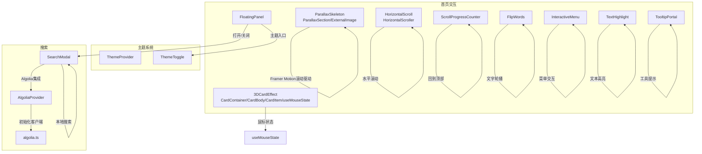
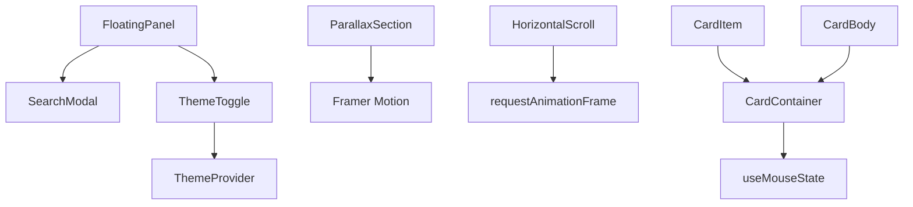
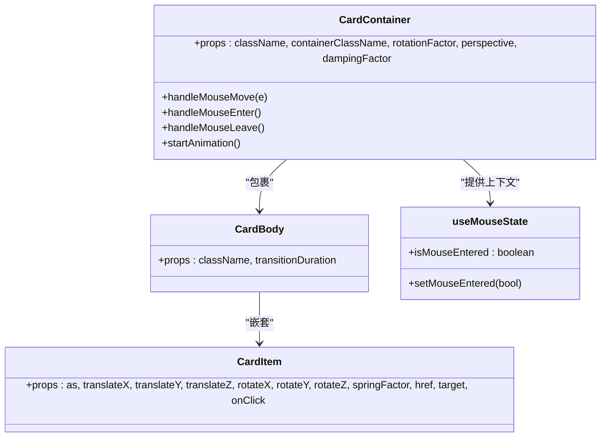
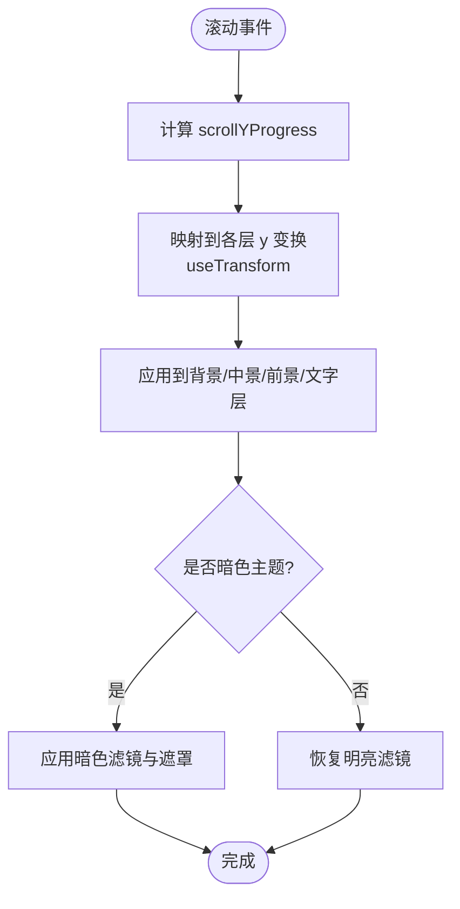
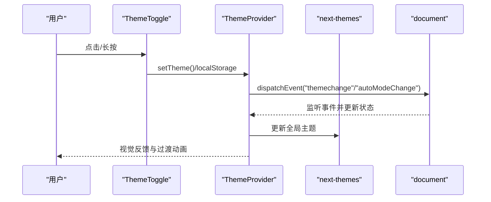
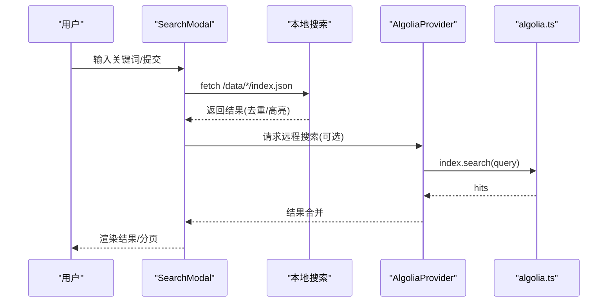
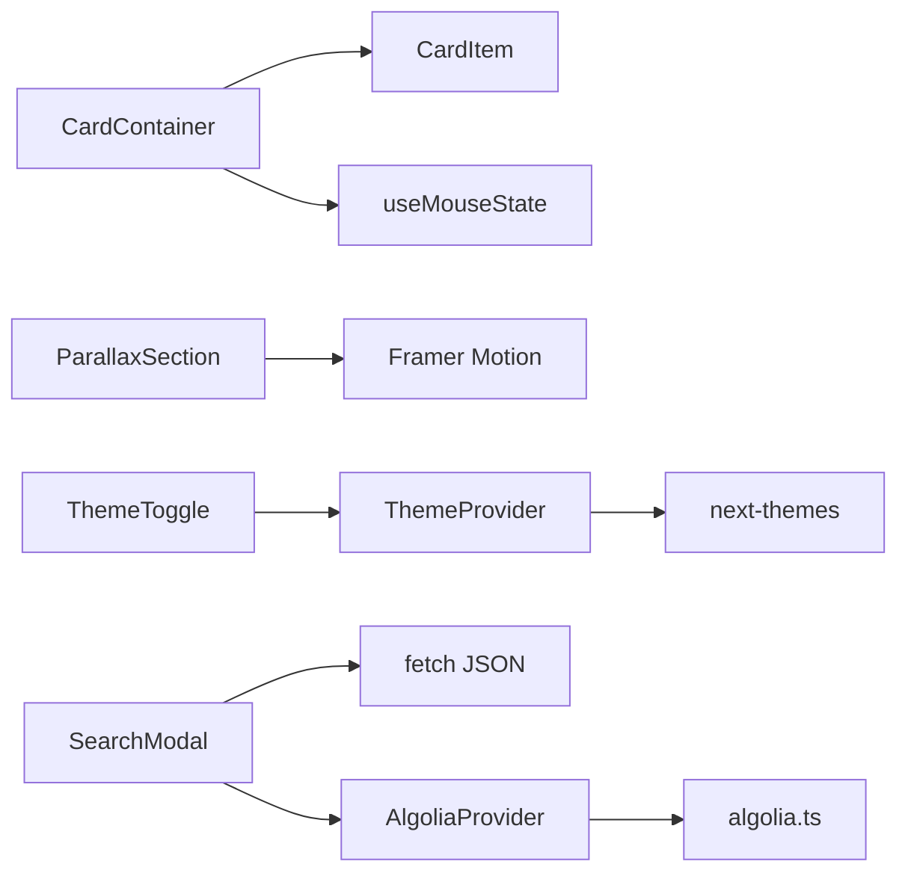

# 用户界面组件

<cite>
**本文档引用的文件**
- [CardContainer.tsx](file://blog-system2/frontend/src/components/Home/3DCardEffect/CardContainer.tsx)
- [CardBody.tsx](file://blog-system2/frontend/src/components/Home/3DCardEffect/CardBody.tsx)
- [CardItem.tsx](file://blog-system2/frontend/src/components/Home/3DCardEffect/CardItem.tsx)
- [useMouseState.ts](file://blog-system2/frontend/src/components/Home/3DCardEffect/useMouseState.ts)
- [ParallaxSection.tsx](file://blog-system2/frontend/src/components/Home/ParallaxSkeleton/ParallaxSection.tsx)
- [ExternalImage.tsx](file://blog-system2/frontend/src/components/Home/ParallaxSkeleton/ExternalImage.tsx)
- [HorizontalScroll.tsx](file://blog-system2/frontend/src/components/Home/HorizontalScroll/HorizontalScroll.tsx)
- [ScrollProgressCounter.tsx](file://blog-system2/frontend/src/components/Home/ScrollProgressCounter.tsx)
- [FloatingPanel.tsx](file://blog-system2/frontend/src/components/Home/FloatingPanel.tsx)
- [FlipWords.tsx](file://blog-system2/frontend/src/components/Home/FlipWords.tsx)
- [InteractiveMenu.tsx](file://blog-system2/frontend/src/components/Home/InteractiveMenu.tsx)
- [TextHighlight.tsx](file://blog-system2/frontend/src/components/Home/TextHighlight.tsx)
- [TooltipPortal.tsx](file://blog-system2/frontend/src/components/Home/TooltipPortal.tsx)
- [ThemeProvider.tsx](file://blog-system2/frontend/src/components/theme/ThemeProvider.tsx)
- [ThemeToggle.tsx](file://blog-system2/frontend/src/components/theme/ThemeToggle.tsx)
- [SearchModal.tsx](file://blog-system2/frontend/src/components/Search/SearchModal.tsx)
- [AlgoliaProvider.tsx](file://blog-system2/frontend/src/components/Search/AlgoliaProvider.tsx)
- [algolia.ts](file://blog-system2/frontend/src/lib/algolia.ts)
</cite>

## 目录
1. [引言](#引言)
2. [项目结构](#项目结构)
3. [核心组件](#核心组件)
4. [架构总览](#架构总览)
5. [详细组件分析](#详细组件分析)
6. [依赖分析](#依赖分析)
7. [性能考量](#性能考量)
8. [故障排查指南](#故障排查指南)
9. [结论](#结论)
10. [附录](#附录)

## 引言
本文件面向技术博客平台的前端UI组件，系统性梳理并解析以下能力模块：
- 3D卡片效果：基于原生DOM与requestAnimationFrame的鼠标交互与弹簧阻尼动画
- 视差滚动：基于Framer Motion的滚动驱动视差与移动端性能优化
- 主题切换：基于next-themes的状态管理与自动/手动模式、无障碍适配
- 搜索模态框：本地聚合搜索与Algolia集成的双轨方案、Canvas粒子动画
- 其他交互组件：悬浮面板、进度指示、翻转文字、滚动进度、水平滚动等

目标是帮助开发者快速理解组件设计理念、实现细节、API与最佳实践，并掌握组件间协作与数据流。

## 项目结构
UI组件主要位于 src/components 下，按功能域划分：
- Home：首页交互组件（3D卡片、视差、滚动进度、浮动面板等）
- theme：主题系统（Provider、Toggle、通知）
- Search：搜索相关（模态框、Algolia Provider、脚本注入）
- 其他：magicui、reactbits、ui等辅助组件

**图表来源**
- [CardContainer.tsx:1-121](file://blog-system2/frontend/src/components/Home/3DCardEffect/CardContainer.tsx#L1-L121)
- [useMouseState.ts:1-11](file://blog-system2/frontend/src/components/Home/3DCardEffect/useMouseState.ts#L1-L11)
- [ParallaxSection.tsx:1-197](file://blog-system2/frontend/src/components/Home/ParallaxSkeleton/ParallaxSection.tsx#L1-L197)
- [HorizontalScroll.tsx:1-386](file://blog-system2/frontend/src/components/Home/HorizontalScroll/HorizontalScroll.tsx#L1-L386)
- [ScrollProgressCounter.tsx:1-241](file://blog-system2/frontend/src/components/Home/ScrollProgressCounter.tsx#L1-L241)
- [FloatingPanel.tsx:1-437](file://blog-system2/frontend/src/components/Home/FloatingPanel.tsx#L1-L437)
- [FlipWords.tsx:1-57](file://blog-system2/frontend/src/components/Home/FlipWords.tsx#L1-L57)
- [InteractiveMenu.tsx:1-72](file://blog-system2/frontend/src/components/Home/InteractiveMenu.tsx#L1-L72)
- [TextHighlight.tsx:1-45](file://blog-system2/frontend/src/components/Home/TextHighlight.tsx#L1-L45)
- [TooltipPortal.tsx:1-56](file://blog-system2/frontend/src/components/Home/TooltipPortal.tsx#L1-L56)
- [ThemeProvider.tsx:1-161](file://blog-system2/frontend/src/components/theme/ThemeProvider.tsx#L1-L161)
- [ThemeToggle.tsx:1-343](file://blog-system2/frontend/src/components/theme/ThemeToggle.tsx#L1-L343)
- [SearchModal.tsx:1-935](file://blog-system2/frontend/src/components/Search/SearchModal.tsx#L1-L935)
- [AlgoliaProvider.tsx:1-100](file://blog-system2/frontend/src/components/Search/AlgoliaProvider.tsx#L1-L100)
- [algolia.ts:1-46](file://blog-system2/frontend/src/lib/algolia.ts#L1-L46)

**章节来源**
- [CardContainer.tsx:1-121](file://blog-system2/frontend/src/components/Home/3DCardEffect/CardContainer.tsx#L1-L121)
- [ParallaxSection.tsx:1-197](file://blog-system2/frontend/src/components/Home/ParallaxSkeleton/ParallaxSection.tsx#L1-L197)
- [HorizontalScroll.tsx:1-386](file://blog-system2/frontend/src/components/Home/HorizontalScroll/HorizontalScroll.tsx#L1-L386)
- [ScrollProgressCounter.tsx:1-241](file://blog-system2/frontend/src/components/Home/ScrollProgressCounter.tsx#L1-L241)
- [FloatingPanel.tsx:1-437](file://blog-system2/frontend/src/components/Home/FloatingPanel.tsx#L1-L437)
- [FlipWords.tsx:1-57](file://blog-system2/frontend/src/components/Home/FlipWords.tsx#L1-L57)
- [InteractiveMenu.tsx:1-72](file://blog-system2/frontend/src/components/Home/InteractiveMenu.tsx#L1-L72)
- [TextHighlight.tsx:1-45](file://blog-system2/frontend/src/components/Home/TextHighlight.tsx#L1-L45)
- [TooltipPortal.tsx:1-56](file://blog-system2/frontend/src/components/Home/TooltipPortal.tsx#L1-L56)
- [ThemeProvider.tsx:1-161](file://blog-system2/frontend/src/components/theme/ThemeProvider.tsx#L1-L161)
- [ThemeToggle.tsx:1-343](file://blog-system2/frontend/src/components/theme/ThemeToggle.tsx#L1-L343)
- [SearchModal.tsx:1-935](file://blog-system2/frontend/src/components/Search/SearchModal.tsx#L1-L935)
- [AlgoliaProvider.tsx:1-100](file://blog-system2/frontend/src/components/Search/AlgoliaProvider.tsx#L1-L100)
- [algolia.ts:1-46](file://blog-system2/frontend/src/lib/algolia.ts#L1-L46)

## 核心组件
- 3D卡片效果：通过鼠标状态上下文与弹簧阻尼算法，实现卡片在X/Y轴的旋转与子项的位移/旋转跟随
- 视差滚动：使用Framer Motion的useScroll与useTransform，桌面端滚动驱动，移动端降级为静态或简化过渡
- 主题切换：Provider集中管理主题状态、自动模式、无障碍偏好，Toggle支持长按切换自动模式
- 搜索模态框：本地聚合搜索与Algolia双轨，Canvas绘制文本粒子动画，分页与高亮
- 浮动面板：集合搜索入口、导航菜单与主题切换入口，带电子风格背景动画
- 其他：滚动进度、翻转文字、交互菜单、文本高亮、工具提示等

**章节来源**
- [CardContainer.tsx:1-121](file://blog-system2/frontend/src/components/Home/3DCardEffect/CardContainer.tsx#L1-L121)
- [ParallaxSection.tsx:1-197](file://blog-system2/frontend/src/components/Home/ParallaxSkeleton/ParallaxSection.tsx#L1-L197)
- [ThemeProvider.tsx:1-161](file://blog-system2/frontend/src/components/theme/ThemeProvider.tsx#L1-L161)
- [ThemeToggle.tsx:1-343](file://blog-system2/frontend/src/components/theme/ThemeToggle.tsx#L1-L343)
- [SearchModal.tsx:1-935](file://blog-system2/frontend/src/components/Search/SearchModal.tsx#L1-L935)
- [FloatingPanel.tsx:1-437](file://blog-system2/frontend/src/components/Home/FloatingPanel.tsx#L1-L437)
- [ScrollProgressCounter.tsx:1-241](file://blog-system2/frontend/src/components/Home/ScrollProgressCounter.tsx#L1-L241)
- [FlipWords.tsx:1-57](file://blog-system2/frontend/src/components/Home/FlipWords.tsx#L1-L57)
- [InteractiveMenu.tsx:1-72](file://blog-system2/frontend/src/components/Home/InteractiveMenu.tsx#L1-L72)
- [TextHighlight.tsx:1-45](file://blog-system2/frontend/src/components/Home/TextHighlight.tsx#L1-L45)
- [TooltipPortal.tsx:1-56](file://blog-system2/frontend/src/components/Home/TooltipPortal.tsx#L1-L56)

## 架构总览
组件间协作关系如下：
- 浮动面板作为入口，承载搜索模态框与主题切换入口
- 3D卡片与视差滚动分别独立工作，但都依赖浏览器渲染管线与事件循环
- 主题系统通过Provider与自定义事件实现跨组件状态同步
- 搜索模态框可选择本地聚合或Algolia，二者互不干扰

**图表来源**
- [FloatingPanel.tsx:1-437](file://blog-system2/frontend/src/components/Home/FloatingPanel.tsx#L1-L437)
- [SearchModal.tsx:1-935](file://blog-system2/frontend/src/components/Search/SearchModal.tsx#L1-L935)
- [ThemeToggle.tsx:1-343](file://blog-system2/frontend/src/components/theme/ThemeToggle.tsx#L1-L343)
- [ThemeProvider.tsx:1-161](file://blog-system2/frontend/src/components/theme/ThemeProvider.tsx#L1-L161)
- [ParallaxSection.tsx:1-197](file://blog-system2/frontend/src/components/Home/ParallaxSkeleton/ParallaxSection.tsx#L1-L197)
- [HorizontalScroll.tsx:1-386](file://blog-system2/frontend/src/components/Home/HorizontalScroll/HorizontalScroll.tsx#L1-L386)
- [CardContainer.tsx:1-121](file://blog-system2/frontend/src/components/Home/3DCardEffect/CardContainer.tsx#L1-L121)
- [CardItem.tsx:1-136](file://blog-system2/frontend/src/components/Home/3DCardEffect/CardItem.tsx#L1-L136)
- [CardBody.tsx:1-30](file://blog-system2/frontend/src/components/Home/3DCardEffect/CardBody.tsx#L1-L30)
- [useMouseState.ts:1-11](file://blog-system2/frontend/src/components/Home/3DCardEffect/useMouseState.ts#L1-L11)

## 详细组件分析

### 3D卡片效果组件
- 设计理念
  - 通过鼠标进入/离开与移动事件，计算目标旋转角度，结合弹簧阻尼算法平滑过渡
  - 子项支持独立的位移与旋转参数，形成层次化跟随效果
- 实现要点
  - 上下文共享鼠标状态，避免重复计算
  - 使用requestAnimationFrame与阻尼因子控制动画节奏
  - preserve-3d与will-change优化3D变换性能
- API概览
  - CardContainer
    - 属性：className、containerClassName、rotationFactor、perspective、dampingFactor
    - 事件：无（通过上下文与回调控制）
  - CardBody
    - 属性：className、transitionDuration
  - CardItem
    - 属性：as、translateX/Y/Z、rotateX/Y/Z、springFactor、href、target、onClick
    - 事件：onClick（透传）
  - useMouseState
    - 返回：isMouseEntered、setMouseEntered

**图表来源**
- [CardContainer.tsx:1-121](file://blog-system2/frontend/src/components/Home/3DCardEffect/CardContainer.tsx#L1-L121)
- [CardBody.tsx:1-30](file://blog-system2/frontend/src/components/Home/3DCardEffect/CardBody.tsx#L1-L30)
- [CardItem.tsx:1-136](file://blog-system2/frontend/src/components/Home/3DCardEffect/CardItem.tsx#L1-L136)
- [useMouseState.ts:1-11](file://blog-system2/frontend/src/components/Home/3DCardEffect/useMouseState.ts#L1-L11)

**章节来源**
- [CardContainer.tsx:1-121](file://blog-system2/frontend/src/components/Home/3DCardEffect/CardContainer.tsx#L1-L121)
- [CardBody.tsx:1-30](file://blog-system2/frontend/src/components/Home/3DCardEffect/CardBody.tsx#L1-L30)
- [CardItem.tsx:1-136](file://blog-system2/frontend/src/components/Home/3DCardEffect/CardItem.tsx#L1-L136)
- [useMouseState.ts:1-11](file://blog-system2/frontend/src/components/Home/3DCardEffect/useMouseState.ts#L1-L11)

### 视差滚动组件
- 设计理念
  - 桌面端使用Framer Motion的滚动驱动视差，移动端降级为静态或简化滤镜
  - 通过主题状态动态切换明暗滤镜与遮罩，增强沉浸感
- 实现要点
  - useScroll与useTransform计算各层位移曲线
  - cubicBezier缓动与will-change优化
  - 响应式媒体查询判断移动端，避免不必要的滚动监听
- API概览
  - ParallaxSection
    - 属性：foregroundImage、midgroundImage、backgroundImage、backgroundImageDark
    - 行为：根据滚动进度驱动各层位移与滤镜

**图表来源**
- [ParallaxSection.tsx:1-197](file://blog-system2/frontend/src/components/Home/ParallaxSkeleton/ParallaxSection.tsx#L1-L197)

**章节来源**
- [ParallaxSection.tsx:1-197](file://blog-system2/frontend/src/components/Home/ParallaxSkeleton/ParallaxSection.tsx#L1-L197)
- [ExternalImage.tsx:1-17](file://blog-system2/frontend/src/components/Home/ParallaxSkeleton/ExternalImage.tsx#L1-L17)

### 主题切换组件
- 设计理念
  - Provider集中管理主题状态、自动模式与无障碍偏好
  - Toggle支持点击手动切换与长按进入自动模式，自动模式按时间段切换
- 实现要点
  - 自定义事件“themechange”与“autoModeChange”跨组件通信
  - localStorage持久化用户覆盖与自动模式开关
  - 过渡动画与减少动画模式适配
- API概览
  - ThemeProvider
    - 属性：继承next-themes Provider
    - 行为：挂载阶段、自动模式定时器、事件监听
  - ThemeToggle
    - 行为：切换主题、切换自动模式、长按逻辑、无障碍适配

**图表来源**
- [ThemeToggle.tsx:1-343](file://blog-system2/frontend/src/components/theme/ThemeToggle.tsx#L1-L343)
- [ThemeProvider.tsx:1-161](file://blog-system2/frontend/src/components/theme/ThemeProvider.tsx#L1-L161)

**章节来源**
- [ThemeProvider.tsx:1-161](file://blog-system2/frontend/src/components/theme/ThemeProvider.tsx#L1-L161)
- [ThemeToggle.tsx:1-343](file://blog-system2/frontend/src/components/theme/ThemeToggle.tsx#L1-L343)

### 搜索模态框组件
- 设计理念
  - 提供统一搜索入口，支持本地聚合搜索与Algolia远程搜索
  - Canvas绘制文本粒子动画，移动端跳过动画以提升性能
- 实现要点
  - 本地搜索：读取站点数据JSON，聚合文章、通知、资源、关于页
  - 分页与高亮：每页最多6条，关键词高亮
  - Algolia集成：Provider注入脚本与手动初始化，lib封装检索接口
- API概览
  - SearchModal
    - 属性：isOpen、onClose
    - 行为：输入监听、Canvas动画、搜索触发、分页渲染
  - AlgoliaProvider
    - 行为：脚本加载、客户端初始化、兜底初始化
  - algolia.ts
    - 方法：searchPosts(query) -> Promise<SearchResult[]>

**图表来源**
- [SearchModal.tsx:1-935](file://blog-system2/frontend/src/components/Search/SearchModal.tsx#L1-L935)
- [AlgoliaProvider.tsx:1-100](file://blog-system2/frontend/src/components/Search/AlgoliaProvider.tsx#L1-L100)
- [algolia.ts:1-46](file://blog-system2/frontend/src/lib/algolia.ts#L1-L46)

**章节来源**
- [SearchModal.tsx:1-935](file://blog-system2/frontend/src/components/Search/SearchModal.tsx#L1-L935)
- [AlgoliaProvider.tsx:1-100](file://blog-system2/frontend/src/components/Search/AlgoliaProvider.tsx#L1-L100)
- [algolia.ts:1-46](file://blog-system2/frontend/src/lib/algolia.ts#L1-L46)

### 其他交互组件
- 悬浮面板 FloatingPanel
  - 行为：遮罩层点击关闭、电路风格背景动画、搜索入口、导航菜单、主题入口
- 滚动进度 ScrollProgressCounter
  - 行为：监听滚动进度、百分比动画、回到顶部与弹性动画
- 翻转文字 FlipWords
  - 行为：定时轮换单词，入场/离场动画
- 交互菜单 InteractiveMenu
  - 行为：触摸设备降级、悬停/点击样式变化
- 文本高亮 TextHighlight
  - 行为：CSS变量驱动的背景展开与文字颜色变化
- 工具提示 TooltipPortal
  - 行为：Portal渲染至body，基于锚点矩形定位

**章节来源**
- [FloatingPanel.tsx:1-437](file://blog-system2/frontend/src/components/Home/FloatingPanel.tsx#L1-L437)
- [ScrollProgressCounter.tsx:1-241](file://blog-system2/frontend/src/components/Home/ScrollProgressCounter.tsx#L1-L241)
- [FlipWords.tsx:1-57](file://blog-system2/frontend/src/components/Home/FlipWords.tsx#L1-L57)
- [InteractiveMenu.tsx:1-72](file://blog-system2/frontend/src/components/Home/InteractiveMenu.tsx#L1-L72)
- [TextHighlight.tsx:1-45](file://blog-system2/frontend/src/components/Home/TextHighlight.tsx#L1-L45)
- [TooltipPortal.tsx:1-56](file://blog-system2/frontend/src/components/Home/TooltipPortal.tsx#L1-L56)

## 依赖分析
- 组件耦合
  - 3D卡片：CardContainer与CardItem强关联，共享MouseState上下文
  - 视差滚动：依赖Framer Motion与主题状态，与页面滚动解耦
  - 主题系统：通过自定义事件与next-themes实现跨组件通信
  - 搜索：SearchModal可独立工作，也可与AlgoliaProvider配合
- 外部依赖
  - Framer Motion：滚动驱动与动画
  - next-themes：主题提供者
  - next/image：图片优化
  - react-icons：图标
  - react-dom：Portal

**图表来源**
- [CardContainer.tsx:1-121](file://blog-system2/frontend/src/components/Home/3DCardEffect/CardContainer.tsx#L1-L121)
- [CardItem.tsx:1-136](file://blog-system2/frontend/src/components/Home/3DCardEffect/CardItem.tsx#L1-L136)
- [useMouseState.ts:1-11](file://blog-system2/frontend/src/components/Home/3DCardEffect/useMouseState.ts#L1-L11)
- [ParallaxSection.tsx:1-197](file://blog-system2/frontend/src/components/Home/ParallaxSkeleton/ParallaxSection.tsx#L1-L197)
- [ThemeToggle.tsx:1-343](file://blog-system2/frontend/src/components/theme/ThemeToggle.tsx#L1-L343)
- [ThemeProvider.tsx:1-161](file://blog-system2/frontend/src/components/theme/ThemeProvider.tsx#L1-L161)
- [SearchModal.tsx:1-935](file://blog-system2/frontend/src/components/Search/SearchModal.tsx#L1-L935)
- [AlgoliaProvider.tsx:1-100](file://blog-system2/frontend/src/components/Search/AlgoliaProvider.tsx#L1-L100)
- [algolia.ts:1-46](file://blog-system2/frontend/src/lib/algolia.ts#L1-L46)

**章节来源**
- [CardContainer.tsx:1-121](file://blog-system2/frontend/src/components/Home/3DCardEffect/CardContainer.tsx#L1-L121)
- [CardItem.tsx:1-136](file://blog-system2/frontend/src/components/Home/3DCardEffect/CardItem.tsx#L1-L136)
- [ParallaxSection.tsx:1-197](file://blog-system2/frontend/src/components/Home/ParallaxSkeleton/ParallaxSection.tsx#L1-L197)
- [ThemeProvider.tsx:1-161](file://blog-system2/frontend/src/components/theme/ThemeProvider.tsx#L1-L161)
- [ThemeToggle.tsx:1-343](file://blog-system2/frontend/src/components/theme/ThemeToggle.tsx#L1-L343)
- [SearchModal.tsx:1-935](file://blog-system2/frontend/src/components/Search/SearchModal.tsx#L1-L935)
- [AlgoliaProvider.tsx:1-100](file://blog-system2/frontend/src/components/Search/AlgoliaProvider.tsx#L1-L100)
- [algolia.ts:1-46](file://blog-system2/frontend/src/lib/algolia.ts#L1-L46)

## 性能考量
- 3D卡片
  - 使用requestAnimationFrame与阻尼算法，避免高频重排
  - preserve-3d与will-change提升3D变换性能
- 视差滚动
  - 移动端禁用useScroll，直接静态展示，减少滚动监听与计算
  - 使用will-change-transform与滤镜过渡优化
- 搜索模态框
  - Canvas动画在移动端跳过，降低CPU/GPU占用
  - 本地搜索分页与去重，限制结果数量
- 主题切换
  - 减少动画模式下使用简洁过渡，避免复杂动画
  - 事件监听在卸载时清理，避免内存泄漏

[本节为通用性能建议，无需特定文件引用]

## 故障排查指南
- Algolia未初始化
  - 现象：搜索无响应或报错
  - 排查：确认脚本加载策略与onLoad回调、手动初始化流程
  - 参考
    - [AlgoliaProvider.tsx:1-100](file://blog-system2/frontend/src/components/Search/AlgoliaProvider.tsx#L1-L100)
    - [algolia.ts:1-46](file://blog-system2/frontend/src/lib/algolia.ts#L1-L46)
- 主题切换无效
  - 现象：点击无反应或自动模式不生效
  - 排查：检查自定义事件监听、localStorage状态、无障碍偏好
  - 参考
    - [ThemeToggle.tsx:1-343](file://blog-system2/frontend/src/components/theme/ThemeToggle.tsx#L1-L343)
    - [ThemeProvider.tsx:1-161](file://blog-system2/frontend/src/components/theme/ThemeProvider.tsx#L1-L161)
- 3D卡片无响应
  - 现象：鼠标移动无旋转
  - 排查：确认容器ref存在、阻尼动画未被提前终止、触摸设备匹配
  - 参考
    - [CardContainer.tsx:1-121](file://blog-system2/frontend/src/components/Home/3DCardEffect/CardContainer.tsx#L1-L121)
    - [CardItem.tsx:1-136](file://blog-system2/frontend/src/components/Home/3DCardEffect/CardItem.tsx#L1-L136)
- 视差滚动异常
  - 现象：滚动无效果或抖动
  - 排查：检查scrollYProgress映射、移动端降级逻辑、滤镜与遮罩
  - 参考
    - [ParallaxSection.tsx:1-197](file://blog-system2/frontend/src/components/Home/ParallaxSkeleton/ParallaxSection.tsx#L1-L197)

**章节来源**
- [AlgoliaProvider.tsx:1-100](file://blog-system2/frontend/src/components/Search/AlgoliaProvider.tsx#L1-L100)
- [algolia.ts:1-46](file://blog-system2/frontend/src/lib/algolia.ts#L1-L46)
- [ThemeToggle.tsx:1-343](file://blog-system2/frontend/src/components/theme/ThemeToggle.tsx#L1-L343)
- [ThemeProvider.tsx:1-161](file://blog-system2/frontend/src/components/theme/ThemeProvider.tsx#L1-L161)
- [CardContainer.tsx:1-121](file://blog-system2/frontend/src/components/Home/3DCardEffect/CardContainer.tsx#L1-L121)
- [CardItem.tsx:1-136](file://blog-system2/frontend/src/components/Home/3DCardEffect/CardItem.tsx#L1-L136)
- [ParallaxSection.tsx:1-197](file://blog-system2/frontend/src/components/Home/ParallaxSkeleton/ParallaxSection.tsx#L1-L197)

## 结论
本UI组件库围绕“高性能、可访问、可扩展”的目标构建：
- 3D卡片与视差滚动在桌面端提供沉浸式体验，移动端进行降级优化
- 主题系统通过Provider与事件实现跨组件状态同步，兼顾自动与手动模式
- 搜索模态框提供本地与远程双轨方案，兼顾易用性与性能
- 其他交互组件完善了导航、反馈与装饰性效果

建议在新业务中优先采用现有模式：事件驱动的状态管理、性能优先的移动端降级、以及清晰的组件职责划分。

[本节为总结性内容，无需特定文件引用]

## 附录
- 组件使用示例与最佳实践
  - 3D卡片：在CardContainer内嵌套CardItem，合理设置springFactor与transform参数
  - 视差滚动：在页面首屏使用ParallaxSection，注意移动端降级
  - 主题切换：在根组件包裹ThemeProvider，使用ThemeToggle作为入口
  - 搜索模态框：在导航中触发，SearchModal负责生命周期与动画，AlgoliaProvider按需引入
- 常见问题
  - 移动端滚动卡顿：优先使用视差滚动的移动端降级策略
  - 搜索性能：限制每页结果数、启用分页与去重
  - 主题闪烁：在挂载阶段使用Provider的默认主题占位

[本节为补充性内容，无需特定文件引用]