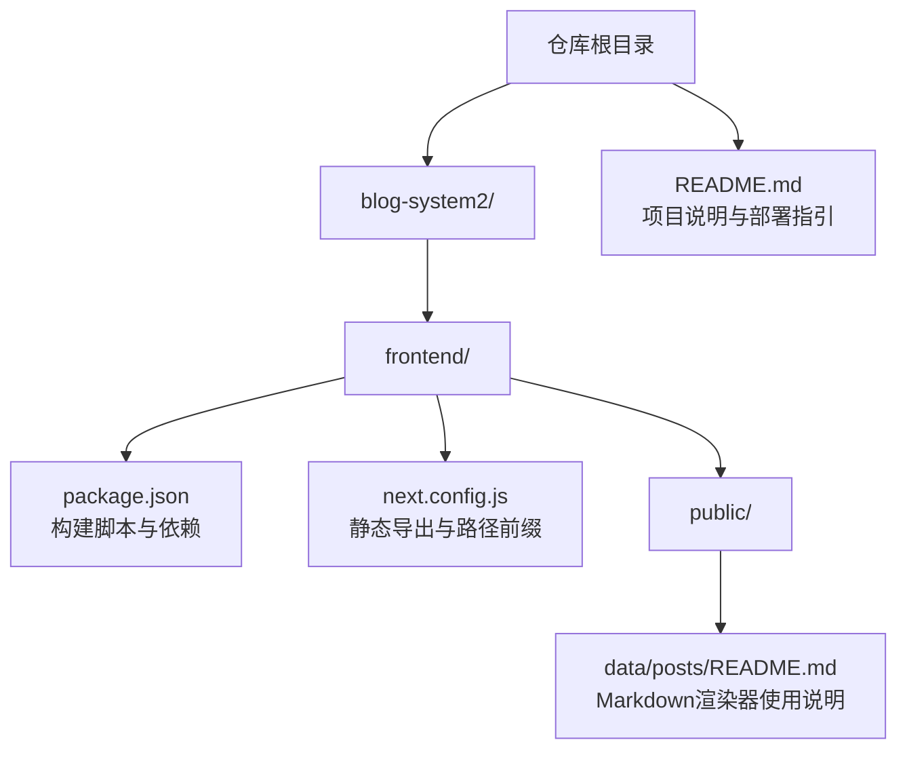
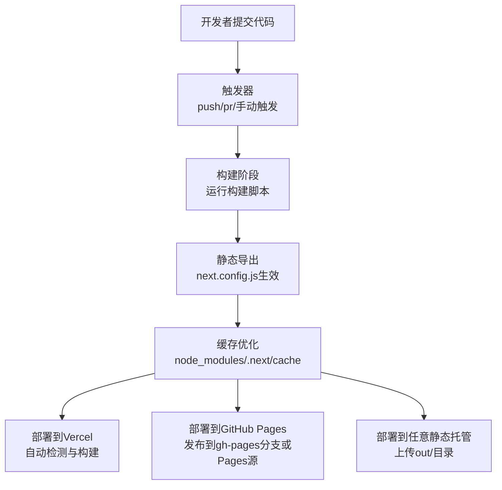
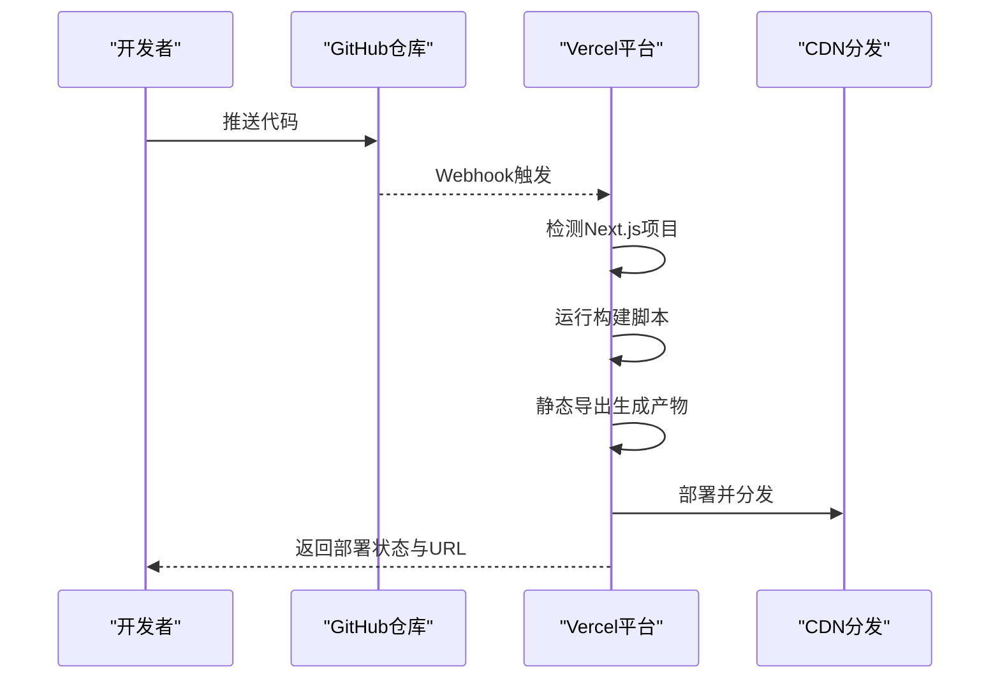
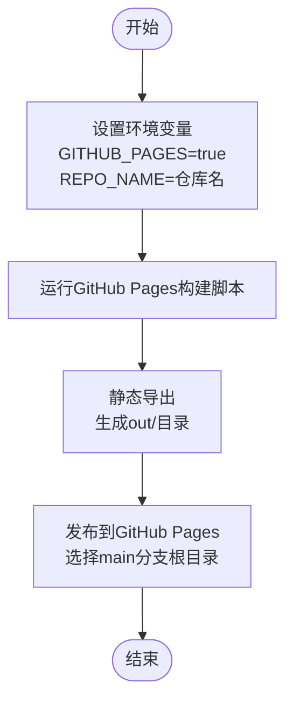
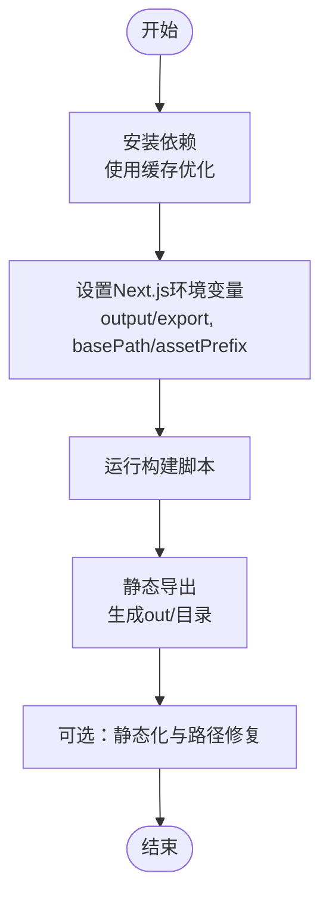
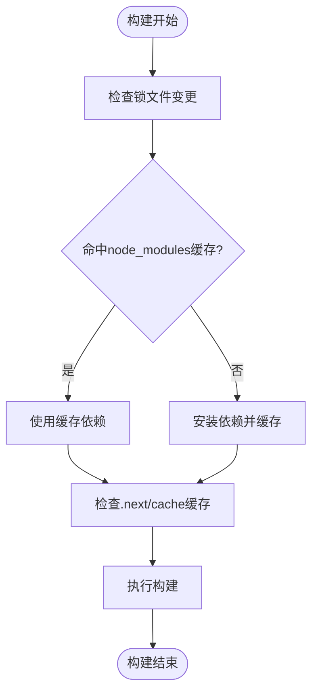
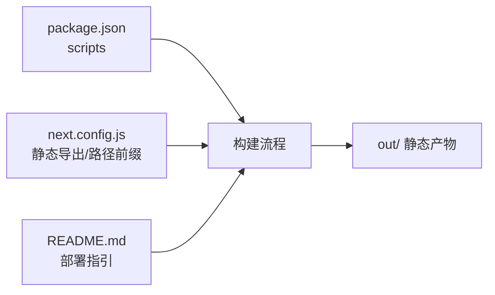

# CI/CD工作流

<cite>
**本文引用的文件**
- [README.md](file://README.md)
- [package.json](file://blog-system2/frontend/package.json)
- [next.config.js](file://blog-system2/frontend/next.config.js)
- [public/data/posts/README.md](file://blog-system2/frontend/public/data/posts/README.md)
</cite>

## 目录
1. [简介](#简介)
2. [项目结构](#项目结构)
3. [核心组件](#核心组件)
4. [架构总览](#架构总览)
5. [详细组件分析](#详细组件分析)
6. [依赖分析](#依赖分析)
7. [性能考虑](#性能考虑)
8. [故障排查指南](#故障排查指南)
9. [结论](#结论)
10. [附录](#附录)

## 简介
本指南面向CI/CD工作流的落地与运维，围绕GitHub Actions在本项目的应用展开，结合项目中现有的构建与部署脚本，系统阐述以下主题：
- GitHub Actions工作流的设计与实现思路（基于现有脚本与配置的映射）
- Vercel部署流程（基于Next.js静态导出与平台自动化）
- GitHub Pages部署配置（基于Next.js静态导出与GitHub Pages分支发布）
- Next.js构建流程（静态导出、环境变量与路径前缀）
- 工作流触发条件、执行步骤与环境配置
- 缓存策略（node_modules与.next/cache的缓存优化思路）
- Secrets配置与安全令牌管理
- 工作流调试与日志分析方法
- 自定义工作流创建指南与最佳实践
- 分支保护策略与PR检查流程
- 工作流失败排查与重试机制

说明：当前仓库未包含实际的GitHub Actions工作流YAML文件，因此本指南以“基于现有脚本与配置”的方式，给出可直接落地的CI/CD实施蓝图与最佳实践。

## 项目结构
本项目为基于Next.js 15的静态博客系统，前端位于 blog-system2/frontend，核心与CI/CD相关的文件包括：
- 构建脚本与依赖：package.json
- Next.js静态导出配置：next.config.js
- 项目使用说明与部署指引：README.md
- Markdown渲染器使用说明：public/data/posts/README.md

图表来源
- [README.md](file://README.md)
- [package.json](file://blog-system2/frontend/package.json)
- [next.config.js](file://blog-system2/frontend/next.config.js)
- [public/data/posts/README.md](file://blog-system2/frontend/public/data/posts/README.md)

章节来源
- [README.md](file://README.md)
- [package.json](file://blog-system2/frontend/package.json)
- [next.config.js](file://blog-system2/frontend/next.config.js)
- [public/data/posts/README.md](file://blog-system2/frontend/public/data/posts/README.md)

## 核心组件
- 构建与部署脚本
  - 标准构建：生成静态文件，输出至 out/ 目录
  - GitHub Pages专用构建：设置环境变量以启用静态导出与路径前缀
  - 静态站点完整构建流程：包含额外的静态化与路径修复步骤
- Next.js静态导出配置
  - 输出模式：静态导出（export）
  - 路径前缀：根据环境变量动态设置 basePath 与 assetPrefix
  - 图片优化：禁用Next.js内置优化，使用静态资源
- 部署方式
  - Vercel：导入项目后自动部署，无需额外配置
  - GitHub Pages：通过GitHub Pages从main分支根目录发布
  - 任意静态托管：将 out/ 目录上传至任意静态托管服务

章节来源
- [README.md](file://README.md)
- [package.json](file://blog-system2/frontend/package.json)
- [next.config.js](file://blog-system2/frontend/next.config.js)

## 架构总览
下图展示了从代码提交到不同部署目标的典型流水线架构，映射到本项目的构建与配置：

说明：该图为概念性架构图，用于指导工作流设计；具体YAML文件需在仓库中创建并配置。

## 详细组件分析

### Vercel部署流程（基于Next.js静态导出）
- 触发条件
  - 推送至默认分支（如main）或手动触发
- 执行步骤
  - Vercel自动检测Next.js项目并执行构建
  - 由于项目使用静态导出配置，Vercel将直接部署静态产物
- 环境配置
  - 无需额外配置，Vercel自动识别Next.js项目
  - 如需自定义构建命令，可在Vercel控制台设置（本项目可使用标准构建脚本）

章节来源
- [README.md](file://README.md)
- [package.json](file://blog-system2/frontend/package.json)
- [next.config.js](file://blog-system2/frontend/next.config.js)

### GitHub Pages部署配置（基于静态导出）
- 触发条件
  - 推送至默认分支或手动触发
- 执行步骤
  - 使用GitHub Pages专用构建脚本生成静态产物
  - 将产物发布到GitHub Pages（选择main分支根目录作为发布源）
- 环境配置
  - 使用环境变量控制静态导出与路径前缀
  - 配置GitHub Pages源为“Deploy from a branch”，分支选择main，目录选择根目录/

章节来源
- [README.md](file://README.md)
- [package.json](file://blog-system2/frontend/package.json)
- [next.config.js](file://blog-system2/frontend/next.config.js)

### Next.js构建流程（静态导出）
- 触发条件
  - 推送至默认分支、PR合并或手动触发
- 执行步骤
  - 安装依赖（使用缓存优化）
  - 运行构建脚本，生成静态文件
  - 可选：运行静态化与路径修复脚本
- 环境配置
  - 静态导出：output=export
  - 路径前缀：basePath与assetPrefix根据环境变量动态设置
  - 图片优化：禁用Next.js内置优化，使用静态资源

章节来源
- [package.json](file://blog-system2/frontend/package.json)
- [next.config.js](file://blog-system2/frontend/next.config.js)

### 缓存策略（node_modules与.next/cache）
- node_modules缓存
  - 使用包管理器锁文件（如package-lock.json或yarn.lock）作为缓存键
  - 在CI中命中缓存可显著减少依赖安装时间
- .next/cache缓存
  - Next.js构建缓存目录，可缓存编译中间产物
  - 在CI中缓存该目录可加速后续构建
- 实施建议
  - 为不同操作系统与Node版本分别缓存
  - 在PR与主分支使用独立缓存键，避免污染

章节来源
- [package.json](file://blog-system2/frontend/package.json)
- [next.config.js](file://blog-system2/frontend/next.config.js)

### Secrets配置与安全令牌管理
- 常见Secrets
  - Vercel令牌：用于CLI部署或私有项目
  - GitHub Pages部署令牌：用于自动化发布（如需要）
  - 第三方服务令牌：如Algolia搜索API密钥（若启用搜索）
- 管理原则
  - 仅在需要的环境中设置Secrets
  - 使用最小权限原则，避免泄露敏感信息
  - 在工作流中按需注入，避免硬编码

章节来源
- [README.md](file://README.md)

### 工作流调试与日志分析
- 调试方法
  - 查看工作流运行日志，定位失败步骤
  - 分步执行构建脚本，验证环境变量与路径配置
  - 使用缓存命中情况分析构建耗时
- 日志分析要点
  - 依赖安装阶段的缓存命中率
  - 构建阶段的错误堆栈与警告
  - 部署阶段的URL与状态码

章节来源
- [README.md](file://README.md)
- [package.json](file://blog-system2/frontend/package.json)

### 自定义工作流创建指南与最佳实践
- 创建步骤
  - 在仓库根目录创建 .github/workflows 目录
  - 新建YAML文件，定义触发器、环境、步骤与缓存策略
  - 在步骤中调用现有构建脚本
- 最佳实践
  - 使用矩阵构建（多Node版本/操作系统）
  - 为PR与主分支设置不同策略
  - 启用重试与超时控制
  - 使用工件（artifacts）保存构建产物以便回溯

章节来源
- [README.md](file://README.md)
- [package.json](file://blog-system2/frontend/package.json)

### 分支保护策略与PR检查流程
- 分支保护
  - 保护默认分支，强制要求审查与检查通过
  - 限制推送权限，确保只有授权人员可合并
- PR检查
  - 构建检查：确保构建成功
  - 代码质量检查：ESLint等
  - 部署预检：在预发布环境验证

章节来源
- [README.md](file://README.md)

### 工作流失败排查与重试机制
- 常见失败原因
  - 依赖安装失败（网络/权限）
  - 构建失败（环境变量缺失/路径错误）
  - 部署失败（令牌过期/权限不足）
- 重试机制
  - 对不稳定步骤（如依赖安装）启用自动重试
  - 设置超时与最大重试次数
  - 失败后保留工件以便诊断

章节来源
- [README.md](file://README.md)
- [package.json](file://blog-system2/frontend/package.json)

## 依赖分析
- 构建脚本依赖
  - package.json中的scripts定义了构建、静态化与GitHub Pages构建命令
- Next.js配置依赖
  - next.config.js中的静态导出与路径前缀配置影响构建产物与部署路径
- 项目文档依赖
  - README.md提供了部署方式与环境变量说明

图表来源
- [package.json](file://blog-system2/frontend/package.json)
- [next.config.js](file://blog-system2/frontend/next.config.js)
- [README.md](file://README.md)

章节来源
- [package.json](file://blog-system2/frontend/package.json)
- [next.config.js](file://blog-system2/frontend/next.config.js)
- [README.md](file://README.md)

## 性能考虑
- 缓存优先：优先命中依赖与构建缓存，减少重复安装与编译
- 并行化：在允许的情况下并行执行多个构建任务
- 精简依赖：移除不必要的开发依赖，缩小镜像体积
- 预热缓存：在PR中预热缓存，提升主分支构建速度

## 故障排查指南
- 构建失败
  - 检查环境变量是否正确设置（如GITHUB_PAGES、REPO_NAME）
  - 确认静态导出配置与路径前缀一致
- 部署失败
  - 核对部署目标（Vercel/GitHub Pages/静态托管）的配置
  - 检查Secrets是否正确注入
- 性能问题
  - 分析缓存命中率与构建耗时
  - 优化依赖安装与构建步骤

章节来源
- [README.md](file://README.md)
- [package.json](file://blog-system2/frontend/package.json)
- [next.config.js](file://blog-system2/frontend/next.config.js)

## 结论
本指南基于项目现有的构建与配置，给出了CI/CD工作流的完整实施蓝图。通过合理利用静态导出、缓存策略与分支保护，可实现稳定高效的自动化部署。建议尽快在仓库中创建GitHub Actions工作流YAML，并结合本指南的最佳实践逐步完善。

## 附录
- Markdown渲染器使用说明（与CI/CD关联较小，但有助于理解内容构建）
  - 该文档提供了Markdown渲染器的使用方法与特性，便于在构建过程中理解内容生成与展示逻辑

章节来源
- [public/data/posts/README.md](file://blog-system2/frontend/public/data/posts/README.md)