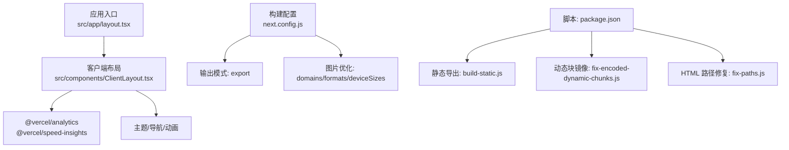
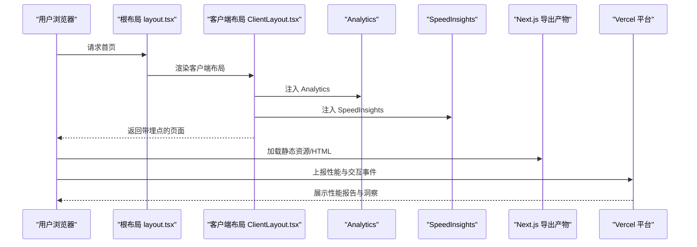
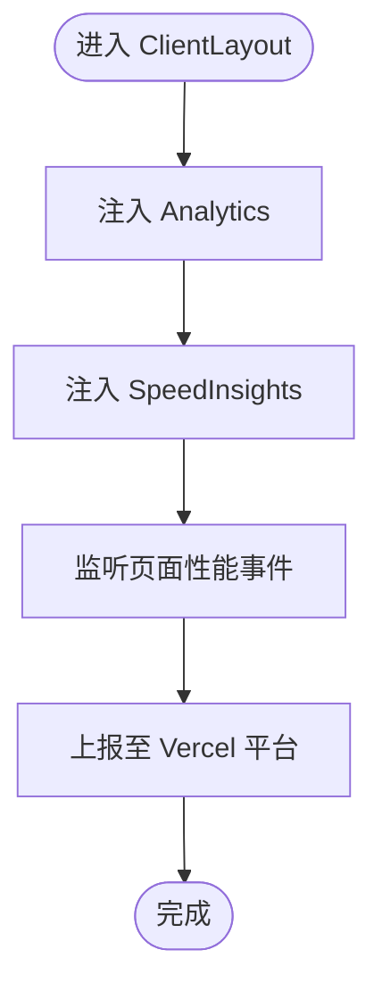
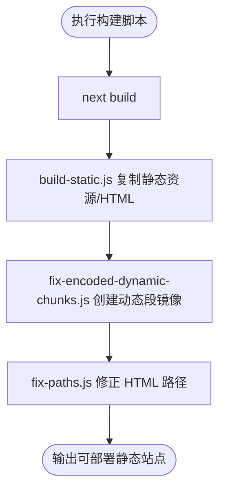
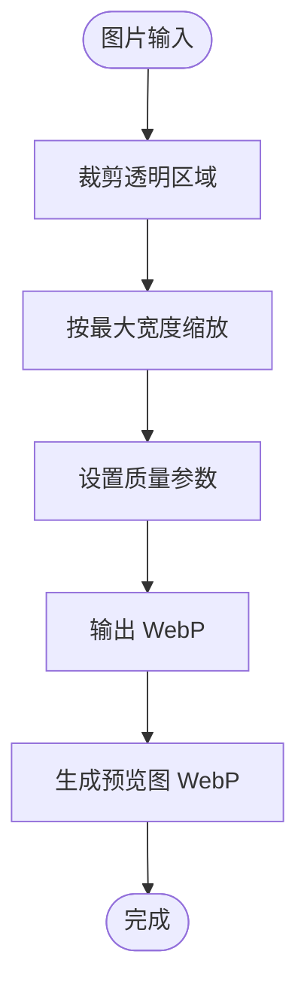
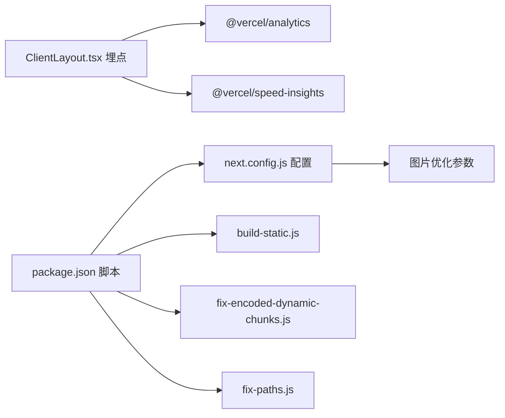

# 性能监控

<cite>
**本文引用的文件**
- [package.json](file://blog-system2/frontend/package.json)
- [next.config.js](file://blog-system2/frontend/next.config.js)
- [ClientLayout.tsx](file://blog-system2/frontend/src/components/ClientLayout.tsx)
- [layout.tsx](file://blog-system2/frontend/src/app/layout.tsx)
- [IMAGE_OPTIMIZATION.md](file://blog-system2/frontend/IMAGE_OPTIMIZATION.md)
- [build-static.js](file://blog-system2/frontend/build-static.js)
- [fix-encoded-dynamic-chunks.js](file://blog-system2/frontend/fix-encoded-dynamic-chunks.js)
- [fix-paths.js](file://blog-system2/frontend/fix-paths.js)
- [tailwind.config.mjs](file://blog-system2/frontend/tailwind.config.mjs)
- [postcss.config.mjs](file://blog-system2/frontend/postcss.config.mjs)
- [tsconfig.json](file://blog-system2/frontend/tsconfig.json)
</cite>

## 目录
1. [简介](#简介)
2. [项目结构](#项目结构)
3. [核心组件](#核心组件)
4. [架构总览](#架构总览)
5. [详细组件分析](#详细组件分析)
6. [依赖分析](#依赖分析)
7. [性能考虑](#性能考虑)
8. [故障排查指南](#故障排查指南)
9. [结论](#结论)
10. [附录](#附录)

## 简介
本指南面向在 Next.js 项目中落地性能监控与优化的工程实践，结合当前仓库已集成的 Vercel Analytics 与 Vercel Speed Insights，系统讲解性能指标采集（如 LCP、FID、CLS 等 Core Web Vitals）、构建性能优化（代码分割、懒加载、资源压缩）、CDN 与全球加速、缓存策略（静态资源与 API 响应）、基准测试与持续监控、移动端与网络优化、以及性能报告解读与改进路径。

## 项目结构
该前端为 Next.js 应用，采用 App Router 结构，关键性能相关配置集中在以下位置：
- 依赖与脚本：package.json 中声明了 @vercel/analytics 与 @vercel/speed-insights，并提供静态导出与路径修复脚本
- 构建配置：next.config.js 控制输出模式、图片优化、Webpack 插件与忽略项
- 客户端布局：ClientLayout.tsx 注入 Analytics 与 SpeedInsights，并承载主题、导航与动画等交互层
- 图片优化：IMAGE_OPTIMIZATION.md 提供本地图片处理流程
- 静态站点导出：build-static.js、fix-encoded-dynamic-chunks.js、fix-paths.js 协助生成可部署的静态站点

图表来源
- [layout.tsx:28-47](file://blog-system2/frontend/src/app/layout.tsx#L28-L47)
- [ClientLayout.tsx:16-62](file://blog-system2/frontend/src/components/ClientLayout.tsx#L16-L62)
- [next.config.js:6-45](file://blog-system2/frontend/next.config.js#L6-L45)
- [package.json:5-11](file://blog-system2/frontend/package.json#L5-L11)

章节来源
- [package.json:1-72](file://blog-system2/frontend/package.json#L1-L72)
- [next.config.js:1-48](file://blog-system2/frontend/next.config.js#L1-L48)
- [ClientLayout.tsx:1-63](file://blog-system2/frontend/src/components/ClientLayout.tsx#L1-L63)
- [layout.tsx:1-48](file://blog-system2/frontend/src/app/layout.tsx#L1-L48)

## 核心组件
- Vercel Analytics 与 Speed Insights
  - 在客户端布局中引入 Analytics 与 SpeedInsights，用于采集用户行为与性能指标（如 LCP、FID、CLS）
  - 参考路径：[ClientLayout.tsx:8-58](file://blog-system2/frontend/src/components/ClientLayout.tsx#L8-L58)
- 构建与导出
  - 使用 next.config.js 的 output: "export" 将应用静态化，配合 build-static.js、fix-encoded-dynamic-chunks.js、fix-paths.js 实现可部署静态站点
  - 参考路径：[next.config.js:6-11](file://blog-system2/frontend/next.config.js#L6-L11)，[build-static.js:33-87](file://blog-system2/frontend/build-static.js#L33-L87)，[fix-encoded-dynamic-chunks.js:39-73](file://blog-system2/frontend/fix-encoded-dynamic-chunks.js#L39-L73)，[fix-paths.js:6-34](file://blog-system2/frontend/fix-paths.js#L6-L34)
- 图片优化
  - 通过 IMAGE_OPTIMIZATION.md 提供本地图片处理流程；next.config.js 中配置 domains、formats、deviceSizes 等以支持图像优化
  - 参考路径：[IMAGE_OPTIMIZATION.md:1-28](file://blog-system2/frontend/IMAGE_OPTIMIZATION.md#L1-L28)，[next.config.js:20-33](file://blog-system2/frontend/next.config.js#L20-L33)

章节来源
- [ClientLayout.tsx:8-58](file://blog-system2/frontend/src/components/ClientLayout.tsx#L8-L58)
- [next.config.js:6-33](file://blog-system2/frontend/next.config.js#L6-L33)
- [IMAGE_OPTIMIZATION.md:1-28](file://blog-system2/frontend/IMAGE_OPTIMIZATION.md#L1-L28)
- [build-static.js:33-87](file://blog-system2/frontend/build-static.js#L33-L87)
- [fix-encoded-dynamic-chunks.js:39-73](file://blog-system2/frontend/fix-encoded-dynamic-chunks.js#L39-L73)
- [fix-paths.js:6-34](file://blog-system2/frontend/fix-paths.js#L6-L34)

## 架构总览
下图展示从用户访问到性能数据上报的关键链路，涵盖客户端注入、静态导出与路径修复、以及 Vercel 平台侧的指标采集与分析。

图表来源
- [layout.tsx:28-47](file://blog-system2/frontend/src/app/layout.tsx#L28-L47)
- [ClientLayout.tsx:8-58](file://blog-system2/frontend/src/components/ClientLayout.tsx#L8-L58)
- [build-static.js:33-87](file://blog-system2/frontend/build-static.js#L33-L87)
- [fix-paths.js:6-34](file://blog-system2/frontend/fix-paths.js#L6-L34)

## 详细组件分析

### 组件一：性能监控埋点（Analytics 与 Speed Insights）
- 功能定位
  - 在客户端布局中引入 Analytics 与 SpeedInsights，自动采集页面性能指标（如 LCP、FID、CLS）与用户交互事件
- 集成方式
  - 在 ClientLayout.tsx 中直接渲染 Analytics 与 SpeedInsights 组件
- 影响范围
  - 对所有页面生效，无需在业务路由中重复引入
- 注意事项
  - 确保在客户端上下文中使用（已通过 "use client" 与 ClientLayout.tsx 包裹）

图表来源
- [ClientLayout.tsx:8-58](file://blog-system2/frontend/src/components/ClientLayout.tsx#L8-L58)

章节来源
- [ClientLayout.tsx:8-58](file://blog-system2/frontend/src/components/ClientLayout.tsx#L8-L58)

### 组件二：静态导出与路径修复（构建性能优化）
- 功能定位
  - 通过 next.config.js 的 output: "export" 生成静态站点，配合 build-static.js、fix-encoded-dynamic-chunks.js、fix-paths.js 完成产物复制、动态段镜像与 HTML 路径修正
- 关键流程
  - 构建阶段：next build 后执行静态导出与路径修复脚本
  - 导出阶段：复制静态资源、HTML 文件与公共资源
  - 修复阶段：为动态路由段创建编码镜像，修正相对路径前缀
- 性能收益
  - 减少运行时渲染开销，提升首屏加载速度
  - 降低服务器压力，便于 CDN 缓存与全球分发

图表来源
- [package.json:5-11](file://blog-system2/frontend/package.json#L5-L11)
- [build-static.js:33-87](file://blog-system2/frontend/build-static.js#L33-L87)
- [fix-encoded-dynamic-chunks.js:39-73](file://blog-system2/frontend/fix-encoded-dynamic-chunks.js#L39-L73)
- [fix-paths.js:6-34](file://blog-system2/frontend/fix-paths.js#L6-L34)

章节来源
- [package.json:5-11](file://blog-system2/frontend/package.json#L5-L11)
- [next.config.js:6-11](file://blog-system2/frontend/next.config.js#L6-L11)
- [build-static.js:33-87](file://blog-system2/frontend/build-static.js#L33-L87)
- [fix-encoded-dynamic-chunks.js:39-73](file://blog-system2/frontend/fix-encoded-dynamic-chunks.js#L39-L73)
- [fix-paths.js:6-34](file://blog-system2/frontend/fix-paths.js#L6-L34)

### 组件三：图片优化与缓存策略
- 图片处理规范
  - 提供本地图片批量处理流程（裁剪、缩放、质量控制、生成预览），建议统一转换为 WebP 格式以减小体积
- Next.js 图片优化配置
  - domains：允许的外域域名列表
  - formats：优先格式为 image/webp
  - deviceSizes/imageSizes：适配多设备像素比与尺寸
  - minimumCacheTTL：最小缓存时间（秒）
- 缓存策略建议
  - 静态资源：利用 CDN 与浏览器缓存，设置较长的 max-age 与合适的 ETag/Last-Modified
  - 动态资源：合理设置 Cache-Control 与协商缓存，避免过期或陈旧

图表来源
- [IMAGE_OPTIMIZATION.md:9-26](file://blog-system2/frontend/IMAGE_OPTIMIZATION.md#L9-L26)
- [next.config.js:20-33](file://blog-system2/frontend/next.config.js#L20-L33)

章节来源
- [IMAGE_OPTIMIZATION.md:1-28](file://blog-system2/frontend/IMAGE_OPTIMIZATION.md#L1-L28)
- [next.config.js:20-33](file://blog-system2/frontend/next.config.js#L20-L33)

### 组件四：CDN 配置与全球加速
- 域名与缓存
  - 通过 domains 列表与 formats 设置，确保图片请求走优化链路
  - minimumCacheTTL 设定最小缓存时长，有助于减少回源频率
- 全球加速建议
  - 使用 CDN 提升静态资源分发效率，结合边缘缓存与智能路由
  - 对于动态 API，建议就近接入边缘节点或使用多区域部署

章节来源
- [next.config.js:20-33](file://blog-system2/frontend/next.config.js#L20-L33)

### 组件五：移动端性能优化与网络优化
- 移动端特性检测
  - 通过 matchMedia 判断移动端（hover: none 且 pointer: coarse），在移动端禁用部分视觉效果（如模糊与缩放），减少 GPU/CPU 开销
- 网络优化建议
  - 启用 HTTP/2 或更高版本，开启 Brotli/Gzip 压缩
  - 合理拆分首屏关键资源，延迟非关键脚本与字体加载
  - 使用资源提示（preload/prefetch）优化关键路径

章节来源
- [ClientLayout.tsx:24-26](file://blog-system2/frontend/src/components/ClientLayout.tsx#L24-L26)

## 依赖分析
- 依赖关系
  - @vercel/analytics 与 @vercel/speed-insights 作为性能监控依赖，由 ClientLayout.tsx 引入
  - next.config.js 控制构建输出与图片优化参数
  - package.json 的 scripts 定义了静态导出与路径修复流程
- 耦合性与内聚性
  - 性能监控埋点集中于 ClientLayout.tsx，职责清晰、耦合度低
  - 构建与导出脚本与 Next.js 配置解耦，便于扩展与维护

图表来源
- [package.json:5-11](file://blog-system2/frontend/package.json#L5-L11)
- [next.config.js:6-45](file://blog-system2/frontend/next.config.js#L6-L45)
- [ClientLayout.tsx:8-58](file://blog-system2/frontend/src/components/ClientLayout.tsx#L8-L58)
- [build-static.js:33-87](file://blog-system2/frontend/build-static.js#L33-L87)
- [fix-encoded-dynamic-chunks.js:39-73](file://blog-system2/frontend/fix-encoded-dynamic-chunks.js#L39-L73)
- [fix-paths.js:6-34](file://blog-system2/frontend/fix-paths.js#L6-L34)

章节来源
- [package.json:1-72](file://blog-system2/frontend/package.json#L1-L72)
- [next.config.js:1-48](file://blog-system2/frontend/next.config.js#L1-L48)
- [ClientLayout.tsx:1-63](file://blog-system2/frontend/src/components/ClientLayout.tsx#L1-L63)

## 性能考虑
- Core Web Vitals 指标采集
  - LCP：通过 Speed Insights 自动采集，关注首屏内容渲染时机
  - FID：记录首次输入延迟，优化主线程阻塞
  - CLS：测量布局偏移，避免动态插入内容导致的抖动
- 构建优化策略
  - 代码分割：利用 Next.js 的路由级分割，按需加载页面与组件
  - 懒加载：对非关键资源（图片、视频、第三方脚本）采用懒加载
  - 资源压缩：启用 Brotli/Gzip，压缩 JS/CSS/HTML
- 缓存策略
  - 静态资源：长缓存 + 版本化文件名，结合 ETag/Last-Modified
  - API 响应：合理设置 Cache-Control，区分 GET 与写操作
- 基准测试与持续监控
  - 使用 Lighthouse、WebPageTest、Vercel 自带的分析面板进行基准测试
  - 建立自动化流水线，定期抓取关键指标并生成报告
- 移动端与网络优化
  - 针对移动端禁用重资源动画，减少主线程压力
  - 使用 HTTP/2 多路复用，合并请求，降低 RTT

## 故障排查指南
- 静态导出产物缺失或路径错误
  - 检查 build-static.js 是否成功复制静态资源与 HTML
  - 确认 fix-encoded-dynamic-chunks.js 已为动态段创建编码镜像
  - 使用 fix-paths.js 修正 HTML 中的相对路径前缀
- 图片未按预期优化
  - 核对 next.config.js 的 domains、formats、deviceSizes、minimumCacheTTL
  - 确认图片已转换为 WebP 并放置在 public 或受信任的 CDN
- 性能埋点未生效
  - 确认 Analytics 与 SpeedInsights 已在客户端布局中渲染
  - 检查是否在服务端渲染阶段误用客户端组件

章节来源
- [build-static.js:33-87](file://blog-system2/frontend/build-static.js#L33-L87)
- [fix-encoded-dynamic-chunks.js:39-73](file://blog-system2/frontend/fix-encoded-dynamic-chunks.js#L39-L73)
- [fix-paths.js:6-34](file://blog-system2/frontend/fix-paths.js#L6-L34)
- [next.config.js:20-33](file://blog-system2/frontend/next.config.js#L20-L33)
- [ClientLayout.tsx:8-58](file://blog-system2/frontend/src/components/ClientLayout.tsx#L8-L58)

## 结论
通过在客户端布局中集成 Vercel Analytics 与 Speed Insights，并结合静态导出、图片优化与 CDN 缓存策略，本项目已具备完善的性能监控与优化基础。建议在此基础上持续完善自动化基准测试与监控告警，针对移动端与网络环境进一步细化优化策略，以获得更佳的用户体验与更高的性能稳定性。

## 附录
- TypeScript、Tailwind、PostCSS 配置
  - tsconfig.json：严格类型检查与模块解析配置
  - tailwind.config.mjs：内容扫描与暗色模式支持
  - postcss.config.mjs：PostCSS 插件链
- 建议的后续步骤
  - 在 CI 中加入 Lighthouse 或 WebPageTest 任务
  - 为 API 接口增加缓存层（如 Redis）与合理的失效策略
  - 对关键路由启用预加载与预取，缩短关键路径

章节来源
- [tsconfig.json:1-42](file://blog-system2/frontend/tsconfig.json#L1-L42)
- [tailwind.config.mjs:1-18](file://blog-system2/frontend/tailwind.config.mjs#L1-L18)
- [postcss.config.mjs:1-6](file://blog-system2/frontend/postcss.config.mjs#L1-L6)