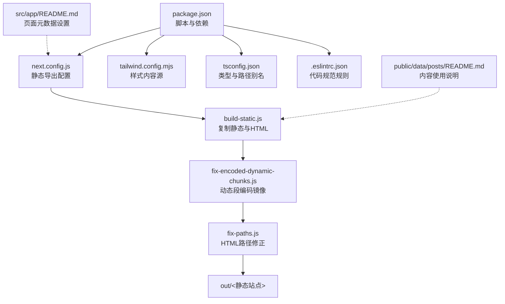
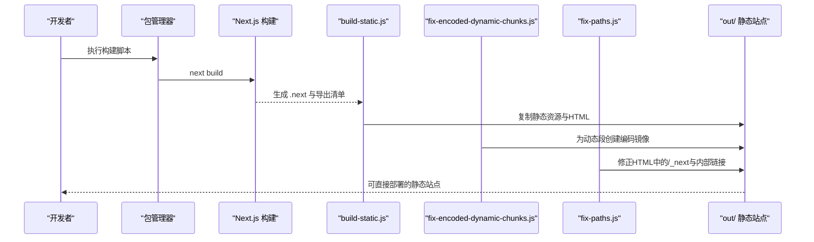
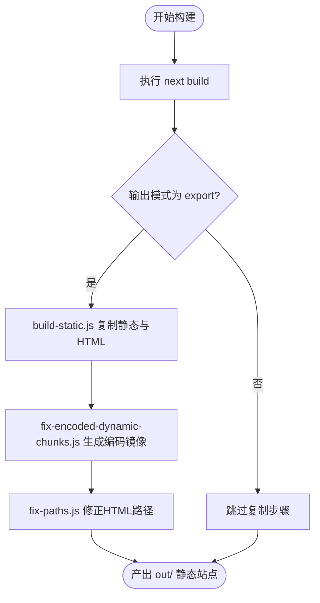
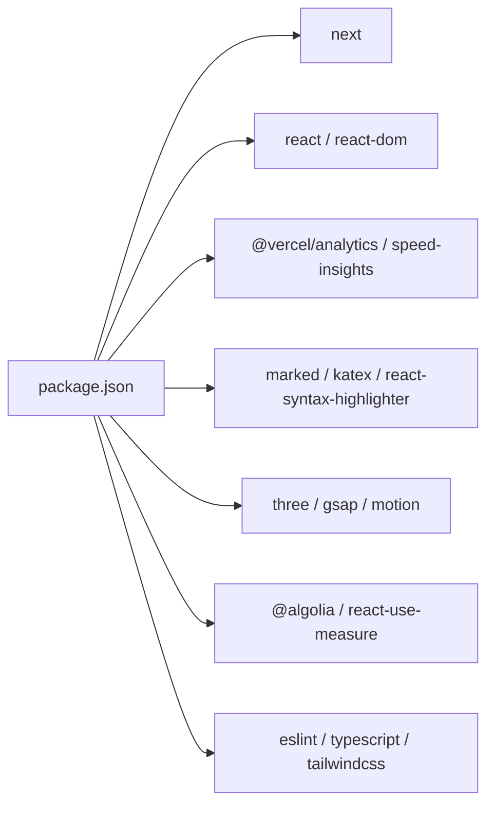

# 维护与故障排除

<cite>
**本文引用的文件**
- [package.json](file://blog-system2/frontend/package.json)
- [next.config.js](file://blog-system2/frontend/next.config.js)
- [build-static.js](file://blog-system2/frontend/build-static.js)
- [fix-encoded-dynamic-chunks.js](file://blog-system2/frontend/fix-encoded-dynamic-chunks.js)
- [fix-paths.js](file://blog-system2/frontend/fix-paths.js)
- [tailwind.config.mjs](file://blog-system2/frontend/tailwind.config.mjs)
- [tsconfig.json](file://blog-system2/frontend/tsconfig.json)
- [.eslintrc.json](file://blog-system2/frontend/.eslintrc.json)
- [public/data/posts/README.md](file://blog-system2/frontend/public/data/posts/README.md)
- [src/app/README.md](file://blog-system2/frontend/src/app/README.md)
</cite>

## 目录
1. [简介](#简介)
2. [项目结构](#项目结构)
3. [核心组件](#核心组件)
4. [架构总览](#架构总览)
5. [详细组件分析](#详细组件分析)
6. [依赖分析](#依赖分析)
7. [性能考虑](#性能考虑)
8. [故障排除指南](#故障排除指南)
9. [结论](#结论)
10. [附录](#附录)

## 简介
本指南面向博客系统的运维与开发团队，聚焦于日常维护、部署与故障排除、性能监控、版本与发布流程、容量规划、安全配置与漏洞扫描、备份与灾备、监控告警与响应流程，以及开发与生产环境差异管理。本文结合仓库中的构建脚本、配置文件与文档，给出可操作的实践建议与排障步骤。

## 项目结构
前端采用 Next.js 应用，使用静态导出（export）模式生成纯静态站点，配合若干后处理脚本完成产物修正与路径修复。核心目录与文件如下：
- 构建与导出：next.config.js、package.json 中的 scripts
- 静态产物生成：build-static.js
- 动态路由片段编码镜像：fix-encoded-dynamic-chunks.js
- HTML 路径修正：fix-paths.js
- 样式与类型：tailwind.config.mjs、tsconfig.json
- 规范与校验：.eslintrc.json
- 内容与元数据：public/data/posts/README.md、src/app/README.md

图表来源
- [package.json:1-72](file://blog-system2/frontend/package.json#L1-L72)
- [next.config.js:1-48](file://blog-system2/frontend/next.config.js#L1-L48)
- [build-static.js:1-141](file://blog-system2/frontend/build-static.js#L1-L141)
- [fix-encoded-dynamic-chunks.js:1-73](file://blog-system2/frontend/fix-encoded-dynamic-chunks.js#L1-L73)
- [fix-paths.js:1-53](file://blog-system2/frontend/fix-paths.js#L1-L53)
- [tailwind.config.mjs:1-18](file://blog-system2/frontend/tailwind.config.mjs#L1-L18)
- [tsconfig.json:1-42](file://blog-system2/frontend/tsconfig.json#L1-L42)
- [.eslintrc.json:1-12](file://blog-system2/frontend/.eslintrc.json#L1-L12)
- [public/data/posts/README.md:1-209](file://blog-system2/frontend/public/data/posts/README.md#L1-L209)
- [src/app/README.md:1-79](file://blog-system2/frontend/src/app/README.md#L1-L79)

章节来源
- [package.json:1-72](file://blog-system2/frontend/package.json#L1-L72)
- [next.config.js:1-48](file://blog-system2/frontend/next.config.js#L1-L48)

## 核心组件
- 构建与导出链路
  - next.config.js：启用输出模式为 export，设置基础路径与资源前缀，忽略 TypeScript/ESLint 构建期错误，配置图片域名与尺寸等。
  - package.json scripts：提供开发、构建、静态导出与 GitHub Pages 导出的命令。
  - build-static.js：将 .next 静态资源、服务端 app HTML、public 非 data 目录与 data 数据复制到 out 目录，形成可部署的静态站点。
  - fix-encoded-dynamic-chunks.js：为动态路由段生成编码后的镜像目录，解决导出后动态段无法访问的问题。
  - fix-paths.js：修正 out 目录下 HTML 中的静态资源与内部链接路径，适配 export 模式的相对路径要求。
- 样式与类型
  - tailwind.config.mjs：声明内容扫描范围与深色模式策略。
  - tsconfig.json：严格类型检查、路径别名、类型根目录与插件配置。
- 规范与校验
  - .eslintrc.json：基于 Next.js 核心 Web Vitals 规则集，调整部分警告级别与忽略项。

章节来源
- [next.config.js:1-48](file://blog-system2/frontend/next.config.js#L1-L48)
- [package.json:5-12](file://blog-system2/frontend/package.json#L5-L12)
- [build-static.js:33-87](file://blog-system2/frontend/build-static.js#L33-L87)
- [fix-encoded-dynamic-chunks.js:39-73](file://blog-system2/frontend/fix-encoded-dynamic-chunks.js#L39-L73)
- [fix-paths.js:6-34](file://blog-system2/frontend/fix-paths.js#L6-L34)
- [tailwind.config.mjs:1-18](file://blog-system2/frontend/tailwind.config.mjs#L1-L18)
- [tsconfig.json:1-42](file://blog-system2/frontend/tsconfig.json#L1-L42)
- [.eslintrc.json:1-12](file://blog-system2/frontend/.eslintrc.json#L1-L12)

## 架构总览
静态导出的端到端流程如下：

图表来源
- [package.json:5-12](file://blog-system2/frontend/package.json#L5-L12)
- [next.config.js:6-18](file://blog-system2/frontend/next.config.js#L6-L18)
- [build-static.js:33-87](file://blog-system2/frontend/build-static.js#L33-L87)
- [fix-encoded-dynamic-chunks.js:39-73](file://blog-system2/frontend/fix-encoded-dynamic-chunks.js#L39-L73)
- [fix-paths.js:36-53](file://blog-system2/frontend/fix-paths.js#L36-L53)

## 详细组件分析

### 构建与导出流水线
- 关键点
  - 输出模式为 export，适合托管在静态平台或 CDN。
  - 忽略构建期 TS/ESLint 错误，便于快速迭代；但需在 CI 中开启严格校验。
  - 图片优化关闭（unoptimized: true），减少运行时开销，但需确保资源可用性与缓存策略。
- 常见问题
  - 动态路由段导出后不可访问：通过 fix-encoded-dynamic-chunks.js 生成编码镜像解决。
  - HTML 中静态资源路径错误：通过 fix-paths.js 统一替换为相对路径。
  - GitHub Pages 基础路径与资源前缀：通过环境变量控制 basePath 与 assetPrefix。

图表来源
- [next.config.js:6-18](file://blog-system2/frontend/next.config.js#L6-L18)
- [build-static.js:33-87](file://blog-system2/frontend/build-static.js#L33-L87)
- [fix-encoded-dynamic-chunks.js:39-73](file://blog-system2/frontend/fix-encoded-dynamic-chunks.js#L39-L73)
- [fix-paths.js:36-53](file://blog-system2/frontend/fix-paths.js#L36-L53)

章节来源
- [next.config.js:1-48](file://blog-system2/frontend/next.config.js#L1-L48)
- [package.json:5-12](file://blog-system2/frontend/package.json#L5-L12)
- [build-static.js:1-141](file://blog-system2/frontend/build-static.js#L1-L141)
- [fix-encoded-dynamic-chunks.js:1-73](file://blog-system2/frontend/fix-encoded-dynamic-chunks.js#L1-L73)
- [fix-paths.js:1-53](file://blog-system2/frontend/fix-paths.js#L1-L53)

### 页面元数据与 SEO
- Next.js 元数据系统用于设置浏览器标题、描述与 OpenGraph，支持静态与动态页面。
- 建议为每个页面提供明确的标题与描述，避免过长或重复。

章节来源
- [src/app/README.md:1-79](file://blog-system2/frontend/src/app/README.md#L1-L79)

### 内容与 Markdown 使用
- public/data 下存放文章与通知等 Markdown 资源，README 提供命名规范、常见问题与最佳实践。
- 建议统一文件命名、合理使用标题层级与代码语言标注，确保渲染一致性。

章节来源
- [public/data/posts/README.md:1-209](file://blog-system2/frontend/public/data/posts/README.md#L1-L209)

### 样式与类型配置
- Tailwind 内容扫描范围覆盖 pages、components、app，确保按需生成样式。
- TypeScript 严格模式与路径别名提升开发体验与可维护性。

章节来源
- [tailwind.config.mjs:1-18](file://blog-system2/frontend/tailwind.config.mjs#L1-L18)
- [tsconfig.json:1-42](file://blog-system2/frontend/tsconfig.json#L1-L42)

### 代码规范与质量
- ESLint 基于 Next.js 核心规则集，针对图片标签、依赖项与脚本放置位置进行警告提示。
- 建议在 CI 中启用严格模式，本地保留宽松以便快速迭代。

章节来源
- [.eslintrc.json:1-12](file://blog-system2/frontend/.eslintrc.json#L1-L12)

## 依赖分析
- 核心依赖
  - next、react、react-dom：框架与运行时。
  - @vercel/analytics、@vercel/speed-insights：性能与分析。
  - marked、katex、react-syntax-highlighter：Markdown 渲染与公式、代码高亮。
  - three、gsap、motion：动画与交互。
  - @algolia/algoliasearch、react-use-measure：搜索与测量。
- 开发依赖
  - eslint、typescript、tailwindcss、webpack 相关工具链。

图表来源
- [package.json:13-42](file://blog-system2/frontend/package.json#L13-L42)
- [package.json:50-70](file://blog-system2/frontend/package.json#L50-L70)

章节来源
- [package.json:1-72](file://blog-system2/frontend/package.json#L1-L72)

## 性能考虑
- 构建与导出
  - export 模式减少运行时开销，适合静态内容型站点；注意资源可用性与缓存 TTL。
  - 图片优化关闭，建议通过 CDN 与合适的缓存策略保障加载速度。
- 运行时性能
  - 启用 Vercel Analytics/SI 获取真实性能指标，结合浏览器性能面板定位瓶颈。
  - 控制第三方库体积，按需引入动画与交互库。
- 类型与样式
  - 严格 TS 与 Tailwind 内容扫描有助于减少未使用样式与类型检查成本。

章节来源
- [next.config.js:20-33](file://blog-system2/frontend/next.config.js#L20-L33)
- [package.json:19-42](file://blog-system2/frontend/package.json#L19-L42)
- [tailwind.config.mjs:5-9](file://blog-system2/frontend/tailwind.config.mjs#L5-L9)
- [tsconfig.json:2-28](file://blog-system2/frontend/tsconfig.json#L2-L28)

## 故障排除指南

### 构建失败
- 症状
  - TypeScript/ESLint 错误导致构建中断。
- 排查
  - 检查 next.config.js 中的 ignoreBuildErrors 设置。
  - 在本地使用严格模式验证问题，CI 中开启严格校验。
- 参考
  - [next.config.js:12-18](file://blog-system2/frontend/next.config.js#L12-L18)
  - [.eslintrc.json:1-12](file://blog-system2/frontend/.eslintrc.json#L1-L12)

章节来源
- [next.config.js:12-18](file://blog-system2/frontend/next.config.js#L12-L18)
- [.eslintrc.json:1-12](file://blog-system2/frontend/.eslintrc.json#L1-L12)

### 导出后资源加载错误
- 症状
  - 静态资源 404 或路径不正确。
- 排查
  - 确认 build-static.js 是否成功复制 _next/static 与 public 非 data 目录。
  - 使用 fix-paths.js 修正 HTML 中的路径前缀。
- 参考
  - [build-static.js:48-83](file://blog-system2/frontend/build-static.js#L48-L83)
  - [fix-paths.js:6-34](file://blog-system2/frontend/fix-paths.js#L6-L34)

章节来源
- [build-static.js:48-83](file://blog-system2/frontend/build-static.js#L48-L83)
- [fix-paths.js:6-34](file://blog-system2/frontend/fix-paths.js#L6-L34)

### 动态路由段无法访问
- 症状
  - 导出后形如 [slug] 的页面 404。
- 排查
  - 运行 fix-encoded-dynamic-chunks.js 生成编码镜像目录。
- 参考
  - [fix-encoded-dynamic-chunks.js:39-73](file://blog-system2/frontend/fix-encoded-dynamic-chunks.js#L39-L73)

章节来源
- [fix-encoded-dynamic-chunks.js:39-73](file://blog-system2/frontend/fix-encoded-dynamic-chunks.js#L39-L73)

### GitHub Pages 基础路径问题
- 症状
  - 资源路径错误或页面跳转异常。
- 排查
  - 设置 GITHUB_PAGES=true 与 REPO_NAME，确认 basePath 与 assetPrefix。
- 参考
  - [next.config.js:3-10](file://blog-system2/frontend/next.config.js#L3-L10)
  - [package.json:9](file://blog-system2/frontend/package.json#L9)

章节来源
- [next.config.js:3-10](file://blog-system2/frontend/next.config.js#L3-L10)
- [package.json:9](file://blog-system2/frontend/package.json#L9)

### 日志分析与错误追踪
- 建议
  - 在 CI 中记录构建与导出日志，关注 build-static.js 与 fix-* 脚本的输出。
  - 使用 Vercel Analytics/SI 的前端性能报告定位慢资源与交互卡顿。
  - 对第三方库（marked、katex、algolia）增加加载失败降级与重试策略。

章节来源
- [package.json:19-42](file://blog-system2/frontend/package.json#L19-L42)

### 回滚策略与紧急修复
- 回滚
  - 保留上一个稳定版本的 out/ 目录与部署工件，必要时一键回滚。
- 紧急修复
  - 优先修复影响面广的资源路径与动态路由问题，确保首页与关键页面可用。
  - 临时关闭图片优化或降级第三方库版本以快速恢复。

章节来源
- [fix-paths.js:36-53](file://blog-system2/frontend/fix-paths.js#L36-L53)
- [fix-encoded-dynamic-chunks.js:39-73](file://blog-system2/frontend/fix-encoded-dynamic-chunks.js#L39-L73)

### 版本管理与发布流程
- 版本号
  - 当前版本由 package.json 中 version 字段标识，建议遵循语义化版本。
- 发布步骤
  - 本地构建与校验 → CI 构建与导出 → 产物上传至托管平台 → 健康检查 → 上线。
- 变更记录
  - 在 README 或变更日志中标注破坏性改动与迁移指引。

章节来源
- [package.json:2-4](file://blog-system2/frontend/package.json#L2-L4)
- [package.json:5-12](file://blog-system2/frontend/package.json#L5-L12)

### 容量规划与扩容策略
- 资源规模
  - 统计 public 与 data 目录大小，评估 CDN 缓存与带宽需求。
- 扩容建议
  - 使用 CDN 加速静态资源；对图片与视频进行压缩与懒加载。
  - 限制第三方库体积，按需加载非关键功能。

章节来源
- [next.config.js:20-33](file://blog-system2/frontend/next.config.js#L20-L33)

### 安全配置与漏洞扫描
- 配置要点
  - 仅允许可信域名（images.domains）加载图片。
  - 严格 CSP 策略（在托管平台或反向代理层配置）。
- 扫描建议
  - 使用 npm audit 或类似工具定期扫描依赖漏洞。
  - 对第三方库版本进行定期升级与回归测试。

章节来源
- [next.config.js:22-28](file://blog-system2/frontend/next.config.js#L22-L28)
- [package.json:13-42](file://blog-system2/frontend/package.json#L13-L42)

### 备份与灾难恢复
- 备份
  - 备份源码、public 与 data 目录、构建产物与托管平台配置。
- 灾备
  - 建立多环境（开发/预发布/生产）隔离与独立部署通道。
  - 制定一键切换与快速回滚方案。

章节来源
- [build-static.js:33-87](file://blog-system2/frontend/build-static.js#L33-L87)

### 监控告警与响应流程
- 监控
  - 前端性能：Vercel Analytics/SI。
  - 可用性：健康检查端点与 4xx/5xx 告警。
- 响应
  - 建立值班与升级机制，优先处理影响用户的关键问题。

章节来源
- [package.json:19-21](file://blog-system2/frontend/package.json#L19-L21)

### 开发与生产差异管理
- 差异点
  - 构建忽略 TS/ESLint 错误（开发期），CI 中开启严格校验。
  - export 模式与 GitHub Pages 基础路径配置。
- 管理建议
  - 使用环境变量区分不同部署目标，统一配置模板与 CI 流水线。

章节来源
- [next.config.js:12-18](file://blog-system2/frontend/next.config.js#L12-L18)
- [next.config.js:3-10](file://blog-system2/frontend/next.config.js#L3-L10)

## 结论
本指南围绕静态导出型 Next.js 博客系统，给出了从构建到部署、从性能到安全、从监控到灾备的全流程维护与故障排除建议。建议团队将上述流程纳入 CI/CD 与运维手册，持续改进与演练，确保系统稳定与快速恢复能力。

## 附录
- 快速检查清单
  - 构建脚本执行成功，无 TS/ESLint 构建期错误。
  - build-static.js 成功复制静态与 HTML。
  - fix-encoded-dynamic-chunks.js 生成编码镜像。
  - fix-paths.js 修正 HTML 路径。
  - GitHub Pages 基础路径与资源前缀正确。
  - 第三方库版本可控，定期扫描漏洞。
  - 监控与告警已配置，具备回滚与灾备预案。