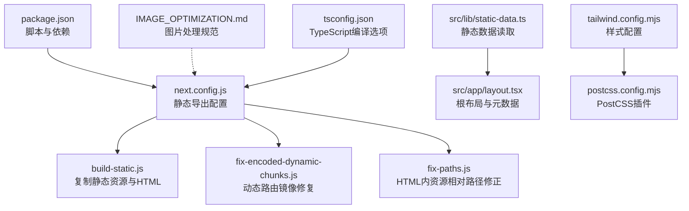
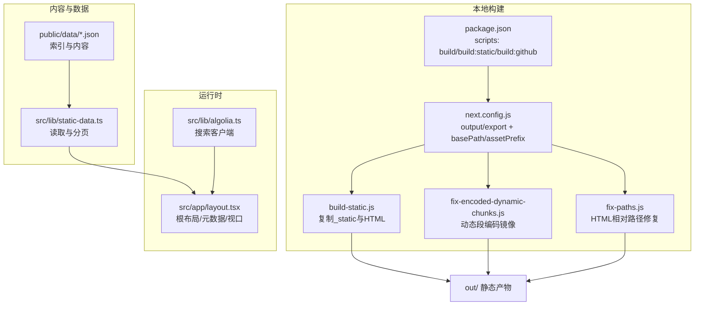
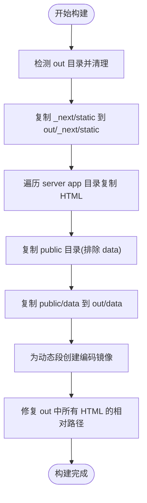
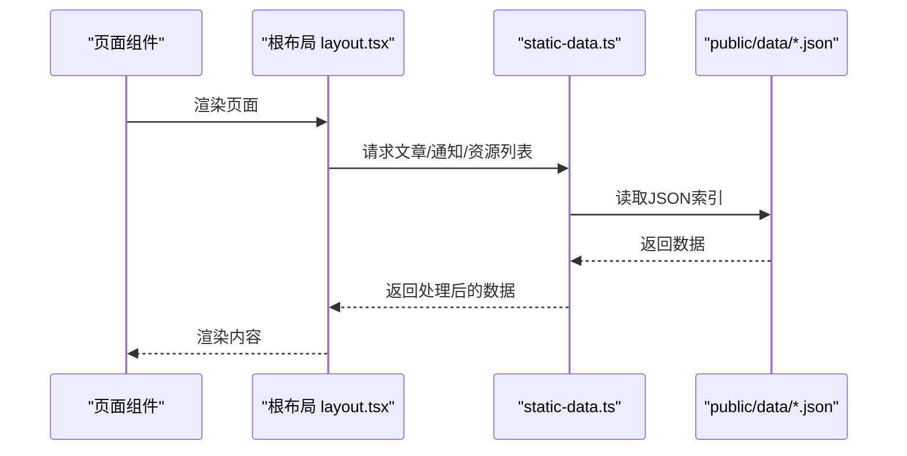
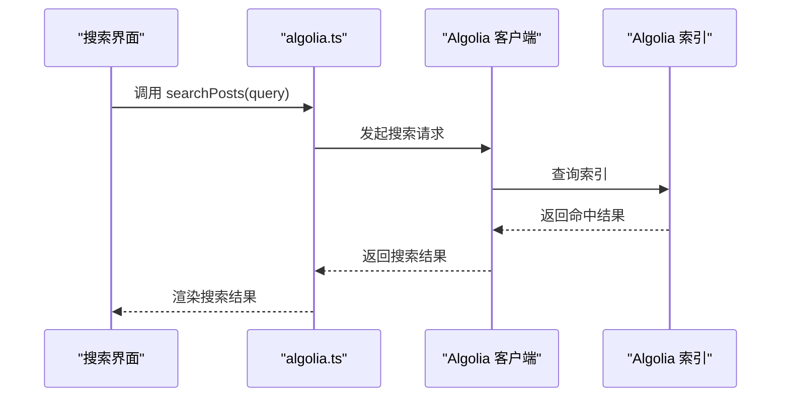
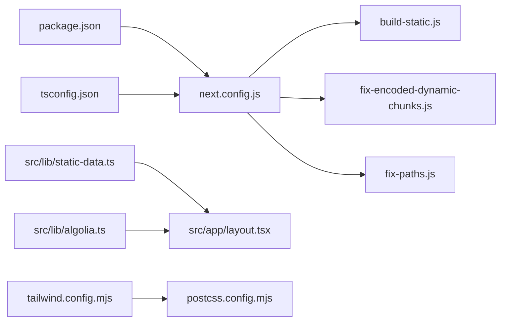

# 部署与运维

<cite>
**本文引用的文件**
- [package.json](file://blog-system2/frontend/package.json)
- [next.config.js](file://blog-system2/frontend/next.config.js)
- [build-static.js](file://blog-system2/frontend/build-static.js)
- [fix-encoded-dynamic-chunks.js](file://blog-system2/frontend/fix-encoded-dynamic-chunks.js)
- [fix-paths.js](file://blog-system2/frontend/fix-paths.js)
- [IMAGE_OPTIMIZATION.md](file://blog-system2/frontend/IMAGE_OPTIMIZATION.md)
- [tailwind.config.mjs](file://blog-system2/frontend/tailwind.config.mjs)
- [postcss.config.mjs](file://blog-system2/frontend/postcss.config.mjs)
- [tsconfig.json](file://blog-system2/frontend/tsconfig.json)
- [src/app/layout.tsx](file://blog-system2/frontend/src/app/layout.tsx)
- [src/lib/static-data.ts](file://blog-system2/frontend/src/lib/static-data.ts)
- [src/lib/algolia.ts](file://blog-system2/frontend/src/lib/algolia.ts)
</cite>

## 目录
1. [简介](#简介)
2. [项目结构](#项目结构)
3. [核心组件](#核心组件)
4. [架构总览](#架构总览)
5. [详细组件分析](#详细组件分析)
6. [依赖关系分析](#依赖关系分析)
7. [性能考量](#性能考量)
8. [故障排除指南](#故障排除指南)
9. [结论](#结论)
10. [附录](#附录)

## 简介
本指南面向运维与开发团队，系统讲解该技术博客平台在 GitHub Pages 与 Vercel 的部署与运维实践，涵盖静态站点生成、自动化构建与优化、CI/CD 设计、域名与 HTTPS、CDN 加速、性能监控、版本回滚、安全加固、日志与错误追踪等主题。文档基于仓库中现有配置与脚本进行分析，并提供可操作的实施建议。

## 项目结构
前端采用 Next.js 应用，使用静态导出模式输出纯静态站点，配合自定义构建脚本完成静态化与路径修复，便于在 GitHub Pages 或任意静态托管服务上部署。

**图表来源**
- [package.json:1-72](file://blog-system2/frontend/package.json#L1-L72)
- [next.config.js:1-48](file://blog-system2/frontend/next.config.js#L1-L48)
- [build-static.js:1-141](file://blog-system2/frontend/build-static.js#L1-L141)
- [fix-encoded-dynamic-chunks.js:1-73](file://blog-system2/frontend/fix-encoded-dynamic-chunks.js#L1-L73)
- [fix-paths.js:1-53](file://blog-system2/frontend/fix-paths.js#L1-L53)
- [src/lib/static-data.ts:1-214](file://blog-system2/frontend/src/lib/static-data.ts#L1-L214)
- [src/app/layout.tsx:1-48](file://blog-system2/frontend/src/app/layout.tsx#L1-L48)
- [IMAGE_OPTIMIZATION.md:1-28](file://blog-system2/frontend/IMAGE_OPTIMIZATION.md#L1-L28)
- [tailwind.config.mjs:1-18](file://blog-system2/frontend/tailwind.config.mjs#L1-L18)
- [postcss.config.mjs:1-6](file://blog-system2/frontend/postcss.config.mjs#L1-L6)
- [tsconfig.json:1-42](file://blog-system2/frontend/tsconfig.json#L1-L42)

**章节来源**
- [package.json:1-72](file://blog-system2/frontend/package.json#L1-L72)
- [next.config.js:1-48](file://blog-system2/frontend/next.config.js#L1-L48)
- [IMAGE_OPTIMIZATION.md:1-28](file://blog-system2/frontend/IMAGE_OPTIMIZATION.md#L1-L28)

## 核心组件
- 静态导出与构建链路：通过 Next.js 配置开启静态导出，结合自定义脚本完成静态资源复制、动态路由镜像与 HTML 路径修复。
- 数据层：从 public/data 下的 JSON 索引读取文章、通知与资源信息，支持分页与排序。
- 搜索：集成 Algolia 客户端，提供搜索结果检索能力。
- 样式与工具：Tailwind CSS 与 PostCSS 配置，TypeScript 编译选项，以及通用工具函数。

**章节来源**
- [next.config.js:6-45](file://blog-system2/frontend/next.config.js#L6-L45)
- [build-static.js:33-87](file://blog-system2/frontend/build-static.js#L33-L87)
- [fix-encoded-dynamic-chunks.js:39-73](file://blog-system2/frontend/fix-encoded-dynamic-chunks.js#L39-L73)
- [fix-paths.js:6-34](file://blog-system2/frontend/fix-paths.js#L6-L34)
- [src/lib/static-data.ts:32-73](file://blog-system2/frontend/src/lib/static-data.ts#L32-L73)
- [src/lib/algolia.ts:28-45](file://blog-system2/frontend/src/lib/algolia.ts#L28-L45)
- [tailwind.config.mjs:1-18](file://blog-system2/frontend/tailwind.config.mjs#L1-L18)
- [postcss.config.mjs:1-6](file://blog-system2/frontend/postcss.config.mjs#L1-L6)
- [tsconfig.json:1-42](file://blog-system2/frontend/tsconfig.json#L1-L42)

## 架构总览
下图展示了从构建到静态发布的关键流程与组件交互。

**图表来源**
- [package.json:5-12](file://blog-system2/frontend/package.json#L5-L12)
- [next.config.js:6-11](file://blog-system2/frontend/next.config.js#L6-L11)
- [build-static.js:33-87](file://blog-system2/frontend/build-static.js#L33-L87)
- [fix-encoded-dynamic-chunks.js:39-73](file://blog-system2/frontend/fix-encoded-dynamic-chunks.js#L39-L73)
- [fix-paths.js:36-52](file://blog-system2/frontend/fix-paths.js#L36-L52)
- [src/lib/static-data.ts:32-73](file://blog-system2/frontend/src/lib/static-data.ts#L32-L73)
- [src/app/layout.tsx:28-47](file://blog-system2/frontend/src/app/layout.tsx#L28-L47)
- [src/lib/algolia.ts:28-45](file://blog-system2/frontend/src/lib/algolia.ts#L28-L45)

## 详细组件分析

### 静态导出与构建脚本
- 静态导出配置：启用输出为 export，自动添加尾随斜杠，支持 GitHub Pages 的仓库名前缀 basePath 与 assetPrefix。
- 自定义构建脚本：复制静态资源目录、遍历 server app 目录生成 HTML 文件、复制 public 目录（除 data）与 data 子目录。
- 动态路由镜像修复：针对动态段（如 [slug]）生成编码后的镜像目录，保证链接可用性。
- HTML 路径修复：统一替换 _next 前缀与内部链接，适配静态部署的相对路径。

**图表来源**
- [build-static.js:33-87](file://blog-system2/frontend/build-static.js#L33-L87)
- [fix-encoded-dynamic-chunks.js:39-73](file://blog-system2/frontend/fix-encoded-dynamic-chunks.js#L39-L73)
- [fix-paths.js:36-52](file://blog-system2/frontend/fix-paths.js#L36-L52)

**章节来源**
- [next.config.js:6-11](file://blog-system2/frontend/next.config.js#L6-L11)
- [build-static.js:10-87](file://blog-system2/frontend/build-static.js#L10-L87)
- [fix-encoded-dynamic-chunks.js:13-73](file://blog-system2/frontend/fix-encoded-dynamic-chunks.js#L13-L73)
- [fix-paths.js:6-34](file://blog-system2/frontend/fix-paths.js#L6-L34)

### 数据与内容加载
- 数据来源：public/data 下的 posts/notices/resources 索引 JSON，通过静态数据模块读取并提供分页、排序、相关推荐等功能。
- 页面渲染：根布局负责全局样式与元数据，页面组件通过静态数据模块获取内容。

**图表来源**
- [src/app/layout.tsx:28-47](file://blog-system2/frontend/src/app/layout.tsx#L28-L47)
- [src/lib/static-data.ts:32-73](file://blog-system2/frontend/src/lib/static-data.ts#L32-L73)

**章节来源**
- [src/lib/static-data.ts:32-73](file://blog-system2/frontend/src/lib/static-data.ts#L32-L73)
- [src/app/layout.tsx:8-11](file://blog-system2/frontend/src/app/layout.tsx#L8-L11)

### 搜索集成
- 客户端初始化：通过环境变量注入 Algolia 应用 ID、搜索 API Key 与索引名称，创建客户端并暴露 index。
- 搜索调用：根据查询参数向索引发起搜索请求，限制返回条数并指定检索字段与高亮字段。

**图表来源**
- [src/lib/algolia.ts:28-45](file://blog-system2/frontend/src/lib/algolia.ts#L28-L45)

**章节来源**
- [src/lib/algolia.ts:1-46](file://blog-system2/frontend/src/lib/algolia.ts#L1-L46)

### 样式与工具链
- Tailwind CSS：声明内容扫描范围、深色模式开关与插件，确保按需生成样式。
- PostCSS：启用 Tailwind 插件，与 Tailwind 配置协同工作。
- TypeScript：严格模式、模块解析、路径映射与类型根目录配置，保障类型安全与工程化。

**章节来源**
- [tailwind.config.mjs:1-18](file://blog-system2/frontend/tailwind.config.mjs#L1-L18)
- [postcss.config.mjs:1-6](file://blog-system2/frontend/postcss.config.mjs#L1-L6)
- [tsconfig.json:1-42](file://blog-system2/frontend/tsconfig.json#L1-L42)

## 依赖关系分析
- 构建脚本依赖 Next.js 静态导出能力与自定义复制逻辑，确保 out 目录结构完整且路径正确。
- 数据访问依赖 public/data 下的 JSON 索引，静态数据模块提供统一接口。
- 搜索功能依赖 Algolia 客户端与索引，需正确配置环境变量。
- 样式与工具链影响打包体积与构建时间，需结合 CDN 与缓存策略优化。

**图表来源**
- [package.json:5-12](file://blog-system2/frontend/package.json#L5-L12)
- [next.config.js:6-45](file://blog-system2/frontend/next.config.js#L6-L45)
- [build-static.js:33-87](file://blog-system2/frontend/build-static.js#L33-L87)
- [fix-encoded-dynamic-chunks.js:39-73](file://blog-system2/frontend/fix-encoded-dynamic-chunks.js#L39-L73)
- [fix-paths.js:36-52](file://blog-system2/frontend/fix-paths.js#L36-L52)
- [src/lib/static-data.ts:32-73](file://blog-system2/frontend/src/lib/static-data.ts#L32-L73)
- [src/lib/algolia.ts:28-45](file://blog-system2/frontend/src/lib/algolia.ts#L28-L45)
- [tailwind.config.mjs:1-18](file://blog-system2/frontend/tailwind.config.mjs#L1-L18)
- [postcss.config.mjs:1-6](file://blog-system2/frontend/postcss.config.mjs#L1-L6)
- [tsconfig.json:1-42](file://blog-system2/frontend/tsconfig.json#L1-L42)

**章节来源**
- [package.json:13-42](file://blog-system2/frontend/package.json#L13-L42)
- [next.config.js:20-33](file://blog-system2/frontend/next.config.js#L20-L33)

## 性能考量
- 图片优化：遵循图片处理规范，批量裁剪、压缩与生成 WebP 预览图，降低带宽与首屏加载时间。
- 构建优化：忽略不必要的语言包，减少包体；合理配置 images 域与格式，提升缓存命中率。
- 静态导出：使用 export 输出纯静态站点，结合 CDN 缓存与边缘节点就近分发。
- 搜索性能：在客户端侧进行搜索，避免服务端压力；对搜索结果进行分页与字段精简。
- 样式与打包：Tailwind 按需生成，TS 严格模式减少运行时开销。

**章节来源**
- [IMAGE_OPTIMIZATION.md:1-28](file://blog-system2/frontend/IMAGE_OPTIMIZATION.md#L1-L28)
- [next.config.js:20-33](file://blog-system2/frontend/next.config.js#L20-L33)
- [tailwind.config.mjs:1-18](file://blog-system2/frontend/tailwind.config.mjs#L1-L18)
- [tsconfig.json:1-42](file://blog-system2/frontend/tsconfig.json#L1-L42)

## 故障排除指南
- 构建失败或路径错误
  - 症状：页面空白或资源 404。
  - 排查：确认 basePath 与 assetPrefix 是否与仓库名一致；检查 HTML 路径修复是否生效。
  - 参考：[next.config.js:6-11](file://blog-system2/frontend/next.config.js#L6-L11)、[fix-paths.js:6-34](file://blog-system2/frontend/fix-paths.js#L6-L34)
- 动态路由无法访问
  - 症状：[slug] 对应页面 404。
  - 排查：确认已生成编码镜像；检查 build-static.js 是否复制了 server app 目录。
  - 参考：[fix-encoded-dynamic-chunks.js:39-73](file://blog-system2/frontend/fix-encoded-dynamic-chunks.js#L39-L73)、[build-static.js:89-138](file://blog-system2/frontend/build-static.js#L89-L138)
- 搜索无结果
  - 症状：搜索框无返回。
  - 排查：确认环境变量是否正确注入；检查索引名称与 API Key；查看网络面板错误。
  - 参考：[src/lib/algolia.ts:4-13](file://blog-system2/frontend/src/lib/algolia.ts#L4-L13)
- 图片不显示或加载慢
  - 症状：图片缺失或加载缓慢。
  - 排查：确认 images.domains 是否包含 CDN 域；检查图片格式与缓存 TTL。
  - 参考：[next.config.js:22-32](file://blog-system2/frontend/next.config.js#L22-L32)
- TypeScript 类型错误
  - 症状：构建时报错。
  - 排查：检查 tsconfig.json 的 include/exclude 与 paths；确保类型根目录包含自定义类型。
  - 参考：[tsconfig.json:21-28](file://blog-system2/frontend/tsconfig.json#L21-L28)

## 结论
本指南基于仓库现有配置与脚本，给出了从构建到发布的完整运维方案。通过静态导出、路径修复与 CDN 缓存，可在 GitHub Pages 与 Vercel 上稳定运行；结合性能监控与日志追踪，可实现持续优化与快速定位问题。

## 附录

### GitHub Pages 自动化部署与配置
- 触发条件：建议在主分支推送或合并后触发构建。
- 关键步骤：执行构建脚本，生成静态产物，推送到 gh-pages 分支或使用静态托管。
- 注意事项：确保 basePath 与 assetPrefix 与仓库名一致；在 Pages 设置中选择正确的源分支与构建目录。

**章节来源**
- [package.json:5-12](file://blog-system2/frontend/package.json#L5-L12)
- [next.config.js:3-11](file://blog-system2/frontend/next.config.js#L3-L11)

### Vercel 部署配置与性能监控
- 平台特性：Vercel 支持静态导出与自动缓存，适合本项目。
- 监控集成：利用 @vercel/analytics 与 @vercel/speed-insights 进行用户行为与性能指标采集。
- 配置要点：保持 output: export；确保 public 与 data 目录被正确包含；启用边缘缓存。

**章节来源**
- [package.json:19-20](file://blog-system2/frontend/package.json#L19-L20)
- [next.config.js:6-11](file://blog-system2/frontend/next.config.js#L6-L11)

### CI/CD 工作流设计与执行机制
- 构建阶段：安装依赖、执行构建脚本、生成静态产物。
- 测试阶段：可选的 Lint 与类型检查。
- 部署阶段：将 out 目录部署至目标平台（GitHub Pages 或 Vercel）。
- 触发方式：分支保护、PR 合并、标签发布等。

**章节来源**
- [package.json:5-12](file://blog-system2/frontend/package.json#L5-L12)

### 域名配置、HTTPS 与 CDN 加速
- 域名与 HTTPS：在托管平台绑定自定义域名并启用自动证书；确保强制 HTTPS。
- CDN 加速：使用平台自带 CDN 或第三方 CDN；配置缓存头与压缩；将图片域名加入 images.domains。

**章节来源**
- [next.config.js:22-32](file://blog-system2/frontend/next.config.js#L22-L32)

### 版本管理、回滚策略与安全配置
- 版本管理：使用 Git 标签标记发布版本；记录构建产物哈希。
- 回滚策略：保留最近几个版本的静态产物；在托管平台切换到历史版本。
- 安全建议：限制公开敏感信息；使用只读令牌访问外部服务；定期更新依赖。

### 日志分析与错误追踪最佳实践
- 前端监控：集成性能与行为分析；记录关键事件与错误堆栈。
- 错误追踪：在搜索与数据加载处增加异常捕获与上报。
- 日志留存：区分开发与生产日志级别；避免在生产输出敏感信息。

**章节来源**
- [src/lib/algolia.ts:41-45](file://blog-system2/frontend/src/lib/algolia.ts#L41-L45)