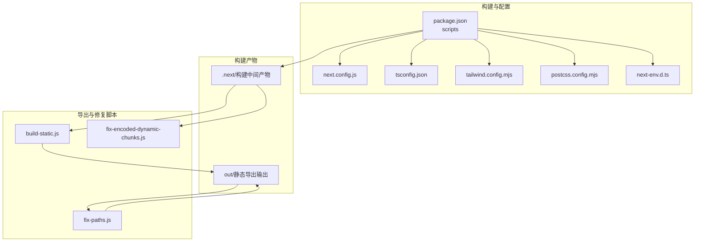
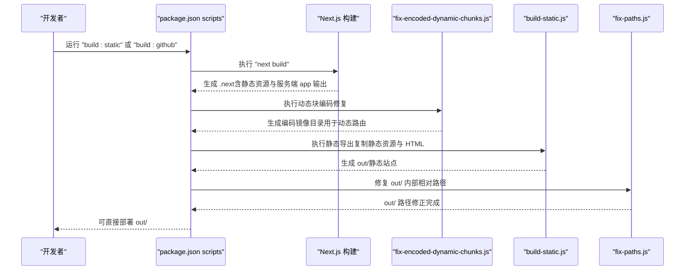
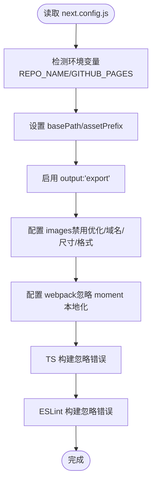
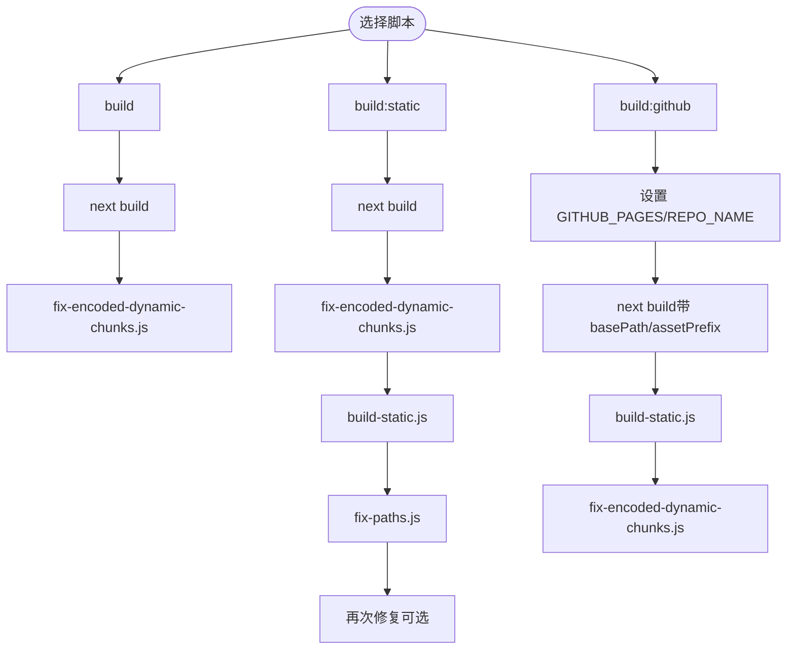
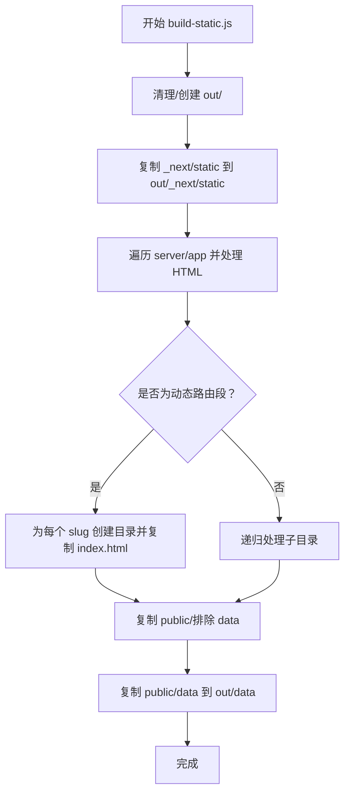
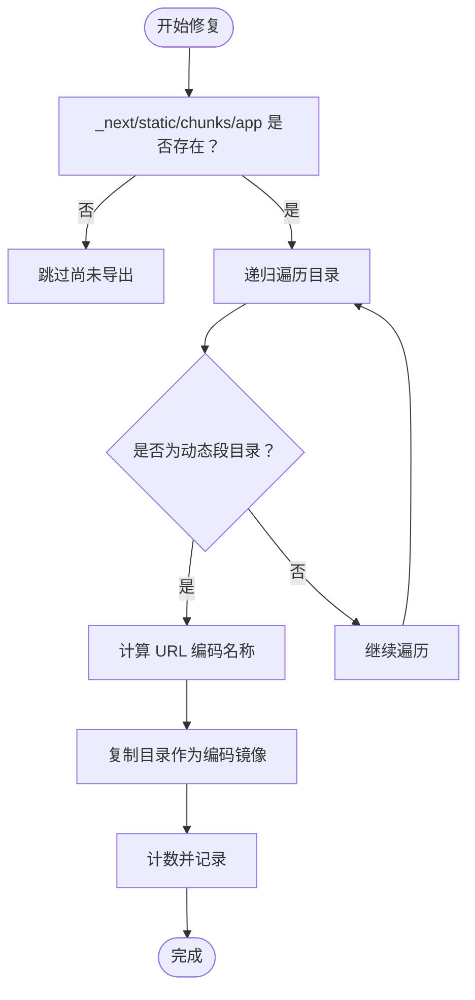
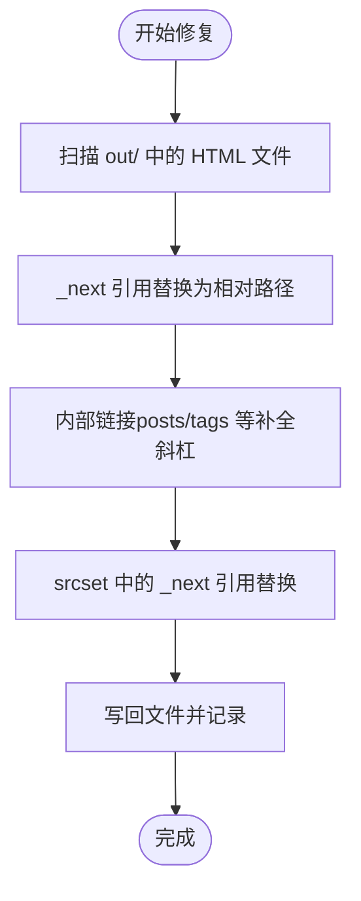
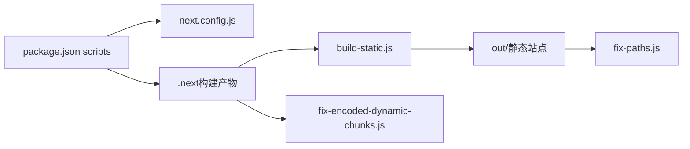

# 部署配置

<cite>
**本文引用的文件**
- [next.config.js](file://blog-system2/frontend/next.config.js)
- [package.json](file://blog-system2/frontend/package.json)
- [build-static.js](file://blog-system2/frontend/build-static.js)
- [fix-encoded-dynamic-chunks.js](file://blog-system2/frontend/fix-encoded-dynamic-chunks.js)
- [fix-paths.js](file://blog-system2/frontend/fix-paths.js)
- [IMAGE_OPTIMIZATION.md](file://blog-system2/frontend/IMAGE_OPTIMIZATION.md)
- [tailwind.config.mjs](file://blog-system2/frontend/tailwind.config.mjs)
- [tsconfig.json](file://blog-system2/frontend/tsconfig.json)
- [postcss.config.mjs](file://blog-system2/frontend/postcss.config.mjs)
- [next-env.d.ts](file://blog-system2/frontend/next-env.d.ts)
</cite>

## 目录
1. [简介](#简介)
2. [项目结构](#项目结构)
3. [核心组件](#核心组件)
4. [架构总览](#架构总览)
5. [详细组件分析](#详细组件分析)
6. [依赖关系分析](#依赖关系分析)
7. [性能考量](#性能考量)
8. [故障排查指南](#故障排查指南)
9. [结论](#结论)
10. [附录](#附录)

## 简介
本文件系统化梳理该 Next.js 应用的静态站点生成（SSG）与部署配置，覆盖以下主题：
- next.config.js 中的关键静态导出配置项：output、basePath、assetPrefix、images、webpack 等
- build-static.js 的作用与执行流程，以及与辅助脚本的协作
- package.json scripts 如何串联构建、静态导出与路径修复
- 静态资源优化：图片优化、代码分割与缓存策略
- 环境变量与生产优化设置
- 不同部署平台（Vercel、GitHub Pages、传统服务器）的配置差异与注意事项
- 配置验证与测试方法

## 项目结构
前端工程位于 blog-system2/frontend，采用 App Router 结构，使用 Next.js 15。关键配置与脚本如下：
- 构建配置：next.config.js
- 构建脚本：package.json scripts
- 静态导出与目录整理：build-static.js
- 动态路由编码修复：fix-encoded-dynamic-chunks.js
- HTML 路径修复：fix-paths.js
- 样式与类型：tailwind.config.mjs、tsconfig.json、postcss.config.mjs、next-env.d.ts
- 图片处理规范：IMAGE_OPTIMIZATION.md

图表来源
- [next.config.js:1-48](file://blog-system2/frontend/next.config.js#L1-L48)
- [package.json:1-72](file://blog-system2/frontend/package.json#L1-L72)
- [build-static.js:1-141](file://blog-system2/frontend/build-static.js#L1-L141)
- [fix-encoded-dynamic-chunks.js:1-73](file://blog-system2/frontend/fix-encoded-dynamic-chunks.js#L1-L73)
- [fix-paths.js:1-53](file://blog-system2/frontend/fix-paths.js#L1-L53)

章节来源
- [next.config.js:1-48](file://blog-system2/frontend/next.config.js#L1-L48)
- [package.json:1-72](file://blog-system2/frontend/package.json#L1-L72)

## 核心组件
- 静态导出配置（next.config.js）
  - output: "export" 启用静态导出模式
  - basePath 与 assetPrefix：在 GitHub Pages 等子路径场景下自动注入仓库名前缀
  - images：禁用默认优化器并配置域名白名单、尺寸与格式
  - webpack：移除 moment.js 的本地化资源以减小体积
  - TypeScript 与 ESLint：构建时忽略错误以提升兼容性
- 构建脚本（package.json）
  - build：标准构建后执行动态块修复
  - build:static：完整静态导出流水线（构建→修复→导出→路径修复→二次修复）
  - build:github：针对 GitHub Pages 的一键构建（通过环境变量驱动 basePath/assetPrefix）
- 导出与修复脚本
  - build-static.js：复制静态资源、HTML 页面与公共文件到 out/，并按路由规则组织目录结构
  - fix-encoded-dynamic-chunks.js：为动态路由段生成编码镜像目录，解决静态导出的路由匹配问题
  - fix-paths.js：修正 HTML 内部相对路径引用，确保 _next 与内部链接在任意层级下均正确解析

章节来源
- [next.config.js:6-45](file://blog-system2/frontend/next.config.js#L6-L45)
- [package.json:5-12](file://blog-system2/frontend/package.json#L5-L12)
- [build-static.js:33-87](file://blog-system2/frontend/build-static.js#L33-L87)
- [fix-encoded-dynamic-chunks.js:39-73](file://blog-system2/frontend/fix-encoded-dynamic-chunks.js#L39-L73)
- [fix-paths.js:6-34](file://blog-system2/frontend/fix-paths.js#L6-L34)

## 架构总览
静态导出的端到端流程由构建脚本驱动，依次完成：
- Next.js 标准构建（.next 生成）
- 动态块编码修复（生成编码镜像目录）
- 静态导出（复制静态资源与 HTML 到 out/）
- 路径修复（修正 out/ 内部相对路径）

图表来源
- [package.json:8-9](file://blog-system2/frontend/package.json#L8-L9)
- [fix-encoded-dynamic-chunks.js:39-73](file://blog-system2/frontend/fix-encoded-dynamic-chunks.js#L39-L73)
- [build-static.js:33-87](file://blog-system2/frontend/build-static.js#L33-L87)
- [fix-paths.js:36-52](file://blog-system2/frontend/fix-paths.js#L36-L52)

## 详细组件分析

### 组件一：静态导出配置（next.config.js）
- output: "export"
  - 将应用切换至静态导出模式，生成可直接部署的纯静态文件
- basePath 与 assetPrefix
  - 在 GitHub Pages 环境下，通过环境变量注入仓库名前缀，保证资源与链接正确指向
- images
  - 关闭默认优化器，避免在静态导出时对图片进行运行时处理
  - 白名单域名与尺寸/格式配置，便于外部图片加载与缓存
- webpack
  - 忽略 moment.js 的本地化资源，减少包体与构建时间
- TypeScript 与 ESLint
  - 构建阶段忽略错误，提高兼容性与稳定性

图表来源
- [next.config.js:3-45](file://blog-system2/frontend/next.config.js#L3-L45)

章节来源
- [next.config.js:3-45](file://blog-system2/frontend/next.config.js#L3-L45)

### 组件二：构建脚本（package.json scripts）
- build
  - 标准构建后执行动态块编码修复，确保动态路由在静态导出后仍可访问
- build:static
  - 完整静态导出流水线：构建→修复→导出→路径修复→二次修复
- build:github
  - 通过环境变量驱动 GitHub Pages 的 basePath/assetPrefix，一键完成静态导出

图表来源
- [package.json:5-12](file://blog-system2/frontend/package.json#L5-L12)

章节来源
- [package.json:5-12](file://blog-system2/frontend/package.json#L5-L12)

### 组件三：静态导出脚本（build-static.js）
- 目标：将 .next 中的静态资源与服务端 app 输出复制到 out/，并按路由规则组织目录
- 关键步骤
  - 清理/创建 out/ 目录
  - 复制静态资源（_next/static）
  - 处理服务端 app 目录（递归遍历，特殊处理动态路由段 [slug] 与 index/_not-found）
  - 复制 public/ 下的非 data 文件与 data 目录
- 输出：out/ 即为可直接部署的静态站点根目录

图表来源
- [build-static.js:33-87](file://blog-system2/frontend/build-static.js#L33-L87)
- [build-static.js:89-138](file://blog-system2/frontend/build-static.js#L89-L138)

章节来源
- [build-static.js:10-87](file://blog-system2/frontend/build-static.js#L10-L87)
- [build-static.js:89-138](file://blog-system2/frontend/build-static.js#L89-L138)

### 组件四：动态路由编码修复（fix-encoded-dynamic-chunks.js）
- 目标：为动态路由段（如 [slug]）生成编码后的镜像目录，解决静态导出后路径匹配问题
- 行为：遍历 out/_next/static/chunks/app，遇到以方括号包裹的动态段，生成对应 URL 编码后的镜像目录

图表来源
- [fix-encoded-dynamic-chunks.js:39-73](file://blog-system2/frontend/fix-encoded-dynamic-chunks.js#L39-L73)

章节来源
- [fix-encoded-dynamic-chunks.js:1-73](file://blog-system2/frontend/fix-encoded-dynamic-chunks.js#L1-L73)

### 组件五：HTML 路径修复（fix-paths.js）
- 目标：修正 out/ 内部 HTML 的相对路径引用，确保 _next 与内部链接在任意层级下正确解析
- 行为：遍历 out/，对每个 HTML 文件替换 href/src 与 srcset 中的绝对路径为基于当前层级的相对路径

图表来源
- [fix-paths.js:6-34](file://blog-system2/frontend/fix-paths.js#L6-L34)
- [fix-paths.js:36-52](file://blog-system2/frontend/fix-paths.js#L36-L52)

章节来源
- [fix-paths.js:1-53](file://blog-system2/frontend/fix-paths.js#L1-L53)

### 组件六：图片优化与资源策略
- 配置层面
  - images.unoptimized: true，禁用 Next.js 默认图片优化，适合静态导出场景
  - domains、deviceSizes、imageSizes、formats 等配置，便于外部图片加载与缓存
- 实践层面
  - 提供图片处理规范文档，建议在构建前对图片进行预处理（裁剪、压缩、WebP 转换），降低运行时开销

章节来源
- [next.config.js:20-33](file://blog-system2/frontend/next.config.js#L20-L33)
- [IMAGE_OPTIMIZATION.md:1-28](file://blog-system2/frontend/IMAGE_OPTIMIZATION.md#L1-L28)

### 组件七：样式与类型配置
- Tailwind：content 覆盖 pages/components/app，启用暗色模式与插件
- PostCSS：集成 Tailwind 插件
- TypeScript：严格模式、模块解析、路径映射与类型根目录配置

章节来源
- [tailwind.config.mjs:1-18](file://blog-system2/frontend/tailwind.config.mjs#L1-L18)
- [postcss.config.mjs:1-6](file://blog-system2/frontend/postcss.config.mjs#L1-L6)
- [tsconfig.json:1-42](file://blog-system2/frontend/tsconfig.json#L1-L42)
- [next-env.d.ts:1-6](file://blog-system2/frontend/next-env.d.ts#L1-L6)

## 依赖关系分析
- 构建脚本依赖 next.config.js 的静态导出配置
- build-static.js 依赖 .next 的构建产物
- fix-encoded-dynamic-chunks.js 依赖 out/_next/static/chunks/app 的存在
- fix-paths.js 依赖 out/ 的最终导出结果
- package.json scripts 串联上述所有步骤

图表来源
- [package.json:5-12](file://blog-system2/frontend/package.json#L5-L12)
- [next.config.js:6-45](file://blog-system2/frontend/next.config.js#L6-L45)
- [build-static.js:33-87](file://blog-system2/frontend/build-static.js#L33-L87)
- [fix-encoded-dynamic-chunks.js:39-73](file://blog-system2/frontend/fix-encoded-dynamic-chunks.js#L39-L73)
- [fix-paths.js:36-52](file://blog-system2/frontend/fix-paths.js#L36-L52)

章节来源
- [package.json:5-12](file://blog-system2/frontend/package.json#L5-L12)

## 性能考量
- 代码分割与缓存
  - 使用动态导入与路由分块，结合静态导出的产物结构，确保页面级资源最小化加载
  - 通过 basePath/assetPrefix 与 assetPrefix 在子路径部署时保持缓存命中
- 图片优化
  - 在静态导出场景禁用 Next.js 图片优化，建议在构建前完成图片预处理（裁剪、压缩、WebP）
- 体积控制
  - 移除 moment.js 的本地化资源，减少包体与构建时间
- 生产优化
  - 构建阶段忽略 TS/ESLint 错误，提升兼容性；在开发阶段仍可通过 lint 脚本发现问题

章节来源
- [next.config.js:35-44](file://blog-system2/frontend/next.config.js#L35-L44)
- [next.config.js:20-33](file://blog-system2/frontend/next.config.js#L20-L33)
- [IMAGE_OPTIMIZATION.md:1-28](file://blog-system2/frontend/IMAGE_OPTIMIZATION.md#L1-L28)

## 故障排查指南
- 构建失败或导出为空
  - 确认已执行完整流水线（build:static 或 build:github）
  - 检查 .next 是否存在，确认 build-static.js 已复制静态资源与 HTML
- 动态路由无法访问
  - 确认 fix-encoded-dynamic-chunks.js 已执行，out/_next/static/chunks/app 中存在编码镜像目录
- 链接或静态资源 404
  - 确认 fix-paths.js 已执行，out/ 内部路径已修正为相对路径
- GitHub Pages 子路径问题
  - 确认设置了 GITHUB_PAGES=true 与 REPO_NAME，next.config.js 已根据环境变量注入 basePath/assetPrefix
- 图片加载异常
  - 确认 images.unoptimized 为 true，且外部域名已在 domains 白名单中

章节来源
- [build-static.js:33-87](file://blog-system2/frontend/build-static.js#L33-L87)
- [fix-encoded-dynamic-chunks.js:39-73](file://blog-system2/frontend/fix-encoded-dynamic-chunks.js#L39-L73)
- [fix-paths.js:6-34](file://blog-system2/frontend/fix-paths.js#L6-L34)
- [next.config.js:3-10](file://blog-system2/frontend/next.config.js#L3-L10)
- [next.config.js:20-33](file://blog-system2/frontend/next.config.js#L20-L33)

## 结论
该配置以“静态导出 + 辅助修复脚本”的方式，实现了可在多平台部署的纯静态站点。通过环境变量与脚本编排，既能适配 Vercel 等平台的自动部署，也能轻松落地到 GitHub Pages 与传统服务器。建议在 CI/CD 中固定使用 build:static 或 build:github，确保每次部署前执行完整的导出与修复流程。

## 附录

### 不同部署平台的配置要点对比
- Vercel
  - 自动识别 next.config.js 的静态导出配置，无需额外配置
  - 建议开启 ISR/SSR 时，保留 output 配置并配合环境变量
- GitHub Pages
  - 使用 build:github 脚本，自动注入 basePath/assetPrefix
  - 确保仓库设置为 Pages 源（gh-pages 分支或 out 目录）
- 传统服务器（Nginx/Apache）
  - 部署 out/ 目录
  - 配置 404 回退至 index.html（单页应用回退）
  - 设置静态资源缓存头（CSS/JS/媒体文件）

### 配置验证与测试方法
- 本地验证
  - 执行 build:static，检查 out/ 是否生成且包含 _next/static、HTML 页面与 public 资源
  - 使用静态服务器（如 http-server）启动 out/，手动访问首页与动态路由页面
- 路径修复验证
  - 确认 out/ 内部链接与静态资源引用均为相对路径
- 环境变量验证
  - 在 GitHub Pages 环境下设置 GITHUB_PAGES=true 与 REPO_NAME，重新构建并核对 basePath/assetPrefix 注入情况

章节来源
- [package.json:8-9](file://blog-system2/frontend/package.json#L8-L9)
- [next.config.js:3-10](file://blog-system2/frontend/next.config.js#L3-L10)
- [build-static.js:33-87](file://blog-system2/frontend/build-static.js#L33-L87)
- [fix-paths.js:36-52](file://blog-system2/frontend/fix-paths.js#L36-L52)