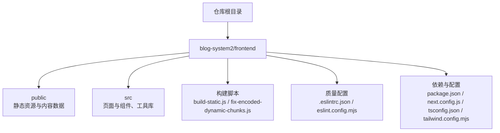
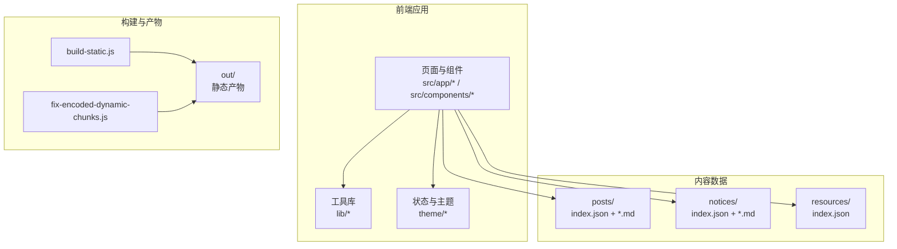
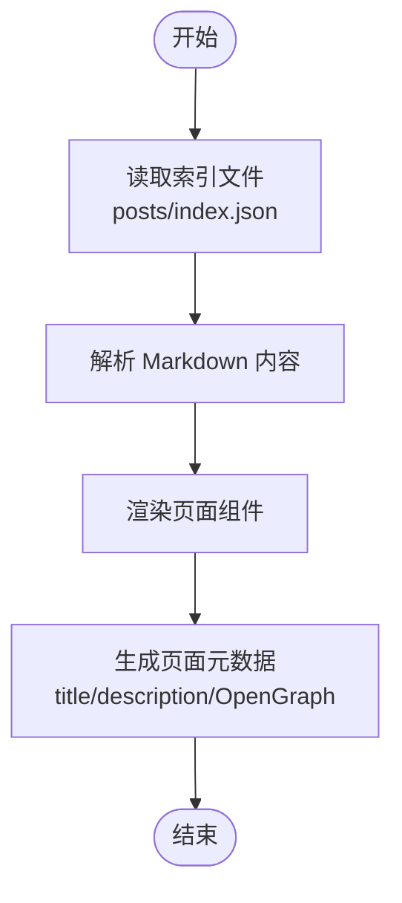
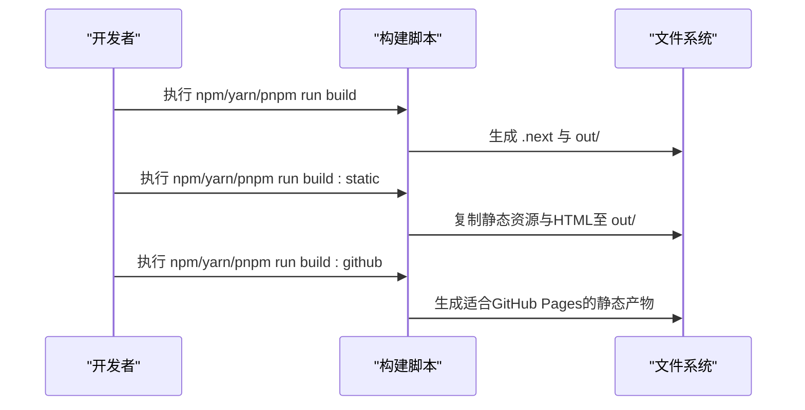
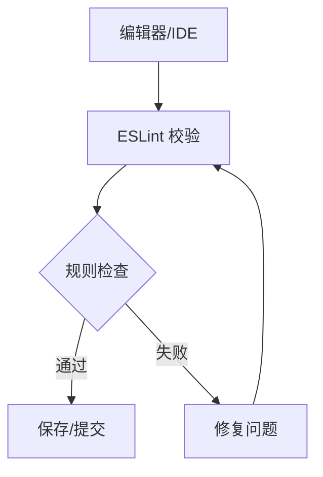
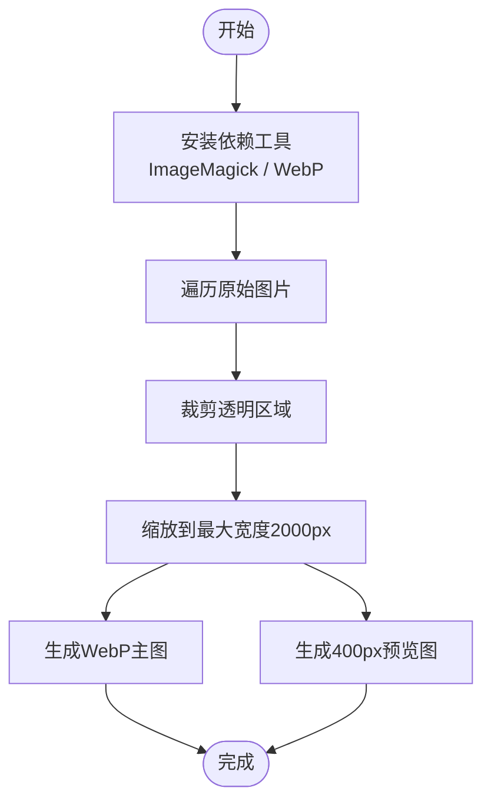
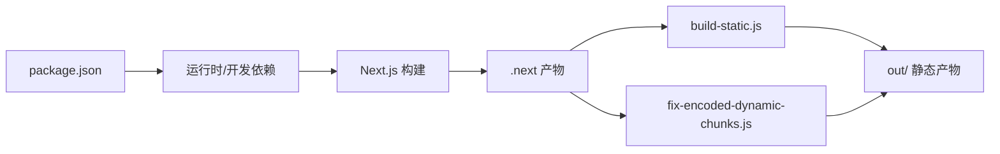

# 开发团队与贡献

<cite>
**本文引用的文件**
- [README.md](file://README.md)
- [package.json](file://blog-system2/frontend/package.json)
- [.eslintrc.json](file://blog-system2/frontend/.eslintrc.json)
- [eslint.config.mjs](file://blog-system2/frontend/eslint.config.mjs)
- [build-static.js](file://blog-system2/frontend/build-static.js)
- [fix-encoded-dynamic-chunks.js](file://blog-system2/frontend/fix-encoded-dynamic-chunks.js)
- [IMAGE_OPTIMIZATION.md](file://blog-system2/frontend/IMAGE_OPTIMIZATION.md)
- [public/data/posts/README.md](file://blog-system2/frontend/public/data/posts/README.md)
- [src/app/README.md](file://blog-system2/frontend/src/app/README.md)
- [.gitignore](file://.gitignore)
</cite>

## 目录
1. [简介](#简介)
2. [项目结构](#项目结构)
3. [核心角色与职责](#核心角色与职责)
4. [架构总览](#架构总览)
5. [详细组件分析](#详细组件分析)
6. [依赖关系分析](#依赖关系分析)
7. [性能与质量保障](#性能与质量保障)
8. [贡献指南](#贡献指南)
9. [参与方式与沟通渠道](#参与方式与沟通渠道)
10. [版本管理与发布策略](#版本管理与发布策略)
11. [行为准则与协作文化](#行为准则与协作文化)
12. [故障排查指南](#故障排查指南)
13. [结语](#结语)

## 简介
本项目为基于 Next.js 的现代化静态博客平台，面向技术社区提供内容展示、搜索、主题切换与丰富的前端动画效果。项目采用纯前端静态站点架构，通过本地 JSON 与 Markdown 管理内容，支持多种部署方式（GitHub Pages、Vercel、EdgeOne Pages 等）。本文档旨在帮助贡献者理解团队构成、治理模式、开发流程与协作规范，推动高质量、可持续的社区共建。

## 项目结构
项目采用前后端一体化的单仓结构，前端位于 blog-system2/frontend，核心目录与职责如下：
- blog-system2/frontend
  - public：静态资源与内容数据（posts、notices、resources、首页背景等）
  - src：Next.js App Router 页面与组件、工具库、类型声明
  - 构建与部署脚本：build-static.js、fix-encoded-dynamic-chunks.js
  - 质量保障：.eslintrc.json、eslint.config.mjs
  - 依赖与配置：package.json、next.config.js、tsconfig.json、tailwind.config.mjs 等

**图表来源**
- [README.md:53-93](file://README.md#L53-L93)

**章节来源**
- [README.md:53-93](file://README.md#L53-L93)

## 核心角色与职责
- 核心开发者
  - 负责整体架构设计、关键技术选型与关键模块实现
  - 统筹内容数据模型（posts/index.json、notices/index.json、resources/index.json）与渲染管线
  - 维护构建与部署脚本，保障静态站点生成与兼容性
- 技术负责人
  - 负责代码质量与规范落地（ESLint、TypeScript、组件设计）
  - 组织技术评审与方案讨论，推动最佳实践
- 参与成员
  - 负责具体页面、组件与内容的开发与维护
  - 遵循统一的提交规范与审查流程，保证交付质量

说明：当前仓库未提供正式的团队角色文档或治理章程文件，以上角色划分基于项目现状与职责边界进行归纳，便于贡献者理解协作关系与责任分工。

## 架构总览
系统采用“静态站点 + 本地内容”的架构，前端负责页面渲染、搜索与主题切换，内容通过 JSON 与 Markdown 管理，构建阶段生成可直接托管的静态产物。

**图表来源**
- [README.md:173-236](file://README.md#L173-L236)
- [build-static.js:33-87](file://blog-system2/frontend/build-static.js#L33-L87)
- [fix-encoded-dynamic-chunks.js:39-73](file://blog-system2/frontend/fix-encoded-dynamic-chunks.js#L39-L73)

## 详细组件分析

### 内容管理与渲染
- 数据模型
  - 文章：public/data/posts/index.json 作为索引，配合各 .md 内容文件
  - 公告：public/data/notices/index.json 与 .md
  - 资源：public/data/resources/index.json
- 渲染流程
  - 页面读取索引，解析 Markdown，生成页面内容与元数据
  - 支持数学公式、代码高亮、图片等富文本能力
- 命名与组织
  - 建议按类别组织文件，合理使用标题层级，为代码块指定语言，优化图片与链接

**图表来源**
- [README.md:173-236](file://README.md#L173-L236)
- [public/data/posts/README.md:148-209](file://blog-system2/frontend/public/data/posts/README.md#L148-L209)
- [src/app/README.md:1-79](file://blog-system2/frontend/src/app/README.md#L1-L79)

**章节来源**
- [README.md:173-236](file://README.md#L173-L236)
- [public/data/posts/README.md:148-209](file://blog-system2/frontend/public/data/posts/README.md#L148-L209)
- [src/app/README.md:1-79](file://blog-system2/frontend/src/app/README.md#L1-L79)

### 构建与静态站点生成
- 构建脚本
  - build-static.js：复制 .next 静态资源、App Router HTML、public 非 data 目录与 data 目录至 out/
  - fix-encoded-dynamic-chunks.js：为动态路由段生成编码镜像，提升兼容性
- 构建命令
  - package.json 中提供 dev、build、build:static、build:github、start、lint 等脚本

**图表来源**
- [package.json:5-11](file://blog-system2/frontend/package.json#L5-L11)
- [build-static.js:33-87](file://blog-system2/frontend/build-static.js#L33-L87)
- [fix-encoded-dynamic-chunks.js:39-73](file://blog-system2/frontend/fix-encoded-dynamic-chunks.js#L39-L73)

**章节来源**
- [package.json:5-11](file://blog-system2/frontend/package.json#L5-L11)
- [build-static.js:33-87](file://blog-system2/frontend/build-static.js#L33-L87)
- [fix-encoded-dynamic-chunks.js:39-73](file://blog-system2/frontend/fix-encoded-dynamic-chunks.js#L39-L73)

### 质量与规范
- ESLint 配置
  - 使用 Next.js 核心 Web Vitals 规则集，针对图片、依赖、未使用变量等规则进行调整
  - 支持 Flat Config（eslint.config.mjs）与传统配置（.eslintrc.json）
- 类型与工具
  - TypeScript 配置与类型声明位于 tsconfig.json 与 src/types
  - 工具函数与静态数据读取位于 lib/static-data.ts 与 lib/utils.ts

**图表来源**
- [.eslintrc.json:1-12](file://blog-system2/frontend/.eslintrc.json#L1-L12)
- [eslint.config.mjs:12-16](file://blog-system2/frontend/eslint.config.mjs#L12-L16)

**章节来源**
- [.eslintrc.json:1-12](file://blog-system2/frontend/.eslintrc.json#L1-L12)
- [eslint.config.mjs:12-16](file://blog-system2/frontend/eslint.config.mjs#L12-L16)

### 图片处理规范
- 预处理流程
  - 安装 ImageMagick 与 WebP 工具
  - 批量裁剪透明区域、缩放至最大宽度 2000px、生成 WebP 与预览图
- 输出目录
  - raw-images → temp → processed / previews

**图表来源**
- [IMAGE_OPTIMIZATION.md:1-28](file://blog-system2/frontend/IMAGE_OPTIMIZATION.md#L1-L28)

**章节来源**
- [IMAGE_OPTIMIZATION.md:1-28](file://blog-system2/frontend/IMAGE_OPTIMIZATION.md#L1-L28)

## 依赖关系分析
- 依赖管理
  - package.json 管理运行时与开发依赖，包含 Next.js、React、Tailwind CSS、Algolia、KaTeX、Three.js 等
- 构建链路
  - Next.js 构建 → build-static.js 复制静态资源与 HTML → fix-encoded-dynamic-chunks.js 生成编码镜像
- 版本与兼容
  - 通过固定版本与脚本命令确保构建一致性

**图表来源**
- [package.json:13-70](file://blog-system2/frontend/package.json#L13-L70)
- [build-static.js:33-87](file://blog-system2/frontend/build-static.js#L33-L87)
- [fix-encoded-dynamic-chunks.js:39-73](file://blog-system2/frontend/fix-encoded-dynamic-chunks.js#L39-L73)

**章节来源**
- [package.json:13-70](file://blog-system2/frontend/package.json#L13-L70)
- [build-static.js:33-87](file://blog-system2/frontend/build-static.js#L33-L87)
- [fix-encoded-dynamic-chunks.js:39-73](file://blog-system2/frontend/fix-encoded-dynamic-chunks.js#L39-L73)

## 性能与质量保障
- 性能
  - 静态站点无需后端，部署简单、加载快速
  - 图片处理与压缩（WebP）降低带宽占用
- 质量
  - ESLint 规范约束与类型检查
  - 构建脚本确保产物一致性与兼容性

[本节为通用指导，不直接分析具体文件]

## 贡献指南
- 提交前准备
  - 本地运行代码检查与构建命令，确保通过
  - 遵循内容命名与组织规范，合理使用标题层级与代码高亮
- 提交流程
  - Fork 仓库 → 新建分支 → 提交更改 → 发起 Pull Request
  - PR 描述需说明变更目的、影响范围与测试情况
- 代码审查
  - 审查重点：功能正确性、性能影响、可维护性、安全性
  - 通过 CI 校验与审查意见后合并

[本节为通用指导，不直接分析具体文件]

## 参与方式与沟通渠道
- 问题反馈与功能建议
  - 通过 Issue 模板提交，附带环境信息、复现步骤与期望结果
- 代码贡献
  - 遵循贡献流程与审查标准，保持高质量交付
- 沟通渠道
  - 邮件与微信联系方式详见内容渲染说明文档

**章节来源**
- [public/data/posts/README.md:203-209](file://blog-system2/frontend/public/data/posts/README.md#L203-L209)

## 版本管理与发布策略
- 版本标识
  - 项目版本由 package.json 中的 version 字段标识
- 发布节奏
  - 采用迭代式发布，结合功能完成度与稳定性评估
- 发布内容
  - 重大变更记录于 README 或变更日志（如存在）

**章节来源**
- [package.json:3](file://blog-system2/frontend/package.json#L3)
- [README.md:480-484](file://README.md#L480-L484)

## 行为准则与协作文化
- 尊重与包容
  - 鼓励不同背景的成员参与，营造开放友好的社区氛围
- 透明与协作
  - 决策过程公开，鼓励讨论与贡献
- 质量优先
  - 重视代码质量与用户体验，持续改进

[本节为通用指导，不直接分析具体文件]

## 故障排查指南
- 构建失败
  - 检查依赖安装与 Node.js 版本要求
  - 运行构建脚本并关注输出日志
- 静态产物异常
  - 确认 build-static.js 与 fix-encoded-dynamic-chunks.js 是否成功执行
  - 检查 out/ 目录结构与内容完整性
- 内容未生效
  - 确认索引文件（index.json）与 Markdown 文件路径正确
  - 检查文件命名与组织规范

**章节来源**
- [README.md:99-125](file://README.md#L99-L125)
- [build-static.js:33-87](file://blog-system2/frontend/build-static.js#L33-L87)
- [fix-encoded-dynamic-chunks.js:39-73](file://blog-system2/frontend/fix-encoded-dynamic-chunks.js#L39-L73)
- [public/data/posts/README.md:148-209](file://blog-system2/frontend/public/data/posts/README.md#L148-L209)

## 结语
本指南为技术博客平台的开发团队与贡献者提供了角色分工、治理模式、开发流程与协作规范的总体说明。请在实际贡献中结合仓库现有脚本与配置，遵循质量与性能要求，共同推动项目的持续演进与社区繁荣。