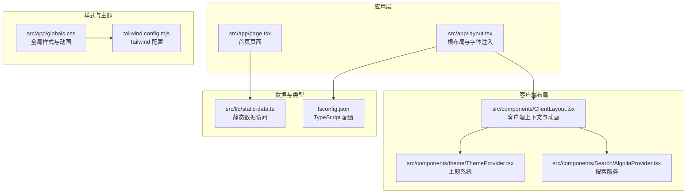
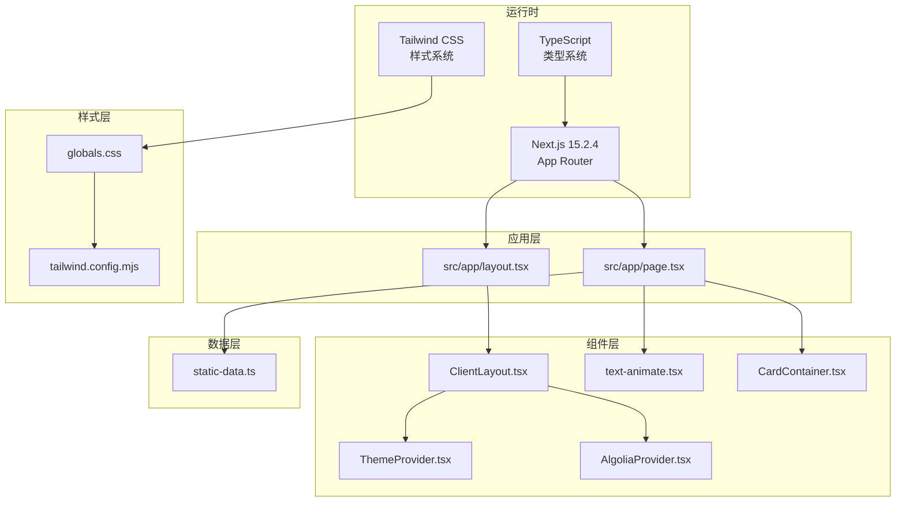
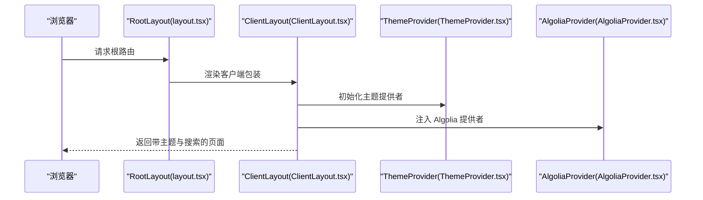
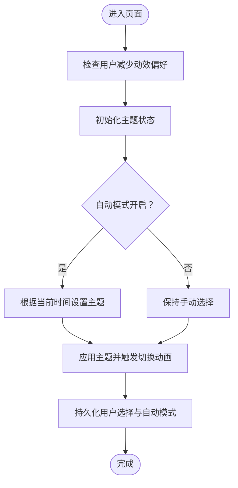
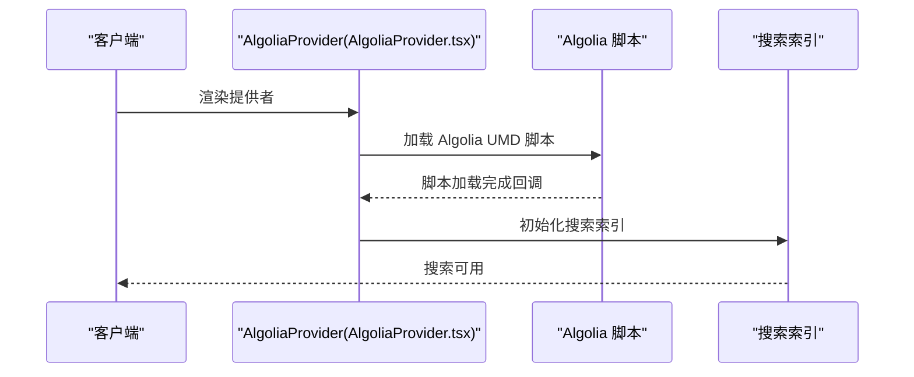
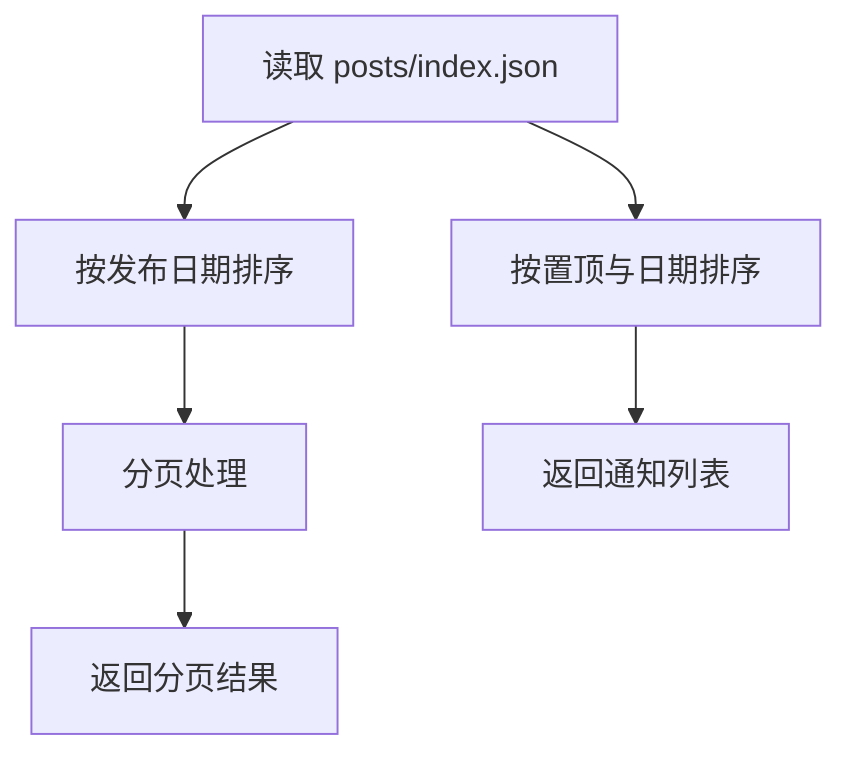
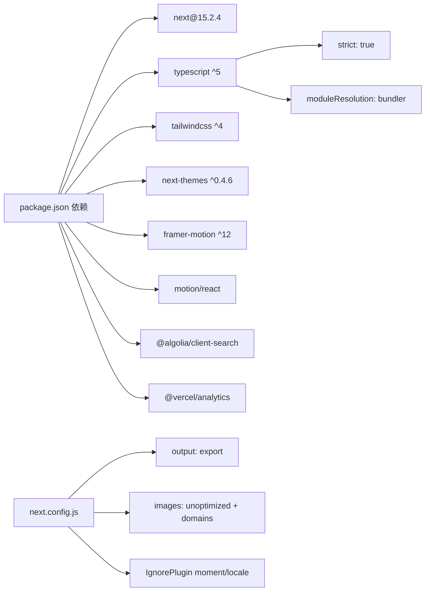

# 技术架构概览

<cite>
**本文档引用的文件**
- [package.json](file://blog-system2/frontend/package.json)
- [next.config.js](file://blog-system2/frontend/next.config.js)
- [tsconfig.json](file://blog-system2/frontend/tsconfig.json)
- [tailwind.config.mjs](file://blog-system2/frontend/tailwind.config.mjs)
- [layout.tsx](file://blog-system2/frontend/src/app/layout.tsx)
- [page.tsx](file://blog-system2/frontend/src/app/page.tsx)
- [ClientLayout.tsx](file://blog-system2/frontend/src/components/ClientLayout.tsx)
- [ThemeProvider.tsx](file://blog-system2/frontend/src/components/theme/ThemeProvider.tsx)
- [AlgoliaProvider.tsx](file://blog-system2/frontend/src/components/Search/AlgoliaProvider.tsx)
- [globals.css](file://blog-system2/frontend/src/app/globals.css)
- [static-data.ts](file://blog-system2/frontend/src/lib/static-data.ts)
- [CardContainer.tsx](file://blog-system2/frontend/src/components/Home/3DCardEffect/CardContainer.tsx)
- [text-animate.tsx](file://blog-system2/frontend/src/components/magicui/text-animate.tsx)
</cite>

## 目录
1. [引言](#引言)
2. [项目结构](#项目结构)
3. [核心组件](#核心组件)
4. [架构总览](#架构总览)
5. [详细组件分析](#详细组件分析)
6. [依赖关系分析](#依赖关系分析)
7. [性能考虑](#性能考虑)
8. [故障排除指南](#故障排除指南)
9. [结论](#结论)
10. [附录](#附录)

## 引言
本技术博客平台采用现代化前端技术栈，围绕 Next.js 15.2.4 构建，结合 TypeScript 提供强类型保障，使用 Tailwind CSS 实现实用优先的样式系统。项目通过组件化设计、数据驱动渲染与响应式布局，为开发者与用户提供优秀的开发体验与浏览体验。本文档从架构视角梳理技术选型、集成方式与协作机制，同时给出学习路径建议与最佳实践。

## 项目结构
前端项目位于 `blog-system2/frontend`，采用 Next.js App Router 的目录组织方式，核心结构如下：
- 应用入口与根布局：`src/app/`（包含全局布局、元数据、路由页面）
- 组件层：`src/components/`（可复用 UI 组件、业务组件、第三方集成）
- 工具与类型：`src/lib/`（静态数据访问、工具函数）、`src/types/`（自定义类型声明）
- 样式与主题：`src/app/globals.css`（全局样式）、`tailwind.config.mjs`（Tailwind 配置）
- 构建配置：`next.config.js`（Next.js 配置）、`tsconfig.json`（TypeScript 配置）



**图示来源**
- [layout.tsx:1-48](file://blog-system2/frontend/src/app/layout.tsx#L1-L48)
- [page.tsx:1-120](file://blog-system2/frontend/src/app/page.tsx#L1-L120)
- [ClientLayout.tsx:1-63](file://blog-system2/frontend/src/components/ClientLayout.tsx#L1-L63)
- [ThemeProvider.tsx:1-161](file://blog-system2/frontend/src/components/theme/ThemeProvider.tsx#L1-L161)
- [AlgoliaProvider.tsx:1-100](file://blog-system2/frontend/src/components/Search/AlgoliaProvider.tsx#L1-L100)
- [globals.css:1-200](file://blog-system2/frontend/src/app/globals.css#L1-L200)
- [tailwind.config.mjs:1-18](file://blog-system2/frontend/tailwind.config.mjs#L1-L18)
- [static-data.ts:1-214](file://blog-system2/frontend/src/lib/static-data.ts#L1-L214)
- [tsconfig.json:1-42](file://blog-system2/frontend/tsconfig.json#L1-L42)

**章节来源**
- [layout.tsx:1-48](file://blog-system2/frontend/src/app/layout.tsx#L1-L48)
- [page.tsx:1-120](file://blog-system2/frontend/src/app/page.tsx#L1-L120)
- [ClientLayout.tsx:1-63](file://blog-system2/frontend/src/components/ClientLayout.tsx#L1-L63)
- [globals.css:1-200](file://blog-system2/frontend/src/app/globals.css#L1-L200)
- [tailwind.config.mjs:1-18](file://blog-system2/frontend/tailwind.config.mjs#L1-L18)
- [static-data.ts:1-214](file://blog-system2/frontend/src/lib/static-data.ts#L1-L214)
- [tsconfig.json:1-42](file://blog-system2/frontend/tsconfig.json#L1-L42)

## 核心组件
- 根布局与字体注入：通过根布局注入 Geist 字体变量与全局样式，统一字体与基础样式。
- 客户端布局：封装主题提供者、搜索提供者、导航进度条、动画过渡与分析埋点。
- 主题系统：基于 next-themes 的主题提供者，支持自动/手动切换与无障碍偏好检测。
- 搜索集成：Algolia 提供者负责脚本加载与索引初始化，确保搜索功能可用。
- 数据访问：静态数据模块提供文章、通知、资源的索引与查询能力，支持分页与排序。
- 动画与交互：文本动画组件与 3D 卡片容器提供丰富的交互体验与性能优化。

**章节来源**
- [layout.tsx:1-48](file://blog-system2/frontend/src/app/layout.tsx#L1-L48)
- [ClientLayout.tsx:1-63](file://blog-system2/frontend/src/components/ClientLayout.tsx#L1-L63)
- [ThemeProvider.tsx:1-161](file://blog-system2/frontend/src/components/theme/ThemeProvider.tsx#L1-L161)
- [AlgoliaProvider.tsx:1-100](file://blog-system2/frontend/src/components/Search/AlgoliaProvider.tsx#L1-L100)
- [static-data.ts:1-214](file://blog-system2/frontend/src/lib/static-data.ts#L1-L214)
- [text-animate.tsx:1-120](file://blog-system2/frontend/src/components/magicui/text-animate.tsx#L1-L120)
- [CardContainer.tsx:1-121](file://blog-system2/frontend/src/components/Home/3DCardEffect/CardContainer.tsx#L1-L121)

## 架构总览
整体架构采用“应用层 + 组件层 + 样式层 + 数据层”的分层设计，Next.js 作为运行时与构建时核心，TypeScript 提供类型安全，Tailwind CSS 提供实用优先的样式体系。客户端布局统一管理主题、搜索、动画与分析，首页页面通过静态数据模块进行数据驱动渲染。



**图示来源**
- [package.json:1-72](file://blog-system2/frontend/package.json#L1-L72)
- [next.config.js:1-48](file://blog-system2/frontend/next.config.js#L1-L48)
- [tsconfig.json:1-42](file://blog-system2/frontend/tsconfig.json#L1-L42)
- [tailwind.config.mjs:1-18](file://blog-system2/frontend/tailwind.config.mjs#L1-L18)
- [layout.tsx:1-48](file://blog-system2/frontend/src/app/layout.tsx#L1-L48)
- [page.tsx:1-120](file://blog-system2/frontend/src/app/page.tsx#L1-L120)
- [ClientLayout.tsx:1-63](file://blog-system2/frontend/src/components/ClientLayout.tsx#L1-L63)
- [ThemeProvider.tsx:1-161](file://blog-system2/frontend/src/components/theme/ThemeProvider.tsx#L1-L161)
- [AlgoliaProvider.tsx:1-100](file://blog-system2/frontend/src/components/Search/AlgoliaProvider.tsx#L1-L100)
- [globals.css:1-200](file://blog-system2/frontend/src/app/globals.css#L1-L200)
- [static-data.ts:1-214](file://blog-system2/frontend/src/lib/static-data.ts#L1-L214)
- [text-animate.tsx:1-120](file://blog-system2/frontend/src/components/magicui/text-animate.tsx#L1-L120)
- [CardContainer.tsx:1-121](file://blog-system2/frontend/src/components/Home/3DCardEffect/CardContainer.tsx#L1-L121)

## 详细组件分析

### 根布局与客户端布局
- 根布局负责注入字体变量、全局样式与客户端布局包装，确保主题与动画在客户端生效。
- 客户端布局统一管理主题切换、搜索提供者、导航进度条、动画过渡与分析埋点，保证页面切换的流畅体验。



**图示来源**
- [layout.tsx:1-48](file://blog-system2/frontend/src/app/layout.tsx#L1-L48)
- [ClientLayout.tsx:1-63](file://blog-system2/frontend/src/components/ClientLayout.tsx#L1-L63)
- [ThemeProvider.tsx:1-161](file://blog-system2/frontend/src/components/theme/ThemeProvider.tsx#L1-L161)
- [AlgoliaProvider.tsx:1-100](file://blog-system2/frontend/src/components/Search/AlgoliaProvider.tsx#L1-L100)

**章节来源**
- [layout.tsx:1-48](file://blog-system2/frontend/src/app/layout.tsx#L1-L48)
- [ClientLayout.tsx:1-63](file://blog-system2/frontend/src/components/ClientLayout.tsx#L1-L63)

### 主题系统与无障碍偏好
- 主题提供者基于 next-themes，支持自动/手动切换与时间感知的自动模式。
- 通过监听用户减少动效偏好与本地存储状态，实现平滑的主题切换与无障碍优化。



**图示来源**
- [ThemeProvider.tsx:74-149](file://blog-system2/frontend/src/components/theme/ThemeProvider.tsx#L74-L149)

**章节来源**
- [ThemeProvider.tsx:1-161](file://blog-system2/frontend/src/components/theme/ThemeProvider.tsx#L1-L161)

### 搜索服务集成
- Algolia 提供者负责在客户端加载搜索脚本并初始化索引，提供调试日志与回退初始化策略，确保搜索功能稳定可用。



**图示来源**
- [AlgoliaProvider.tsx:22-99](file://blog-system2/frontend/src/components/Search/AlgoliaProvider.tsx#L22-L99)

**章节来源**
- [AlgoliaProvider.tsx:1-100](file://blog-system2/frontend/src/components/Search/AlgoliaProvider.tsx#L1-L100)

### 数据驱动渲染与静态数据访问
- 静态数据模块提供文章、通知、资源的索引与查询接口，支持分页、排序与相关推荐，首页通过异步获取最新文章与通知列表。



**图示来源**
- [static-data.ts:32-83](file://blog-system2/frontend/src/lib/static-data.ts#L32-L83)
- [static-data.ts:150-173](file://blog-system2/frontend/src/lib/static-data.ts#L150-L173)

**章节来源**
- [static-data.ts:1-214](file://blog-system2/frontend/src/lib/static-data.ts#L1-L214)
- [page.tsx:20-30](file://blog-system2/frontend/src/app/page.tsx#L20-L30)

### 动画与交互组件
- 文本动画组件支持多种分割方式与预设动画，结合视口可见性与循环控制，提供丰富的文本呈现效果。
- 3D 卡片容器通过鼠标状态与请求动画帧实现平滑的旋转交互，针对触摸设备进行降级处理。

```mermaid
classDiagram
class TextAnimate {
+children : string|ReactNode
+by : "text"|"word"|"character"|"line"
+animation : "fadeIn"|"blurIn"|...
+startOnView : boolean
+loop : boolean|number
+duration : number
+delay : number
}
class CardContainer {
+rotationFactor : number
+perspective : number
+dampingFactor : number
+handleMouseMove()
+handleMouseEnter()
+handleMouseLeave()
}
TextAnimate --> "使用" motion/react
CardContainer --> "使用" useMouseState
```

**图示来源**
- [text-animate.tsx:20-73](file://blog-system2/frontend/src/components/magicui/text-animate.tsx#L20-L73)
- [CardContainer.tsx:10-26](file://blog-system2/frontend/src/components/Home/3DCardEffect/CardContainer.tsx#L10-L26)

**章节来源**
- [text-animate.tsx:1-474](file://blog-system2/frontend/src/components/magicui/text-animate.tsx#L1-L474)
- [CardContainer.tsx:1-121](file://blog-system2/frontend/src/components/Home/3DCardEffect/CardContainer.tsx#L1-L121)

## 依赖关系分析
- Next.js 15.2.4 作为核心运行时与构建时框架，提供 App Router、图像优化与静态导出能力。
- TypeScript 严格模式与 bundler 解析提升开发体验与类型安全。
- Tailwind CSS 与 @tailwindcss/typography 提供实用优先的样式系统与排版增强。
- 主题与动画依赖 next-themes、framer-motion、motion/react 等生态库。
- 搜索服务依赖 Algolia 客户端与 Next.js Script 组件。



**图示来源**
- [package.json:13-42](file://blog-system2/frontend/package.json#L13-L42)
- [next.config.js:6-45](file://blog-system2/frontend/next.config.js#L6-L45)
- [tsconfig.json:2-28](file://blog-system2/frontend/tsconfig.json#L2-L28)

**章节来源**
- [package.json:1-72](file://blog-system2/frontend/package.json#L1-L72)
- [next.config.js:1-48](file://blog-system2/frontend/next.config.js#L1-L48)
- [tsconfig.json:1-42](file://blog-system2/frontend/tsconfig.json#L1-L42)

## 性能考虑
- 图像优化：禁用 Next.js 默认优化并在配置中声明允许的域名，结合设备像素比与格式优化提升加载性能。
- 构建导出：启用静态导出与尾随斜杠，适配 GitHub Pages 等静态托管环境。
- 动效优化：移动端与减少动效偏好场景下禁用持续动画，降低 GPU 开销；触摸设备禁用 hover 效果避免卡顿。
- 类型安全：严格 TypeScript 配置与 bundler 解析，减少运行时错误与打包体积。
- 样式优化：Tailwind 内容扫描范围明确，配合 darkMode class 与 CSS 变量，减少未使用样式。

**章节来源**
- [next.config.js:20-33](file://blog-system2/frontend/next.config.js#L20-L33)
- [globals.css:380-400](file://blog-system2/frontend/src/app/globals.css#L380-L400)
- [globals.css:608-681](file://blog-system2/frontend/src/app/globals.css#L608-L681)
- [tsconfig.json:2-28](file://blog-system2/frontend/tsconfig.json#L2-L28)

## 故障排除指南
- Algolia 初始化失败：检查脚本加载策略与索引初始化回调，确认域名与网络可达性。
- 主题切换异常：验证本地存储键值与自动模式开关，确认减少动效偏好的影响。
- 页面切换动画问题：检查 AnimatePresence 与 motion 组件的 key 与过渡配置。
- 图像加载失败：核对 next.config.js 中的 domains 与设备尺寸配置，确保图片路径正确。

**章节来源**
- [AlgoliaProvider.tsx:28-70](file://blog-system2/frontend/src/components/Search/AlgoliaProvider.tsx#L28-L70)
- [ThemeProvider.tsx:87-149](file://blog-system2/frontend/src/components/theme/ThemeProvider.tsx#L87-L149)
- [ClientLayout.tsx:34-55](file://blog-system2/frontend/src/components/ClientLayout.tsx#L34-L55)
- [next.config.js:20-33](file://blog-system2/frontend/next.config.js#L20-L33)

## 结论
该技术博客平台通过 Next.js 15.2.4、TypeScript 与 Tailwind CSS 的组合，实现了高性能、可维护且具有良好用户体验的前端架构。组件化设计与数据驱动渲染提升了开发效率，主题系统与动画组件增强了交互体验。建议在后续迭代中持续关注性能指标与无障碍兼容性，进一步完善测试与监控体系。

## 附录
- 学习路径建议
  - Next.js 基础：App Router、路由与布局、图像优化与静态导出
  - TypeScript：严格模式、模块解析、类型推断与声明合并
  - Tailwind CSS：实用优先、暗色模式、插件与自定义主题
  - 动画与交互：Framer Motion、motion/react、无障碍偏好处理
  - 搜索集成：Algolia 客户端、索引初始化与调试
  - 主题系统：next-themes、本地存储与时间感知自动模式