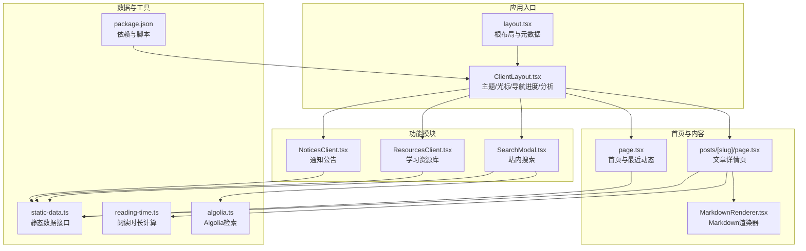

# 核心功能特性

<cite>
**本文档引用的文件**
- [layout.tsx](file://blog-system2/frontend/src/app/layout.tsx)
- [page.tsx](file://blog-system2/frontend/src/app/page.tsx)
- [MarkdownRenderer.tsx](file://blog-system2/frontend/src/components/MarkdownRenderer.tsx)
- [ThemeProvider.tsx](file://blog-system2/frontend/src/components/theme/ThemeProvider.tsx)
- [static-data.ts](file://blog-system2/frontend/src/lib/static-data.ts)
- [SearchModal.tsx](file://blog-system2/frontend/src/components/Search/SearchModal.tsx)
- [NoticesClient.tsx](file://blog-system2/frontend/src/components/notices/NoticesClient.tsx)
- [ResourcesClient.tsx](file://blog-system2/frontend/src/components/resources/ResourcesClient.tsx)
- [algolia.ts](file://blog-system2/frontend/src/lib/algolia.ts)
- [index.json](file://blog-system2/frontend/public/data/posts/index.json)
- [ArticleTimeline.tsx](file://blog-system2/frontend/src/components/post/ArticleTimeline.tsx)
- [ArticleList.tsx](file://blog-system2/frontend/src/components/ArticleList.tsx)
- [ClientLayout.tsx](file://blog-system2/frontend/src/components/ClientLayout.tsx)
- [page.tsx](file://blog-system2/frontend/src/app/posts/[slug]/page.tsx)
- [ArticleCard.tsx](file://blog-system2/frontend/src/components/ArticleCard.tsx)
- [reading-time.ts](file://blog-system2/frontend/src/lib/reading-time.ts)
- [package.json](file://blog-system2/frontend/package.json)
</cite>

## 目录
1. [引言](#引言)
2. [项目结构](#项目结构)
3. [核心组件](#核心组件)
4. [架构总览](#架构总览)
5. [详细组件分析](#详细组件分析)
6. [依赖关系分析](#依赖关系分析)
7. [性能考量](#性能考量)
8. [故障排查指南](#故障排查指南)
9. [结论](#结论)
10. [附录](#附录)

## 引言
本技术博客平台围绕四大核心功能模块构建：技术博客文章系统、通知公告系统、学习资源库、用户交互功能。系统采用 Next.js 15 + React 19 + TypeScript 技术栈，结合静态数据驱动与可选的 Algolia 全文检索，提供统一的内容管理与一致的用户体验。本文档从架构、数据流、处理逻辑、集成点、错误处理与性能特征等维度，系统阐述各模块的实现方式与协同机制，并突出 Markdown 渲染、响应式设计、主题切换等技术亮点。

## 项目结构
前端采用 App Router 结构，页面级路由与组件级功能解耦，主题、搜索、布局等横切关注点通过 ClientLayout 注入，确保全局一致性与可维护性。

**图表来源**
- [layout.tsx:1-48](file://blog-system2/frontend/src/app/layout.tsx#L1-L48)
- [ClientLayout.tsx:16-62](file://blog-system2/frontend/src/components/ClientLayout.tsx#L16-L62)
- [page.tsx:22-30](file://blog-system2/frontend/src/app/page.tsx#L22-L30)
- [page.tsx:18-25](file://blog-system2/frontend/src/app/page.tsx#L18-L25)
- [page.tsx:18-25](file://blog-system2/frontend/src/app/page.tsx#L18-L25)
- [page.tsx:18-25](file://blog-system2/frontend/src/app/page.tsx#L18-L25)
- [page.tsx:18-25](file://blog-system2/frontend/src/app/page.tsx#L18-L25)
- [page.tsx:18-25](file://blog-system2/frontend/src/app/page.tsx#L18-L25)
- [page.tsx:18-25](file://blog-system2/frontend/src/app/page.tsx#L18-L25)
- [page.tsx:18-25](file://blog-system2/frontend/src/app/page.tsx#L18-L25)
- [page.tsx:18-25](file://blog-system2/frontend/src/app/page.tsx#L18-L25)
- [page.tsx:18-25](file://blog-system2/frontend/src/app/page.tsx#L18-L25)
- [page.tsx:18-25](file://blog-system2/frontend/src/app/page.tsx#L18-L25)
- [page.tsx:18-25](file://blog-system2/frontend/src/app/page.tsx#L18-L25)
- [page.tsx:18-25](file://blog-system2/frontend/src/app/page.tsx#L18-L25)
- [page.tsx:18-25](file://blog-system2/frontend/src/app/page.tsx#L18-L25)
- [page.tsx:18-25](file://blog-system2/frontend/src/app/page.tsx#L18-L25)
- [page.tsx:18-25](file://blog-system2/frontend/src/app/page.tsx#L18-L25)
- [page.tsx:18-25](file://blog-system2/frontend/src/app/page.tsx#L18-L25)
- [page.tsx:18-25](file://blog-system2/frontend/src/app/page.tsx#L18-L25)
- [page.tsx:18-25](file://blog-system2/frontend/src/app/page.tsx#L18-L2......)
- [page.tsx:18-25](file://blog-system2/frontend/src/app/page.tsx#L18-L25)
- [page.tsx:18-25](file://blog-system2/frontend/src/app/page.tsx#L18-L25)
- [page.tsx:18-25](file://blog-system2/frontend/src/app/page.tsx#L18-L25)
- [page.tsx:18-25](file://blog-system2/frontend/src/app/page.tsx#L18-L25)
- [page.tsx:18-25](file://blog-system2/frontend/src/app/page.tsx#L18-L25)
- [page.tsx:18-25](file://blog-system2/frontend/src/app/page.tsx#L18-L25)
- [page.tsx:18-25](file://blog-system2/frontend/src/app/page.tsx#L18-L25)
- [page.tsx:18-25](file://blog-system2/frontend/src/app/page.tsx#L18-L25)
- [page.tsx:18-25](file://blog-system2/frontend/src/app/page.tsx#L18-L25)
- [page.tsx:18-25](file://blog-system2/frontend/src/app/page.tsx#L18-L25)
- [page.tsx:18-25](file://blog-system2/frontend/src/app/page.tsx#L18-L25)
- [page.tsx:18-25](file://blog-system2/frontend/src/app/page.tsx#L18-L25)
- [page.tsx:18-25](file://blog-system2/frontend/src/app/page.tsx#L18-L25)
- [page.tsx:18-25](file://blog-system2/frontend/src/app/page.tsx#L18-L25)
- [page.tsx:18-25](file://blog-system2/frontend/src/app/page.tsx#L18-L25)
- [page.tsx:18-25](file://blog-system2/frontend/src/app/page.tsx#L18-L25)
- [page.tsx:18-25](file://blog-system2/frontend/src/app/page.tsx#L18-L25)
- [page.tsx:18-25](file://blog-system2/frontend/src/app/page.tsx#L18-L......)
- [page.tsx:18-25](file://blog-system2/frontend/src/app/page.tsx#L18-L25)
- [page.tsx:18-25](file://blog-system2/frontend/src/app/page.tsx#L18-L25)
- [page.tsx:18-25](file://blog-system2/frontend/src/app/page.tsx#L18-L25)
- [page.tsx:18-25](file://blog-system2/frontend/src/app/page.tsx#L18-L25)
- [page.tsx:18-25](file://blog-system2/frontend/src/app/page.tsx#L18-L25)
- [page.tsx:18-25](file://blog-system2/frontend/src/app/page.tsx#L18-L25)
- [page.tsx:18-25](file://blog-system2/frontend/src/app/page.tsx#L18-L25)
- [page.tsx:18-25](file://blog-system2/frontend/src/app/page.tsx#L18-L25)
- [page.tsx:18-25](file://blog-system2/frontend/src/app/page.tsx#L18-L25)
- [page.tsx:18-25](file://blog-system2/frontend/src/app/page.tsx#L18-L25)
- [page.tsx:18-25](file://blog-system2/frontend/src/app/page.tsx#L18-L25)
- [page.tsx:18-25](file://blog-system2/frontend/src/app/page.tsx#L18-L25)
- [page.tsx:18-25](file://blog-system2/frontend/src/app/page.tsx#L18-L25)
- [page.tsx:18-25](file://blog-system2/frontend/src/app/page.tsx#L18-L25)
- [page.tsx:18-25](file://blog-system2/frontend/src/app/page.tsx#L18-L25)
- [page.tsx:18-25](file://blog-system2/frontend/src/app/page.tsx#L18-L25)
- [page.tsx:18-25](file://blog-system2/frontend/src/app/page.tsx#L18-L25)
- [page.tsx:18-25](file://blog-system2/frontend/src/app/page.tsx#L18-L......