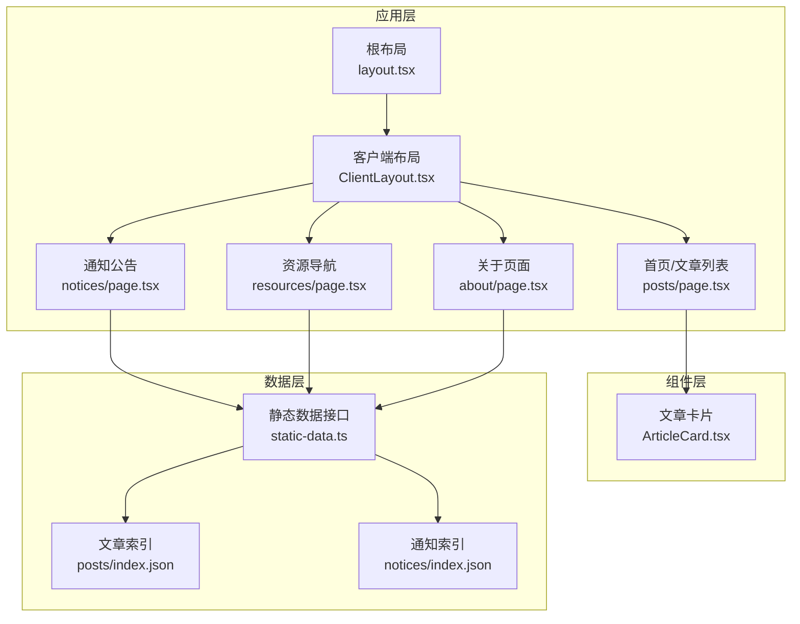
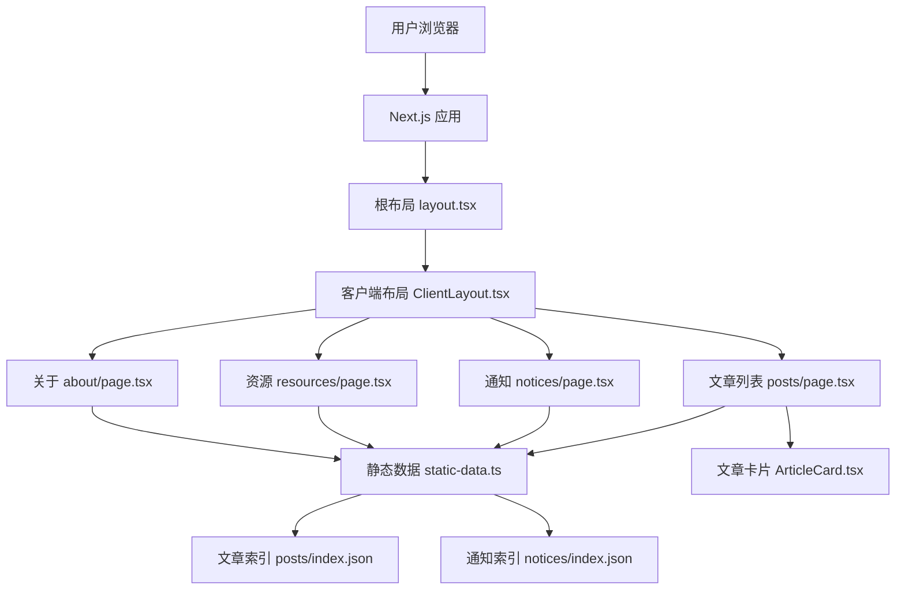
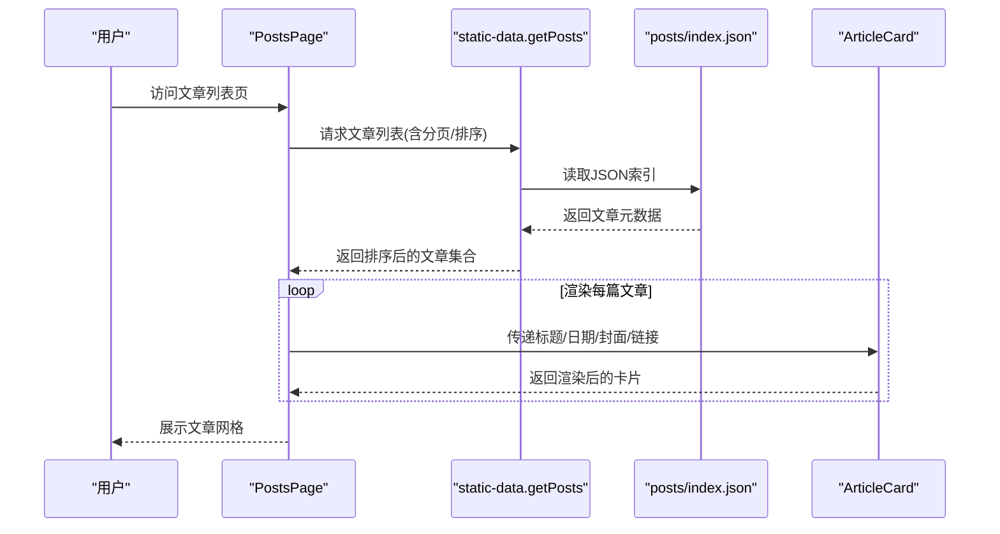
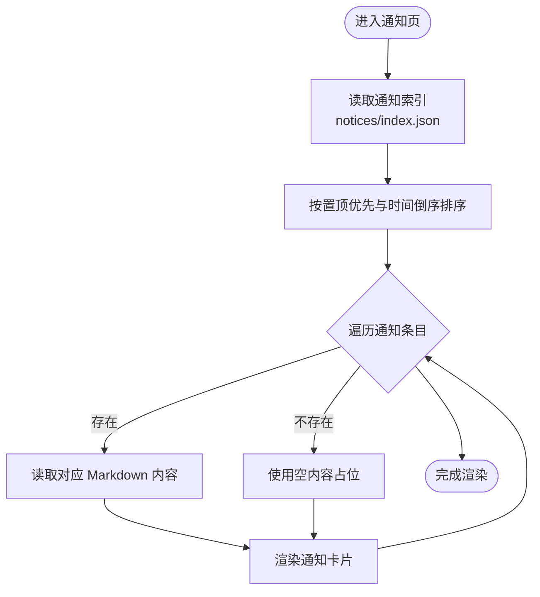
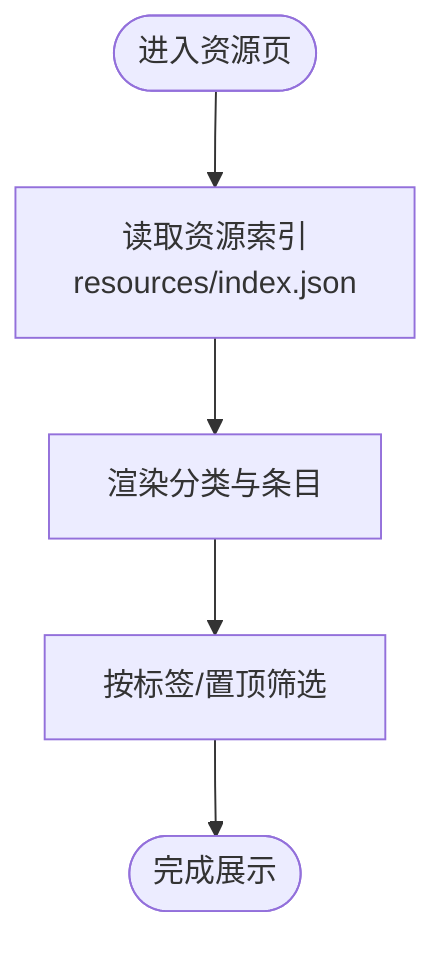
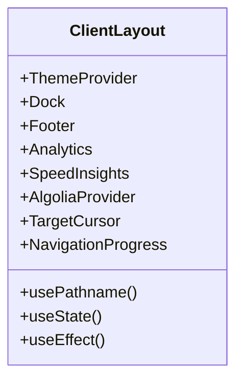
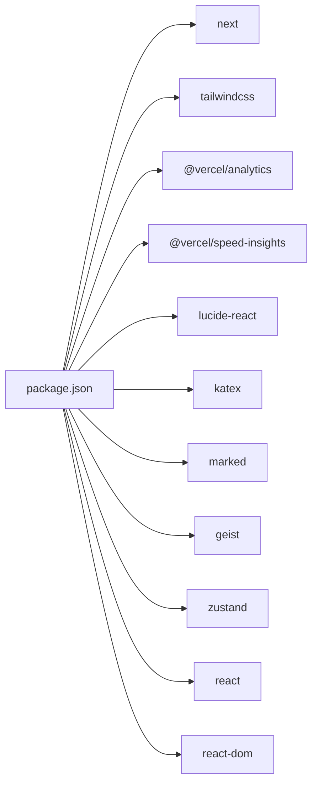

# 项目介绍

<cite>
**本文档引用的文件**
- [README.md](file://blog-system2/frontend/README.md)
- [package.json](file://blog-system2/frontend/package.json)
- [layout.tsx](file://blog-system2/frontend/src/app/layout.tsx)
- [ClientLayout.tsx](file://blog-system2/frontend/src/components/ClientLayout.tsx)
- [static-data.ts](file://blog-system2/frontend/src/lib/static-data.ts)
- [posts/page.tsx](file://blog-system2/frontend/src/app/posts/page.tsx)
- [notices/page.tsx](file://blog-system2/frontend/src/app/notices/page.tsx)
- [resources/page.tsx](file://blog-system2/frontend/src/app/resources/page.tsx)
- [ArticleCard.tsx](file://blog-system2/frontend/src/components/ArticleCard.tsx)
- [posts/index.json](file://blog-system2/frontend/public/data/posts/index.json)
- [notices/index.json](file://blog-system2/frontend/public/data/notices/index.json)
- [posts/README.md](file://blog-system2/frontend/public/data/posts/README.md)
- [posts/智能基座成立大会.md](file://blog-system2/frontend/public/data/posts/智能基座成立大会.md)
- [about/page.tsx](file://blog-system2/frontend/src/app/about/page.tsx)
</cite>

## 目录
1. [引言](#引言)
2. [项目结构](#项目结构)
3. [核心组件](#核心组件)
4. [架构总览](#架构总览)
5. [详细组件分析](#详细组件分析)
6. [依赖关系分析](#依赖关系分析)
7. [性能考虑](#性能考虑)
8. [故障排除指南](#故障排除指南)
9. [结论](#结论)

## 引言
本项目是暨南大学智能基座论文复现组的技术博客平台，旨在为研究人员和技术爱好者提供一个专业、易用、可扩展的知识分享与学术交流空间。平台围绕“论文复现”这一核心主题，承载例会回顾、学习笔记、技术文档、资源导航等内容，服务于团队内部的知识沉淀与对外展示。

项目创建的背景与初衷：
- 满足智能基座论文复现组的日常内容发布与管理需求，统一信息入口，提升知识传播效率。
- 通过现代化前端技术栈构建高性能、可维护的静态/服务端渲染站点，降低运维成本。
- 以“技术+学术”的双轴内容体系，促进团队协作、经验传承与跨方向交流。

项目核心使命：
- 为研究人员和技术爱好者提供一个专业的技术分享平台，涵盖论文复现、学习笔记、资源导航与活动公告。
- 在智能基座学术生态中发挥桥梁作用，推动知识传播、技术交流与团队协作。

项目在智能基座学术生态中的定位与价值：
- 内容聚合：集中展示例会回顾、学习任务与阶段性成果，形成可检索的知识库。
- 协作支撑：通过统一的发布与检索机制，降低沟通成本，提升团队学习效率。
- 形象展示：以现代设计与交互体验呈现暨南大学计算机学科的技术实力与创新精神。

建设历程与发展愿景：
- 建设历程：从内容索引与静态数据驱动出发，逐步完善文章列表、通知公告、资源导航与搜索能力；持续优化视觉与交互体验，增强移动端适配与无障碍访问。
- 发展愿景：打造可持续演进的学术博客平台，支持多源内容接入、更丰富的多媒体展示与社区互动，成为智能基座乃至更大范围内的知识共享枢纽。

## 项目结构
前端采用 Next.js 应用程序目录结构，结合静态数据与客户端组件，实现内容驱动的页面渲染与交互体验。

图表来源
- [layout.tsx:28-47](file://blog-system2/frontend/src/app/layout.tsx#L28-L47)
- [ClientLayout.tsx:16-62](file://blog-system2/frontend/src/components/ClientLayout.tsx#L16-L62)
- [posts/page.tsx:12-168](file://blog-system2/frontend/src/app/posts/page.tsx#L12-L168)
- [notices/page.tsx:29-34](file://blog-system2/frontend/src/app/notices/page.tsx#L29-L34)
- [resources/page.tsx:6-9](file://blog-system2/frontend/src/app/resources/page.tsx#L6-L9)
- [ArticleCard.tsx:29-197](file://blog-system2/frontend/src/components/ArticleCard.tsx#L29-L197)
- [static-data.ts:32-213](file://blog-system2/frontend/src/lib/static-data.ts#L32-L213)
- [posts/index.json:1-102](file://blog-system2/frontend/public/data/posts/index.json#L1-L102)
- [notices/index.json:1-40](file://blog-system2/frontend/public/data/notices/index.json#L1-L40)

章节来源
- [layout.tsx:28-47](file://blog-system2/frontend/src/app/layout.tsx#L28-L47)
- [ClientLayout.tsx:16-62](file://blog-system2/frontend/src/components/ClientLayout.tsx#L16-L62)
- [posts/page.tsx:12-168](file://blog-system2/frontend/src/app/posts/page.tsx#L12-L168)
- [notices/page.tsx:29-34](file://blog-system2/frontend/src/app/notices/page.tsx#L29-L34)
- [resources/page.tsx:6-9](file://blog-system2/frontend/src/app/resources/page.tsx#L6-L9)
- [ArticleCard.tsx:29-197](file://blog-system2/frontend/src/components/ArticleCard.tsx#L29-L197)
- [static-data.ts:32-213](file://blog-system2/frontend/src/lib/static-data.ts#L32-L213)
- [posts/index.json:1-102](file://blog-system2/frontend/public/data/posts/index.json#L1-L102)
- [notices/index.json:1-40](file://blog-system2/frontend/public/data/notices/index.json#L1-L40)

## 核心组件
- 静态数据接口：提供文章、通知、资源的索引与查询能力，支持分页、排序与相关推荐。
- 文章列表页：基于静态数据渲染文章卡片网格，支持懒加载与动画入场效果。
- 通知公告页：读取通知索引与对应 Markdown 内容，按置顶优先与时间倒序展示。
- 资源导航页：读取分类化的资源索引，提供标签化与置顶资源的展示。
- 客户端布局：集成主题切换、全局搜索、导航进度、分析与性能监控等横切能力。
- 关于页面：承载团队介绍、日程安排与项目声明，体现团队文化与发展方向。

章节来源
- [static-data.ts:45-122](file://blog-system2/frontend/src/lib/static-data.ts#L45-L122)
- [posts/page.tsx:12-168](file://blog-system2/frontend/src/app/posts/page.tsx#L12-L168)
- [notices/page.tsx:29-34](file://blog-system2/frontend/src/app/notices/page.tsx#L29-L34)
- [resources/page.tsx:6-9](file://blog-system2/frontend/src/app/resources/page.tsx#L6-L9)
- [ClientLayout.tsx:16-62](file://blog-system2/frontend/src/components/ClientLayout.tsx#L16-L62)
- [about/page.tsx:1178-1185](file://blog-system2/frontend/src/app/about/page.tsx#L1178-L1185)

## 架构总览
平台采用“静态数据驱动 + 客户端渲染”的混合架构，通过 Next.js 的 App Router 实现页面级的静态生成与客户端交互增强。

图表来源
- [layout.tsx:28-47](file://blog-system2/frontend/src/app/layout.tsx#L28-L47)
- [ClientLayout.tsx:16-62](file://blog-system2/frontend/src/components/ClientLayout.tsx#L16-L62)
- [posts/page.tsx:12-168](file://blog-system2/frontend/src/app/posts/page.tsx#L12-L168)
- [notices/page.tsx:29-34](file://blog-system2/frontend/src/app/notices/page.tsx#L29-L34)
- [resources/page.tsx:6-9](file://blog-system2/frontend/src/app/resources/page.tsx#L6-L9)
- [about/page.tsx:1178-1185](file://blog-system2/frontend/src/app/about/page.tsx#L1178-L1185)
- [static-data.ts:32-213](file://blog-system2/frontend/src/lib/static-data.ts#L32-L213)
- [posts/index.json:1-102](file://blog-system2/frontend/public/data/posts/index.json#L1-L102)
- [notices/index.json:1-40](file://blog-system2/frontend/public/data/notices/index.json#L1-L40)
- [ArticleCard.tsx:29-197](file://blog-system2/frontend/src/components/ArticleCard.tsx#L29-L197)

## 详细组件分析

### 文章列表组件分析
文章列表页负责展示所有文章的摘要卡片，支持按发布时间倒序排列与懒加载动画。

图表来源
- [posts/page.tsx:12-168](file://blog-system2/frontend/src/app/posts/page.tsx#L12-L168)
- [static-data.ts:45-73](file://blog-system2/frontend/src/lib/static-data.ts#L45-L73)
- [posts/index.json:1-102](file://blog-system2/frontend/public/data/posts/index.json#L1-L102)
- [ArticleCard.tsx:29-197](file://blog-system2/frontend/src/components/ArticleCard.tsx#L29-L197)

章节来源
- [posts/page.tsx:12-168](file://blog-system2/frontend/src/app/posts/page.tsx#L12-L168)
- [static-data.ts:45-73](file://blog-system2/frontend/src/lib/static-data.ts#L45-L73)
- [posts/index.json:1-102](file://blog-system2/frontend/public/data/posts/index.json#L1-L102)
- [ArticleCard.tsx:29-197](file://blog-system2/frontend/src/components/ArticleCard.tsx#L29-L197)

### 通知公告组件分析
通知页通过索引文件读取通知条目，并在运行时读取对应的 Markdown 内容进行渲染。

图表来源
- [notices/page.tsx:29-34](file://blog-system2/frontend/src/app/notices/page.tsx#L29-L34)
- [notices/index.json:1-40](file://blog-system2/frontend/public/data/notices/index.json#L1-L40)

章节来源
- [notices/page.tsx:29-34](file://blog-system2/frontend/src/app/notices/page.tsx#L29-L34)
- [notices/index.json:1-40](file://blog-system2/frontend/public/data/notices/index.json#L1-L40)

### 资源导航组件分析
资源页读取分类化的资源索引，支持按类别与标签筛选，突出置顶资源。

图表来源
- [resources/page.tsx:6-9](file://blog-system2/frontend/src/app/resources/page.tsx#L6-L9)
- [static-data.ts:208-213](file://blog-system2/frontend/src/lib/static-data.ts#L208-L213)

章节来源
- [resources/page.tsx:6-9](file://blog-system2/frontend/src/app/resources/page.tsx#L6-L9)
- [static-data.ts:208-213](file://blog-system2/frontend/src/lib/static-data.ts#L208-L213)

### 客户端布局与横切能力
客户端布局统一注入主题切换、全局搜索、导航进度、分析与性能监控等能力，确保用户体验一致性。

图表来源
- [ClientLayout.tsx:16-62](file://blog-system2/frontend/src/components/ClientLayout.tsx#L16-L62)

章节来源
- [ClientLayout.tsx:16-62](file://blog-system2/frontend/src/components/ClientLayout.tsx#L16-L62)

## 依赖关系分析
项目依赖以 Next.js 为核心，结合主题、搜索、分析与动画等生态库，形成轻量而强大的前端技术栈。

图表来源
- [package.json:13-42](file://blog-system2/frontend/package.json#L13-L42)

章节来源
- [package.json:13-42](file://blog-system2/frontend/package.json#L13-L42)

## 性能考虑
- 静态生成与懒加载：文章列表采用静态生成与懒加载策略，减少首屏压力。
- 图片优化：使用 Next.js Image 组件与懒加载属性，支持多种质量与尺寸配置。
- 动画与交互：通过 Framer Motion 实现页面切换动画，同时在移动端禁用重度动画以保证流畅性。
- 搜索与分析：集成 Algolia 搜索与 Vercel Analytics/SI，兼顾性能监控与用户体验。

## 故障排除指南
- 文章封面图片加载失败：组件内置错误回退逻辑，自动切换至默认占位图。
- Markdown 内容缺失：通知页在读取 Markdown 文件失败时返回空内容，避免页面崩溃。
- 路由与导航：客户端布局使用路径名控制页面切换动画，若出现异常可检查路由状态与动画配置。

章节来源
- [ArticleCard.tsx:109-115](file://blog-system2/frontend/src/components/ArticleCard.tsx#L109-L115)
- [notices/page.tsx:20-25](file://blog-system2/frontend/src/app/notices/page.tsx#L20-L25)
- [ClientLayout.tsx:36-50](file://blog-system2/frontend/src/components/ClientLayout.tsx#L36-L50)

## 结论
本项目以“论文复现”为核心，围绕内容索引与静态数据驱动，构建了高效、可维护、体验友好的技术博客平台。通过统一的布局与组件体系，平台不仅满足了智能基座论文复现组的学术交流需求，也体现了暨南大学计算机学科的技术实力与创新精神。未来可在内容生态、多媒体展示与社区互动方面持续演进，进一步扩大平台影响力与价值。