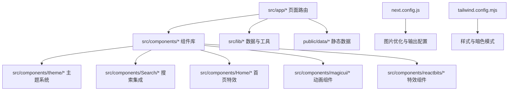
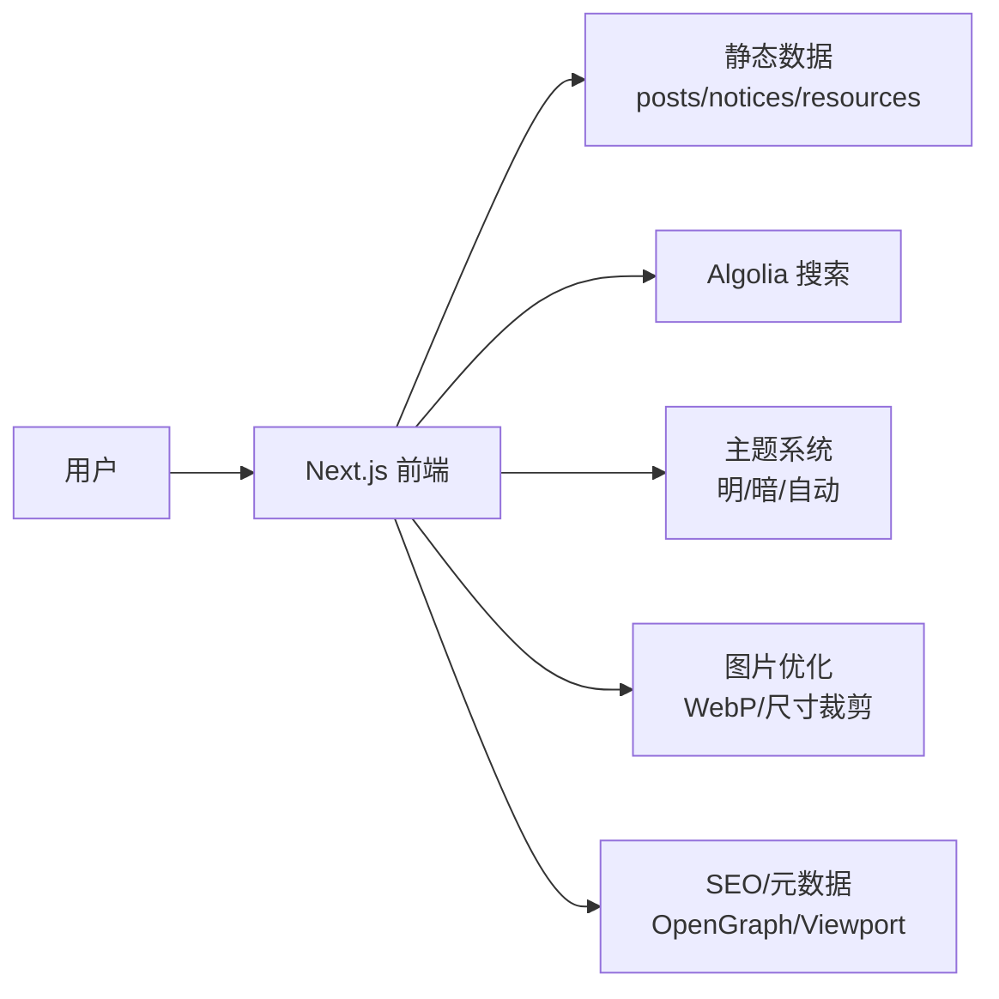
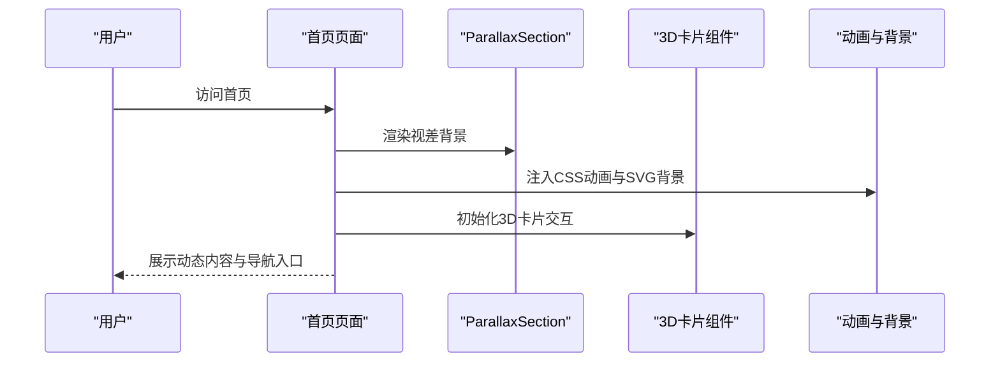
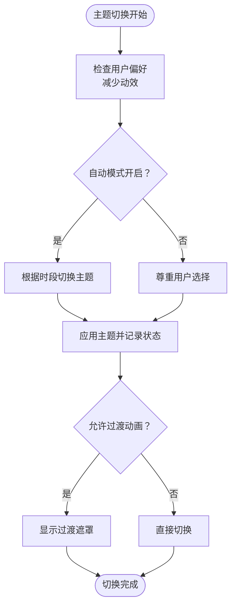
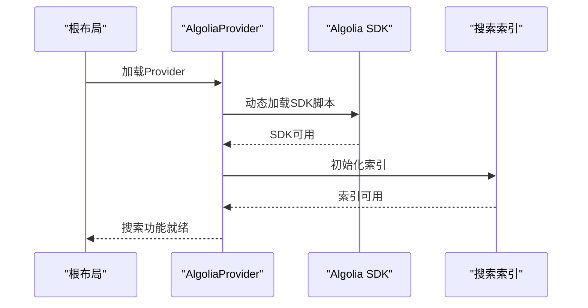
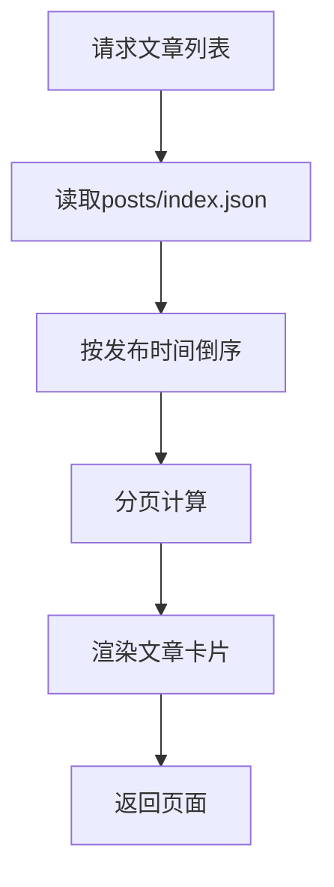
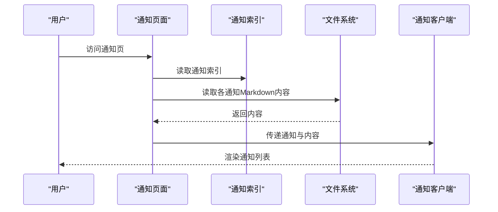
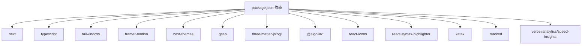

# 项目概述

<cite>
**本文档引用的文件**
- [package.json](file://blog-system2/frontend/package.json)
- [README.md](file://blog-system2/frontend/README.md)
- [layout.tsx](file://blog-system2/frontend/src/app/layout.tsx)
- [page.tsx](file://blog-system2/frontend/src/app/page.tsx)
- [static-data.ts](file://blog-system2/frontend/src/lib/static-data.ts)
- [ThemeProvider.tsx](file://blog-system2/frontend/src/components/theme/ThemeProvider.tsx)
- [AlgoliaProvider.tsx](file://blog-system2/frontend/src/components/Search/AlgoliaProvider.tsx)
- [posts/page.tsx](file://blog-system2/frontend/src/app/posts/page.tsx)
- [notices/page.tsx](file://blog-system2/frontend/src/app/notices/page.tsx)
- [resources/page.tsx](file://blog-system2/frontend/src/app/resources/page.tsx)
- [data.d.ts](file://blog-system2/frontend/src/types/data.d.ts)
- [next.config.js](file://blog-system2/frontend/next.config.js)
- [tailwind.config.mjs](file://blog-system2/frontend/tailwind.config.mjs)
- [date.json](file://blog-system2/frontend/public/data/date.json)
- [posts/index.json](file://blog-system2/frontend/public/data/posts/index.json)
- [notices/index.json](file://blog-system2/frontend/public/data/notices/index.json)
- [README.md](file://README.md)
</cite>

## 目录
1. [简介](#简介)
2. [项目结构](#项目结构)
3. [核心组件](#核心组件)
4. [架构总览](#架构总览)
5. [详细组件分析](#详细组件分析)
6. [依赖关系分析](#依赖关系分析)
7. [性能考量](#性能考量)
8. [故障排查指南](#故障排查指南)
9. [结论](#结论)
10. [附录](#附录)

## 简介
暨南大学智能基座论文复现组技术博客平台是一个面向学术交流与技术分享的现代化前端站点，服务于论文复现组成员与相关研究者。项目围绕“文章发布、通知公告、资源管理”三大核心功能，结合Next.js框架与组件化设计思想，提供流畅的阅读体验与丰富的交互效果。

- 核心目标
  - 提供稳定、可扩展的文章发布与展示系统
  - 构建统一的通知公告与资源共享入口
  - 通过主题切换、3D动画、视差滚动等特性提升用户体验
  - 支持静态数据驱动与可扩展的后端集成（Strapi）

- 主要功能特性
  - 文章列表与详情页：支持分页、时间线、相关文章推荐
  - 通知公告：置顶优先、按日期排序、Markdown渲染
  - 资源管理：分类化资源索引与快速检索
  - 搜索集成：Algolia全文检索
  - 主题系统：明暗主题切换、自动模式、无障碍动效偏好
  - 视觉增强：3D卡片、视差背景、打字机/旋转文本等动画

- 技术价值
  - 前端现代化：Next.js App Router、TypeScript、Tailwind CSS
  - 组件化与可维护性：模块化组件、类型安全、主题封装
  - 性能与可访问性：静态导出、图片优化、减少不必要的动画
  - 可扩展架构：静态数据与后端API双通道，便于演进

## 项目结构
前端采用Next.js App Router目录结构，按功能域划分页面与组件，配合静态数据与类型声明，形成清晰的层次化组织。

图表来源
- [layout.tsx:1-48](file://blog-system2/frontend/src/app/layout.tsx#L1-L48)
- [page.tsx:1-800](file://blog-system2/frontend/src/app/page.tsx#L1-L800)
- [next.config.js:1-48](file://blog-system2/frontend/next.config.js#L1-L48)
- [tailwind.config.mjs:1-18](file://blog-system2/frontend/tailwind.config.mjs#L1-L18)

章节来源
- [layout.tsx:1-48](file://blog-system2/frontend/src/app/layout.tsx#L1-L48)
- [README.md:1-37](file://blog-system2/frontend/README.md#L1-L37)
- [next.config.js:1-48](file://blog-system2/frontend/next.config.js#L1-L48)
- [tailwind.config.mjs:1-18](file://blog-system2/frontend/tailwind.config.mjs#L1-L18)

## 核心组件
- 首页与布局
  - RootLayout负责全局元数据、字体与客户端布局包装
  - 首页整合视差背景、3D卡片、打字机/旋转文本等视觉组件
- 主题系统
  - ThemeProvider封装主题切换逻辑、自动模式与无障碍偏好
- 搜索集成
  - AlgoliaProvider负责SDK加载与索引初始化
- 数据层
  - static-data提供文章、通知、资源的静态数据读取与排序
- 页面路由
  - posts、notices、resources页面分别承载对应功能域的数据展示

章节来源
- [layout.tsx:1-48](file://blog-system2/frontend/src/app/layout.tsx#L1-L48)
- [page.tsx:1-800](file://blog-system2/frontend/src/app/page.tsx#L1-L800)
- [ThemeProvider.tsx:1-161](file://blog-system2/frontend/src/components/theme/ThemeProvider.tsx#L1-L161)
- [AlgoliaProvider.tsx:1-100](file://blog-system2/frontend/src/components/Search/AlgoliaProvider.tsx#L1-L100)
- [static-data.ts:1-214](file://blog-system2/frontend/src/lib/static-data.ts#L1-L214)
- [posts/page.tsx:1-169](file://blog-system2/frontend/src/app/posts/page.tsx#L1-L169)
- [notices/page.tsx:1-35](file://blog-system2/frontend/src/app/notices/page.tsx#L1-L35)
- [resources/page.tsx:1-10](file://blog-system2/frontend/src/app/resources/page.tsx#L1-L10)

## 架构总览
项目采用前端静态化与外部数据源相结合的架构，首页与列表页通过静态数据渲染，搜索与主题等功能通过第三方库与客户端逻辑增强。

图表来源
- [page.tsx:1-800](file://blog-system2/frontend/src/app/page.tsx#L1-L800)
- [static-data.ts:1-214](file://blog-system2/frontend/src/lib/static-data.ts#L1-L214)
- [AlgoliaProvider.tsx:1-100](file://blog-system2/frontend/src/components/Search/AlgoliaProvider.tsx#L1-L100)
- [ThemeProvider.tsx:1-161](file://blog-system2/frontend/src/components/theme/ThemeProvider.tsx#L1-L161)
- [next.config.js:1-48](file://blog-system2/frontend/next.config.js#L1-L48)

章节来源
- [README.md:37-53](file://README.md#L37-L53)
- [next.config.js:1-48](file://blog-system2/frontend/next.config.js#L1-L48)

## 详细组件分析

### 首页与视觉特效
首页通过ParallaxSection、3D卡片、打字机/旋转文本等组件营造沉浸式体验，配合动画与背景电路板元素，体现技术主题氛围。

图表来源
- [page.tsx:1-800](file://blog-system2/frontend/src/app/page.tsx#L1-L800)

章节来源
- [page.tsx:1-800](file://blog-system2/frontend/src/app/page.tsx#L1-L800)

### 主题系统与无障碍
主题系统支持明/暗/自动模式，尊重用户“减少动效”的偏好设置，并在切换时提供过渡遮罩以避免闪烁。

图表来源
- [ThemeProvider.tsx:1-161](file://blog-system2/frontend/src/components/theme/ThemeProvider.tsx#L1-L161)

章节来源
- [ThemeProvider.tsx:1-161](file://blog-system2/frontend/src/components/theme/ThemeProvider.tsx#L1-L161)

### 搜索集成与初始化
搜索通过AlgoliaProvider注入SDK并在窗口对象上初始化索引，提供全文检索能力。

图表来源
- [AlgoliaProvider.tsx:1-100](file://blog-system2/frontend/src/components/Search/AlgoliaProvider.tsx#L1-L100)

章节来源
- [AlgoliaProvider.tsx:1-100](file://blog-system2/frontend/src/components/Search/AlgoliaProvider.tsx#L1-L100)

### 文章列表与分页
文章列表页从静态数据读取并按发布时间倒序排列，支持分页与卡片式展示。

图表来源
- [posts/page.tsx:1-169](file://blog-system2/frontend/src/app/posts/page.tsx#L1-L169)
- [static-data.ts:45-73](file://blog-system2/frontend/src/lib/static-data.ts#L45-L73)

章节来源
- [posts/page.tsx:1-169](file://blog-system2/frontend/src/app/posts/page.tsx#L1-L169)
- [static-data.ts:45-73](file://blog-system2/frontend/src/lib/static-data.ts#L45-L73)

### 通知公告与Markdown内容
通知页从静态索引读取条目，并在构建时读取对应的Markdown内容进行渲染。

图表来源
- [notices/page.tsx:1-35](file://blog-system2/frontend/src/app/notices/page.tsx#L1-L35)
- [static-data.ts:164-178](file://blog-system2/frontend/src/lib/static-data.ts#L164-L178)

章节来源
- [notices/page.tsx:1-35](file://blog-system2/frontend/src/app/notices/page.tsx#L1-L35)
- [static-data.ts:164-178](file://blog-system2/frontend/src/lib/static-data.ts#L164-L178)

### 资源管理
资源页从静态索引读取分类化的资源项，支持按类别与标签筛选与浏览。

章节来源
- [resources/page.tsx:1-10](file://blog-system2/frontend/src/app/resources/page.tsx#L1-L10)
- [static-data.ts:208-214](file://blog-system2/frontend/src/lib/static-data.ts#L208-L214)

## 依赖关系分析
项目依赖以Next.js为核心，结合动画、主题、搜索与样式等生态库，形成现代化前端技术栈。

图表来源
- [package.json:13-42](file://blog-system2/frontend/package.json#L13-L42)

章节来源
- [package.json:1-72](file://blog-system2/frontend/package.json#L1-L72)

## 性能考量
- 静态导出与图片优化
  - 输出模式与路径前缀适配静态托管
  - 图片优化策略：禁用Next内置优化、白名单域名、WebP格式、缓存策略
- 动画与性能
  - 移动端与“减少动效”偏好下禁用持续动画，降低GPU占用
  - 使用CSS动画与SVG背景，避免复杂JS动画对主线程的压力
- 构建与缓存
  - TypeScript与ESLint忽略构建错误以加速CI
  - Webpack移除/moment/locale 以减小包体

章节来源
- [next.config.js:1-48](file://blog-system2/frontend/next.config.js#L1-L48)
- [page.tsx:344-374](file://blog-system2/frontend/src/app/page.tsx#L344-L374)

## 故障排查指南
- 搜索无结果
  - 检查Algolia SDK是否成功加载与索引初始化
  - 确认索引名称与前端配置一致
- 主题切换异常
  - 检查自动模式与用户覆盖状态
  - 确认过渡遮罩逻辑与无障碍偏好设置
- 图片不显示
  - 核对next.config.js中的域名白名单
  - 确认CDN或本地路径正确
- 构建错误
  - TypeScript/ESLint忽略构建错误仅用于CI加速，本地开发建议修复

章节来源
- [AlgoliaProvider.tsx:28-70](file://blog-system2/frontend/src/components/Search/AlgoliaProvider.tsx#L28-L70)
- [ThemeProvider.tsx:87-149](file://blog-system2/frontend/src/components/theme/ThemeProvider.tsx#L87-L149)
- [next.config.js:20-33](file://blog-system2/frontend/next.config.js#L20-L33)

## 结论
本项目以Next.js为基础，结合主题系统、搜索集成与丰富的视觉特效，构建了面向学术交流与技术分享的现代化博客平台。其组件化设计与静态数据驱动的架构，既保证了开发效率与可维护性，也为后续与后端系统的集成预留了空间。通过性能优化与无障碍偏好支持，平台能够在多设备与多场景下提供稳定、流畅的用户体验。

## 附录
- 团队与协作
  - 项目由暨南大学智能基座论文复现组维护，欢迎通过Issue与贡献参与
- 发展历程与规划
  - 当前版本聚焦于静态数据驱动与前端体验优化
  - 后续可扩展方向：后端API集成、评论系统、增量静态再生（ISR）、国际化等

章节来源
- [README.md:639-655](file://README.md#L639-L655)