# 图像分割概述 - 语义分割、实例分割、全景分割、一键抠图（FCN, U-Net, Mask R-CNN, UPSNet）

> 作者：Calvin
> 哲学 | 人工智能 | 生物技术 | 量子计算

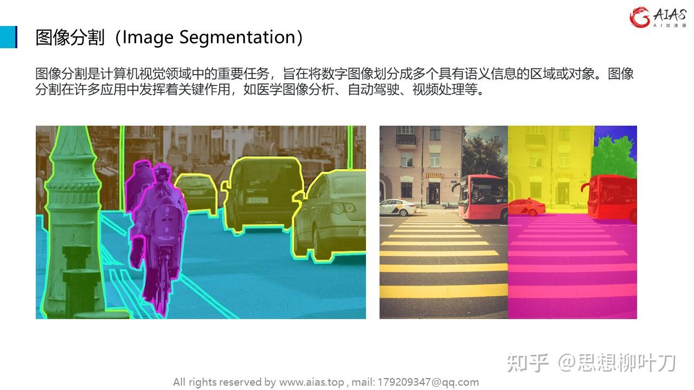

## 图像分割是什么

图像分割是计算机视觉领域中的重要任务，旨在将数字图像划分成多个具有语义信息的区域或对象。图像分割在许多应用中发挥着关键作用，如医学图像分析、自动驾驶、视频处理等。

## 相关阅读（综述）

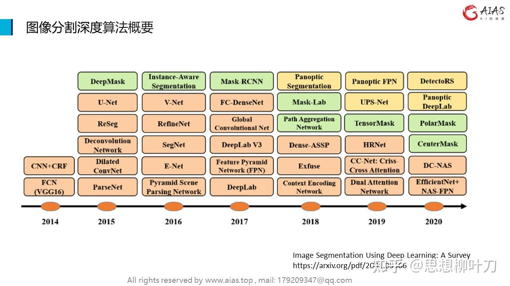

- [Image Segmentation Using Deep Learning: A Survey](https://arxiv.org/pdf/2001.05566)

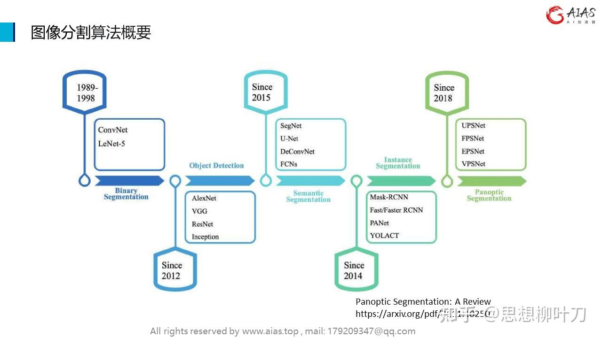

- [Panoptic Segmentation: A Review](https://arxiv.org/pdf/2111.10250)

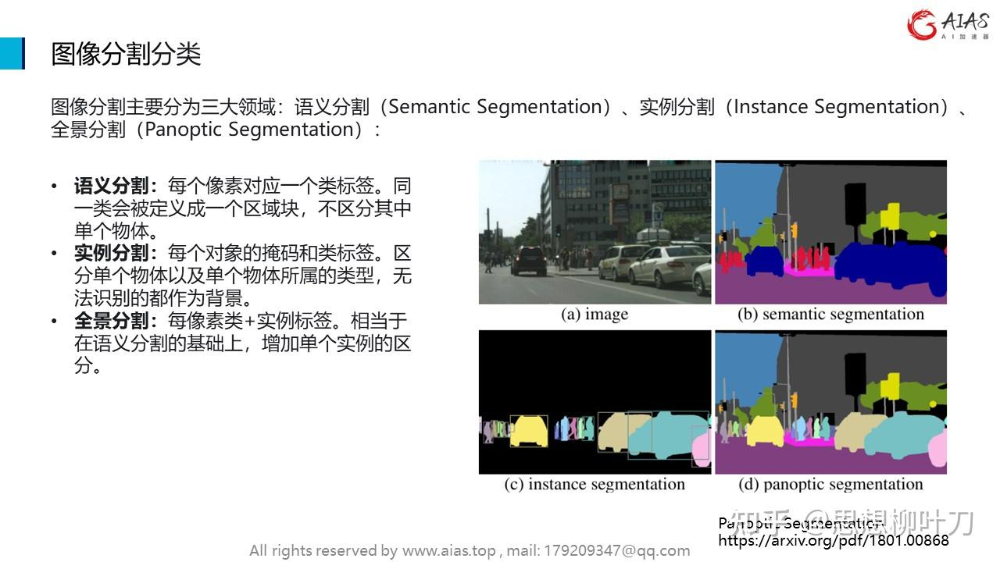

## 三大方向：语义 / 实例 / 全景

图像分割主要分为三大领域：语义分割（Semantic Segmentation）、实例分割（Instance Segmentation）、全景分割（Panoptic Segmentation）。

- **语义分割**：每个像素对应一个类标签。同一类会被定义成一个区域块，不区分其中单个物体。
- **实例分割**：每个对象的掩码和类标签。区分单个物体以及单个物体所属的类型，无法识别的都作为背景。
- **全景分割**：每像素类 + 实例标签。相当于在语义分割的基础上，增加单个实例的区分。

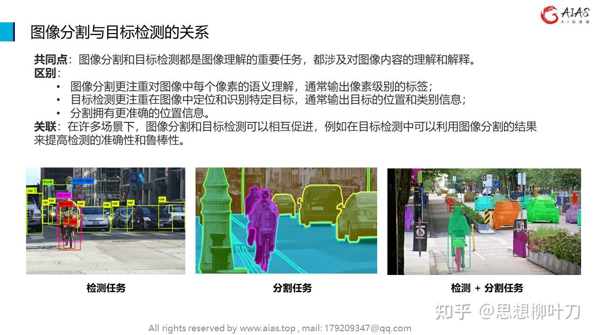

## 图像分割与目标检测的关系

- **共同点**：图像分割和目标检测都是图像理解的重要任务，都涉及对图像内容的理解和解释。
- **区别**：
  - 图像分割更注重对图像中每个像素的语义理解，通常输出像素级别的标签；
  - 目标检测更注重在图像中定位和识别特定目标，通常输出目标的位置和类别信息；
  - 分割拥有更准确的位置信息。
- **关联**：在许多场景下，图像分割和目标检测可以相互促进，例如在目标检测中可以利用图像分割的结果来提高检测的准确性和鲁棒性。

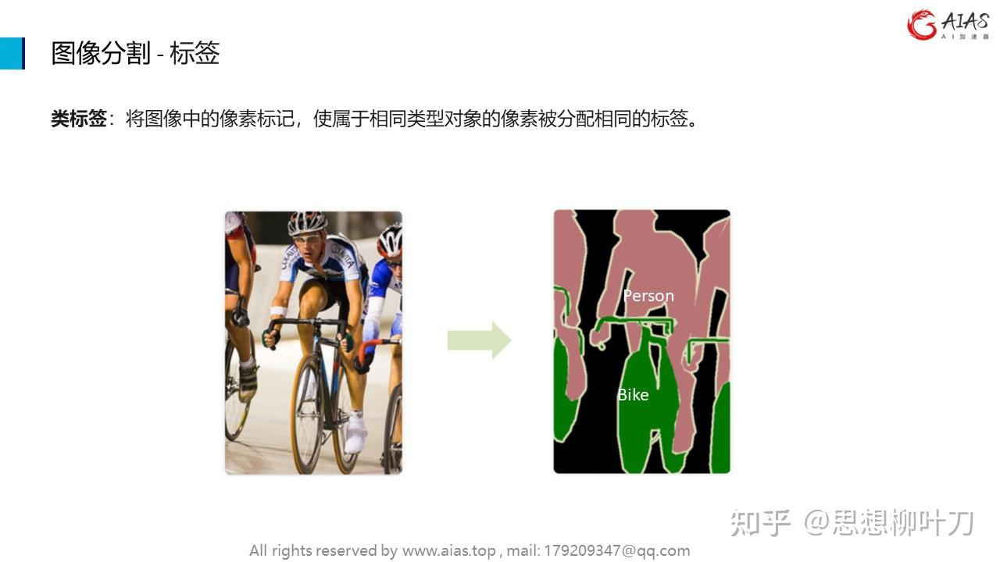

图像分割类标签：将图像中的像素标记，使属于相同类型对象的像素被分配相同的标签。

## 语义分割（Semantic Segmentation）

语义分割（Semantic Segmentation）：每个像素对应一个类标签。同一类会被定义成一个区域块，不区分其中单个物体。

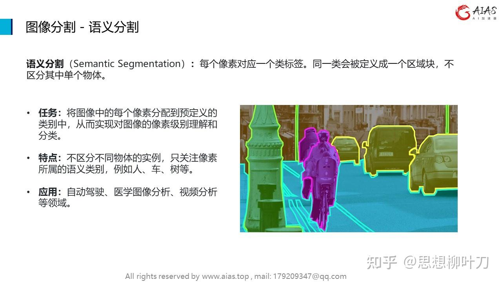

- **任务**：将图像中的每个像素分配到预定义的类别中，从而实现对图像的像素级别理解和分类。
- **特点**：不区分不同物体的实例，只关注像素所属的语义类别，例如人、车、树等。
- **应用**：自动驾驶、医学图像分析、视频分析等领域。

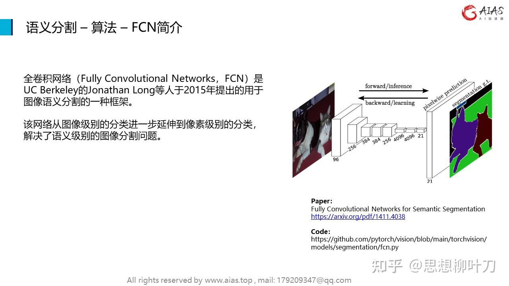

### FCN（Fully Convolutional Network）

FCN（Fully Convolutional Network）是一种用于图像语义分割的深度学习网络架构。传统的深度学习网络（如 CNN）通常用于图像分类任务，输出一个固定大小的向量来表示图像的类别。然而，在图像分割任务中，我们需要对图像的每个像素进行分类，因此需要一种能够处理不同尺寸输入并输出相同尺寸输出的网络结构。

FCN 通过将传统的全连接层替换为卷积层，使得网络能够接受任意尺寸的输入图像，并输出相同尺寸的分割结果。这种结构使得 FCN 能够有效地处理图像分割任务，同时保留了空间信息，使得分割结果更加精确。

FCN 的一些变种还引入了跳跃连接（skip connections）和上采样技术，以提高分割结果的精度和细节。这些技术使得 FCN 在图像分割任务中取得了很好的效果，并被广泛应用于语义分割、实例分割等领域。

**文献**：[Fully Convolutional Networks for Semantic Segmentation](https://arxiv.org/pdf/1411.4038)

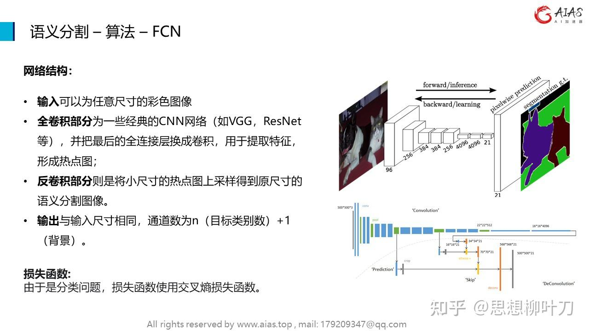

#### 网络结构

- **输入**：可以为任意尺寸的彩色图像。
- **全卷积部分**：为一些经典的 CNN 网络（如 VGG、ResNet 等），并把最后的全连接层换成卷积，用于提取特征，形成热点图。
- **反卷积部分**：将小尺寸的热点图上采样得到原尺寸的语义分割图像。
- **输出**：与输入尺寸相同，通道数为 n（目标类别数）+ 1（背景）。

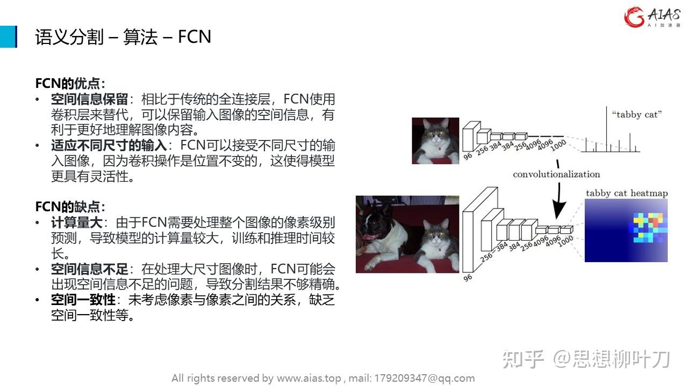

#### FCN 的优点

- **空间信息保留**：相比于传统的全连接层，FCN 使用卷积层来替代，可以保留输入图像的空间信息，有利于更好地理解图像内容。
- **适应不同尺寸的输入**：FCN 可以接受不同尺寸的输入图像，因为卷积操作是位置不变的，这使得模型更具有灵活性。

#### FCN 的缺点

- **计算量大**：由于 FCN 需要处理整个图像的像素级别预测，导致模型的计算量较大，训练和推理时间较长。
- **空间信息不足**：在处理大尺寸图像时，FCN 可能会出现空间信息不足的问题，导致分割结果不够精确。
- **空间一致性不足**：未考虑像素与像素之间的关系，缺乏空间一致性等。

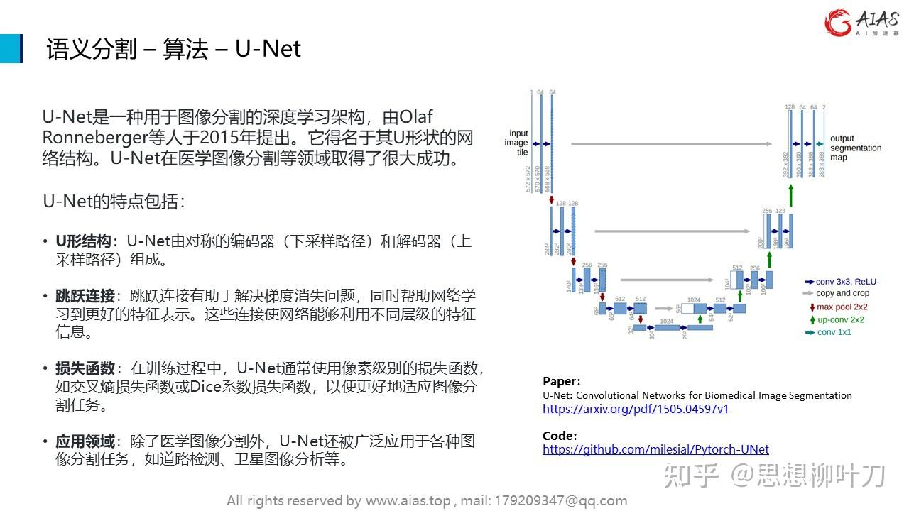

### U-Net

U-Net 的特点包括：

- **U 形结构**：U-Net 由对称的编码器（下采样路径）和解码器（上采样路径）组成，中间有跳跃连接（skip connections）将编码器的特征图与解码器的特征图相连接。这种结构有助于保留高分辨率信息。
- **跳跃连接**：跳跃连接有助于解决梯度消失问题，同时帮助网络学习到更好的特征表示。这些连接使网络能够利用不同层级的特征信息。
- **损失函数**：在训练过程中，U-Net 通常使用像素级别的损失函数，如交叉熵损失函数或 Dice 系数损失函数，以便更好地适应图像分割任务。
- **应用领域**：除了医学图像分割外，U-Net 还被广泛应用于各种图像分割任务，如道路检测、卫星图像分析等。

**Paper**：[U-Net: Convolutional Networks for Biomedical Image Segmentation](https://arxiv.org/pdf/1505.04597v1)
**Code**：[https://github.com/milesial/Pytorch-UNet](https://github.com/milesial/Pytorch-UNet)

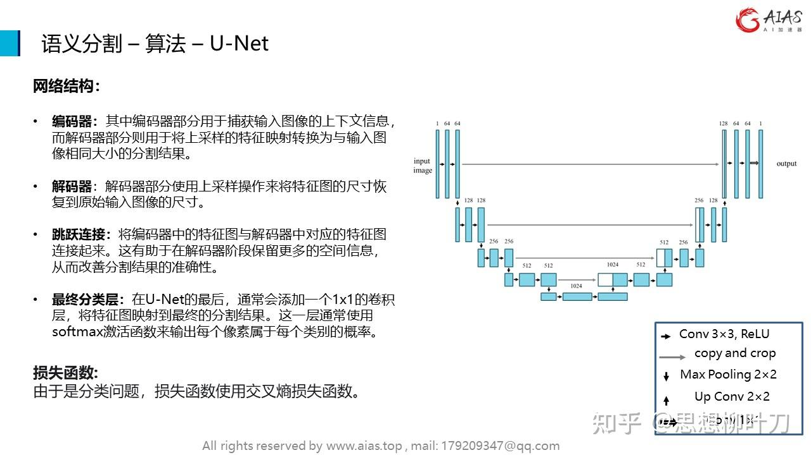

#### 网络结构

- **编码器**：其中编码器部分用于捕获输入图像的上下文信息，而解码器部分则用于将上采样的特征映射转换为与输入图像相同大小的分割结果。
- **解码器**：解码器部分使用上采样操作来将特征图的尺寸恢复到原始输入图像的尺寸。
- **跳跃连接**：将编码器中的特征图与解码器中对应的特征图连接起来。这有助于在解码器阶段保留更多的空间信息，从而改善分割结果的准确性。
- **最终分类层**：在 U-Net 的最后，通常会添加一个 1×1 的卷积层，将特征图映射到最终的分割结果。这一层通常使用 softmax 激活函数来输出每个像素属于每个类别的概率。

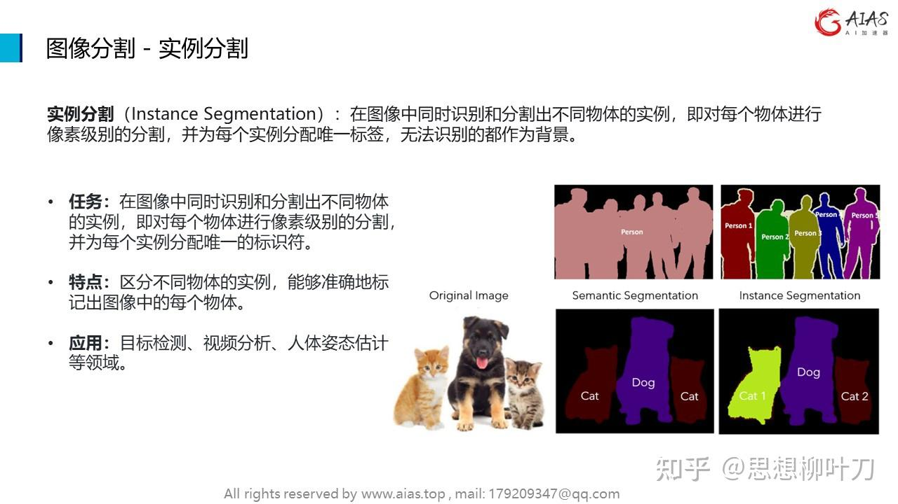

## 实例分割（Instance Segmentation）

实例分割（Instance Segmentation）：在图像中同时识别和分割出不同物体的实例，即对每个物体进行像素级别的分割，并为每个实例分配唯一标签，无法识别的都作为背景。

- **任务**：在图像中同时识别和分割出不同物体的实例，即对每个物体进行像素级别的分割，并为每个实例分配唯一的标识符。
- **特点**：区分不同物体的实例，能够准确地标记出图像中的每个物体。
- **应用**：目标检测、视频分析、人体姿态估计等领域。

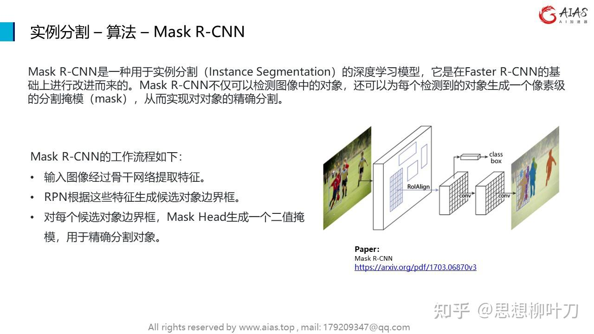

### Mask R-CNN

Mask R-CNN 是一种用于实例分割（Instance Segmentation）的深度学习模型，它是在 Faster R-CNN 的基础上进行改进而来的。Mask R-CNN 不仅可以检测图像中的对象，还可以为每个检测到的对象生成一个像素级的分割掩模（mask），从而实现对对象的精确分割。

Mask R-CNN 的工作流程如下：

- 输入图像经过骨干网络提取特征。
- RPN 根据这些特征生成候选对象边界框。
- 对每个候选对象边界框，Mask Head 生成一个二值掩模，用于精确分割对象。

**Paper**：[Mask R-CNN](https://arxiv.org/pdf/1703.06870v3)

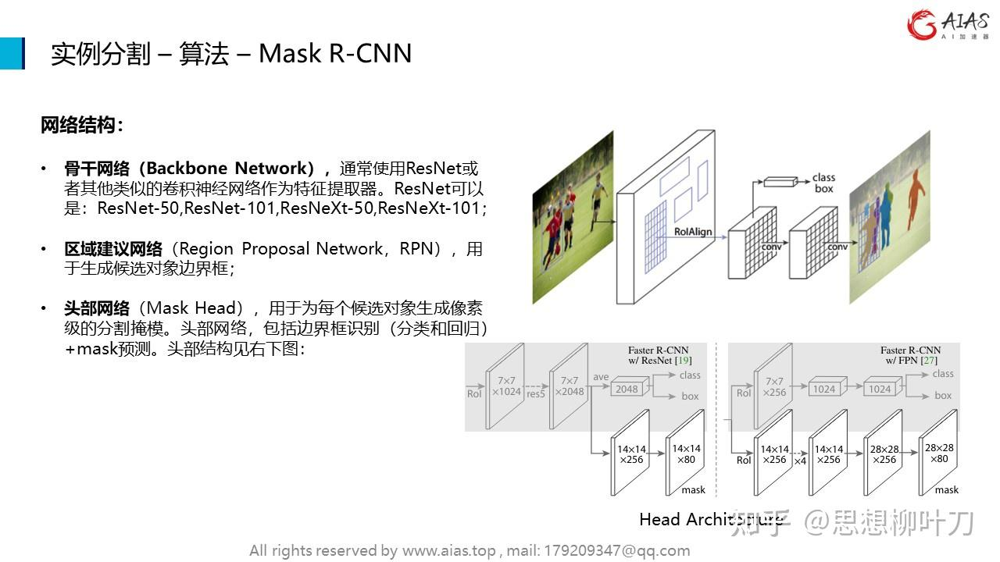

#### 网络结构

- **骨干网络（Backbone Network）**：通常使用 ResNet 或者其他类似的卷积神经网络作为特征提取器。ResNet 可以是：ResNet-50, ResNet-101, ResNeXt-50, ResNeXt-101。
- **区域建议网络（Region Proposal Network，RPN）**：用于生成候选对象边界框。
- **头部网络（Mask Head）**：用于为每个候选对象生成像素级的分割掩模。头部网络包括边界框识别（分类和回归）+ mask 预测。

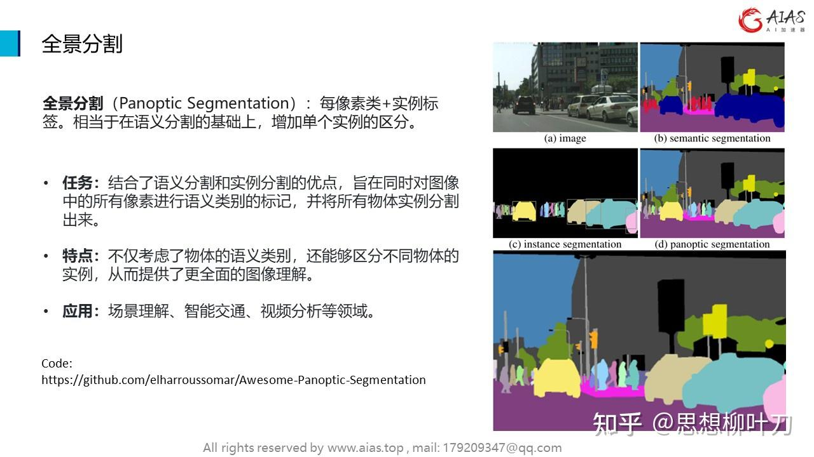

## 全景分割（Panoptic Segmentation）

全景分割（Panoptic Segmentation）：每像素类 + 实例标签。相当于在语义分割的基础上，增加单个实例的区分。

- **任务**：结合了语义分割和实例分割的优点，旨在同时对图像中的所有像素进行语义类别的标记，并将所有物体实例分割出来。
- **特点**：不仅考虑了物体的语义类别，还能够区分不同物体的实例，从而提供了更全面的图像理解。
- **应用**：场景理解、智能交通、视频分析等领域。

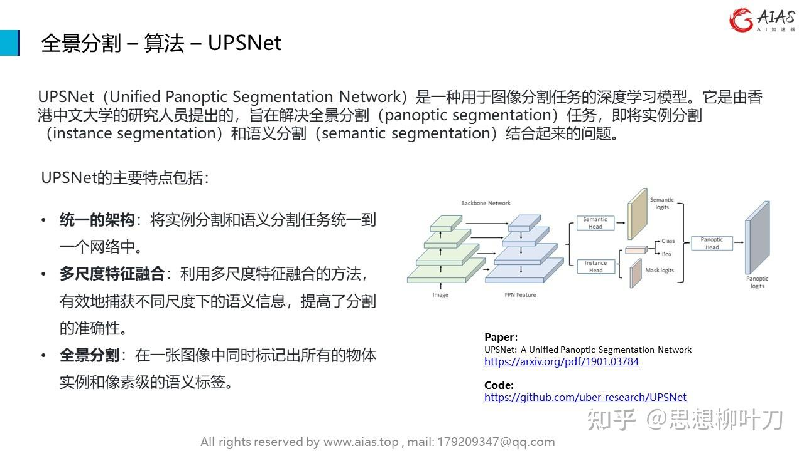

### UPSNet（Unified Panoptic Segmentation Network）

UPSNet（Unified Panoptic Segmentation Network）是一种用于图像分割任务的深度学习模型。它是由香港中文大学的研究人员提出的，旨在解决全景分割（panoptic segmentation）任务，即将实例分割（instance segmentation）和语义分割（semantic segmentation）结合起来的问题。

UPSNet 的主要特点包括：

1. **统一的架构**：UPSNet 将实例分割和语义分割任务统一到一个网络中，通过共享特征来提高模型的效率和性能。
2. **多尺度特征融合**：UPSNet 利用多尺度特征融合的方法，有效地捕获不同尺度下的语义信息，提高了分割的准确性。
3. **全景分割**：UPSNet 的目标是实现全景分割，即在一张图像中同时标记出所有的物体实例和像素级的语义标签。

**Paper**：[UPSNet: A Unified Panoptic Segmentation Network](https://arxiv.org/pdf/1901.03784)
**Code**：[https://github.com/uber-research/UPSNet](https://github.com/uber-research/UPSNet)

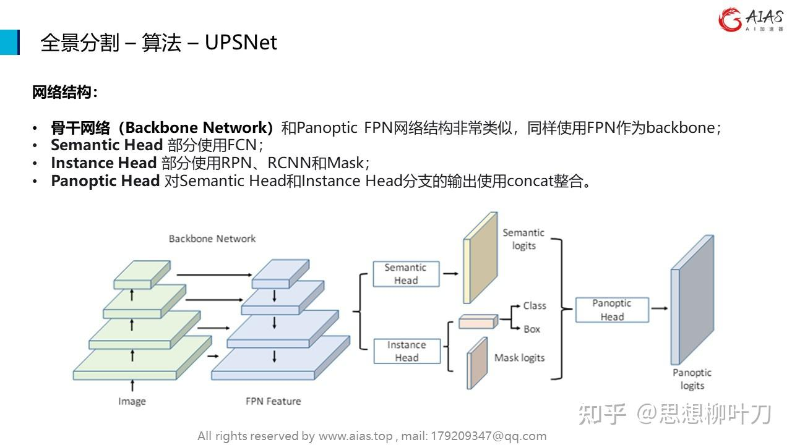

#### 网络结构

- **骨干网络（Backbone Network）**：和 Panoptic FPN 网络结构非常类似，同样使用 FPN 作为 backbone。
- **Semantic Head**：部分使用 FCN。
- **Instance Head**：部分使用 RPN、RCNN 和 Mask。
- **Panoptic Head**：对 Semantic Head 和 Instance Head 分支的输出使用 concat 整合。

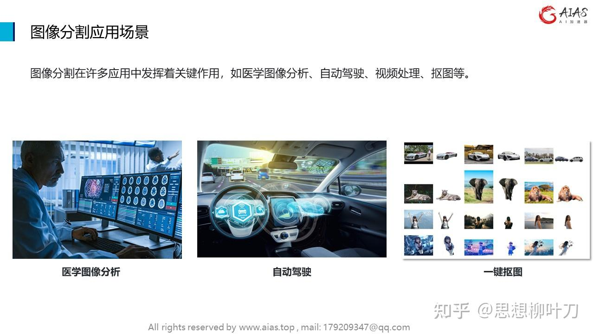

## 图像分割应用场景

图像分割是计算机视觉领域中的重要技术，它可以将图像分成若干个具有语义信息的区域或对象。图像分割在许多应用场景中发挥着重要作用，以下是一些常见的图像分割应用场景：

1. 医学图像分析：在医学影像领域，图像分割可用于识别和定位病变区域，辅助医生进行疾病诊断和治疗规划。
2. 自动驾驶：在自动驾驶系统中，图像分割可以帮助车辆识别道路、车辆、行人等不同的物体，从而实现智能驾驶和避免交通事故。
3. 农业领域：在农业领域，图像分割可用于识别作物、病虫害、杂草等，帮助农民进行精准农业管理。
4. 地图制作：图像分割可以用于从卫星图像或航拍图像中提取道路、建筑物、水体等地理信息，用于地图制作和城市规划。
5. 人脸识别：在人脸识别系统中，图像分割可以帮助识别人脸的不同部分，如眼睛、嘴巴等，提高识别准确率。
6. 艺术和设计：图像分割可以用于艺术创作和设计领域，帮助艺术家和设计师实现创意作品的制作和编辑。

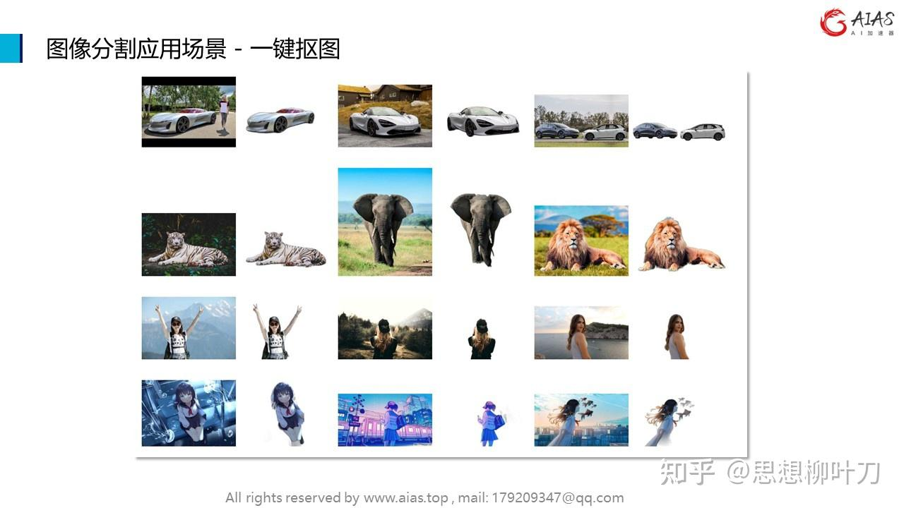

## 一键抠图

一键抠图是一种图像处理技术，旨在自动将图像中的前景对象从背景中分离出来。它可以帮助用户快速、准确地实现抠图效果，无需手动绘制边界或进行复杂的图像编辑操作。

一键抠图的原理通常基于计算机视觉和机器学习技术。它使用深度神经网络模型，通过训练大量的图像样本，学习如何识别和分离前景对象和背景。这些模型能够理解图像中的像素信息和上下文，并根据学习到的知识进行像素级别的分割。

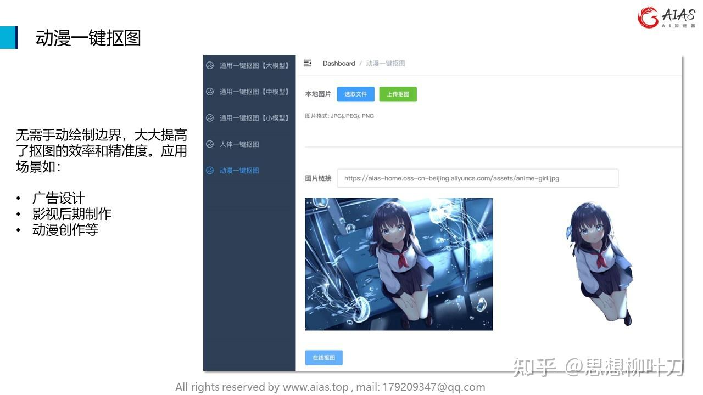

### 动漫一键抠图

动漫一键抠图旨在通过计算机自动识别图像中的前景和背景，将前景动漫人物从背景中抠出，实现图像的抠图效果。这种技术可以帮助用户快速、高效地实现抠图操作，节省大量的时间和精力。

使用动漫一键抠图技术，用户只需简单操作，即可实现复杂的抠图效果，无需手动绘制边界，大大提高了抠图的效率和精准度。这种技术在许多领域都有广泛的应用，如广告设计、影视后期制作、动漫创作等，为用户提供了便利和高效的图像处理解决方案。

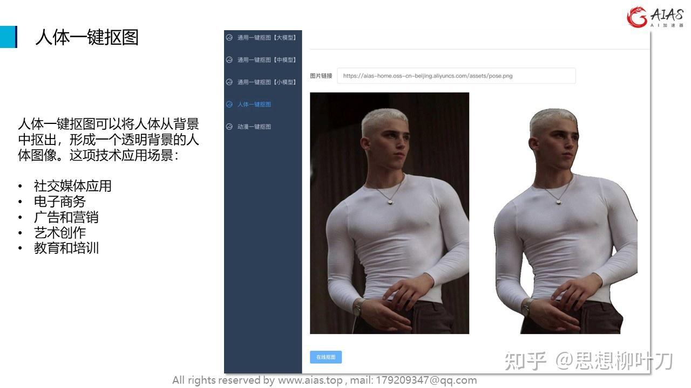

### 人体一键抠图

人体一键抠图可以自动识别图像中的人体，并将人体从背景中抠出，形成一个透明背景的人体图像。这项技术在许多应用场景中都非常有用，以下是一些简要介绍：

1. 社交媒体应用：人体一键抠图可以帮助用户在社交媒体平台上制作更具创意的照片和视频内容。用户可以将自己的照片抠出，换上不同的背景，制作有趣的合成照片或视频。
2. 电子商务：在线商店可以利用人体一键抠图技术来展示产品效果图，让消费者更清晰地看到产品细节，提升购物体验。例如，展示服装时可以将模特的图片抠出，让消费者更好地看到服装的款式和剪裁。
3. 广告和营销：广告和营销领域也可以利用人体一键抠图技术制作更引人注目的广告素材。通过将产品或服务与抠出的人体图像结合，可以吸引更多目光，提升广告效果。
4. 艺术创作：艺术家和设计师可以利用人体一键抠图技术在他们的创作中加入人物元素，创作出更具艺术感的作品。这项技术可以帮助他们更方便地进行合成和设计。
5. 教育和培训：在教育领域，人体一键抠图技术可以用于制作教学素材和课件，使教学内容更生动形象。教师和培训师可以利用这项技术制作具有视觉吸引力的教学资源。

总的来说，人体一键抠图技术在许多领域都有广泛的应用，可以帮助提升工作效率，增强视觉表现力，以及创造更具创意和吸引力的作品。
