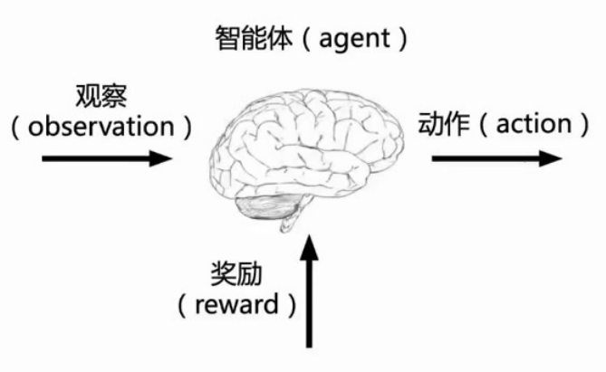
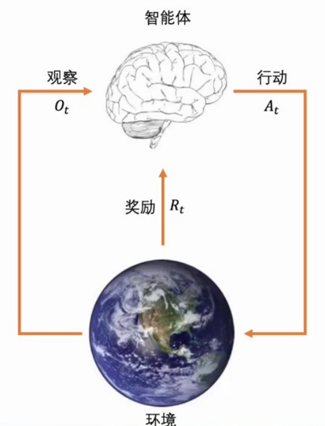

# 强化学习

---

## 目录

1. [课程导论](#一课程导论)
2. [强化学习基础](#二强化学习基础)
3. [数学框架与核心概念](#三数学框架与核心概念)
4. [深度强化学习](#四深度强化学习)
5. [前沿技术方向](#五前沿技术方向)
6. [产业应用案例](#六产业应用案例)
7. [技术挑战与未来趋势](#七技术挑战与未来趋势)
8. [知识小结](#八知识小结)

---

## 一、课程导论

### 1.1 课程目标

- **参考信息**：该笔记大纲参考张伟楠博士的强化学习讲座制定
- **教材推荐**：使用《动手学强化学习》配套实践，提供可复现代码

### 1.2 AI任务类型全景

```
┌─────────────────────────────────────────────────────┐
│                  人工智能任务分类                      │
├─────────────────────┬───────────────────────────────┤
│    预测型任务        │         决策型任务              │
│  ─────────────────  │  ─────────────────────────    │
│  • 输出不改变环境状态 │  • 动作输出会改变环境状态       │
│                     │                               │
│  • 监督学习          │  • 强化学习（通过试错交互学习） │
│    （如图像分类）    │                               │
│                     │  • 三要素：                    │
│  • 无监督学习        │    - 状态转移：s_{t+1}=f(s_t,a_t) │
│    （如GAN生成图像） │    - 即时奖励：r_t=R(s_t,a_t)  │
│                     │    - 长期收益：max∑γ^t r_t     │
└─────────────────────┴───────────────────────────────┘
```

### 1.3 决策智能分类

#### 白盒环境（模型已知）

| 类型     | 方法                         | 示例         |
| -------- | ---------------------------- | ------------ |
| 静态环境 | 运筹优化（混合整数线性规划） | 资源分配     |
| 静态环境 | 动态规划（MDP精确求解）      | 最短路径算法 |

> **特点**：状态转移函数 $P(s'|s,a)$ 和奖励函数 $R(s,a)$ 已知

#### 黑盒环境（模型未知）

| 类型               | 方法                                      | 示例             |
| ------------------ | ----------------------------------------- | ---------------- |
| 静态环境           | 黑盒优化（神经网络代理模型）              | 超参调优         |
| 静态环境           | 贝叶斯优化（高斯过程建模）                | 实验设计         |
| **动态环境** | **强化学习（Q-learning/策略梯度）** | **游戏AI** |
| 动态环境           | Bandit问题（探索-利用权衡）               | 推荐系统         |

> **特点**：仅通过输入输出交互学习，无显式模型

---

## 二、强化学习基础

### 2.1 什么是序贯决策？

**定义**：智能体在动态环境中连续做出决策序列，通过不断接收新观测来优化目标。

**数学表达**：

$$
\max_{\pi} \mathbb{E}_{\pi, Env} \left[ \sum_{t=0}^{T} \gamma^t r(s_t, a_t) \right]
$$

#### 公式逐层拆解

上述公式是强化学习的**终极优化目标**，其完整含义可从外到内逐层解读：

**第一层——最外层 $\max_{\pi}$：「找最优策略」**

- $\pi$ 表示**策略**（智能体的决策规则/做事方法），如迷宫中往哪走、车辆怎么开、机器人如何控制关节等
- $\max_{\pi}$ 的含义是：**在所有可能的候选策略中，挑选出能使收益达到最大的那一个**
- 这一层回答的是"**要选哪个策略**"

**第二层——中间层 $\mathbb{E}_{\pi, Env}$：「算长期平均」**

- $\mathbb{E}$ 是数学期望（期望值 = 长期统计平均值），**不是单次运气的得分**
- 下标 $\pi, Env$ 指明计算条件：**使用特定策略 $\pi$ 与真实环境 $Env$ 交互时**的期望
- 引入期望的原因在于：实际环境普遍存在随机性（如路面突发状况、游戏随机事件、物理仿真中的微小扰动），单次结果不可靠，必须用多次试验的长期平均值来衡量策略的真实水平
- 这一屔回答的是"**用什么指标来评价策略好坏**"

**第三层——最内层 $\sum_{t=0}^{T} \gamma^t r(s_t, a_t)$：「算单次总奖励」**

- $r(s_t, a_t)$：第 $t$ 步执行动作后获得的**即时奖励**（正值为奖励，负值为惩罚）
- $\gamma^t$：**折扣因子**的幂次，使得越远期的奖励权重越小（$\gamma \in [0,1]$）
- $\sum$：将每个时间步的折扣奖励从头到尾累加求和
- 这一层数值表示智能体按照某条完整轨迹走完全程后获得的**折扣后累计总分**

#### 三层为何缺一不可？

单独取出任意一层都无法构成完整的优化目标：

| 只取的部分                   | 能做什么                                           | 缺失什么                         |
| :--------------------------- | :------------------------------------------------- | :------------------------------- |
| 仅最内层$\sum$             | 计算单次轨迹的总分                                 | 受单次运气影响大，无法排除偶然性 |
| 仅中间层$\mathbb{E}[\sum]$ | 评估某一固定策略的长期表现                         | 无法在不同策略之间比较优劣       |
| 加上外层$\max_\pi$         | **在所有候选策略中选出使长期平均总分最大者** | —— 完整                        |

三层嵌套的逻辑链条是：**先定义单次收益 → 再消除随机性取平均 → 最后全局寻优**。这就是强化学习的核心命题：**寻找最优策略，赢在长期、稳在平均**。

#### 案例代入验证

**案例一——迷宫导航智能体**：

将公式各部分代入迷宫场景：

- 内层 $\sum$：每走一步扣 1 分（$r = -1$），步数越多扣分越重；折扣 $\gamma$ 使后期扣分的实际影响更大（逼迫尽快找到出口）
- 中间层 $\mathbb{E}$：迷宫可能存在随机障碍物或滑动机制，同一路径每次执行结果不完全一致，需计算多轮平均扣分
- 外层 $\max_\pi$：在"随机乱走""贴右墙走""最短路径探索"等无穷多种策略中，找出**平均总扣分最少**的那一个

**案例二——自动驾驶车道保持**：

- 内层 $\sum$：保持在车道中心得正分、偏离/越界得负分，长期累积
- 中间层 $\mathbb{E}$：道路表面存在微小波动和不确定性，以长期平均得分为准
- 外层 $\max_\pi$：搜索最优驾驶策略，使车辆长期平稳行驶且平均得分最高

**典型应用——机器狗越障**：

- 通过轮足与地形持续交互完成越障任务
- 核心特点：决策具有时间连续性，当前决策影响后续状态
- 绝大多数序贯决策问题可用强化学习求解

### 2.2 强化学习定义

**马尔可夫决策过程（MDP）——强化学习的数学框架**

在正式定义强化学习之前，需要先理解其底层数学框架：**马尔可夫决策过程（Markov Decision Process, MDP）**。MDP 是 AI 做决策的"游戏规则说明书"，课件中所有的序贯决策、状态转移、策略、奖励等概念均在 MDP 框架下定义。

**马尔可夫性——MDP 的核心前提**

马尔可夫性的本质是：**只看现在，不翻旧账**。即下一步会变成什么样、该如何决策，只依赖当前状态，和之前所有历史无关。

以迷宫为例：智能体当前位于第5格。不管它是从起点一路直走过来，还是绕路撞墙多次才到达此处，下一步往哪个方向走、走到哪里，完全取决于"你在第5格"这一件事，与之前的路径毫无关系。课件中状态的定义 $S_t = f(H_t)$（状态是历史的函数），其目的正是从完整历史中提炼出满足马尔可夫性所需的当前关键信息，丢弃无用的历史细节。

> **通俗类比**：将 MDP 类比为玩闯关游戏——你站在当前关卡（状态），无需回忆之前怎么玩的；选操作（动作）→ 跳到下一关（状态转移）→ 加分/扣分（奖励），目标是通关拿最高分。

#### MDP 五要素详解

MDP 由以下五个核心要素构成：

| 要素                              | 符号                                     | 数学定义                                                  | 含义                                   | 课件案例                                                   |
| :-------------------------------- | :--------------------------------------- | :-------------------------------------------------------- | :------------------------------------- | :--------------------------------------------------------- |
| **状态 S** (State)          | $S_t$                                  | 环境在时刻 $t$ 的完整描述                                | 满足马尔可夫性的当前全部关键信息       | 迷宫格子ID、小车位置/朝向、Atari游戏像素帧、机器狗关节角度 |
| **动作 A** (Action)         | $A_t$                                  | 智能体在状态 $S_t$ 可执行的选择集合                      | 会改变环境的决策输出                   | 迷宫{上/下/左/右}、小车方向盘{左转/右转}、游戏手柄按键     |
| **状态转移 P** (Transition) | $P(s' \mid s,a)$ 或 $s_{t+1}=f(s_t,a_t)$ | 在状态 $s$ 执行动作 $a$ 后转移到状态 $s'$ 的概率规则 | 描述"做了某动作后环境怎么变"           | 迷宫按方向移动到邻格、撞墙则原地不动                       |
| **奖励 R** (Reward)         | $R(s,a)$ 或 $\mathcal{R}_s^a$        | 状态-动作对 $(s,a)$ 对应的即时标量反馈                   | 环境给出的"好坏"信号                   | 迷宫每步 $r=-1$（鼓励快速退出）、车道保持 $r=+1$        |
| **折扣因子 γ** (Discount)  | $\gamma \in [0,1]$                     | 应用于未来奖励的时间衰减系数                              | 越远的奖励权重越小，使无限时序求和收敛 | $\gamma=0.99$ 时10步后的奖励约为当前的90%                |

各要素之间的协作关系为：智能体观察当前**状态 $S$** → 根据策略选择并执行**动作 $A$** → 环境**状态转移 P** 决定下一状态 → 环境**奖励 R** 给出反馈 → 折扣 **γ** 将远期奖励折算至当前价值。

**用迷宫案例完整跑通 MDP 流程**：假设一个 4×4 迷宫，起点在左上角(0,0)，出口在右下角(3,3)，每步奖励 $r=-1$：

- 当前**状态**：(1, 2)（位于第1行第2格）
- 可选**动作**：{上, 下, 左, 右}
- 选择动作"右"后，**状态转移**：移动到 (1, 3)
- 获得**奖励**：$r=-1$
- 目标：在所有可能的动作序列中，找到使累计折扣奖励最大的策略

#### MDP 与强化学习的关系

根据环境模型是否已知，MDP 分为两类，对应不同的求解方法：

| 类型               | 条件                    | 求解方法                                              | 代表算法                          |
| :----------------- | :---------------------- | :---------------------------------------------------- | :-------------------------------- |
| **白盒 MDP** | $P$ 和 $R$ 全部已知 | 动态规划 / 值迭代 / 策略迭代直接求解最优策略$\pi^*$ | Value Iteration, Policy Iteration |
| **黑盒 MDP** | $P$ 和 $R$ 均未知   | 强化学习——通过与环境试错交互来学习最优策略          | Q-learning, DQN, PPO, SAC         |

强化学习的本质定位是：**在黑盒 MDP 中通过交互经验寻找最优策略 $\pi^*$**。其中策略 $\pi$ 的定义为：在每个状态下选择什么动作的映射规则 $\pi(a|s)$，目标是最大化长期累积折扣奖励 $\sum_{t=0}^{T} \gamma^t r_t$。

> **"智能"的定义**：达成目标的计算过程称为智能
> **"学习"的本质**：通过经验提升目标性能的过程
> **强化学习的特征**：强调从交互过程中积累经验来实现目标

**历史沿革**：

- 1950s：图灵首次提出智能体概念
- 1980s：正式写入学术论文
- 近期：因大模型普及重新受到关注（已有近50年发展历史）

### 2.3 智能体核心三要素

| 要素                          | 符号    | 说明             |
| ----------------------------- | ------- | ---------------- |
| **观测**（Observation） | $O_t$ | 感知环境当前状态 |
| **动作**（Action）      | $A_t$ | 输出决策影响环境 |
| **奖励**（Reward）      | $R_t$ | 评估动作效果     |

**关于公式中"竖线" $\mid$ 的说明——条件期望在强化学习中的使用**

在强化学习公式中，经常出现形如 $\mathbb{E}[\,\cdot \mid S_0=s]$ 的写法。这种形式在概率论中被称为**条件期望**（Conditional Expectation），RL 中直接沿用该术语，并无特殊命名。

#### 竖线 `|` 的统一含义

竖线 `|` 在所有场景下的含义均为 **"给定前提 / 在……条件下"**，与条件概率 $P(A|B)$ 中的用法完全一致：

| 符号形式                               | 所属领域 | 含义                                                     |
| :------------------------------------- | :------- | :------------------------------------------------------- |
| $P(A \mid B)$                            | 概率论   | 条件概率：事件 B 已发生时，事件 A 的概率                 |
| $\mathbb{E}[X \mid Y=y]$               | 概率论   | 条件期望：随机变量 Y 取值为 y 时，X 的期望（加权平均）   |
| $\mathbb{E}_\pi[\,\cdot \mid S_0=s]$ | 强化学习 | 条件期望：初始状态为 s、按策略 π 交互时，累积奖励的期望 |

因此，条件期望可以理解为**条件概率的加权平均**：$\mathbb{E}[X \mid Y=y] = \sum_x x \cdot P(X=x \mid Y=y)$，竖线的底层逻辑完全一致。

#### RL 中两种最常见的条件期望

强化学习的核心任务是**评估从某个起点出发未来能获得多少奖励**，几乎所有价值函数都需要一个"起点条件"：

- **状态价值 $V^\pi(s)$**：

  $$
  V^\pi(s) = \mathbb{E}_\pi\left[ \sum_{t=0}^T \gamma^t r(s_t,a_t) \mid S_0 = s \right]
  $$

  条件为"初始状态是 $s$"，限定"从哪里开始"，但第一步动作仍由策略 $\pi$ 决定
- **动作价值 $Q^\pi(s,a)$**：

  $$
  Q^\pi(s,a) = \mathbb{E}_\pi\left[ \sum_{t=0}^T \gamma^t r(s_t,a_t) \mid S_0 = s, A_0 = a \right]
  $$

  条件进一步收紧为"初始状态 $s$ + 第一步必须选动作 $a$"，连第一个动作也固定了

#### 为何将 $\mathbb{E}_\pi$ 与 $\mid S_0=s$ 分开书写？

公式中存在两个看似都是"条件"的成分，但它们的**本质角色完全不同**，分开书写有四个核心原因：

1. **语义层级不同**：$\mathbb{E}_\pi$ 定义了整个交互轨迹的概率分布（策略 $\pi$ 加环境转移 $P$ 共同确定了轨迹分布 $P_\pi$）；而 $\mid S_0=s$ 是在该分布上指定的具体初始条件——类似于"掷硬币时硬币偏倚率 $p$"与"第一次掷出正面"的区别
2. **突出优化目标**：强化学习的终极目标是寻找最优策略 $\pi^*$，$\pi$ 是被优化的变量。将 $\pi$ 写在期望下标或价值函数上标处，相当于将其标记为"外部优化参数"，使优化式一目了然：

   $$
   \max_\pi V^\pi(s) = \max_\pi \mathbb{E}_\pi[\,\cdot \mid S_0=s]
   $$
3. **符合约定俗成的简化**：RL 中所有期望均基于某个策略 $\pi$，这是默认前提，故简化为 $\mathbb{E}_\pi$；而 $\mid S_0=s$ 是每次评估不同状态时变化的条件，需明确保留
4. **贝尔曼方程推导更清晰**：分离写法使推导结构自然——当前步骤的动作由 $\pi$采样，后续价值仍属同一策略，逻辑链条清晰：

   $$
   V^\pi(s) = \mathbb{E}_\pi[r(s,a) + \gamma V^\pi(s') \mid S_0=s]
   $$

> 注：部分偏理论的文献也会将两者合并写作 $\mathbb{E}[\,\cdot \mid \pi, S_0=s]$，数学上等价但不突出优化目标，故主流教材（如 Sutton & Barto）多采用分离记法。

### 2.4 智能体-环境交互闭环



**交互循环**：

1. 智能体获得观察 $O_t$
2. 智能体执行动作 $A_t$
3. 环境接收动作 $A_t$，产生奖励 $R_t$
4. 环境生成新观察 $O_{t+1}$

> **系统特性**：构建了智能体与动态环境序贯交互决策的**闭环系统**



### 2.5 与传统机器学习的本质区别

| 对比维度 | 监督/无监督学习          | 强化学习                           |
| -------- | ------------------------ | ---------------------------------- |
| 数据来源 | 基于固定数据集或数据分布 | 数据分布随策略动态变化             |
| 数据特性 | 静态分布                 | **动态变化**                 |
| 核心差异 | —                       | 策略不同 → 完全不同的交互数据分布 |

> **关键洞察**：这是强化学习最核心的挑战——**在变化的分布上学习**

#### 策略与数据分布的动态对应关系（逐层解析）

强化学习中，策略 $\pi$ 与其产生的数据分布（即占用度量 $\rho^\pi(s,a)$）之间存在深刻的内在联系。以下从四个层面逐一剖析：

**第一层——严格一一对应（数学底层）**

$$
\rho_{\pi_1} = \rho_{\pi_2} \iff \pi_1 = \pi_2
$$

该定理表明策略与占用度量之间是**双向等价的双射关系**：

- 正向：相同的策略 $\Rightarrow$ 生成完全相同的数据分布
- 反向：相同的数据分布 $\Rightarrow$ 唯一对应同一个策略
- 不存在任何模糊空间：一个策略对应唯一分布，一个分布也只对应唯一策略

这是 RL 中最硬核的数学关系，也是"从占用度量反推策略公式" $\pi(a|s) = \rho(s,a) / \sum_{a'} \rho(s,a')$ 的理论基础。

**第二层——微小策略变动导致分布剧变（反直觉关键）**

哪怕仅修改**某一个状态**下的动作选择概率（例如将"向左"的概率从 0.50 微调为 0.51），也会引发连锁反应：

```
某状态s的动作选择微变 → 到达该状态时的实际动作改变
  → 触发的下一状态 s' 改变
    → 后续整条交互轨迹全部改写
      → 所有 (s,a) 对的访问频率 ρ(s,a) 被重新计算
        → 数据分布完全不同
```

**迷宫实例**：原策略在起点选择"向东"，新策略仅在起点改为"向北"——仅仅这一处改动，后续经过的所有格子、每一步的状态-动作对全部改变，整个占用度量彻底重写。

课件金句——"**策略改变1%就会导致100%不同的数据分布**"——正是对此特性的精准概括。

**第三层——核心闭环："策略生成数据，数据训练策略"**

| 学习范式        | 数据分布特征                         | 模型/策略与数据的关系                                                                                       |
| :-------------- | :----------------------------------- | :---------------------------------------------------------------------------------------------------------- |
| 监督/无监督学习 | **固定不变**（提前给定训练集） | 模型拟合固定规律，数据是"死"的                                                                              |
| 强化学习        | **动态变化**（由策略生成）     | 策略$\pi$ $\to$ 生成分布 $\rho^{\pi}$ $\to$ 用 $\rho^{\pi}$ 更新 $\pi$ $\to$ 新策略生成新分布 |

强化学习中数据是"活"的——**策略决定了智能体能看到什么数据，而这些数据又反过来决定如何修改策略**。

**第四层——黑盒环境下分布只能采样、不能计算**

已知策略 $\pi$ 后，由于环境状态转移 $P(s'|s,a)$ 在黑盒场景下未知，**不存在任何显式公式能直接计算出分布 $\rho^\pi$**。获取 $\rho^\pi$ 的唯一途径是让智能体按该策略与环境实际交互运行轨迹，统计 $(s,a)$ 对的出现频率来估计分布。这种隐式关系意味着优化目标缺乏对策略更新方向的解析指导。

#### 该对应关系的理论意义

1. **解释了 RL 为何困难**：数据分布在训练过程中持续变化，没有固定的训练集可用，导致训练不稳定、样本效率低
2. **奠定了 RL 的基本优化范式**：无法一步解析求出最优策略，只能采用**策略评估 $\to$ 策略提升**的迭代方法逐步逼近
3. **区分了两类 AI 任务的本质**：预测型任务面对静态分布，决策型任务（RL）面对动态自生成分布

### 2.6 应用案例：无人驾驶小车

**实验设置**：

- 环境：英国牛津小道
- 机制：越界后重置训练周期

**训练进程**：

| 训练周期 | 行驶距离          | 表现         |
| -------- | ----------------- | ------------ |
| 首轮评估 | 9.8 米            | 初始表现     |
| 第2周期  | 明显增加          | 路径长度改善 |
| 最终周期 | **53.8 米** | 连续平稳驾驶 |

**技术亮点**：

- 无预设规则：完全通过RL算法自主学习
- 论文来源：ICRA 2019 *Learning to Drive in a Day*
- 学习原理：保持车道行驶获得正向奖励，$\gamma$ 折扣因子平衡即时/远期收益

---

## 三、数学框架与核心概念

### 3.1 历史序列与状态

**历史序列** $H_t$ 是观察(O)、动作(A)和奖励(R)的序列：

$$
H_t = O_1, R_1, A_1, O_2, R_2, A_2, \ldots, O_t, R_t
$$

**状态**是历史的函数：

$$
S_t = f(H_t)
$$

> 例如：MIT机器狗通过关节扭矩、角度等观测值构建历史序列，进而推断当前真实状态。

### 3.2 策略（Policy）

策略 $\pi$ 是强化学习的**最终输出模块**，决定智能体在特定状态下的行为方式。

| 策略类型             | 数学表达                              | 说明                   |
| -------------------- | ------------------------------------- | ---------------------- |
| **确定性策略** | $a = \pi(s)$                        | 直接映射状态到动作     |
| **随机策略**   | $\pi(a \mid s) = P(A_t = a \mid S_t = s)$ | 按条件概率分布采样动作 |

> **表示规范**：大写斜体字母表示随机变量（如 $S, O, A, R$），小写字母表示具体取值（如 $s, a, o, r$）

### 3.3 奖励函数

- **信号特性**：标量值 $R_t$ 或 $r(s,a)$，提供即时"好坏"反馈信号
- **设计原则**：必须为标量形式以便优化比较（类比监督学习的损失函数或无监督学习的 log likelihood）
- **反馈机制**：环境对每个状态或状态-动作对生成奖励值

#### 为何奖励预测公式必须使用期望？

课件中的奖励预测公式为：

$$
\mathcal{R}_s^a = \mathbb{E}[R_{t+1} \mid S_t=s, A_t=a]
$$

该公式使用期望（而非固定数值）的原因在于一个关键事实：**强化学习所面对的实际环境中，同一状态 $s$ 下执行同一动作 $a$ 的结果往往是随机的、不固定的。**

初学者常有一个直觉假设："在状态 $s$ 执行动作 $a$ → 下一步一定得到某个固定奖励 $r$"。然而真实环境普遍具有随机性——MDP 的状态转移 $P(s'|s,a)$ 本身就是概率性的，这导致同一 $(s,a)$ 对可能触发不同的后续状态和不同奖励。因此：

1. **环境存在内在随机性**：同一 $s$、同一 $a$ 不会每次都产生完全相同的奖励
2. **单次结果不可靠**：某次运气好得 +10、下次运气差得 -5，不能以单次值做决策依据
3. **期望是最稳定的预测值**：期望 = 无数次重复 $(s,a)$ 后的**长期平均奖励**，是唯一可用于训练、规划和预测的可靠数值

**具体案例——迷宫中的随机性**：

假设迷宫中每步基础奖励为 -1，撞墙惩罚为 -10。当前状态为起点格子，选择动作"向东移动"：

- 70% 概率：顺利移动到东侧邻格 → 获得奖励 $r = -1$
- 30% 概率：遇到隐藏墙体碰撞 → 获得奖励 $r = -10$

此时奖励预测值为：

$$
\mathcal{R}_s^a = 0.7 \times (-1) + 0.3 \times (-10) = -3.7
$$

这个 **-3.7** 就是在该状态下执行"向东"动作时**平均每次能获得的奖励**，而非某一次的运气结果。

**具体案例——无人驾驶车道保持**：

当前状态 = 车辆位于车道中心区域，动作 = 轻微左打方向盘：

- 80% 概率：成功保持在车道内 → $r = +1$
- 20% 概率：压到车道边界线 → $r = -5$

奖励预测值：$\mathcal{R}_s^a = 0.8 \times (+1) + 0.2 \times (-5) = -0.2$

系统使用的就是这个**平均值**，而非 +1 或 -5。

> **总结**：固定确定性环境下奖励为常数，无需引入期望；而**随机环境（RL 的实际场景）** 中奖励不固定，必须用期望（= 长期平均值）来代表最稳定的奖励预测值。课件中的"奖励预测"预测的正是这一长期平均收益，而非单次随机结果。

### 3.4 强化学习目标函数

$$
\max_{\pi} \mathbb{E}_{\pi, Env} \left[ \sum_{t=0}^{T} \gamma^t r(s_t, a_t) \right]
$$

**折扣因子 $\gamma \in [0,1]$ 的作用**：

- 保证无限时间步下奖励总和收敛
- 伽马衰减形式是数学推导的唯一解
- 体现"**当前奖励比未来更重要**"的预期思维

### 3.5 环境模型

| 组件               | 数学表达                                                  | 含义                       |
| ------------------ | --------------------------------------------------------- | -------------------------- |
| **状态转移** | $P_{ss'}^a = P[S_{t+1}=s' \mid S_t=s, A_t=a]$             | 描述动作引发的状态变化概率 |
| **奖励预测** | $\mathcal{R}_s^a = \mathbb{E}[R_{t+1} \mid S_t=s, A_t=a]$ | 预测状态-动作对的期望奖励  |

#### 为何仅凭两个公式就能模拟整个动态环境？

动态环境的全部运行规则本质上只有两件事：

1. **当前状态做了某个动作后，环境会变成什么样？** → 由状态转移公式 $P(s'|s,a)$ 回答
2. **环境变化后给出多少反馈？** → 由奖励预测公式 $\mathcal{R}_s^a$ 回答

这两件事涵盖了环境的全部动态行为。只要知道了它们，就能完整复刻环境的运行逻辑，无需额外信息。

**迷宫案例演示——用两个公式模拟"走一步"全过程**：

假设迷宫规则为：当前格子 $s$，选择"向东移动"，每步基础奖励 -1，撞墙额外惩罚 -10：

- 状态转移 $P(s'|s,a)$：70% 概率顺利走到东侧邻格 $s'$；30% 概率撞到隐藏墙体停在原格
- 奖励预测 $\mathcal{R}_s^a = 0.7 \times (-1) + 0.3 \times (-11) = -4$

此时无需真正在物理环境中行走，**光靠这两个公式即可在代码中模拟出完整的"走一步"过程**：先根据状态转移概率采样确定下一状态，再根据奖励预测获得反馈值。

#### 策略模型 vs 环境模型——必须严格区分的两个概念

强化学习中存在两个名称相近（都叫"模型"）但功能完全相反的概念，是初学者最易混淆的要点：

| 对比维度               | **策略模型 $\pi$** | **环境模型 $M$**     |
| :--------------------- | :------------------------- | :--------------------------- |
| **本质身份**     | 智能体的决策大脑           | 环境的模拟器/仿真器          |
| **功能定位**     | 做出决策                   | 模拟真实世界                 |
| **输入**         | 当前状态$s$              | 当前状态$s$ + 动作 $a$   |
| **输出**         | 动作$a$（或动作分布）    | 下一状态$s'$ + 奖励 $r$  |
| **回答的问题**   | "我该怎么做？"             | "做了这个之后世界会怎样？"   |
| **课件中的角色** | RL 的最终输出产品          | 可选组件（用于基于模型的RL） |

**交互流程对比**：

- **无环境模型的标准 RL 流程**：智能体 $\to$ 策略 $\pi$ 输出动作 $a$ $\to$ **真实环境**返回 $(s', r)$ $\to$ 智能体学习
- **有环境模型的 RL 流程**：智能体 $\to$ 策略 $\pi$ 输出动作 $a$ $\to$ **环境模型 $M$** 用 $P(s'\|s,a)$ 计算 $s'$、用 $\mathcal{R}_s^a$ 计算 $r$ $\to$ 返回 $(s', r)$（无需接触真实环境）

#### 环境模型的价值

环境模型的核心作用是**减少真实环境中的高风险试错交互**。以无人驾驶为例：

- 在真实道路上直接训练 = 高昂的事故风险和成本
- 使用环境模型在计算机中**模拟千万次驾驶**，训练出成熟的驾驶策略后再部署到真车

因此环境模型可类比为 AI 的**飞行模拟器**——让智能体在虚拟世界中充分练习、积累经验，降低对真实环境的依赖和安全风险。

### 3.6 经典案例：迷宫问题

| 要素               | 定义                                           |
| ------------------ | ---------------------------------------------- |
| **状态空间** | 智能体所在位置的格子ID作为状态标识             |
| **动作空间** | 四个基本方向动作（N, E, S, W）                 |
| **转移规则** | 目标方向为空位 → 转移；遇到障碍物 → 保持原地 |
| **奖励机制** | 每步固定奖励为 -1（促使尽快找到出口）          |
| **状态价值** | $v_\pi(s)$ 表示该位置的累计奖励期望值        |

### 3.7 经典案例：Atari游戏

| 特性               | 描述                                                                   |
| ------------------ | ---------------------------------------------------------------------- |
| **环境特性** | 游戏规则未知，需通过交互学习                                           |
| **状态观察** | 原始像素画面$O_t$                                                    |
| **交互流程** | 接收像素 → 输出操纵杆动作$A_t$ → 获得即时奖励 $R_t$ + 下一帧画面 |
| **学习挑战** | 从高维像素数据中提取有效特征；无先验条件下自主建立状态-动作映射        |
| **应用优势** | 通用性强，可适配不同游戏环境                                           |

### 3.8 占用度量（Occupancy Measure）

#### 概率论基础预备

占用度量的理解需要三个基础概率概念：

- **分布**：一件事在不同取值上出现的统计规律。例如在迷宫中，总往右走则"右边格子"出现频率高。
- **期望 $\mathbb{E}[\,\cdot\,]$**：长期平均值。如智能体玩100局迷宫，平均踩某个格子的次数就是该状态访问频次的期望。
- **指示函数 $\mathbb{I}(z)$**：一个简单计数器——条件满足时记1，否则记0。

#### 定义

占用度量描述策略 $\pi$ 与环境交互时产生的状态-动作对 $(s,a)$ 的分布情况：

$$
\rho_\pi(s,a) = \mathbb{E} \left[ \sum_{t=0}^{T} \gamma^t \mathbb{I}(S_t = s, A_t = a \mid \pi) \right]
$$

其中 $\mathbb{I}(z)$ 是指示函数，当事件 $z$ 发生时取 1，否则取 0。

**通俗理解**：用策略 $\pi$ 玩游戏，平均下来每个(状态, 动作)组合被踩过的**折扣加权总次数**。$\gamma^t$ 使近期的访问具有更高权重（越近的步子越重要）。

##### 两种等价的数学形式

占用度量存在两种数学上完全等价但视角不同的表达形式：

**形式一——定义式（轨迹/期望视角）**：

$$
\rho^{\pi}(s,a) = \mathbb{E} \left[ \sum_{t=0}^{T} \gamma^{t} \mathbb{I}(S_t=s, A_t=a) \mid \pi \right]
$$

含义：运行**多条完整轨迹**，统计每条轨迹中 $(s,a)$ 被访问时的折扣计数，最后对所有轨迹**取平均值**。

**形式二——概率表达式（时间步/概率视角）**：

$$
\rho^{\pi}(s,a) = \sum_{t=0}^{T} \gamma^{t} P(S_t=s, A_t=a \mid s_0, \pi)
$$

含义：不运行轨迹，直接计算**每个时间步 $t$** 恰好处于 $(s,a)$ 的概率，乘以折扣后累加。

两者通过两个步骤相互转化：(1) 利用期望的线性性将期望移入求和号内部；(2) 利用指示函数的期望等于事件发生概率这一性质，将 $\mathbb{E}[\mathbb{I}(\cdot)]$ 替换为 $P(\cdot)$。形式二在理论证明中更为常用，因为省去了期望算子、便于代数操作。

#### 物理意义

表示从初始状态开始，在策略 $\pi$ 下所有时间步访问到特定状态-动作对 $(s,a)$ 的**累积权重**，$\gamma^t$ 使近期访问的状态-动作对具有更高权重。

> **重要区分**：占用度量是一种**统计分布**（描述"哪里踩得多、踩了多少次"），而非**概率分布**（后者总和必须为1）。它类似于"总足迹"的概念——就像在公园散步10分钟留下一串脚印，我们关心的是每个(位置,方向)被踩了多少次，而不是下一步往哪个方向走的概率。原始占用度量的直接累加和不为1，而是等于 $\frac{1}{1-\gamma}$（当 $T \to \infty$ 时），这是因为它不做归一化除法，只做纯累加。

#### 关键性质

| 性质         | 说明                                                  |
| ------------ | ----------------------------------------------------- |
| 非正则化     | 原始占用度量之和不为1，而是等于$\frac{1}{1-\gamma}$ |
| 正则化方法   | 若要转换为标准概率分布，需乘以$(1-\gamma)$          |
| 衰减因子作用 | $\gamma^t$ 使得近期访问的对具有更高权重             |

**关于正则化的说明**：在无限时间步（$T \to \infty$）且带折扣（$\gamma < 1$）的标准 RL 设定下，原始占用度量之和为等比数列求和结果 $\frac{1}{1-\gamma}$。此时若要将其转换为标准概率分布（总和为1），只需整体乘以 $(1-\gamma)$ 即可。而在有限步、无折扣（$\gamma=1$）的简化场景中，正则化方法为除以总步数 $N$——两种方法的本质一致，都是将总量缩放到1，只是场景不同导致缩放系数不同。之所以不能只定义正则化形式，是因为非正则化形态是 RL 理论的**本体**：它能直接用于计算策略价值 $V^\pi = \sum_{s,a} \rho^\pi(s,a) \cdot r(s,a)$，而正则化后的形式会使每个公式都多出一个系数 $\frac{1}{1-\gamma}$，导致理论推导臃肿。

#### 核心定理

**定理 1（一一对应）**：

$$
\rho_{\pi_1} = \rho_{\pi_2} \iff \pi_1 = \pi_2
$$

策略与数据分布存在严格一一对应关系！

**定理 2（度量到策略的映射）**：

给定合法占用度量 $\rho$，唯一生成策略为：

$$
\pi = \frac{\rho(s,a)}{\sum_{a'} \rho(s,a')}
$$

该公式的推导基于条件概率恒等式：联合概率可分解为边际概率与条件概率之积，即 $\rho(s,a) = \rho(s) \cdot \pi(a\|s)$，其中 $\rho(s) = \sum_{a'} \rho(s,a')$ 为状态的边际占用度量。移项即得上述映射公式。

#### 价值函数的新表达

$$
V(\pi) = \sum_{s,a} \rho_\pi(s,a) \cdot r(s,a)
$$

将时序奖励转化为**状态-动作对的加权和**！其物理含义为：总价值等于每个(状态,动作)对的「访问总权重」乘以「单次奖励」，全部加总。这个表达式将时序累计问题转化为静态加权求和，使数学优化更加便利。

**黑盒特性与评估难点**：虽然策略与占用度量一一对应，但**无法直接从策略解析表达式推导出占用度量**（因为 $\rho$ 还依赖未知的环境状态转移 $P(s'\|s,a)$）。这种隐式对应关系意味着：无法写出 $\rho^\pi = f(\pi)$ 的显式公式，也就无法直接计算"策略微小变动会如何改变目标函数值"、得不到梯度/更新方向。因此优化目标缺乏对策略更新方向的直接指导，只能通过「策略评估→策略提升」的间接迭代来逼近最优。这是强化学习与传统监督学习的本质区别之一。

**占用度量的应用意义**：

- **评估策略**：通过查看占用度量的分布形状即可判断策略优劣——高价值区域集中则策略优，全部集中在少数状态则可能陷入局部最优；$\rho(s,a)=0$ 表示该状态-动作对从未被访问，可能是致命盲区
- **提高探索效率**：量化探索不足之处，定向补盲、避免在某些区域过度集中，用最少样本覆盖关键状态-动作对
- **模仿学习**：让智能体的占用度量逼近专家策略的分布，无需设计奖励函数即可学会专家行为

### 3.9 策略优化范式

#### 公式层级梳理——为什么多个公式看起来一样？

在学习强化学习的过程中，会遇到多个形式高度相似的公式（序贯决策目标、强化学习总目标、价值函数/策略价值、策略评估目标函数）。这些公式的数学形式**完全等价**——均基于"最大化折扣累积奖励的期望"这一母式：

$$
\text{母式：}\quad \max_{\pi} \mathbb{E}_{\pi, Env}\left[\sum_{t=0}^{T} \gamma^t r(s_t,a_t)\right]
$$

但它们是**同一套数学逻辑在不同层级、不同视角下的不同叫法**，而非同一概念。以下从顶层到底层逐一厘清：

| 层级                 | 名称                             | 数学形式                   | 关键特征                                         | 定位                     |
| :------------------- | :------------------------------- | :------------------------- | :----------------------------------------------- | :----------------------- |
| **问题定义层** | 序贯决策目标                     | 母式本身，无$S_0=s$ 条件 | 所有序贯决策问题的通用数学描述                   | "我要解决什么类型的任务" |
| **算法目标层** | 强化学习总目标                   | 母式本身，无$S_0=s$ 条件 | 将序贯决策目标落地为 RL 的具体任务               | "智能体的终极使命"       |
| **指标层**     | 价值函数（状态价值）$V^\pi(s)$ | 母式 + 条件$S_0=s$       | 多了初始状态限定 →**单状态**的局部价值    | "这个状态下策略表现如何" |
| **执行计算层** | 策略评估目标函数                 | 同价值函数公式             | 具体计算$V^\pi(s)$ / $Q^\pi(s,a)$ 数值的过程 | "实际执行评估的操作"     |

> **通俗类比（驾驶场景）**：
>
> - 序贯决策目标 = 全程从家到公司总耗时最短（**任务定义**）
> - 强化学习总目标 = 司机学开车策略让全程最短（**算法任务**）
> - 价值函数 $V^\pi(s)$ = 在当前路口 $s$ 按此策略开到公司还需多久（**状态级指标**）
> - 策略评估目标 = 逐个路口计算剩余耗时（**具体计算过程**）

#### 价值函数的两个实例

"价值函数"是总称呼/集合名——所有用来衡量"从当前情况出发未来能获得多少总奖励"的函数都归入此类。它本身没有独立公式，而是包含两个具体的子概念：

##### 状态价值 $V^\pi(s)$ —— "这个位置值多少钱？"

$$
V^\pi(s) = \mathbb{E}_\pi\left[\sum_{t=0}^{T} \gamma^t r(S_t,A_T) \;\Big|\; S_0=s\right]
$$

**符号逐一解读**：

| 符号                                   | 含义                                       |
| :------------------------------------- | :----------------------------------------- |
| $V^\pi(s)$                           | 在策略$\pi$ 下、状态 $s$ 的价值        |
| $\mathbb{E}_\pi$                     | 按策略$\pi$ 执行交互的长期平均值（期望） |
| $\sum_{t=0}^{T} \gamma^t r(S_t,A_T)$ | 从当前开始到终止的未来所有折扣奖励之和     |
| $\mid S_0=s$                         | 初始条件限定为从状态$s$ 出发             |

回答的核心问题：**"这个状态本身好不好？"** —— 数值越高（越接近0或正数）表示该状态越优、离目标越近；数值越低（越负）表示该状态越差。

**关键理解要点**：

- 它**不是**当前这一步的即时奖励 $r(s,a)$
- 而是**从这个状态出发、往后全程**的累计奖励期望
- 只计算**未来**的奖励，不包含过去已获得的奖励
- 加的是**折扣后**的奖励（$\gamma^t$ 使远期奖励权重更低）
- 取的是**长期平均**（期望），排除单次运气影响

**迷宫数值案例**：假设迷宫每走一步扣1分（$r=-1$），目标尽快到达出口：

- 状态 $s_1$ 距出口还有3步 → $V^\pi(s_1) = -1 + (-1) + (-1) = \mathbf{-3}$
- 状态 $s_2$ 距出口还有5步 → $V^\pi(s_2) = \mathbf{-5}$
- 出口状态 $s_{goal}$ → 已到达终点，后续无奖励 → $V^\pi(s_{goal}) = \mathbf{0}$

单个状态的价值就是**"站在这一格开始，走完剩下全程的平均总分"**。

##### 动作价值 $Q^\pi(s,a)$ —— "在这个状态下选这个动作值多少钱？"

$$
Q^\pi(s,a) = \mathbb{E}_\pi\left[\sum_{t=0}^{T} \gamma^t r(S_t,A_t) \;\Big|\; S_0=s,\; A_0=a\right]
$$

与状态价值的区别仅在于条件中多了一项 **$A_0=a$**：第一步必须执行特定动作 $a$。回答的核心问题：**"在这个状态下做某个特定动作好不好？"**

**迷宫数值延续上述案例**：假设当前位于某格子 $s$：

- $Q^\pi(s, \text{向上})$：先向上走一步再按策略继续 → 可能撞墙导致 $Q=-10$
- $Q^\pi(s, \text{向右})$：先向右走一步再按策略继续 → 可能直达出口方向导致 $Q=-2$
- $V^\pi(s)$：不指定第一步动作，按策略随机混合所有动作后的平均值

注意：同一个状态的 $V$ 值可能较高（因为该格子本身潜力好），但不同动作的 $Q$ 值可能差异极大——**$V$ 只能告诉你这个格子好不好，而 $Q$ 直接告诉你每个动作的具体收益，做决策时可直接选用最大 $Q$ 的动作**。

##### V 与 Q 的关系——两个层面的等价与依赖

**数学定义层面（平行等价，无谁更基础）**：

$V$ 和 $Q$ 的原始定义均直接来自"折扣累积奖励的期望"，两者定义上互不依赖——不存在"先有 $V$ 再有 $Q$"或反之的说法。给定同一策略 $\pi$，两者的全局信息完全等价，可相互推导：

| 推导方向         | 公式                                                            | 所需额外信息                        |
| :--------------- | :-------------------------------------------------------------- | :---------------------------------- |
| 从$V$ 推 $Q$ | $Q^\pi(s,a) = r(s,a) + \gamma \sum_{s'} P(s'\|s,a) V^\pi(s')$ | 环境转移概率$P$（模型已知时可用） |
| 从$Q$ 推 $V$ | $V^\pi(s) = \mathbb{E}_{a\sim\pi(s)}[Q^\pi(s,a)]$             | 策略分布$\pi(a\|s)$（始终可用）   |

**贝尔曼方程计算层面（单步循环依赖）**：

当需要通过贝尔曼方程逐步**计算** $V$ 和 $Q$ 时，出现循环嵌套结构：

```
算当前 V(s) → 需要当前 Q(s,a) → 需要下一步 V(s')
                                    → 需要下一步 Q(s',a') → ……
```

这种单步互相依赖是时序决策的天然属性——**当前价值必然依赖未来价值**，类似于斐波那契数列 $F(n)=F(n-1)+F(n-2)$ 中各项的单步递归依赖：计算时互相嵌套，但定义上各自独立、全局信息完全等价。

**为何同时保留 V 和 Q？——适用场景差异**

| 场景                                      | 推荐使用的价值函数 | 代表算法                          | 原因                                             |
| :---------------------------------------- | :----------------- | :-------------------------------- | :----------------------------------------------- |
| 环境模型已知（如简单迷宫）                | $V$（间接使用）  | Value Iteration, Policy Iteration | 维护一维$V$ 表即可，节省内存和计算量           |
| 环境模型未知（如 Atari 游戏、机器人控制） | $Q$（直接使用）  | Q-learning, DQN                   | 无需知道转移概率$P$，直接试错学 $(s,a)$ 好坏 |
| 策略梯度类深度 RL                         | 两者配合           | PPO, A2C, SAC                     | $V$ 作基线降方差，$Q-V$ 作优势信号指导更新   |

> **策略价值**：课件中偶尔出现的"策略价值"并非新的函数类型，它就是绑定了策略 $\pi$ 的状态价值 $V^\pi(s)$ 本身，只是换了一种强调角度——强调"这是策略 $\pi$ 带来的价值"，用于比较不同策略的优劣。

#### 占用度量形式——另一种等价表达

课件中还出现了价值函数的**占用度量改写版**：

$$
V(\pi) = \sum_{s,a} \rho^\pi(s,a) \cdot r(s,a)
$$

这是母式的等价变形——将时序求和 $\sum_{t=0}^{T}$ 替换为对状态-动作对的静态加权求和。两者数学上完全相等，只是视角不同：时序形式强调时间演化过程，占用度量形式强调状态-动作空间的分布结构。

#### 策略评估（Policy Evaluation）

**目标函数**：

$$
\max_\pi \mathbb{E}[r(S_0,A_0) + \gamma r(S_1,A_1) + \gamma^2 r(S_2,A_2) + \cdots \mid s_0, \pi]
$$

**状态价值函数**：

$$
V^\pi(s) = \mathbb{E}[r(S_0,A_0) + \gamma r(S_1,A_1) + \cdots \mid S_0 = s, \pi]
$$

可分解为：

$$
= \mathbb{E}_{a \sim \pi(s)} \left[ r(s,a) + \gamma \sum_{s' \in S} P_{ss'}^\pi(s') V^\pi(s') \right] = \mathbb{E}_{a \sim \pi(s)} \left[ Q^\pi(s,a) \right]
$$

**动作价值函数**：

$$
Q^\pi(s,a) = r(s,a) + \gamma \sum_{s' \in S} P_{ss'}^\pi(s') V^\pi(s')
$$

**关于贝尔曼方程——RL 最核心的计算工具**

上述分解式（将 $V$ 拆成 $r + \gamma V'$、将 $Q$ 拆成 $r + \gamma V'$）就是**贝尔曼方程（Bellman Equation）**的核心。它是强化学习所有算法的地基——策略评估、策略提升、Q-learning、DQN、PPO 等全部基于贝尔曼方程做优化。

##### 贝尔曼方程的本质：从无穷到有限

价值函数的定义是未来无限步折扣奖励的期望：

$$
V^\pi(s) = \mathbb{E}[r_0 + \gamma r_1 + \gamma^2 r_2 + \cdots \mid S_0=s]
$$

这是无穷项求和，现实中无法直接计算。贝尔曼方程做了一件事：**把无限长的链条砍成「当前1步 + 剩余所有步」**，而"剩余所有步"恰好就是下一步状态的价值。这样就把**无法计算的无穷求和变成了可以逐步递推的有限计算**：

$$
\text{长期价值} = \underbrace{\text{当前即时奖励}}_{\text{这一步}} + \underbrace{\text{折扣} \times \text{下一步状态的长期价值}}_{\text{未来的全部}}
$$

##### 两个版本的贝尔曼方程

| 版本                 | 公式                                                                  | 大白话翻译                                       |
| :------------------- | :-------------------------------------------------------------------- | :----------------------------------------------- |
| **状态价值版** | $V^\pi(s) = \mathbb{E}_\pi[r(s,a) + \gamma V^\pi(s') \mid S_0=s]$ | 当前状态价值 = 这一步赚的 + 下一步状态价值的打折 |
| **动作价值版** | $Q^\pi(s,a) = r(s,a) + \gamma \mathbb{E}_\pi[V^\pi(s')]$             | 在s选a的价值 = 这一步赚的 + 下一步状态价值的打折 |

##### 严格判定标准：什么才叫贝尔曼方程？

**并非所有带折扣因子 $\gamma$ 的公式都叫贝尔曼方程**。严格判定条件为：

- ✅ 必须是**递推等式**形式（左边一个变量，右边包含自身在下一时刻的值）
- ✅ 必须将**长期价值 V/Q** 拆分为 **当前即时奖励 + 折扣×未来价值**
- ✅ 只有**V 的贝尔曼方程**和**Q 的贝尔曼方程**这两个

以下公式**不是**贝尔曼方程：

- ❌ 序贯决策总目标 $\max_\pi \mathbb{E}[\sum\gamma^t r_t]$ —— 这是原始定义的全局求和，不是递推等式
- ❌ 任何不带递归结构的 $\gamma$ 加权求和式

| 对比             | 总目标函数                  | 贝尔曼方程             | 折扣因子 γ（单独） |
| :--------------- | :-------------------------- | :--------------------- | :------------------ |
| 形式             | $\sum\gamma^t r_t$ 的期望 | $V = r + \gamma V'$  | 单独系数            |
| 是否为贝尔曼方程 | ❌ 不是                     | ✅ 是                  | ❌ 不是             |
| 核心作用         | 定义 RL 要优化什么          | 把长期价值拆成单步递推 | 保证收敛+远期贬值   |

> **通俗类比**：总目标函数是"算你这辈子能赚多少钱"（无穷长，没法直接算）；$\gamma$ 是"越远的钱越不值钱"（防止算到无穷大）；贝尔曼方程是**"今年赚的 + 明年起这辈子能赚的钱（打折后）"**（把无穷变成1步递推）。

##### 计算方向：反向递归（而非正向递推）

贝尔曼方程的计算方向与常见的等差/等比数列**完全相反**：

| 类型               | 计算方向     | 已知信息 | 典型例子               |
| :----------------- | :----------- | :------- | :--------------------- |
| **正向递推** | 起点 → 终点 | 首项值   | 等差数列、斐波那契数列 |
| **反向递归** | 终点 → 起点 | 终态值   | **贝尔曼方程**   |

**迷宫中的反向递归演示**：假设迷宫每步 -1 分，出口为终止态（走到出口游戏结束），状态链为 起点 A → 格子 B → 格子 C → 出口：

1. **先确定终态**：$V(\text{出口}) = 0$（终止态无后续奖励）
2. **回溯 C**：$V(C) = -1 + \gamma \times V(\text{出口}) = -1$
3. **回溯 B**：$V(B) = -1 + \gamma \times V(C) \approx -2$
4. **回溯 A**：$V(A) = -1 + \gamma \times V(B) \approx -3$

这就是贝尔曼方程的实际计算过程——**必须先知道终点/终态的价值，才能一层层倒推出当前状态的价值**。这本质上是一种**逆时间方向的递归回溯**（类似于深度优先搜索触底后返回结果的过程）。由于 RL 中存在策略采样和环境转移概率，贝尔曼方程实际上是**带概率期望的反向递归**，但递归核心方向不变。

##### 循环依赖关系与实际算法方案

```
V^π(s) → 依赖 → Q^π(s,a) → 依赖 → V^π(s')
   ↑                                    │
   └──────── 循环依赖 ←─────────────────┘
```

从数学定义上看，价值确实需要递归展开到终止态才能精确计算（像一棵树从当前节点展开到终点再回溯）。但实际运行中**绝不会每个时间步都暴力递归遍历整个未来树**——那样算力会爆炸。实际使用三种高效替代方案：

1. **白盒环境**（如简单迷宫）：用动态规划的迭代法，给所有状态赋初值后反复循环更新直至收敛（Value Iteration / Policy Iteration）
2. **黑盒环境**（如 Atari 游戏）：用采样法，只走一步拿到 $(r, s')$ 后用当前的粗略估计值代替真实未来价值，试错多了自然变准（Q-learning / DQN）
3. **深度强化学习**：直接用神经网络输出价值预测，内部是矩阵前向计算完全没有递归回溯（DQN / PPO / SAC）

##### 收敛保证——为何不会无限递归？

上述三种方案都不会陷入无限递归，原因在于 RL 存在两个天然的"刹车机制"：

1. **终止条件**：绝大多数任务都有明确的终止态（迷宫到达出口、游戏结束、任务完成），终止态的价值为确定值（通常为 0），递归在此处触底停止
2. **折扣因子 $\gamma < 1$**：即使理论上存在无限步的场景，$\gamma^t$ 随 $t$ 增大而指数衰减趋于0，使得无穷级数 $\sum_{t=0}^{\infty}\gamma^t r_t$ 数学上保证**收敛到有限值**，不会发散至无穷大

因此，数学定义上的递归展开虽然看起来会"无止境地进行"，但在实际计算中要么被终止条件截断，要么被折扣因子压至收敛。

#### 策略提升（Policy Improvement）

> *"思想总是走在行动的前面"* —— 海涅

策略提升 = 用评估出的 $V$ 和 $Q$，把策略改得更优的操作。它与策略评估是一对互补操作，形成"评估→提升→再评估→再提升"的迭代循环，直到收敛到最优策略。

> 海涅的诗句"思想总是走在行动的前面"正是对这一范式的精准概括：**先通过策略评估想清楚当前策略哪里好、哪里差（思想），再通过策略提升动手改策略（行动）**。

#### 提升条件——逐符号解读

对于策略 $\pi$ 和 $\pi'$，若在某状态 $s$ 满足：

$$
Q^\pi(s, \pi'(s)) \geq V^\pi(s)
$$

则 $\pi'$ 是 $\pi$ 的**策略提升**。公式中每个符号的含义：

| 符号                  | 身份                         | 含义                                                                 |
| :-------------------- | :--------------------------- | :------------------------------------------------------------------- |
| $\pi$               | 旧策略                       | 当前正在使用、有待改进的策略                                         |
| $\pi'$              | 新策略                       | 改进后得到的目标策略                                                 |
| $\pi'(s)$           | 新策略在状态$s$ 的动作选择 | 新策略在状态$s$ 会执行的具体动作                                   |
| $Q^\pi(s, \pi'(s))$ | 旧标准下新动作的价值         | 在**旧策略 $\pi$ 评估体系**中，状态 $s$ 选新策略动作的价值 |
| $V^\pi(s)$          | 旧策略的状态价值             | 旧策略$\pi$ 在状态 $s$ 的平均价值水平                            |

**通俗翻译**：只要新策略在某状态下选择的动作，比旧策略在该状态的**平均水平**更好，那么新策略整体上就比旧策略更强。

#### 非直觉特性：单点改进即整体优化

课件指出：即使两个策略仅在**单个状态 $s$** 的动作选择不同（$\pi'(s) \neq \pi(s)$），且 $\pi'$ 仅在该状态表现更优、其余所有状态完全一致，$\pi'$ **仍是 $\pi$ 的严格提升**。

这一反直觉结论成立的根本原因在于贝尔曼方程的**反向递归传导机制**：

1. 改进了状态 $s$ 的动作选择 → 状态 $s$ 自身的价值变高
2. 所有**能够到达状态 $s$ 的前序状态**，其价值也会因 $s$ 的价值提升而变高
3. 这种改善沿状态转移图**一路反向传播**至所有前序状态

以迷宫为例：只需将出口前一格的动作从"随机走"改为"朝向出口"，该格子的价值变优 → 所有能走到此格子的前序格子价值也跟着变优 → **整个迷宫的整体导航策略都得到提升**

#### 实施方法——逐步操作指南

策略提升的具体执行分为三个步骤：

**第一步：策略评估**——算出当前策略 $\pi$ 的全部 $V^\pi(s)$ 和 $Q^\pi(s,a)$。这是"摸清底细"阶段，必须先知道当前策略在每个状态的平均表现和每个动作的具体价值，才能判断哪些地方有改进空间。

**第二步：寻找改进点**——在每个状态 $s$ 下遍历所有可用动作 $a$，检查是否满足 $Q^\pi(s,a) > V^\pi(s)$：

- $V^\pi(s)$ 是该状态下的**平均水平**（按策略 $\pi$ 混合所有动作的结果）
- $Q^\pi(s,a)$ 是某个**具体动作**的水平
- 当 $Q > V$ 时，说明该具体动作优于当前平均水平，选它就能获得提升

第三步：更新策略——将策略修改为在满足 $Q > V$ 的状态处选对应的更优动作，生成新策略 $\pi'$。

**迷宫数值示例**：

设起点状态为 $s_0$，当前策略 $\pi$ 为随机行走，经评估得 $V^\pi(s_0) = -3$（平均需扣3分才能到出口）。各动作的 Q 值为：

- 向上：$Q = -5$
- 向下：$Q = -4$
- **向右：$Q = -2$**
- 向左：$Q = -4$

由于向右动作的 $Q(-2) > V(-3)$，将策略改为"在 $s_0$ 时固定向右走"即可完成一次策略提升。

### 3.10 策略提升定理（严格表述）

**定理**：若 $\pi'$ 满足 $Q^\pi(s, \pi'(s)) \geq V^\pi(s)$ 对任意状态 $s$ 成立，则必有 $V_{\pi'}(s) \geq V_\pi(s)$ 对**所有**状态成立。

**证明思路**（递归展开）：

$$
\begin{aligned}
V_\pi(s) &\leq Q^\pi(s, \pi'(s)) \\
&= \mathbb{E}[R_t + \gamma V_\pi(S_{t+1}) \mid S_t=s, A_t=\pi'(s)] \\
&\text{(迭代应用)} \\
&\Rightarrow V_{\pi'}(s) \quad \text{(收敛)}
\end{aligned}
$$

**实施步骤**：

1. **评估阶段**：计算当前策略 $\pi$ 的价值函数 $V_\pi$
2. **改进阶段**：寻找满足 $Q^\pi(s,a) \geq V_\pi(s)$ 的 $(s,a)$ 对
3. **策略更新**：构造新策略 $\pi'$ 使其在关键状态选择更优动作

**收敛保证**：该迭代过程必然收敛到最优策略（价值函数有上界且每次迭代严格单调递增）。

---

## 四、深度强化学习

### 4.1 历史性突破

| 时间节点 | 事件                                                    |
| -------- | ------------------------------------------------------- |
| 2012     | AlexNet 引爆深度学习热潮                                |
| 2013     | DeepMind 团队在 NIPS 发表**首篇深度强化学习论文** |

**开创性工作——DQN**：

- 论文：*Playing Atari with Deep Reinforcement Learning*
- **首次实现端到端学习游戏策略**（输入像素 → 输出动作）
- 使用 CNN 处理游戏画面，DQN 算法学习 Q 函数

### 4.2 深度强化学习三大方法体系

```
┌────────────────────────────────────────────────────────┐
│                深度强化学习方法体系                       │
├──────────────┬───────────────┬─────────────────────────┤
│  基于价值的方法 │  基于策略的方法  │   Actor-Critic 架构    │
│ ──────────── │ ────────────  │ ─────────────────────  │
│ • 核心：通过   │ • 核心：直接    │ • 核心：结合价值评估    │
│   价值函数判断  │   学习策略函数   │   与策略优化           │
│   状态/动作好坏 │   π_θ(a|s)    │                       │
│               │               │ • "教练-运动员"关系      │
│ • 隐含策略     │ • 无需价值函数  │                       │
│   (ε-greedy)  │   通过策略梯度  │ • 兼具稳定性与灵活性    │
│               │   更新参数      │                       │
│ • 代表：Q-    │ • 代表：        │                       │
│   learning    │   REINFORCE    │                       │
│   不显式存储   │               │                       │
│   策略函数     │               │                       │
└──────────────┴───────────────┴─────────────────────────┘
```

**三种方法的详细对比与分工**：

| 方法                              | 学什么                   | 策略形式         | 是否需要价值函数 | 角色        | 训练方式 | 动作类型  | 核心优缺点               |
| :-------------------------------- | :----------------------- | :--------------- | :--------------- | :---------- | :------- | :-------- | :----------------------- |
| **基于价值** (Value-based)  | 只学$Q_\theta(s,a)$    | 隐含（选 max Q） | 是（只打分）     | 只打分      | 每步更新 | 仅离散    | 稳定，但无法处理连续动作 |
| **基于策略** (Policy-based) | 只学$\pi_\theta(a\|s)$ | 显式（直接输出） | 否（只选动作）   | 只选动作    | 整局更新 | 离散+连续 | 灵活，但方差大、训练震荡 |
| **Actor-Critic**            | 同时学$\pi$ 和 $V/Q$ | 显式（Actor）    | 是（Critic打分） | 教练+运动员 | 每步更新 | 离散+连续 | 均衡，无致命缺点         |

**各方法详细说明与代表算法**：

##### 基于价值的方法（Value-based）

核心思路是只学"每个动作值多少分"，分数最高的动作就选。策略完全隐藏在"选最大 Q 值动作"这条规则里，不显式存储任何策略函数。

其标志性特征是使用 **$\varepsilon$-贪心策略（$\varepsilon$-greedy）** 来平衡利用与探索：

- 以概率 $1-\varepsilon$ 选择当前 $Q$ 值最大的动作（**利用**已知的优质动作）
- 以概率 $\varepsilon$ 从所有动作中随机选择一个（**探索**未知可能）
- $\varepsilon$ 通常随训练进程从 1.0 逐渐衰减到 0.01 左右

| 代表算法                       | 年份      | 类型    | 核心特点                                                   |
| :----------------------------- | :-------- | :------ | :--------------------------------------------------------- |
| **Q-learning**           | 1989      | 表格型  | 无需环境模型，off-policy（可从任意数据学习），表格存储Q值  |
| **DQN (Deep Q-Network)** | 2013/2015 | 深度版  | CNN + Q-learning + 经验回放 + Target网络，处理原始像素输入 |
| **Double DQN**           | 2016      | DQN改进 | 解耦动作选择和目标Q计算，减少过估计偏差                    |
| **Dueling DQN**          | 2016      | DQN改进 | 将Q网络拆为状态价值流和优势流，提升学习效率                |

**优点**：训练极其稳定、实现简单、理论基础扎实。**缺点**：只能处理**离散且有限**的动作空间——无法输出机器人关节角度或方向盘转角等连续值。

##### 基于策略的方法（Policy-based）

核心思路是不学"动作多少分"，直接学"该怎么选动作"。神经网络直接输出动作的概率分布：

- **离散动作空间**：输出层使用 Softmax，输出每个离散动作的选择概率
- **连续动作空间**：输出层使用正态分布参数 $(\mu, \sigma)$，从中采样连续动作值

通过**策略梯度（Policy Gradient）**定理直接计算梯度：$\nabla_\theta J(\pi_\theta) = \mathbb{E} [ \nabla_\theta \log \pi_\theta(a \mid s) \cdot G_t ]$，其中 $G_t$ 为累积回报。每执行完一整局轨迹后用总回报作为"评分"来更新网络参数——动作获得高回报的概率被调高，低回报的概率被降低。

| 代表算法                                          | 年份             | 核心特点                                                  |
| :------------------------------------------------ | :--------------- | :-------------------------------------------------------- |
| **REINFORCE**                               | 1992（Williams） | 策略梯度定理的直接实现，蒙特卡洛方法，无需价值函数辅助    |
| **PPO (Proximal Policy Optimization)**      | 2017（OpenAI）   | 截断式目标函数 + 自适应步长，目前最主流的策略梯度算法之一 |
| **TRPO (Trust Region Policy Optimization)** | 2015（Schulman） | 在信任区域内限制策略更新幅度，保证单调改进                |

**优点**：能同时处理离散和连续动作、可直接优化非可微目标。**致命弱点**：必须等**整局结束**才能获得回报信号来更新策略，靠整局累计回报打分导致**方差极大、训练过程剧烈震荡**——就像考试后才知道整张卷子的总分，无法知道哪道题答得好。

##### Actor-Critic 架构

将上述两种方法的优点结合、缺陷互补。它由两个神经网络搭档组成：

- **Actor（演员网络）** $\pi_\theta(a|s)$：纯策略网络，负责观测状态后输出动作概率分布并执行动作。不评判对错，只根据 Critic 的评分微调自己的参数
- **Critic（评论家网络）** $V_w(s)$ 或 $Q_w(s,a)$：纯价值网络，负责输出状态价值或动作价值。使用贝尔曼时序差分误差（TD Error）$\delta_t = r_{t+1} + \gamma V(s_{t+1}) - V(s_t)$ 实时对 Actor 的动作打分

**协作流程**：Actor 选动作 → 环境给反馈 → Critic 用 TD 误差实时打分（正误差=做得好，负误差=做得差）→ Critic 自我优化评分准度 → Actor 根据评分调整动作概率 → 循环往复

Critic 提供的稳定参考标准解决了 REINFORCE 的方差问题（不再等整局结束才给反馈），Actor 保留了策略方法的连续动作能力。

主流改进版本：

- **A2C（Advantage Actor-Critic）**：将 Critic 的绝对评分升级为**相对优势函数** $A(s,a) = Q(s,a) - V(s)$ ——"这个动作比平均好多少"，进一步降低方差
- **PPO（Proximal Policy Optimization）**：Actor 使用 PPO 的截断式目标函数，配合 A2C 风格的 Critic，成为目前工程上**最广泛使用的 AC 类框架**
- **SAC（Soft Actor-Critic）**：引入最大熵思想，自动平衡利用与探索，在连续控制任务中表现优异

##### PPO（Proximal Policy Optimization）——Actor-Critic 的究极稳定版

PPO 是目前**工业界和科研界最主流、最好用**的深度强化学习算法——大模型 RLHF（如 ChatGPT 对齐训练）、机器人控制、游戏 AI 全都采用它。PPO 属于 A2C 的直接升级版，其核心使命只有一个：**解决传统 AC/A2C 策略更新幅度无限制导致训练崩溃的问题**。

**传统 A2C 的致命缺陷**：

A2C 中 Actor 根据优势函数 $A(s,a)$ 调整动作概率时，策略更新幅度**没有任何限制**。如果某一步优势特别大，Actor 会一次性把动作概率改得极其夸张（例如从 0.5 直接跳到 0.95），导致策略分布剧变，训练直接崩掉、不收敛。

| 类比 | A2C | PPO |
| :--- | :--- | :--- |
| 教练说这个动作好 → 运动员反应 | **直接把动作改成100%**，步子迈太大，摔废 | **每次只改一点点**，小步慢走 |
| 策略更新原则 | 无限制 | **新策略和旧策略不能差太远** |

**PPO 的基础架构——完全继承标准 AC 分工**：

PPO **没有改变 AC 的核心分工模式**，网络结构与 A2C 完全一致：

| 组件 | 符号 | 功能 | 输出 |
| :--- | :--- | :--- | :--- |
| **Actor 网络** | $\pi_\theta(a\|s)$ | 观测状态后输出动作概率分布并执行动作 | 动作概率（离散 Softmax / 连续正态分布参数） |
| **Critic 网络** | $V_\phi(s)$ | 计算状态价值 $V(s)$ 和优势函数 $A(s,a)$ | 标量状态价值 |
| **共享骨干** | （工程优化） | Actor 和 Critic 共享前面的特征提取层（如 CNN），仅在最后分开输出 | — |

**核心创新——PPO-Clip 剪切机制（灵魂所在）**：

这是 PPO 区别于所有前代 AC 算法的唯一关键创新。它通过**强制限制新旧策略之间的差异幅度**来保证训练稳定性。

第一步——计算新旧策略比值 ratio：
$$
\text{ratio} = \frac{\pi_{\text{new}}(a|s)}{\pi_{\text{old}}(a|s)}
$$
- $\pi_{\text{new}}$：当前正在更新的新策略参数
- $\pi_{\text{old}}$：之前采集数据时的旧策略参数（固定不变）
- ratio > 1：新策略比旧策略更倾向选该动作
- ratio < 1：新策略比旧策略更不倾向选该动作

第二步——剪切限制：将 ratio 强制锁死在 $[1-\varepsilon, \, 1+\varepsilon]$ 范围内（$\varepsilon$ 通常设为 **0.2**）：
$$
\text{clip(ratio, } 1-\varepsilon,\, 1+\varepsilon)
$$

第三步——最终 Actor 损失函数：
$$
\mathcal{L}_{\text{actor}}^{\text{PPO}} = \min\big(\, \text{ratio} \cdot A(s,a),\; \text{clip(ratio)} \cdot A(s,a) \,\big)
$$

该损失函数的运作逻辑：

| 优势 $A(s,a)$ 的符号 | 意图 | clip 机制的效果 | 更新上限 |
| :--- | :--- | :--- | :--- |
| **正值**（好动作） | 提高该动作的概率 | ratio 被截断到 $1+\varepsilon$ | **最多提高约20%** |
| **负值**（坏动作） | 降低该动作的概率 | ratio 被截断到 $1-\varepsilon$ | **最多降低约16%** |

超出范围的部分被**硬性剪切掉**——无论优势信号多强，单次更新的幅度都被死死限制在小范围内。

**迷宫数值示例**：

场景：起点 $S$ 向右是好方向，优势 $A(S,\text{向右}) > 0$

- **A2C 行为**：直接将"向右"概率从 0.5 → 0.9（一步到位，步子太大）
- **PPO 行为**：ratio 被限制在 [0.8, 1.2]，每次最多变化 20%
  $$0.50 \to 0.58 \to 0.66 \to 0.75 \to \cdots$$
  小步慢涨，既持续优化了策略又绝不失控

**PPO 完整训练流程**：

```
初始化：Actor π_θ、Critic V_φ、空数据缓冲区 D
循环每一轮采集+更新:
  ① 用当前策略 π_old 采集一批数据 (s,a,r,s',done) 存入 D
     （多个智能体并行跑，提升效率）
  ② Critic 用 TD 误差计算每条数据的优势函数 A(s,a)
     （与 A2C 完全一致）
  ③ 多次小幅度更新 Actor（PPO 关键差异点！）
     用同一批数据迭代更新 3~10 次，每次都用 clip 限制更新幅度
     → A2C 是更一次就丢数据；PPO 是小步多次更新，数据利用率更高
  ④ 同步更新 Critic：用 MSE 损失 L = (V_φ(s) - G_t)² 优化价值预测精度
  ⑤ 将新策略赋给旧策略：π_old ← π_new，开始下一轮采集
```

**PPO vs A2C 全面对比**：

| 特性 | A2C（普通AC） | PPO（稳定升级版） |
| :--- | :--- | :--- |
| **策略更新幅度** | 无任何限制，容易崩盘 | 剪切强制限制 ±20%，绝对稳定 |
| **数据利用率** | 低，每批只用一次就丢弃 | 高，同批数据可迭代多次使用 |
| **调参难度** | 学习率敏感，易震荡 | 几乎只有一个超参 ε 要调，极其简单 |
| **收敛性** | 一般，复杂任务常失败 | 业界最强保证单调改进 |
| **适用场景** | 简单任务足够 | 所有复杂场景（机器人、RLHF、游戏AI） |
| **计算开销** | 较低 | 略高（需计算 ratio + clip），但可接受 |

> **为什么 PPO 如此流行？** 四大核心优势：(1) **稳到极致**——永远不会因策略更新过猛而崩掉；(2) **简单好用**——几乎不需要调参；(3) **性能强**——效果不输甚至超越复杂的 TRPO 等算法，速度还更快；(4) **通用性极强**——离散/连续动作全通吃，继承了 AC 架构的所有优点。这也是 OpenAI 在 ChatGPT 的 RLHF 训练中选择 PPO 作为核心算法的原因。

##### 案例实战：王者荣耀 AI 如何用 PPO 从零学会打游戏？

腾讯开悟平台发布的**王者荣耀 AI 开放环境（Honor of Kings Arena, HoK Arena）** 是 PPO 在复杂游戏场景中的经典应用案例（NeurIPS Datasets & Benchmarks 2022）。以下完整展示该环境中一个智能体如何通过 PPO 从完全不会玩到超越人类水平。

**环境概览——AI 面对的是什么任务？**

| 维度 | 说明 |
| :--- | :--- |
| **任务类型** | MOBA 游戏 1v1 / 3v3 对战（后续扩展至 5v5） |
| **状态空间** | 高维向量：英雄位置、血量/蓝量、技能冷却、小兵/塔/野怪状态、地图视野等（每帧观测维度达数百维） |
| **动作空间** | 离散动作：移动方向（8向）、普通攻击、多个技能释放、回城等（受 legal_action mask 约束） |
| **对手类型** | 内置规则 AI（弱对手）→ 其他 RL 智能体（自博弈）→ 高水平人类玩家 |
| **支持英雄** | 鲁班七号、妲己、李白、马可波罗、关羽、貂蝉、露娜等 18+ 个英雄 |
| **单局时长** | 约 3000~9000 帧（一局游戏数分钟） |

> 该环境的论文发表于 NeurIPS 2022 D&B Track：*Wei et al., "Honor of Kings Arena: an Environment for Generalization in Competitive Reinforcement Learning"*

**奖励设计——AI 怎么知道"打得好"？**

环境使用多维度组合奖励函数引导 AI 学习正确行为。以 1v1 模式为例：

$$
r_{\text{total}} = \underbrace{w_1 \cdot r_{\text{hp}}}_{\text{血量变化}} + \underbrace{w_2 \cdot r_{\text{money}}}_{\text{金币获取}} + \underbrace{w_3 \cdot r_{\text{exp}}}_{\text{经验值}} + \underbrace{w_4 \cdot r_{\text{kill}}}_{\text{击杀奖励}} + \underbrace{w_5 \cdot r_{\text{dead}}}_{\text{死亡惩罚}} + \underbrace{w_6 \cdot r_{\text{tower}}}_{\text{推塔奖励}} + \cdots
$$

| 奖励分量 | 含义 | 典型权重 | 引导行为 |
| :--- | :--- | :--- | :--- |
| $r_{\text{hp\_rate}}$ | 自身血量比例变化 | 正值 | 保持存活，不要无脑送 |
| $r_{\text{money}}$ | 金币收入（补刀/推塔） | ~0.006 | 积极发育、补兵拿钱 |
| $r_{\text{exp}}$ | 经验值获取 | ~0.006 | 升级变强 |
| $r_{\text{kill}}$ | 击杀敌方英雄 | 负值（-0.6） | 鼓励击杀但不过度激进 |
| $r_{\text{dead}}$ | 自身死亡惩罚 | -1.0 | 强烈避免送人头 |
| $r_{\text{tower\_hp}}$ | 对敌方防御塔造成伤害 | ~5.0 | 推塔才是最终目标 |
| $r_{\text{last\_hit}}$ | 补刀最后一击 | ~0.5 | 精准补刀获取金币 |

这种细粒度的奖励塑形（Reward Shaping）让 AI 的学习路径清晰可循：先学会不死 → 再学会赚钱升级 → 最后学会打架和推塔。

**PPO 在该环境中的具体适配**

PPO 的标准流程在此环境中有几个关键工程适配：

| 标准PPO组件 | 王者荣耀环境中的具体实现 |
| :--- | :--- |
| **Actor 网络 $\pi_\theta(a\|s)$** | 输入：当前帧的高维状态向量；输出：所有合法动作的概率分布（配合 `legal_action` mask 将非法动作概率置零） |
| **Critic 网络 $V_\phi(s)$** | 输入同上；输出：标量状态价值估计 |
| **共享骨干网络** | 前几层为 MLP（多层感知机），提取通用特征后分别接 Actor 头和 Critic 头 |
| **优势函数 $A(s,a)$** | 采用 GAE（Generalized Advantage Estimation），结合多步 TD 误差计算，平衡偏差与方差 |
| **Clip 参数 $\varepsilon$** | 通常取 0.1~0.2（MOBA 场景中策略更新需更谨慎） |
| **Mini-batch 大小** | 256~1024 条转移数据（并行多智能体验证加速数据收集） |

**训练过程全景——AI 是怎么一步步变强的？**

```
阶段0：完全小白（Episode 1 ~ 100）
├── 行为：随机乱走、原地不动、对着空气放技能
├── 表现：频繁送死（平均每局死10+次）、几乎不发育
├── 奖励：大量负分（死亡惩罚占主导）
└── Critic 评分：全盘否定，但 Actor 开始缓慢调整

阶段1：学会生存（Episode 100 ~ 1000）
├── 行为：开始躲避敌方攻击、往安全区域移动
├── 表现：死亡率下降到每局3-5次
├── 学到的关键技能：不被塔打到、远离强势期敌人
└── 正反馈循环形成：活得更久 → 拿到更多金币/经验 → 更容易打赢

阶段2：学会基础发育（Episode 1000 ~ 5000）
├── 行为：主动补兵、打野怪、控制兵线
├── 表现：经济和等级开始领先于内置AI
├── 学到的关键技能：最后一下补刀拿钱、合理分配时间在兵线和野区之间
└── 奖励中 money/exp 分量持续为正，推动策略进一步优化

阶段3：学会战斗（Episode 5000 ~ 20000）
├── 行为：主动寻找对战机会、连招释放（如貂蝉的位移+技能组合）
├── 表现：击杀数上升、KDA 由负转正
├── 学到的关键技能：技能衔接、打团时优先切后排、残血撤退
└── Critic 给出的战斗相关优势函数信号越来越精准

阶段4：学会运营与推塔（Episode 20000 ~ 100000+）
├── 行为：压制对方经济、控龙/控Buff、抱团推进
├── 表现：胜率突破50%并持续攀升
├── 学到的关键技能：兵线运营、时机判断（何时打何时撤）、团队配合（3v3模式）
└── 最终达到甚至超越高水平人类玩家表现
```

> **关键观察**：PPO 的 clip 机制在整个训练过程中发挥了决定性作用。MOBA 游戏的状态空间极其复杂且高度非平稳（对手策略也在变化），如果用传统 A2C 无限制更新，AI 很容易在某次大胜或大败后剧烈改变策略导致"突然变菜"。PPO 通过限制每次更新幅度（±20%），保证了 AI 的实力**单调递增**而非忽高忽低。

**技术亮点——该环境的特殊挑战与解决方案**

| 挑战 | 解决方案 |
| :--- | :--- |
| **高维稀疏奖励** | 多分量奖励塑形 + GAE 平衡偏差方差 |
| **大规模并行训练** | 多个游戏实例同时运行，批量采集数据填充经验池 |
| **泛化到不同英雄/对手** | 使用多样化训练对手池（多种英雄 × 多种难度级别） |
| **自博弈提升（Self-play）** | AI 与自己的历史版本对战，不断挑战更强的自己（类似 AlphaGo Zero 的思路） |
| **动作合法性约束** | `legal_action` mask 配合 softmax 输出，确保只输出合法动作 |

**效果验证**

根据论文报告的基线结果：
- 经过充分训练后，PPO 智能体在多数支持的英雄上**稳定击败内置规则 AI**
- 在 1v1 模式下，部分英雄的 AI 已接近或达到**人类中等以上水平**
- 3v3 模式中展现出团队协作能力（集火、保护后排、资源分配）

这个案例完整展示了 PPO 从理论到工程落地的全过程：标准 PPO 算法框架 → 针对 MOBA 任务的环境适配 → 细粒度奖励设计 → 大规模并行训练 → 从随机乱走到超越人类的渐进成长。

### 4.3 函数近似：从表格到神经网络

#### 传统 RL 的表格——究竟是什么？

表格型强化学习（Tabular RL）的核心思想极其直观：**将所有可能出现的状态 $s$ 和动作 $a$ 全部枚举出来，排列成一张表格，每个格子里存储一个固定数值**。根据存储对象的不同，存在三种表格：

##### Q 表（动作价值表）——最常用

| 状态$s$ \ 动作 $a$ | 向上 | 向下         | 向左 | 向右         |
| :--------------------- | :--- | :----------- | :--- | :----------- |
| 起点格子 A             | -5   | -4           | -4   | **-2** |
| 中间格子 B             | -3   | **-2** | -5   | -1           |
| 出口前格 C             | -1   | **0**  | -2   | **0**  |

- 行 = 所有可能的状态（如迷宫的每个格子）
- 列 = 所有可能的动作（如上下左右）
- 单元格 = $Q(s,a)$ 值（在该状态选该动作的长期价值）
- **决策方式：查表**。在状态 A 查表 → 向右 Q=-2 为最大 → 直接选向右

##### V 表（状态价值表）

| 状态$s$  | $V(s)$ |
| :--------- | :------- |
| 起点格子 A | -3       |
| 中间格子 B | -2       |
| 出口前格 C | -1       |

一行一个状态，存该状态的长期价值。

##### 策略表 $\pi$

| 状态$s$ \ 动作 $a$ | 向上 | 向下 | 向左 | 向右           |
| :--------------------- | :--- | :--- | :--- | :------------- |
| 起点格子 A             | 0.10 | 0.10 | 0.10 | **0.70** |

单元格存选择该动作的概率，所有概率之和为1。

##### 表格的核心逻辑：一一对应、死记硬背

表格 RL 的运作方式非常直接：

- 遇到**见过的状态 $s$** → 表中有对应行 → 查表得结果
- 遇到**没见过的状态 $s$** → 表中无此行 → **完全无法处理**
- 每个 $(s,a)$ 的值都是**单独存储、独立更新**，不同状态之间互不通用

这种方式在迷宫（几十个格子）、井字棋等小规模环境中简单有效。

#### 表格的三大绝症——为何现实场景中必然崩溃

当状态空间从"几十个格子"变为真实世界的复杂场景时，表格方法面临三个致命问题：

**绝症一：存不下**

以 Atari 游戏为例：输入为 84×84 像素的灰度图像，每个像素取值 0~255。理论上的总状态数为 $256^{84 \times 84}$ —— 这个数字**远超宇宙中的原子总数**。即使不考虑存储空间，建表本身在物理上都不可行。

更极端的场景如机器人控制或自动驾驶：状态包含连续变量（关节角度、速度、位置、摄像头图像），状态空间是**无限稠密的**，根本无法用离散表格枚举。

| 场景                     | 状态规模               | 表格可行性          |
| :----------------------- | :--------------------- | :------------------ |
| 迷宫（4×4）             | ~16 个状态             | ✅ 完全可行         |
| Atari 游戏（84×84像素） | $>10^{16000}$ 个状态 | ❌ 宇宙级内存都不够 |
| 机器人控制（连续关节角） | 无限个状态             | ❌ 无法枚举         |

**绝症二：学不完**

表格只能对**已经访问过的状态**给出有意义的估值。对于从未见过的状态，表格中没有记录，智能体完全不知道如何决策。而在高维空间中，状态组合几乎是无穷的，穷举式学习在时间上也不可行。

**绝症三：不通用**

表格为每个状态存储独立的数值，状态之间没有任何知识共享。游戏画面只差1个像素（对人类来说完全同一场景），在表格看来就是两个完全不同的状态，需要分别学习。

#### 深度学习的解决方案——函数近似（Function Approximation）

深度强化学习的核心突破是用**神经网络的参数 $\theta$ 替代超大表格**，做函数拟合：

$$
\text{表格 RL：}(s,a) \xrightarrow{\text{查表}} Q(s,a) \quad\text{vs}\quad \text{深度 RL：} s \xrightarrow{\text{神经网络}} Q_\theta(s,a)
$$

| 对比维度       | 表格 RL                            | 深度 RL                                        |
| :------------- | :--------------------------------- | :--------------------------------------------- |
| 存储形式       | 大型二维/多维数组（Q表/V表）       | 神经网络参数$\theta$（几百万~几亿个参数）    |
| 工作逻辑       | 死记硬背：每个状态对应一个固定数值 | 学规律：网络学到状态到价值的**映射模式** |
| 面对新状态     | 完全不会（表中无记录）             | 能**泛化推断**（利用相似状态的已知知识） |
| 状态规模上限   | 几千~几万个（受限于内存）          | 理论上无限（受限于算力）                       |
| 状态间知识共享 | 无（各自独立）                     | 有（相邻/相似状态共享特征）                    |

##### 具体例子理解"学规律 vs 死记硬背"

- **表格 RL** 记住的是："迷宫格子A向右走最好"
- **深度 RL** 学会的是：**"靠近出口的方向是好方向"这一通用规律**

因此换到一个全新的迷宫（虽然具体格子编号不同），深度RL的网络依然能基于学到的规律做出合理决策，而表格RL则必须从零开始重新学习每一个新格子。

这就是课件中**"函数近似"（Function Approximation）**的含义：不再用表格硬存每个状态的数值，而是用一个参数化函数（神经网络）来**拟合**价值函数或策略函数。$\theta$ 代表网络的全部权重参数，仅凭这几百万个参数就能替代理论上无限大的表格。

#### Q-learning 到 DQN 的进化路径

Q-learning 和 DQN 是**父子关系**，两者共享完全相同的决策逻辑和数学框架：

$$
\textbf{DQN} = \textbf{Q-learning 核心算法} + \textbf{深度神经网络} + \textbf{两个训练补丁}
$$

| 共享部分   | 内容                                                |
| :--------- | :-------------------------------------------------- |
| 决策逻辑   | 选$Q$ 值最大的动作（$\varepsilon$-贪心探索）    |
| 贝尔曼方程 | $Q(s,a) \leftarrow r + \gamma \max_{a'} Q(s',a')$ |
| 学习目标   | 最小化 TD 误差，使$Q$ 估计逼近真实价值            |
| 更新触发   | 每次与环境交互一步后更新                            |

唯一区别在于 **$Q$ 值如何存储和如何更新**：

| 维度     | Q-learning（表格版）                             | DQN（深度版）                      |
| :------- | :----------------------------------------------- | :--------------------------------- |
| 存储介质 | 数组/Q表                                         | 神经网络$Q_\theta(s,a;\theta)$   |
| 更新方式 | 直接修改表格数字：`Q(s,a) ← Q + α·TD_error` | 通过梯度下降更新网络参数$\theta$ |
| 进步表现 | 表格数字从"不准"变"准"                           | 网络输出从"不准"变"准"             |

由于神经网络引入了传统表格所没有的问题，DQN 必须额外配备两个关键训练机制：

##### 补丁一：经验回放（Experience Replay, ER）

**问题**：智能体与环境交互产生的数据是**高度时序相关**的——连续两帧画面几乎一样、连续两个动作高度依赖。如果用这些数据直接训练网络，会导致网络被带偏（类似"近视效应"，过度拟合最近的经历）。

**解决方案**：

1. 将每步交互产生的转移元组 $(s_t, a_t, r_{t+1}, s_{t+1})$ 存入**经验回放缓冲区**（Replay Buffer，通常容量为几十万~百万条）
2. 训练时从缓冲区中**随机抽样**（Random Sample）一个小批次（mini-batch，如32或64条）
3. 用随机抽样的数据计算梯度、更新网络参数

效果：彻底打破数据的时序相关性，使每次梯度更新的样本相互独立，大幅提升训练稳定性和数据效率。

##### 补丁二：目标网络（Target Network, TN）

**问题**：如果只用单个神经网络同时充当"当前Q估计器"和"目标Q计算器"——即用它自己的输出去修正自己——会导致训练过程中的**目标震荡发散**。因为每更新一次参数，目标值也跟着变化，形成"追着自己影子跑"的不稳定循环。

**解决方案**：使用**两个结构相同但参数独立的神经网络**：

| 网络                  | 符号             | 角色                         | 参数是否更新？ | 在反向传播中是否求导？         |
| :-------------------- | :--------------- | :--------------------------- | :------------- | :----------------------------- |
| **Online 网络** | $Q_\theta$     | 负责选动作、作为主要训练对象 | ✅ 每步都更新  | ✅ 参与梯度计算                |
| **Target 网络** | $Q_{\theta^-}$ | 仅用于计算 Target Q 值       | ❌ 不主动更新  | ❌**视为纯常量，不求导** |

Target 网络的工作流程：

1. Online 网络用当前参数 $\theta$ 选择动作并执行
2. 得到转移 $(s_t, a_t, r_{t+1}, s_{t+1})$
3. 用 **Target 网络**的参数 $\theta^-$ 计算 TargetQ：$y_t = r_{t+1} + \gamma \max_{a'} Q_{\theta^-}(s', a')$
4. Online 网络最小化损失 $(Q_\theta(s_t, a_t) - y_t)^2$ 更新自身参数 $\theta$
5. 每隔固定步数（如 1000 或 10000 步），将 Online 的参数**完整复制**给 Target：$\theta^- \leftarrow \theta$

Target 网络的本质作用是**把会不断移动的目标靶子暂时钉死不动**——Online 网络向着这个固定的参考锚点逐步逼近；待逼近得差不多了，再移动靶子位置继续逼近。这种"逼近→挪靶子→再逼近"的节奏保证了训练过程的稳定收敛。

> **重要澄清**：Target 网络不是"向过去的自己学习"——过去的 $\theta^-$ 只是恰好能当作一个稳定的参照系。它的真正意义在于提供一个**不参与梯度计算的常量参考**来稳定训练过程。

##### DQN 完整训练流程总结

```
初始化：Online网络 Q_θ(随机参数)、Target网络 Q_θ⁻(= Q_θ)、空回放缓冲区 D
循环每一 episode:
  初始化状态 s
  循环每一步 t:
    ① 用 ε-greedy 策略（基于 Q_θ 选动作）
    ② 执行 a，观察 r 和 s'
    ③ 将 (s, a, r, s') 存入 D
    ④ 从 D 中随机采样一批 (s_j, a_j, r_j, s'_j)
    ⑤ 计算 y_j = r_j + γ·max_a' Q_θ⁻(s'_j, a')    ← 用 Target 网络算目标
    ⑥ 对 Q_θ 做梯度下降：(Q_θ(s_j, a_j) - y_j)² → 更新 θ
  每 C 步: θ⁻ ← θ   ← 复制参数到 Target
```

#### Atari 案例——端到端学习的里程碑

2013 年 DeepMind 发表的 DQN 论文是深度强化学习的开创性工作：

- **输入**：210×160 游戏屏幕原始 RGB 像素（预处理后裁剪至 84×84 灰度图）
- **处理**：通过卷积神经网络（CNN）自动提取图像特征（边缘、物体、运动方向等）
- **输出**：每个可用动作对应的 Q 值（如 Pong 的 {不发球, 发球, 上移, 下移} 四个动作）
- **成就**：首次实现**端到端**（End-to-End）学习——直接从原始像素到动作决策，无需任何人工特征工程

### 4.4 端到端强化学习

```
传统流程：人工设计特征(HOG) → 分类器(SVM) → 动作决策
                    ↓
深度RL：  原始像素观察 → [神经网络自动学习特征] → 动作输出
```

**优势**：

- 自动学习最优状态表征
- 避免人工特征工程局限
- Atari 智能体学会"将球持续击打上方砖块"的长期策略

### 4.5 深度强化学习的挑战

| 挑战                     | 描述                                    |
| ------------------------ | --------------------------------------- |
| **训练不稳定**     | 双重近似误差问题（价值近似 + 策略近似） |
| **样本效率低**     | 需百万级交互数据                        |
| **计算资源需求高** | CPU 收集数据 + GPU 训练                 |
| **过拟合风险**     | 环境局部特征干扰                        |

> **金句**：*"策略改变1% 就会导致100%不同的数据分布"*

**深度强化学习的完整工作流（评估-改进框架在深度RL中的延续）**：

策略提升定理不仅是理论保证，也是所有深度 RL 算法的实际工作框架：

- 传统表格RL：用表格算 $V/Q$，按 $Q>V$ 条件改进策略
- 深度RL：用神经网络代替表格算 $V/Q$，完全沿用"评估→改进→更新"循环
  - DQN（深度Q网络）：用 CNN 算 Q 值，按贝尔曼误差改进网络参数
  - PPO（策略梯度）：用价值网络辅助算优势函数，指导策略网络参数更新

该迭代过程必然收敛到最优策略——因为每次策略修改都严格单调提升价值（至少不降），且价值函数有上界（奖励不可能无限大），所以一定会涨到最高点。

**深度RL带来的关键变化总结**：

技术突破方面：(1) 能处理高维/连续状态和动作空间；(2) 实现端到端决策系统，自动学习状态表征，无需人工特征工程。主要挑战方面：(1) 训练不稳定（双重近似误差）；(2) 样本效率低（需百万级交互数据）；(3) 计算资源需求高（CPU采数据+GPU训练）；(4) 过拟合风险。其效果是从"实验室玩具"变成真实生产力工具，落地于游戏AI、机器人控制、自动驾驶等场景。

---

## 五、前沿技术方向

### 5.1 基于模拟模型的强化学习（Model-Based RL）

**核心思想**：通过建立环境模拟器 $p(s',r|s,a)$ 模型生成规划数据，减少与真实环境的试错交互。

**Dreamer 系列**：

- 编码机制：encoder-decoder 结构预测未来多帧环境状态
- 将未来动态性编码进当前状态表征
- Actor 和 Critic 从世界模型预测的抽象表示轨迹中学习
- 在 Minecraft Diamond 等 23 项任务达到 **SOTA** 水平

**应用场景**：特别适用于无人驾驶等高风险领域，避免未训练完善的策略直接部署。

### 5.2 目标驱动的强化学习（Goal-Conditioned RL）

**问题背景**：长程任务中 TD 学习存在累计建模误差和稀疏反馈问题

**解决思路**：

- 将长期任务分解为多个子目标（Sub-Goal）
- 通过贝尔曼迭代分阶段完成
- 避免直接处理上千步的超长序列

**机械臂任务案例**：

- 同时完成扔木块到垃圾桶和移动门把手的复合操作
- 使用视觉子目标生成器（CEM优化）进行前瞻式预测
- 参考：Suraj Nair 等人 ICLR 2020 层次化视觉预览方法

### 5.3 模仿学习（Imitation Learning）

**核心区别**：直接从专家示范 $(s,a)$ 对学习，**无需定义奖励函数 $r(s,a)$**

**适用场景**：机器人、对话系统、自动驾驶等难以量化奖励的领域

**商业案例**：Waymo 收购 Latent Logic 公司，通过模仿人类不完美驾驶行为提升仿真真实性

### 5.4 多智能体强化学习（MARL）

**核心挑战**：

- 环境因其他学习智能体存在而呈现 **non-stationary** 特性
- 策略变化引发连锁反应，形成具有纳什均衡的博弈黑盒

**经典实验**：

- **竞争**：DeepMind 的食物争夺实验
- **合作**：群体围剿猎物

> **预测**：AGI 突破点将出现在**多智能体领域**

### 5.5 强化学习大模型

#### Decision Transformer

- **范式转变**：将强化学习重构为序列预测问题，使用 Transformer 解码动作
- **关键技术**：以目标为条件，基于状态历史预测最优动作序列
- **论文基础**：Chen Lili 等人 NeurIPS 2021

### 5.6 六大前沿研究方向总览

| 方向         | 核心技术                | 代表工作/应用              |
| ------------ | ----------------------- | -------------------------- |
| 模拟模型 RL  | 世界模型/Dreamer        | DreamerV3, Minecraft Agent |
| 目标驱动 RL  | 子目标分解/Hierarchical | 机械臂复合操作             |
| 模仿学习     | 专家示范/离线学习       | Waymo 自动驾驶             |
| 多智能体 RL  | 合作/竞争博弈           | AlphaStar, 群体协作        |
| 大模型 + RL  | Transformer 决策        | Decision Transformer, RLHF |
| 交互环境生成 | 扩散模型/Genie          | ICML 2024 最佳论文         |

---

## 六、产业应用案例

### 6.1 应用场景全景

```
┌─────────────────────────────────────────────────────────┐
│                  强化学习应用领域                          │
├─────────────┬─────────────┬─────────────────────────────┤
│  游戏与娱乐  │ 机器人控制   │   系统优化                 │
├─────────────┼─────────────┼─────────────────────────────┤
│ • 游戏AI    │ • 无人驾驶   │ • 交通灯调度               │
│ • 游戏生成   │ • 机器狗控制 │ • 网约车派单               │
│             │ • 人形机器人  │ • 推荐搜索系统             │
│             │ • 移动操作    │ • 数据中心节能             │
│             │             │ • 路由选路                 │
│             │             │ • 工业互联网               │
└─────────────┴─────────────┴─────────────────────────────┘
```

### 6.2 交互环境生成 —— Genie 模型

| 项目               | 详情                                                 |
| ------------------ | ---------------------------------------------------- |
| **核心技术** | 建立事件模型生成横滚式视频类游戏环境                 |
| **训练方式** | 通过生成多样化游戏环境训练通用游戏智能体             |
| **学术地位** | **ICML 2024 最佳论文奖**，开创世界模型研究先河 |
| **应用特点** | 支持智能体在生成环境中自主学习游戏策略               |

### 6.3 聚变反应堆控制

| 参数               | 规格                                |
| ------------------ | ----------------------------------- |
| **控制目标** | 避免等离子体撕裂不稳定性            |
| **技术方案** | 实时调节束功率和等离子体三角性参数  |
| **系统架构** | DNN 模型 + 动态模型 + 分层控制系统  |
| **控制周期** | 每**25毫秒** 执行一次参数调整 |
| **应用效果** | 将撕裂不稳定性发生率维持在低水平    |

### 6.4 无人机体育竞技

- 仅使用机载传感和计算设备
- 适应多变竞赛环境，实现策略泛化
- 达到**人类冠军级竞赛水平**
- 核心挑战：在动态环境中保持稳定控制

### 6.5 机器狗跑酷控制

- 训练方法：强化学习实现复杂地形适应
- 运动能力：完成**跳跃、攀爬**等跑酷动作
- 泛化性能：应对测试环境中的未知障碍
- 发展现状：2023年已达到高度灵活的运动控制水平

### 6.6 人形机器人控制 —— YangBot 案例

| 维度                 | 进展                                   |
| -------------------- | -------------------------------------- |
| **技术演进**   | 从2023年基础站立 → 2025年复杂动作表演 |
| **抗干扰能力** | 在受外力干扰时保持动作稳定性           |
| **训练方法**   | 强化学习自主调整动作而非预设程序       |
| **表演特点**   | 完成**后空翻**等高难度动作不摔倒 |

### 6.7 全身运动控制

- 控制创新：**单一策略协调全身关节运动**
- 运动模式：上下肢可执行不同任务（如上肢拳击 + 下肢跳跃）
- 扩展应用：2025年实现跨机器人平台策略复用
- 操作方式：支持通过遥操作设备控制多机器人同步动作

### 6.8 移动机器人 & 离线强化学习

| 项目                 | 内容                                         |
| -------------------- | -------------------------------------------- |
| **低成本方案** | 基于全身遥操作数据收集                       |
| **任务示例**   | 煎虾等精细烹饪操作                           |
| **商业转化**   | 催生 Physical Intelligence 公司              |
| **技术方向**   | 视觉-语言-动作（VLA）多模态决策模型          |
| **离线RL突破** | 20分钟连续衣物折叠，处理不同姿态和角度的衣物 |

> **金句**：*"VLA模型让机器人具备20分钟自主叠衣能力"*

---

## 七、技术挑战与未来趋势

### 7.1 RLHF：大语言模型的关键助推器

```
RLHF 流程：

采样阶段          排序阶段           训练阶段
模型生成多个回答 → 标记者排序质量 → 训练奖励模型(RM)
(如"什么是香蕉？")  (如 O>C>A>B)    → PPO算法持续优化参数
                                      ↑
                              使用SFT标记数据调优GPT-3.5
```

**效果数据**：

- GPT-4 通过 RLHF 微调实现超过 **40%** 的相对性能提升
- TruthfulQA 基准测试：RLHF 使 gpt-3.5-turbo 准确率从 **40%→60%**

**技术定位**（蛋糕比喻）：

| 技术       | 占比   | 定位                             |
| ---------- | ------ | -------------------------------- |
| 自监督学习 | 80%    | 蛋糕主体                         |
| 监督学习   | 15-18% | 糖霜                             |
| 强化学习   | 2-5%   | **樱桃（起关键提升作用）** |

### 7.2 安全性问题

- 决策风险：将决策权交给 AI 后可能产生不可控行为（如 OpenAI 安全事件）
- 当前缺乏通用的安全验证框架，需针对具体场景设计防护机制

> **金句**：*"决策权交给AI带来全新安全挑战"*

### 7.3 人才培养挑战

| 指标                       | 数据                   |
| -------------------------- | ---------------------- |
| 全国开设 RL 课程的高校比例 | **不足 20%**     |
| 专业人才缺口（2025）       | **超过 10 万人** |
| 培养路径                   | 校企合作、AI竞赛实践   |

### 7.4 问答精粹

#### Q1：奖励函数设计的困境

- **现状**：顶会论文80%聚焦算法改进，仅20%研究奖励函数
- **现实矛盾**：实际应用70%工作量在奖励函数设计（如机器狗需设计10项奖励因子）
- **原因**：论文追求通用性，落地需解决具体场景的量化定义

#### Q2：多目标强化学习

- 本质是单目标优化（需转化为标量奖励）
- 解决方案：帕累托最优前沿方法、加权求和

#### Q3：网络结构设计

- 图像输入：CNN + MLP
- 文本输入：BiLSTM/BERT + MLP
- 奖励函数设计需符合**领域第一性原理**

#### Q4：开放域强化学习

- 传统：封闭环境（如游戏场景）
- 新一代：基于大模型的开放域智能体（如 WebGPT）

#### Q5：大模型微调方法

- 主流：PPO系列算法（占现有方案的85%）
- 新兴：DPO、KTO等基于排序的算法
- 建议：千亿参数模型采用 LoRA 等轻量化微调

#### Q6：模型自进化能力

- 外挂记忆系统更新（非参数调优）
- 周期性全参数微调（每6个月迭代）

> **趋势预判**：*"2026年自进化将成为研究主旋律"*

---

## 八、知识小结

| 主题                   | 核心观点                               | 主要论据                                    | 文中金句                                           |
| ---------------------- | -------------------------------------- | ------------------------------------------- | -------------------------------------------------- |
| **强化学习概述** | 让AI完成决策任务的关键技术             | 智能与环境的交互试错学习（如无人驾驶案例）  | *"思想总是走在行动的前面，就像闪电走在雷鸣之前"* |
| **RL分类体系**   | 分为基于价值/策略/Actor-Critic三大类   | DQN/PPO等算法演进史；2013年DRL突破          | *"强化学习+深度学习=实际生产力技术"*             |
| **深度RL挑战**   | 双重黑盒特性导致训练困难               | 数据分布动态变化、参数敏感、计算需求大      | *"策略改变1%就会导致100%不同的数据分布"*         |
| **前沿研究方向** | 模型预测/层次化/多智能体等6大方向      | Dreamer系列世界模型、机器狗运动控制案例     | *"多智能体系统将率先实现AGI"*                    |
| **产业应用案例** | 游戏生成/机器人控制/大模型对齐三大领域 | 语数机器人G1运动控制、DeepSeek训练范式      | *"VLA模型让机器人具备20分钟自主叠衣能力"*        |
| **技术发展趋势** | 大模型+强化学习形成新范式              | GPT-4微调提升40%性能、记忆系统外挂方案      | *"2026年自进化将成为研究主旋律"*                 |
| **人才培养现状** | 国内强化学习人才严重短缺               | 全国开课高校不足20%，与腾讯开悟平台合作培养 | *"决策权交给AI带来全新安全挑战"*                 |

---

## 附录：核心公式速查表

| 公式名称                    | 表达式                                                                     | 说明                  |
| --------------------------- | -------------------------------------------------------------------------- | --------------------- |
| **RL目标**            | $\max_\pi \mathbb{E} \left[ \sum_{t=0}^T \gamma^t r_t \right]$                         | 最大化累积折扣奖励    |
| **状态价值**          | $V^\pi(s) = \mathbb{E}_\pi \left[ \sum_{k=0}^\infty \gamma^k r_{t+k} \mid S_t=s \right]$ | 状态 s 下的期望累积奖励 |
| **动作价值**          | $Q^\pi(s,a) = r(s,a) + \gamma \mathbb{E} [ V^\pi(s') ]$                     | 状态-动作对的期望回报 |
| **Bellman方程**       | $V^\pi(s) = \mathbb{E}_{a \sim \pi(s)} [ Q^\pi(s,a) ]$                           | 价值函数的自洽方程    |
| **占用度量**          | $\rho_\pi(s,a) = \mathbb{E} \left[ \sum_t \gamma^t \mathbb{I}(S_t=s, A_t=a) \right]$      | 状态-动作访问频率     |
| **策略提升条件**      | $Q^\pi(s, \pi'(s)) \geq V^\pi(s)$                                         | 判断新策略是否更优    |
| **策略-占用度量映射** | $\pi(a \mid s) = \frac{\rho(s,a)}{\sum_{a'} \rho(s,a')}$                      | 从度量恢复策略        |

---

> **讲义整理自**：张伟楠教授《强化学习前沿洞察》大师课回放笔记
> **适用场景**：课程复习、知识点速查、竞赛备赛参考
