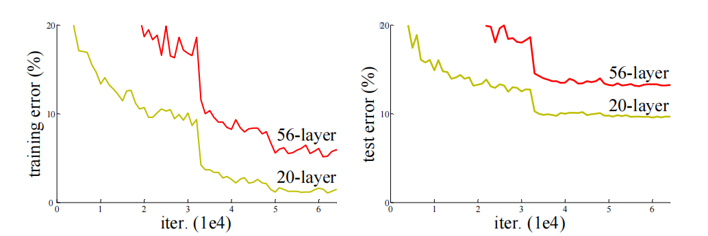
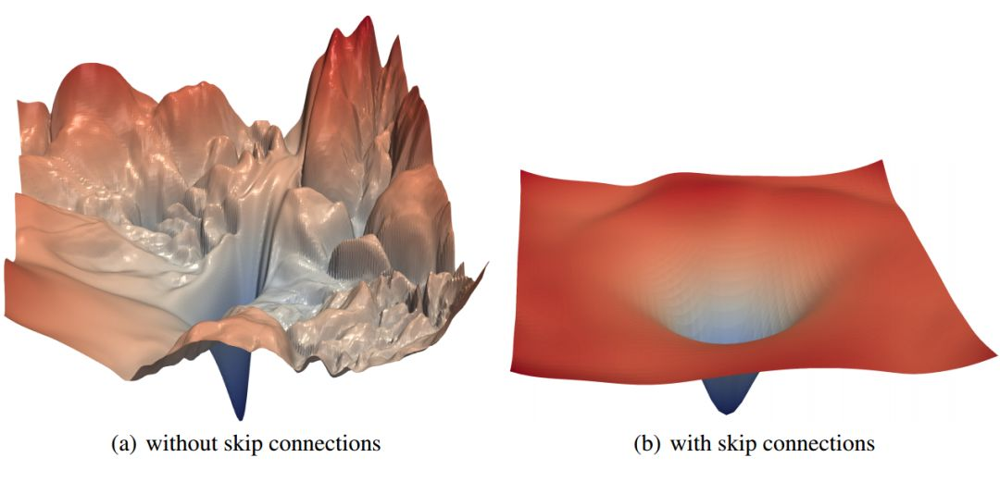
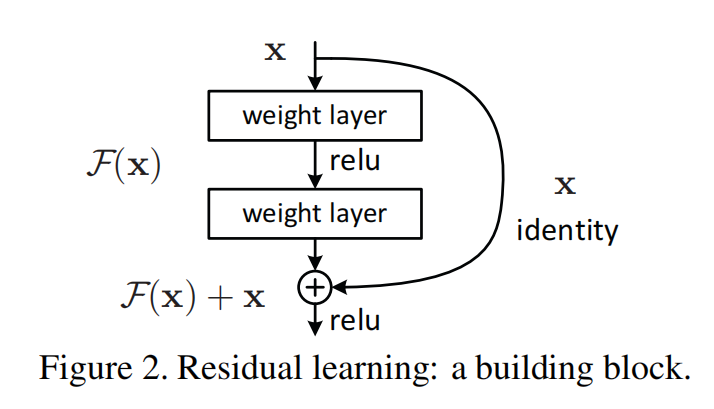
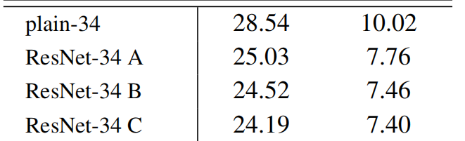
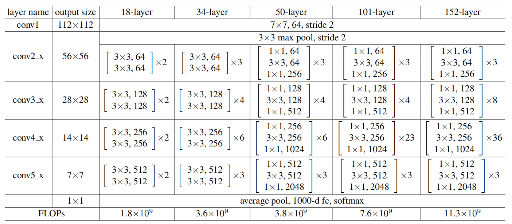
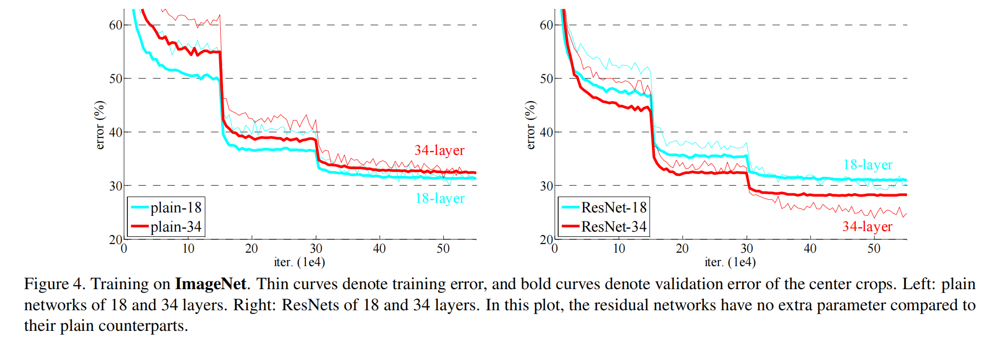
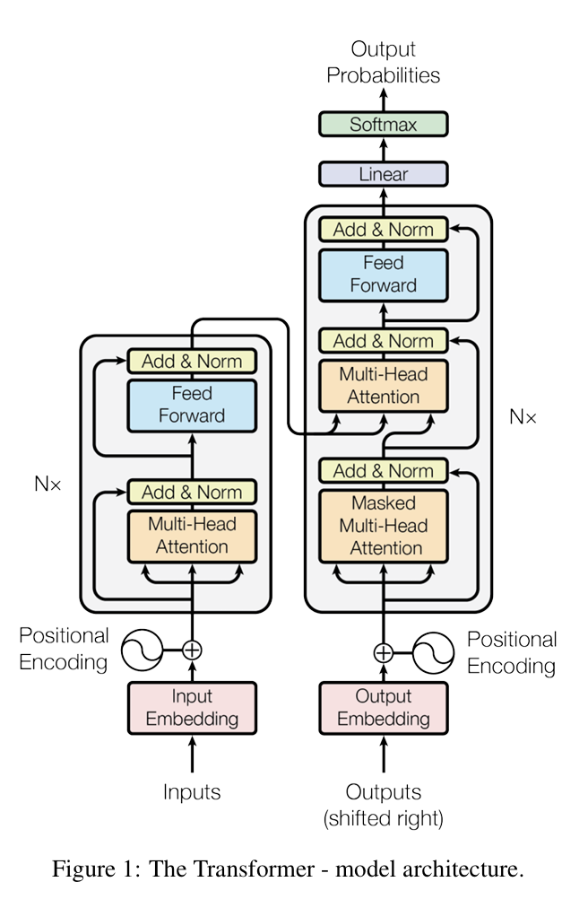

# ResNet学习总结

- 主题论文：**Deep Residual Learning for Image Recognition（ResNet）**

---

1. **为什么网络更深以后，效果反而会变差？**
2. **残差连接到底解决了什么问题？**
3. **ResNet 为什么会成为后来深度视觉模型的基础模块？**

---

## 一、核心问题：深层网络为什么会退化

### 1. 更深不等于更好

直觉上，如果浅层网络有效，那么在它上面继续堆更多层，模型表达能力应该更强，而且一个深层网络至少可以把新增层学成恒等映射（f(x) = x)，即输入等于输出），从而退化回浅层网络，性能至少不该更差。
但论文指出：**当网络深度增加时，准确率会先饱和，然后继续恶化**。更关键的是，这种恶化并**不是过拟合**导致的，因为它连**训练误差都变高了**。

#### 2.深层网络退化问题



深层网络在训练过程中，随着层数增加，出现了训练误差和验证误差都变高的现象，这就是“退化问题”。

### 3. 退化问题并不是简单的梯度消失问题

论文中特别强调，在合适的初始化和 Batch Normalization 的帮助下，几十层网络已经可以正常收敛（而非train不动）。因此，ResNet 真正要解决的重点是：

- **优化器难以在深层普通网络中逼近“本应存在的恒等解”（连原本的信息都被丢失了），换句话说，问题不在于解不存在，而在于这个解很难被找到**

普通串行前馈网络的结构范式，从根本上把「维持模型性能的恒等映射最优解」，转化成了高维非凸损失空间中**一个极度脆弱、无收敛吸引性、优化难度极高的孤立鞍点**，我们可以想象，深层网络的优化路径是一座由庞大参数堆叠的无比崎岖的山路，稍微一点偏离都会造成巨大的偏差，使得优化器找到维持模型性能的恒等映射（原有信息）最优解的难度巨大



### 4. 一个关键推理

如果把一个浅层网络复制到更深网络里，并把新增层学成 **identity mapping（恒等映射）**，那么更深模型理论上至少不该比浅层模型更差。
但现实是，普通堆叠网络很难靠 SGD 自动学出这种“近似恒等”的解。

这说明问题不在于“解不存在”，而在于**优化难**。

---

## 二、ResNet 的核心思想：学习残差，而不是直接学习目标映射

### 1. 从 H(x) 改写为 F(x) + x

论文将原本希望学习的映射（这个残差块**最终要学习的理想完整映射**）记作：

```text
H(x)
```

ResNet 不让网络直接去拟合 `H(x)`，而是改成学习“需要改动的那一部分”：

```text
F(x) = H(x) - x
```

于是最终输出就变成：

```text
H(x) = F(x) + x
```

这里的x是残差块的输入特征（来自上一层的输出），而F(x)则是残差分支要学习的映射，我们称之为 **残差函数** ，也是公式里唯一需要网络学习的部分

其中「残差」的本意就是**目标映射与恒等映射的差值**，对比普通神经网络学习的H(x)，每一层的网络需要从头到尾学习包括原有信息进行一次从头到尾的更新，而resnet需要学习更新的部分只有H(x)与x(原有部分)的差值，即只需要学习网络更新的部分而不无需再从头到尾去构建保持原有部分的信息，而原有部分的信息x则通过shortcut进行恒等映射直接与更新的信息进行合并而保持原有的信息，保证深层网络至少不比浅层网络差

这就是“残差学习（Residual Learning）”。



### 2. shortcut 到底解决了什么问题？

**shortcut（残差连接）**不是为了“增加参数量”，也不是为了“额外增强表达能力”。它最核心的作用是：

> **为信息与梯度提供一条近似无障碍的直达路径，使更深网络不必在每一层都重新编码已有信息。**

它解决了深层网络优化中的两个关键难题：

- **梯度消失/梯度爆炸**：在传统深层网络中，梯度在反向传播时会逐层缩小或放大，导致前层参数难以有效更新。shortcut 让梯度可以直接传递到前层，极大缓解了梯度消失和梯度爆炸。
- **信息保留**：shortcut 让输入 x 直接跨过若干层，保留了原始信息，使网络只需学习“增量修正，即更新的部分”，而不是完全重构输入，防止信息伴随着网络层次的加深而丢失，也解决了深层网络恒等映射难以学习的问题，解决了退化问题。

这个 shortcut 在最基本的形式下是**恒等映射**，没有额外参数，也几乎不增加计算量，也不会在参数更新阶段对shortcut进行参数更新。
这也是 ResNet 非常优雅的地方：**结构变化很小，但训练性质被显著改善**。

### 3. ResNet 如何解决梯度消失和梯度爆炸

在传统网络中，梯度在反向传播时会因多层非线性变换而逐渐消失或爆炸。ResNet 的 shortcut 结构允许梯度直接通过恒等映射传递，使得梯度可以无衰减地到达前层。

数学上，假设某层输出为 $y = F(x) + x$，则反向传播时梯度对 x 的导数为 $\frac{\partial y}{\partial x} = \frac{\partial F(x)}{\partial x} + 1$，可以看到梯度中出现了1，恒等映射保证了梯度不会消失。

### 4. 为什么学习残差对于模型而言更容易

如果最优映射本来就接近恒等映射，那么让网络去学一个接近 0 的残差 `F(x)`，通常比直接用很多非线性层去拟合 `H(x)=x` 更容易。

在很多任务里，前面层已经提取到相当有用的边缘、纹理、局部结构等特征。后续层未必需要全部推翻重来，而更像是在已有表示上做：

- 加一点语义修正
- 调整某些通道响应
- 抑制噪声特征
- 强化有效模式

也就是：

> **学习一个相对输入的小变化，而不是重新发明整套表示。**

这和数值优化中的“增量更新”思想是非常接近的。

换句话说：

- **普通网络**：每一层都要“从头造一个新变换”
- **残差网络**：先保留输入，再只学习“需要修正的部分”

这种改写降低了优化难度，让深层网络更容易训练。

---

## 三、如何理解“残差块”

一个典型残差块可以理解成：

1. 主分支：若干卷积层负责提取和变换特征，得到 `F(x)`
2. 快捷分支：直接把输入 `x` 传过去
3. 融合：做逐元素相加，得到输出

从功能上看，残差块表达的是：

- 保留已有信息
- 只对新信息做增量更新

这类思想后来影响极大，不仅在 CNN 中普及，也影响了后续很多网络设计。

---

## 四、输入输出维度不一致时怎么办

残差相加要求输入和输出形状一致。
如果通道数变化、特征图尺寸变化，就不能直接相加。论文提出了两种主要处理方式：

### 方案 A：零填充（zero-padding）

直接保留 identity shortcut，不足的维度用 0 补齐（一般情况只在差异较小的情况使用，且零填充本身不能在特征图尺寸减少时进行尺寸的对称，需要依赖池化操作减少尺寸）

优点：**没有额外参数、几乎不增加计算量** ，省内存

缺点：新增出来的那些维度只是**形式上硬对齐特征图的空间宽高尺寸**，这些维度本身没有经过 shortcut 分支的残差学习，**没有做任何语义特征的对齐，**新加出来的通道却没有对应的直达信息路径，只能依赖主分支去学（语义上没对齐的部分），所以当通道变化较大、语义重组需求更强时，表达能力会受限

### 方案 B：投影（projection shortcut）

用 `1×1` 卷积对 shortcut 分支做线性投影，让维度对齐。

优点：**可学习、灵活** 。当尺寸或通道变化时，它可以把输入特征主动映射到目标维度，而不是被动补零，因此 shortcut 分支也能参与“如何对齐”和“如何保留信息”的学习，即相对于零填充无意义的填零，只做形式上的对齐，投影能够做到形式上，语义上的对齐。

缺点：增加参数、计算量和显存占用

着部分说明了 ResNet 并不是“任何地方都直接相加”，而是要先满足维度匹配。



上图是论文中A B C三种方案的对比，其中这三种方案分别是：

A:空间池化与零填充（无额外参数，性能稍差，适合极轻量化场景）

B:仅在尺寸不匹配时使用1*1投影（相对于C参数量增加少，性能接近最优，是工程上最常用的折中方案）

C：所有 shortcut 都用 1×1 卷积投影（参数量增加最多，性能最好，适合追求极致精度的场景）

### 方案 C：分组卷积与可学习投影

除了论文提出的两种方式，后续研究还引入了分组卷积和可学习投影，使残差连接更灵活地适应不同结构。

---

## 五、ResNet 的网络结构是怎么设计的



### 1. ImageNet 上的基础结构

论文给出了 18、34、50、101、152 层等多个版本。其中：

- **18 / 34 层**：主要用两层 `3×3` 卷积构成残差块
- **50 / 101 / 152 层**：使用 **bottleneck（瓶颈）结构**

### 2. 为什么要用 bottleneck

更深的网络如果还全部使用普通的双 `3×3` 结构，参数量，计算量会明显增加。实际上非 bottleneck 的更深 ResNet 也能从深度中获益，只是没有 bottleneck 经济，于是论文采用三层结构：

- `1×1` 卷积：降维（降低通道数）
- `3×3` 卷积：特征提取 （把最贵的 3×3 卷积放到**较小通道数**上进行特征提取）
- `1×1` 卷积：升维

这种设计既能保持表达能力，又能控制计算量，可以看到34层与50层的复杂度是相近的，在几乎相近的复杂度下，把网络做得更深，是深层 ResNet 可以做到 50、101、152 层的关键。

bottleneck当中使用降维的方式来减少特征提取步骤的参数量与计算量，其中相比base版本，对比第一个参数块，为什么要将初始的64通道提升到256通道，因为更高的维度代表了更强更深的表示能力，而伴随着网络加深，需要更强的特征容量来提取更高语义的特征，因此对于更深层网络而言，更高维通道数是必要的

总而言之，bottleneck最重要的贡献是瓶颈压缩，通过降维节省更深层网络的计算量，参数量

### 3. 验证结果

论文中特别强调：

- **152 层 ResNet**
- 深度远大于 VGG
- 但复杂度仍低于 VGG-16/19

这说明 ResNet 的价值不只是“更深”，还在于**深得有效、深得经济**。



---

上图是使用resnet架构前后浅层网络与深层网络的训练与测试误差对比，细曲线表示训练误差，粗曲线表示验证误差，可以看到训练误差比验证误差是要更高的，这是因为在训练阶段作者使用了大量的数据增强，使得训练误差是相对较高的，而在测试的时候没有使用数据增强，噪音比较低，所以误差低于训练误差。

同时我们可以注意到模型在迭代的过程中，误差进行了两次变化较大比较明显的下降，这是因为在那两个位置进行了学习率下降调整，改变了训练的步幅以增强模型的收敛。符合前期用大学习率快速接近最优解，后期调小学习率精细收敛，避免在最优解附近震荡，从而让误差出现明显的断崖式下降的训练思路。

## 六、结论与resnet的贡献

ResNet（残差网络）是深度学习发展史上的里程碑式成果，它通过**残差连接（跳跃连接）与残差学习**的核心思想，从根本上解决了深层神经网络的训练瓶颈，重塑了整个深度学习的设计范式，为当前人工智能各领域的爆发奠定了关键基础。

### 1. 对人工智能整体的核心贡献

* **破解了深层网络的核心训练难题** ：ResNet彻底解决了传统深层网络的**梯度消失/爆炸**和**网络退化**问题，打破了“网络层数越深、性能反而越差”的魔咒，首次将神经网络的有效训练深度从几十层推到上千层，从本质上**提升了深度模型的表达能力上限**。
* **重构了深度学习的核心设计逻辑** ：提出“**学习残差而非完整映射**”的核心思想，让网络只需拟合输入与输出的差值，大幅降低了深层模型的优化难度；同时残差连接不引入额外参数、不增加计算量，用极简的设计实现了性能的飞跃，成为后续几乎所有主流深度模型的标准设计原则。
* **验证了深度学习的性能天花板** ：在ImageNet图像分类任务中，ResNet首次将识别错误率降至3.57%，超越了人类视觉的识别水平（约5.1%），向行业证明了深度学习的巨大潜力，直接推动了AI技术从实验室研究走向大规模产业落地。

### 2. 对人工智能各细分领域的具体贡献

#### 对Transformer架构：核心基础组件的关键支撑

Transformer能成为当前AI的通用基础架构，离不开ResNet核心思想的底层赋能：

* **Transformer的标准核心配置** ：2017年提出的Transformer，直接将ResNet的残差连接嵌入到Encoder和Decoder的每一个子层（多头自注意力、前馈网络FFN）之后，形成了“子层变换+残差连接+层归一化”的经典结构，这是Transformer能够稳定堆叠多层、实现有效训练的核心前提。
* **突破了Transformer的深度限制** ：原始Transformer仅堆叠了6层Encoder+6层Decoder，而残差连接为梯度提供了“直通高速公路”，让后续的Transformer变体能够**稳定堆叠上百层甚至上千层**，大幅提升了模型的表达能力，为Transformer从NLP领域扩展到CV、多模态等全领域奠定了基础。

下图是transformer的基本架构，我们可以看到左侧的解码器和右侧的编码器都用到了残差连接的结构



#### 对大语言模型（LLM）领域：规模化发展的底层基石

当前所有主流大语言模型的发展，都建立在ResNet的核心设计之上：

* **支撑了LLM的规模化扩张** ：GPT系列、LLaMA、文心一言等所有主流LLM，均基于**深层Transformer架构**，残差连接是这些模型能够堆叠数十层、上百层，参数量从百亿级扩展到万亿级的核心保障——没有残差连接解决的梯度消失问题，超深的大语言模型根本无法完成有效训练。
* **保障了LLM的长文本信息完整性** ：残差连接**让浅层的词嵌入、基础语义特征能够直接传递到模型深层**，避免了长序列、深层网络中的信息丢失，大幅提升了LLM对长文本的理解和生成能力，也为模型上下文窗口的持续扩大提供了结构支撑。

---

## 七、总结

关于resnet的学习要点，我们需要掌握的主要有两个点：

- 残差学习

  核心是让网络层拟合输入 x 到输出的残差映射 F (x)=H (x)-x，换句话说就是只学习完整特征映射与原映射之间的差异，**即只需要学习更新的部分，而非直接学习完整的 H (x)**，学习目标转化为输入与输出的差值

  从目标设计上大幅降低深层网络的拟合难度，解决了“深层网络难以拟合恒等映射”的核心痛点 —— 当网络达到最优性能时，残差映射可轻松拟合为 0，让多余的层退化为恒等映射，从根源避免了网络层数加深带来的性能退化问题
- 残差连接（shortcut）

  实现残差学习的核心结构载体，是一条绕过网络主变换层的**无参数直通通路，将输入 x 直接传递到主层输出端**，与主层拟合的残差 F (x) 逐元素相加，构成完整残差块

  一是为梯度反向传播提供无衰减的直通路径，彻底缓解深层网络的梯度消失 / 爆炸问题，保障超深网络的可训练性；二是完整**保留浅层原始特征**，避免特征在深层网络的逐层传递中丢失或畸变，同时为残差学习提供稳定的恒等映射基准

实际上就论文而言，resnet所解决的问题重点并不在于梯度消失/梯度爆炸的问题，而是退化问题。而残差学习和残差连接各司其职，残差学习将层的学习目标从拟合完整映射转为拟合残差，使得模型可以轻松拟合为0，让深层网络至少可以拟合恒等映射，保证深层网络的性能至少能不比浅层网络差，而shortcut提供的无参数的恒等映射直通通路，保留的信息奠定了残差学习得以学习残差，而非从头到尾学习完整特征的基础。两者相辅相成，使得模型最终实现能够训练出层次更深，性能更好的神经网络

从这个角度看，ResNet 的贡献可以概括为一句话：

> **它不是单纯把网络变深了，而是第一次让“把网络安全地变深”成为可能。**
