# YOLO v1

## Network Structure

### overview

- 逻辑：仅使用一个卷积神经网络来端到端地检测目标（not two-stage）

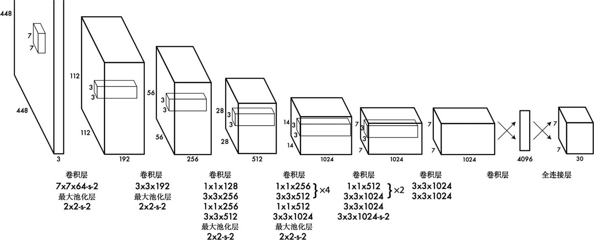

- 遗风：图像分类网络都会将特征图展平(flatten)，得到一个一维特征向量，然后连接全连接层去做
- 预测。（如图）
- 容易计算从特征图被展平，再到连接4096的全连接层时过程的参数量：
- $7 \times 7 \times 1024 \times 4096 + 4096 \approx 2 \times 10^8$
- YOLOv1这一缺陷是致命的（后续的改进便是优化该层网络结构）

### how to realize detection

- 综述：将输入图像划分成7 × 7的网格，然后在网格上做预测。（DL works on CV because of CNN）

### 概览YOLO

- 一张RGB图像输入网络经过一系列的卷积和池化操作后，得到一个经过64倍降采样的 feature map
- （获取高级特征）
- 将其展平为一个一维的特征向量，再由若干全连接层处理，最后做一些必要的维度转换操作，得到
- 输出张量 $Y \in \mathbb{R}^{7\times7\times30}$（可以理解为 information map 或者 meta map） （处理特征获取信息）

### 获取特征

- 将 $H \times W$ 的原始图像 处理为 被降采样的 feature map（$F \in \mathbb{R}^{H_o\times W_o\times C_o}$）。
- 存在： （可带大家数一下图中数字）（明确自变量与因变量）（为什么是这些数，炼丹调出来的）
- $H_o = \frac{H}{stride}$ ， $W_o = \frac{W}{stride}$

### 获取信息

- 为什么要展开
- 展开实际上是为了方便计算与处理，因为展开后还要还原shape，本质上是从feature map直接
  获取 information map （具体如何设计获取，我不知道。根据每个grid的特征来预测该grid是
  是否有目标的中心点坐标，以及相应的目标类别。）
- 我们将输出的information map 看作一个 $7 \times 7 \times 30$ 的立方体，而 $7 \times 7$ 可视作将原图像划作成49个网格（grid）

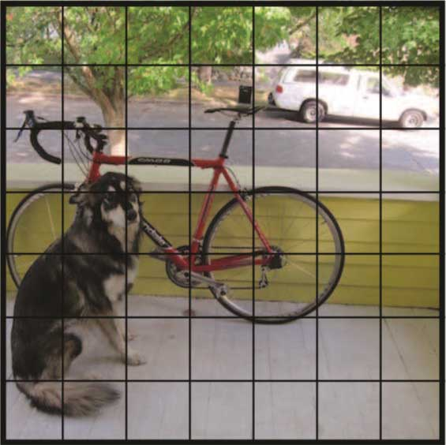

- 每一个网格对应了一个维度为 30 的向量，该向量包含了 两个预测边界框的置信度与位置参数 以
- 及 目标检测类别的 one-hat 表示 （20是因为使用的是VOC数据集）

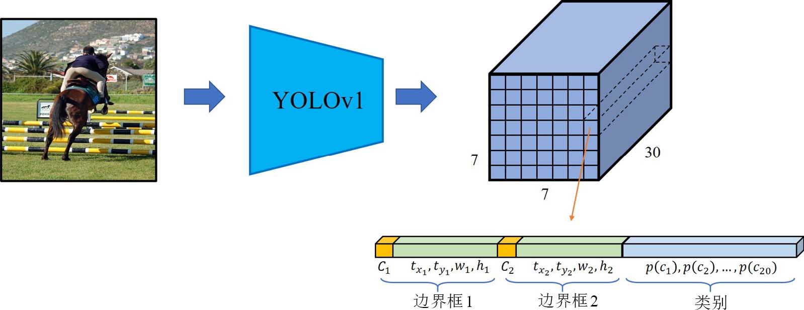

- 其中每一个边界框都包括一个置信度 C(confidence)、边界框位置(tx, ty, w, h)参数，表示边界框的
  中心点相较于网格左上角点的偏移量(tx, ty)以及边界框的宽和高(w, h)
- 因此，我们可以使用 $5B + N_c$ 来计算输出张量的通道数该是多少
- 、、、、其实YOLOv1的这一检测理念也是从Faster R-CNN中的区域候选网络 (region proposal
  network，RPN) 继承来的，只不过，Faster R-CNN只用于确定每个网格里是否有目标，不关心目标类
- 别，而YOLOv1则进一步将目标分类也整合进来，使得定位和分类一步到位，从而进一步发展了
  "anchor-based"的思想。

### recap

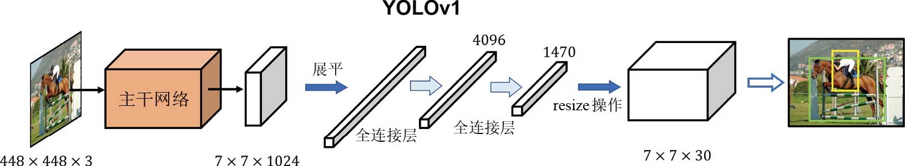

## Detection Principle

### 边界框

- 参数（C, tx, ty, w, h） 的学习

### 逻辑概览

- YOLOv1是通过检测图像中的目标中心点来实现检测目标，即只有包含目标中心点的网格才会被认为是
  有物体的。
- $Pr(objectness) = 1$ 代表此网格有物体
- $Pr(objectness) = 0$ 代表此网格无物体
- 物体在哪个网格，就由该网格去拟合（学习）边界框。
- 该网格内所要预测的边界框，其置信度会尽可能接近1。
- 有物体的网格会被标记为正样本候选区域
- 在训练过程中，训练的正样本(positive sample)只会从此网格处的预测中得到，而其他区域的预测
  都是该目标的负样本（置信度接近0）。

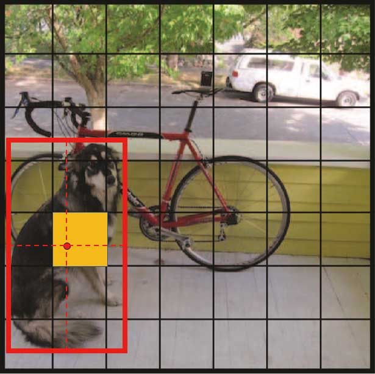

### 目标中心点坐标

- 类似于残差思想，在每个grid的 baseline 上，学习相对于所在网格的偏移量（容易学习。边界框，目
  标点与所在网格联系密切）
- 首先，对于给定的边界框，其左上角点坐标记作 $(x_1, y_1)$，右下角点坐标记作 $(x_2, y_2)$，显然，边界框的宽和高分别是 $x_2-x_1$ 和 $y_2-y_1$。随后，我们计算边界框的中心点坐标 $(c_x, c_y)$：

$$
c_x = \frac{x_1 + x_2}{2}
$$
$$
c_y = \frac{y_1 + y_2}{2}
$$

接着，我们计算边界框的宽 $w$ 和高 $h$：
$$
w = x_2 - x_1
$$
$$
h = y_2 - y_1
$$

最后，我们将中心点坐标 $(c_x, c_y)$ 以及宽 $w$ 和高 $h$ 组合起来，便得到了边界框的参数表示 $(c_x, c_y, w, h)$。
- 。这种表示方法在目标检测中非常常见，因为它能够更直观地描述边界框的位置和大小。
- 通常，中心点坐标不会恰好是一个整数，而网格的坐标又显然是离散的整数值。假定用网格的左上角点
  的坐标来表示该网格的位置，那么，就需要对中心点坐标做一个向下取整的操作来得到该中心点所在的
  网格坐标 (gridx, gridy)：
- $grid_x = \left\lfloor \frac{c_x}{stride} \right\rfloor$
- $grid_y = \left\lfloor \frac{c_y}{stride} \right\rfloor$

### 相对偏移量

- $t_x = \frac{c_x}{stride} - grid_x$
- $t_y = \frac{c_y}{stride} - grid_y$
- 视作训练标签（容易学习）
- 为避免不必要的歧义，我们将其换成 tx、ty。显然，两个偏移量 tx、ty 的值域都是 [0, 1)。在训练过程
  中，计算出的 tx、ty 就将作为此网格处的正样本的学习标签。下面的图示直观地展示了YOLOv1中的中
  心点偏移量的概念。
- 在推理阶段，YOLOv1先用预测的边界框置信度来找出包含目标中心点的网格，再通过这一网格所预测
  出的中心点偏移量得到最终的中心点坐标，计算方法很简单，只需将相对偏移量做逆运算：
- $c_x = (grid_x + t_x) \times stride$
- $c_y = (grid_y + t_y) \times stride$

### 图示：

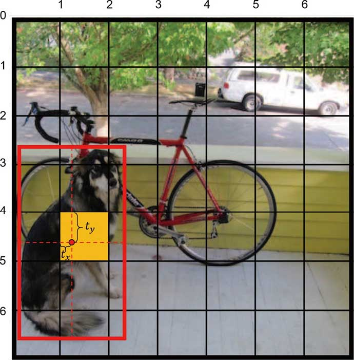

### 边界框的确定：宽与高

- 我们当然可以直接将目标的真实边界框的宽和高作为学习标签。不过一般进行normalization会更好，
- 也会避免一些问题的发生（我不知道）
- $\bar{w} = \frac{w}{W}$
- $\bar{h} = \frac{h}{H}$

### 置信度的学习（范式：二元对立 --> 概率表示）(one-stage 的关键)

- 只有确定了中心点所在的网格坐标 (gridx, gridy)，才能去计算边界框的中心点坐标 (cx, cy) 和大小
- (w, h)。 我们已经知道，YOLOv1 的 S × S 网格中，只有包含了目标中心点的网格才是正样本候选区
- 域，因此，一个训练好的 YOLOv1 检测器就应该在包含目标中心点的网格所预测的 B 个边界框中，其
  中至少有一个边界框的置信度会很高，接近于 1，以表明它检测到了此处的目标。
- 如何给置信度的标签赋值呢？一个很简单的想法是，将有目标中心点的网格处的边界框置信度的学习标
  签设置为1，反之为0，这是一个典型的"二分类"思想，正如Faster-RCNN中的RPN所做的那样。
- YOLOv1希望边界框的置信度能表征所预测的边界框的定位精度。因为边界框不仅要表征有无物体，它
  自身也要去定位物体，所以定位得是否准确同样是至关重要的。而对于边界框的定位精度，通常使用交
  并比(intersection of union，IoU)来衡量。
- IoU: 分别计算出两个矩形框的交集(intersection)和并集(union)，它们的比值即为IoU。显然，IoU
  是一个0～1的数，且IoU越接近1，表明两个矩形框的重合度越高。

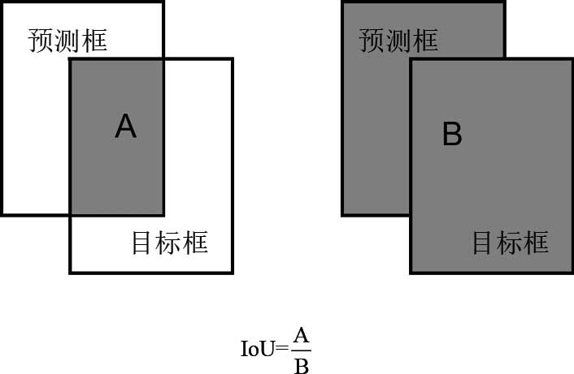

- 既如此，不妨直接将 IuO 作为置信度的学习标签 😋😋😋

### 置信度的训练

- 只需关注那些有目标中心点的网格，即正样本候选区域

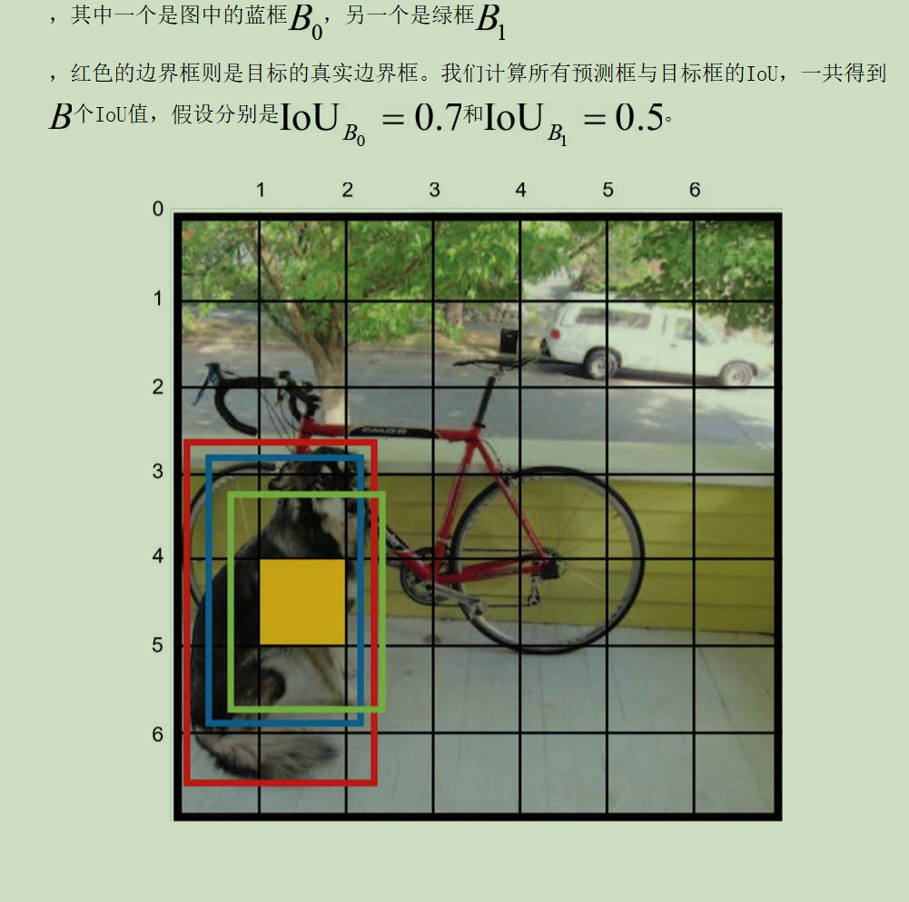

- 仅保留IoU 较大的预测框，让其拟合（学习）目标框， 对于其他预测框将其置信度标签改为0，视作负
- 样本， 和其他网格的预测框一样， 仅计算一次RoU , 不在参与后续的参数拟合（学习）
- 可以看到，一个正样本的标记是由预测本身决定的，即我们是直接构建预测框与目标框之间的关联，而
- 没有借助某种先验。
- 后之视今，会发现YOLOv1一共蕴含了后来被着重发展的3个技术点：（我不知道，我抄的）

  1. 不使用先验框(anchor box)的anchor-free技术。 （关于先验，可以学习classification中朴素贝叶斯）
  2. 将IoU引入类别置信度中的IoU-aware技术
  3. 动态标签分配(dynamic label assignment)技术。

### 分类（类别置信度）

- 同边界框的学习一样，类别的学习也只考虑正样本网格，而不考虑其他不包含目标中心点的网格。
- ***而YOLOv1使用线性函数输出类别置信度预测，并用L2（有关范数，可以理解为最小二乘法）损失
- 来计算每个类别的损失
- but this time it did not continue the myth 🙊🙊🙊
- YOLOv1预测的类别置信度可能会是一个负数，同样，对于边界框的置信度和位置参数，YOLOv1也是
  采用线性函数来输出的 （后续改进点）

### summary

- 最后，我们总结一下YOLOv1的制作正样本的流程。对于一个给定的目标框，其左上角点坐标为 (x1, y1)
  ，右下角点坐标为 (x2, y2)，我们按照以下3个步骤来制作正样本和计算训练损失：
- (1) 计算目标框的中心点坐标 (cx, cy) 以及宽和高 (w, h)，然后计算中心点所在的网格坐标，从而确定正
  样本候选区域的位置；
- (2) 计算中心点偏移量 (tx, ty)，并对目标框的宽和高做归一化，得到归一化后的坐标 (w, h)；
- (3) 使用 one-hot 格式准备类别的学习标签。
- 而置信度的学习标签需要在训练过程中确定，步骤如下：
- (1) 计算中心点所在的网格的每一个预测框与目标框的 IoU；
- (2) 保留 IoU 最大的预测框，标记为正样本，将其设置为置信度的学习标签，然后计算边界框的置信度
  损失、位置参数损失以及类别置信度损失；
- (3) 对于其他预测框只计算置信度损失，且置信度的学习标签为 0。

## Loss Function

- 问题就来到了简单的最小二乘法（线性拟合） （不过是高维形式上） 🤗🤗🤗
- 对于one-hot格式的类别学习，通常会使用Softmax函数来处理网络的类别预测，得到每个类别的
  置信度，再配合交叉熵(cross entropy)函数去计算类别损失

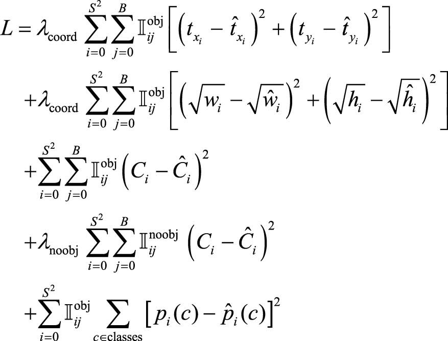

---

---

# YOLOv2

## overview

1. 使用新的网络结构
2. 引入由 Faster R-CNN 工作提出的先验框机制
3. 提出基于k均值聚类算法的先验框聚类算法
4. 采用新的边界框回归方法
5. …………

---

### 优化详解

#### 引入批量归一化(BN)层

关于BN ,参考：Batch Normalization Layer

**''卷积三件套''**

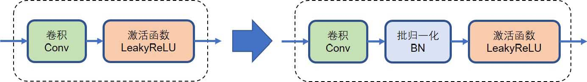

#### 高分辨率主干网络

预备知识：预训练（pretrain），微调（fine-tune）

v1中：先基于GoogLeNet的网络结构设计了合适的主干网络，并将其放到ImageNet数据集上进行一次预训练，随后，再将这一预训练的权重作为YOLOv1的主干网络的初始参数

问题：ImageNet 中 图像大小为 224 × 224， 而训练的 voc 中大小为 448 × 448

也就是原来的预训练后的参数不太好，会忽略很多细节特征

解决方案： 微调： 二次预训练 ，再使用 448 × 448 稍微训练几次

不过，后来被时代抛弃了， 大家可以想想为什么

---

### 先验框机制简介

（抄的）

先验框的意思其实就是在每个网格处都固定放置一些大小不同的边界框，通常情况下，所有网格处所放置的先验框都是相同的，以便后续的处理。

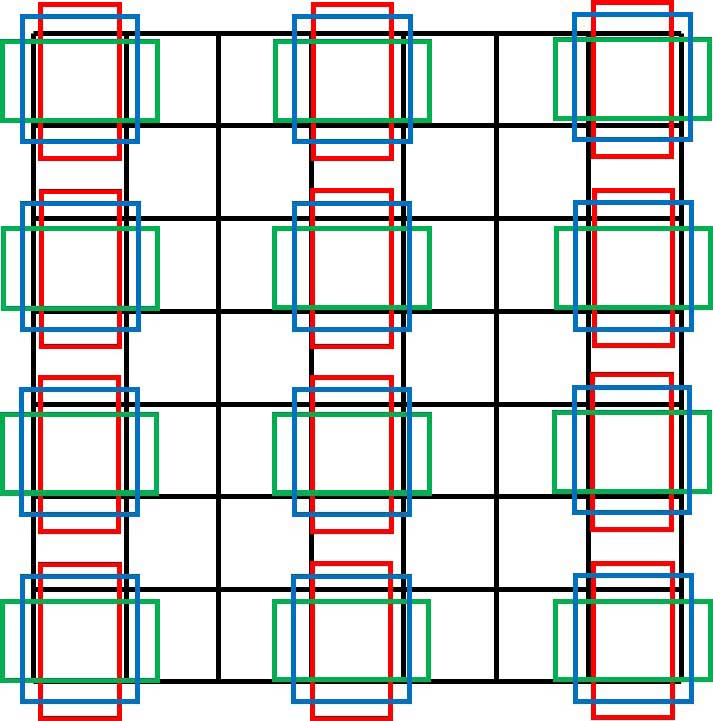

在RPN（FasterR −CNN）中，其目的是希望通过预设不同尺寸的先验框来帮助RPN更好地定位有物体的区域，从而生成更高质量的感兴趣区域(regionofinterest，RoI)，以提升RPN的召回率。事实上，RPN的检测思想其实和YOLOv1是相似的，都是"逐网格找物体"，区别在于，RPN只是找哪些网格有物体（只定位物体），不关注物体的类别，因为分类的任务属于第二阶段；而YOLOv1则是"既找也分类"，即找到物体的时候，也把它的类别确定下来。

每个网格都预先被放置了 K 个具有不同尺寸和不同宽高比的先验框（这些尺寸和大小依赖人工设计）。在推理阶段， FasterR −CNN的RPN 会为每一个先验框预测若干偏移量，包括中心点的偏移量、宽和高的偏移量，并用这些偏移量去调整每一个先验框，得到最终的边界框。由此可见，先验框的本质是提供边界框的尺寸先验，使用网络预测出来的偏移量在这些先验值上进行调整，从而得到最终的边界框尺寸。后来，使用先验框的目标检测网络被统一称为"anchor box based"方法，简称"anchor-based"方法。

既然有anchor-based，那么自然也会有 anchor-free，也就是不使用先验框的目标检测器。事实上，YOLOv1 就是一种anchor-free 检测器。

难点：怎么设计先验框的参数 （不过我们直接使用别人研究好的就行了 😋😋😋）

---

### 全卷积网络与先验框机制

我们提到了全连接层的弊端 见 YOLO v1

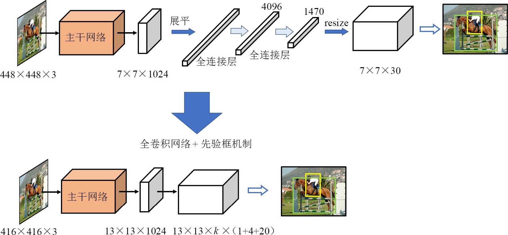

在推理阶段，网络只需要学习能够将先验框映射到目标框的尺寸的偏移量，无须再学习整个目标框的尺寸信息，这使得训练变得更加容易。

v1中每个网格只会预测1个类别的物体， 因为类别置信度是共享的

训练策略：依旧是从 K 个预测的边界框中选择出与目标框的 IoU 最大的边界框作为正样本，其表示有无物体的置信度标签还是最大的 IoU ，其余的边界框则是负样本。

这部分是可以检测更多物体的关键

---

### 使用新的主干网络

自研 "DarkNet-19"

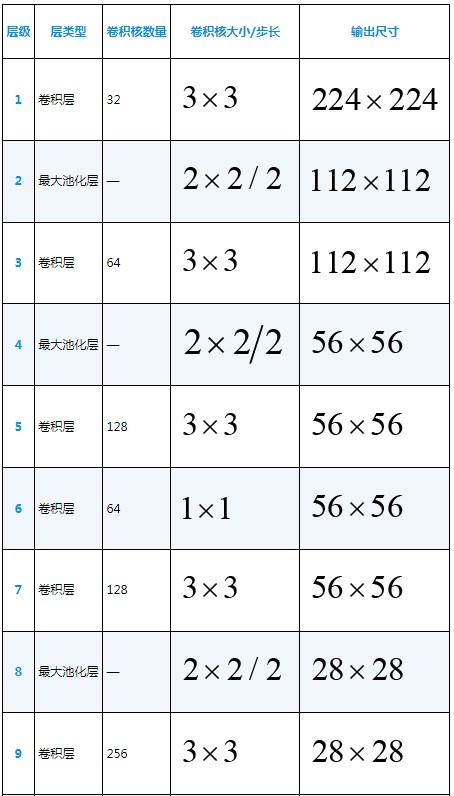

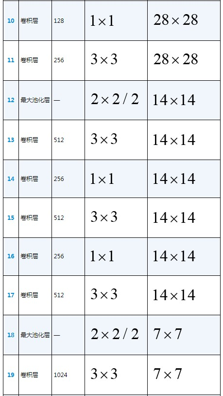

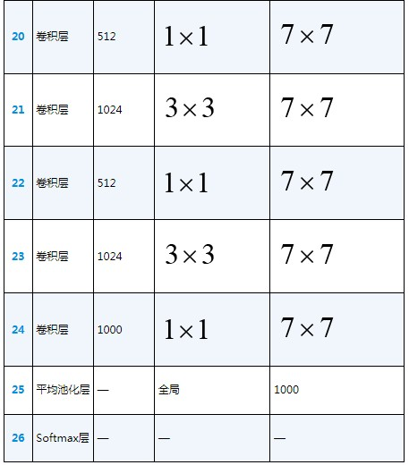

---

### 基于k均值聚类算法的先验框聚类

（我没有深入了解过）

核心：对于先验框参数的去人工化， 可以自动地从数据中获得合适的边界框尺寸

从VOC数据集中的所有边界框中聚类出 K 个先验框，

聚类的目标是数据集中所有边界框的宽和高，与类别无关。

为了能够实现这样的聚类，使用IoU作为聚类的衡量指标

从A数据集聚类出的先验框可能不适用于B数据集

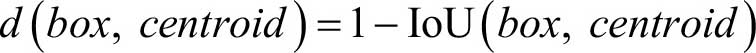

---

### 训练设计

1. 对于每一个边界框，YOLO仍旧去学习中心点偏移量 tx, ty
	- 我们知道，这个中心点偏移量是0～1范围内的数
	- v1中直接使用线性函数输出，模型很有可能会输出数值极大的中心点偏移量
	- 改进：使用Sigmoid函数将网络输出的中心点偏移量映射到0～1
2. 利用先验框，便不再学习目标框的宽高 (location  prediction)
	- 设某个先验框的宽和高分别是 Pw, Ph， 模型输出的宽与高的偏移量分别是 tw, th
	- 可使用以下公式计算边界框的中心点坐标 (cx, cy) 和 宽与高 bw, bh

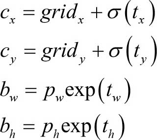

3. YOLOv2的先验框尺寸都是相对于网格尺度的，而非相对于输入图像，所以求解出来的数值也是相对于网格的。

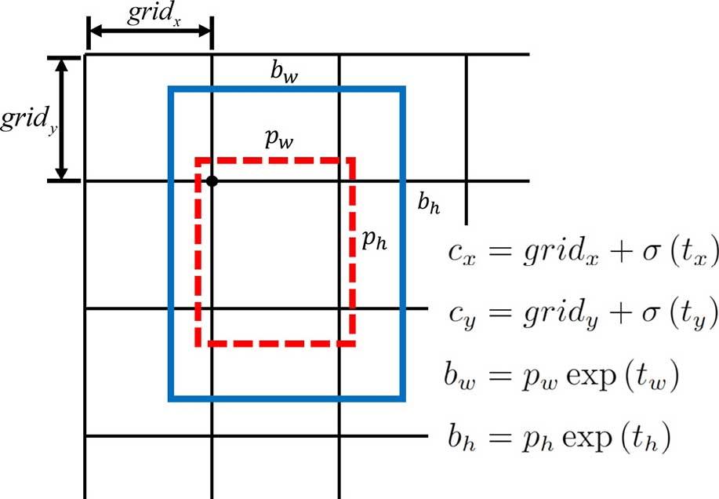

---

### 融合高分辨率特征图

借鉴于SSD

在SSD工作中，检测是在多张特征图上进行的。

不同的特征图的分辨率不同，越是浅层的特征图，越被较少地做降采样处理，因而分辨率就越高，所划分的网格就越精细，这显然有助于去提取更多的细节信息。

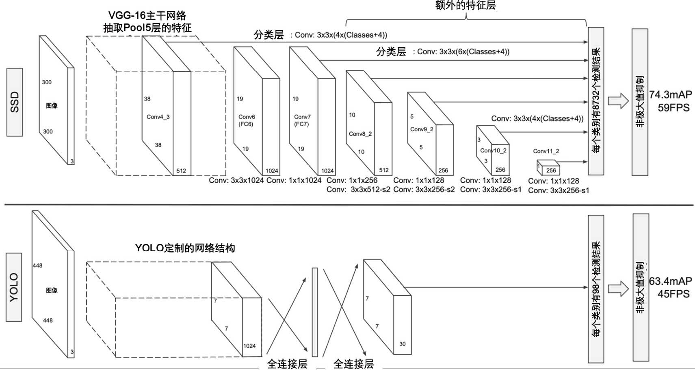

对最后输出的feature map 之前的feature map 在进行一次特殊的特征提取（通道翻四倍，信息量不变）

将这两个 feature map 进行通道维度上的拼接（融合特征）

YOLOv2 的 特殊提取 （我想说的就是没有想象的简单）

先使用1*1 卷积 压缩通道8倍（512--> 64）

再进行特殊的降采样操作使其变为特征图

………………

这里的特殊的降采样操作并不是常用的步长为2的池化或步长为2的卷积操作，而是***reorg不丢失信息的降采样操作：reorg

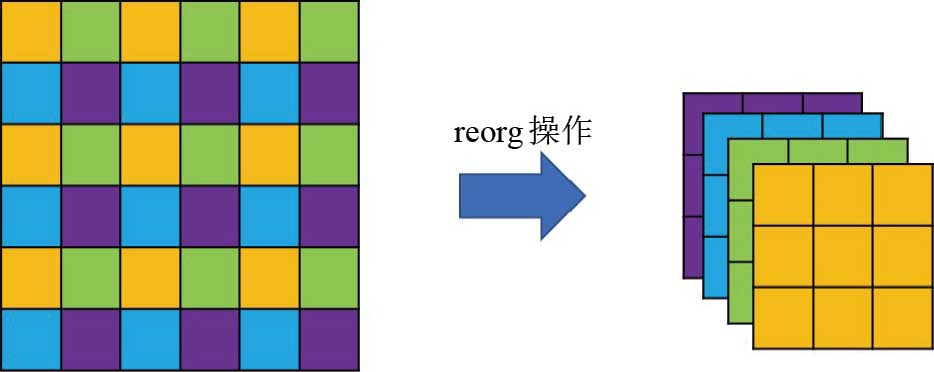

其空间尺寸会减半，而通道数则扩充至原来的4倍，因此，这种特殊降采样操作的好处就在于，降低分辨率的同时未丢失任何细节信息，即信息总量保持不变。

---

### 多尺度训练策略

图像处理操作：图像金字塔 （数据增强）

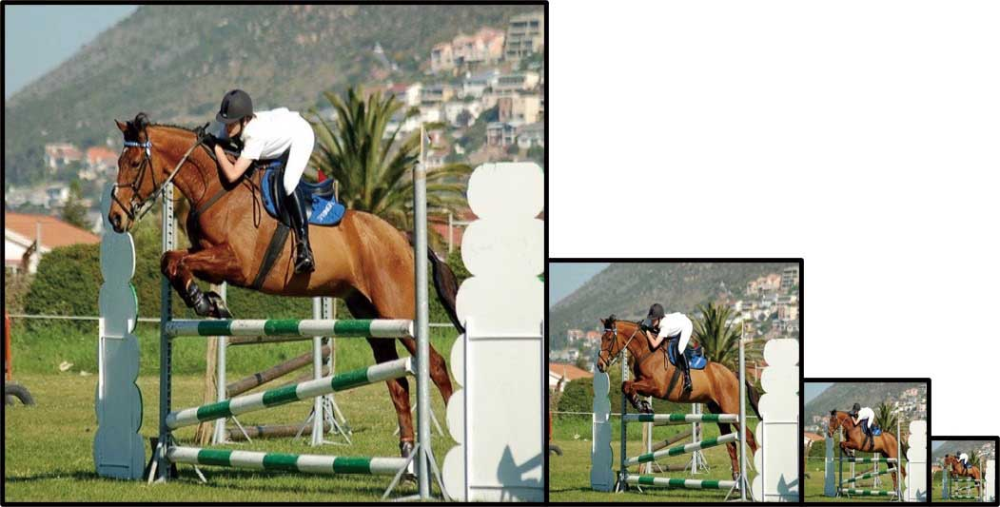

在越大的图像中，其外观越清晰，所包含的信息也就越丰富

其他小尺寸的图像中，细节纹理也相对变少

图像金字塔可以丰富各种尺度的物体数量。

由于数据集中的数据是固定的，因此各种大小的物体的数量也就固定了，但多尺度训练技巧可以通过将每张图像缩放到不同大小，使得其中的物体大小也随之变化，从而丰富了数据集各类尺度的物体，很多时候，数据层面的"丰富"都能够直接有效地提升算法的性能。

每迭代 10次，就从320、352、384、416、448、480、512、544、576、608中选择一个新的图像尺寸用作后续10次训练的图像尺寸。这些尺寸都是32的整数倍，因为网络的最大降采样倍数就是32。

多尺度训练是常用的提升模型性能的技巧之一。

使用了多尺度训练，且全卷积网络的结构可以处理任意大小的图像，那么YOLO 就可以使用不同尺度的图像去测试性能。

---

## summary

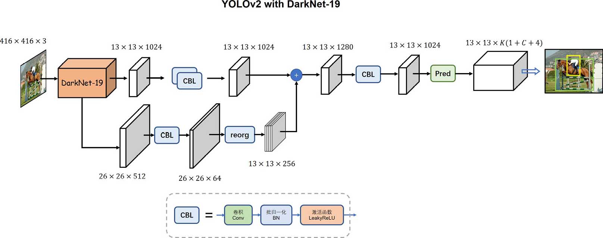

---

---

# YOLOv3

## overview

之前的版本：小目标检测的性能很差。因为只使用了最后那个经过32倍降采样的特征图（高度特征化，忽略局部细节）且最终的检测是在 7 × 7和13 × 13 这样粗糙的网络上进行（过于稀疏，难以捕捉小目标）

---

## What does V3 do

- 引入多级检测结构，弥补小目标的特征
- 使用了特征金字塔结构
- 设计了全新的主干网络 DarkNet-53  (思考，为什么反而更深了，这样不是与小目标检测相反吗)

### DarkNet-53

无需怀疑，这当然借鉴了由ResNet提出的残差连接结构。有趣的是，残差连接结构能够使小感受野的信息与大感受野的信息融合（一位南开教授分享的对ResNet有效性的另一种解释）

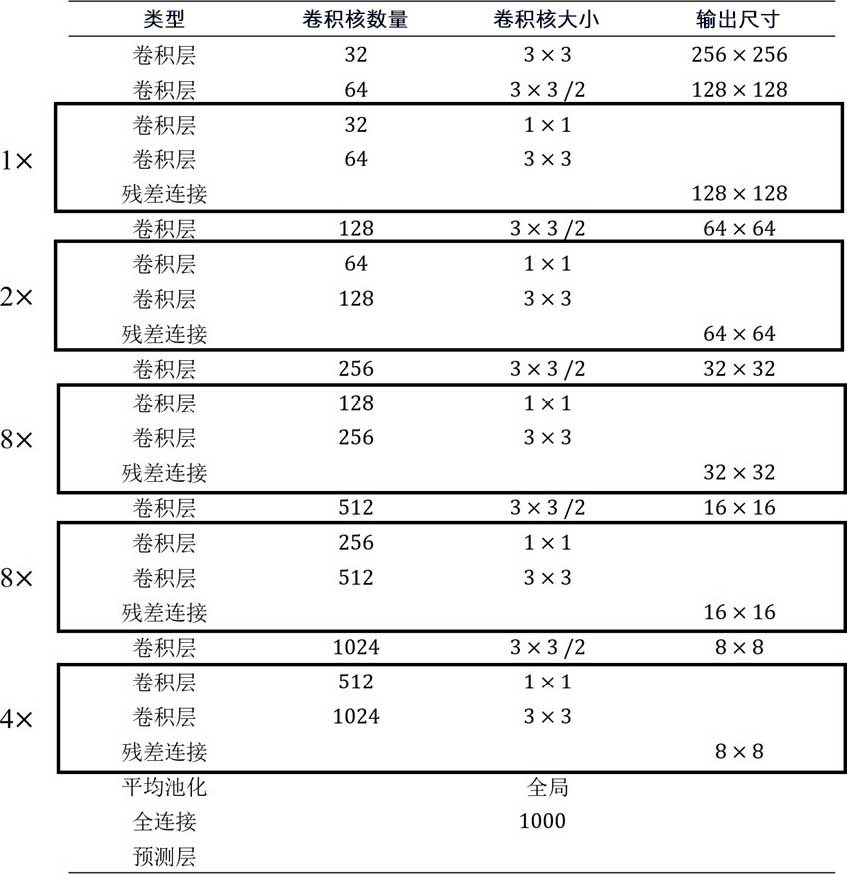

v3不再通过最大池化层实现降采样，而是由卷积层代劳（为什么）

DarkNet-53 的残差块与ResNet-50的残差块相比缺少了最后的一次 1 * 1 线性组合，结果也很好（为什么）

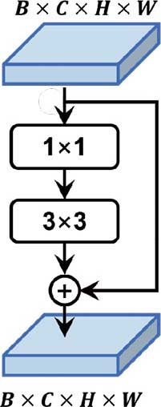

---

## 多级检测与特征金字塔结构

多级检测： 使用不同尺度大小的特征去共同检测物体

特征金字塔网络（FPN）：融合不同尺度的特征

理论指导 (应该了解理论的证明)

随着层数的加深和降采样操作的增多，网络的不同深度所输出的特征图理应包含了不同程度的空间信息（有利于定位）和语义信息（有利于分类）。

对于那些较浅的卷积层所输出的特征图，由于未被较多的卷积层处理，理应具有较浅的语义信息，但也因未被过多地降采样而具备较多的位置信息；

而深层的特征图则恰恰相反，经过了足够多的卷积层处理后，其语义信息被大大加强，而位置信息则因经过太多的降采样处理而丢失了，目标的细节信息被破坏，致使对小目标的检测表现较差，同时，随着层数变多，网络的感受野逐渐增大，网络对大目标的识别越来越充分，检测大目标的性能自然更好。

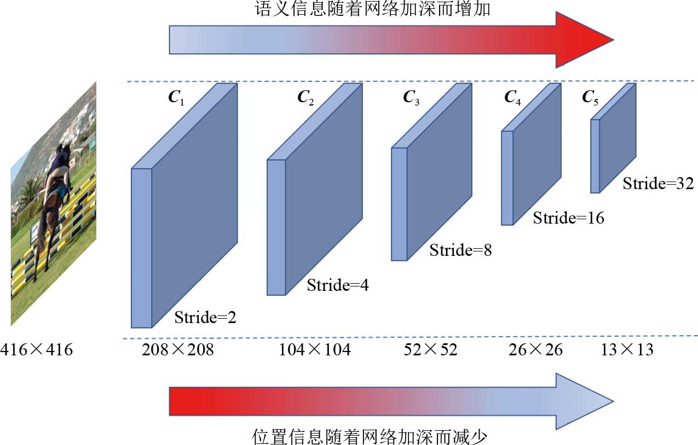

solution ：浅层特征负责检测较小的目标，深层特征负责检测较大的目标。

但是：浅层特征虽然保留了足够多的位置信息，但是其自身语义信息的层次较浅，可能对目标的认识和理解不够充分。

solution： "自顶向下"(top-down)的特征融合结构（FPN）：利用空间上采样的操作不断地将深层特征的较高级语义信息融合到浅层特征中

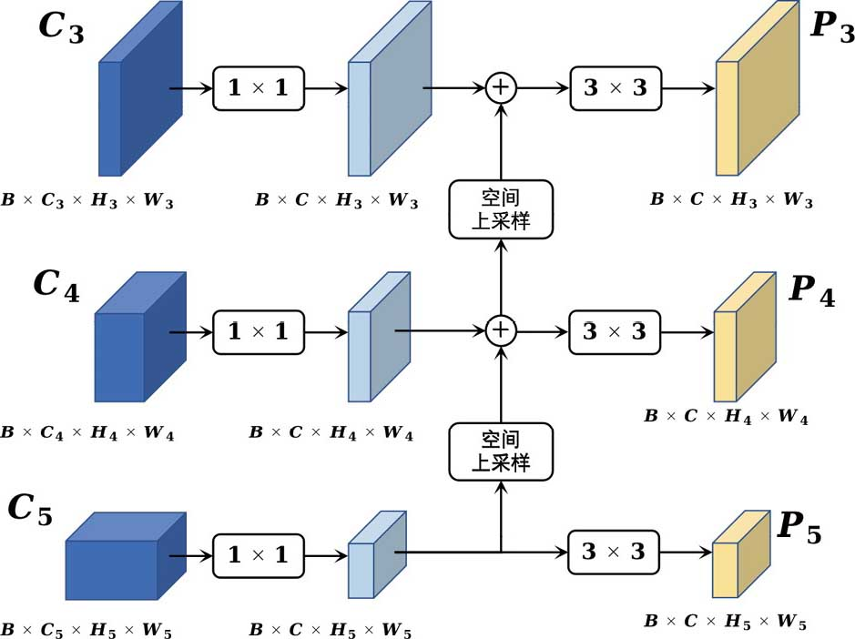

一般选取三个尺度的feature map， 降采样倍数分别为8、16和32（如上图）

对于这三个尺度的特征图，FPN首先使用3个1×1线性卷积将每个特征图的通道数都压缩到256，接着，FPN对深层的特征图做空间上采样操作，与浅层的特征图进行融合，以此类推，直至完成全部融合操作。最后，每个特征图再由3×3线性卷积做一次处理。（如上图）

### V3的具体设计

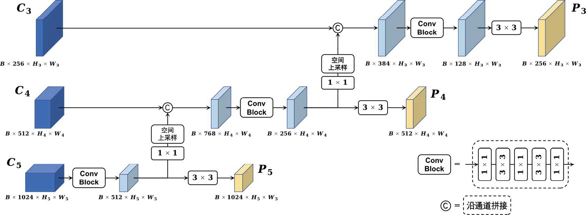

在这样的多级检测框架下，YOLOv3在每个网格处放置3个先验框。由于YOLOv3共使用三个尺度的特征图，因此需要使用k均值聚类方法来得到9个先验框的尺寸：

分别是 (10, 13)、(16, 30)、(33, 23)、(30, 61)、(62, 45)、(59, 119)、(116, 90)、(156, 198) 以及 (373, 326)。

YOLOv3 将这 9 个先验框均分到 3 个尺度的特征图上：

- 对于 C3 特征图，每个网格处放置 (10, 13)、(16, 30) 和 (33, 23) 3 个先验框，用于检测较小的物体；
- 对于 C4 特征图，每个网格处放置 (30, 61)、(62, 45) 和 (59, 119) 3 个先验框，用于检测中等大小的物体；
- 对于 C5 特征图，每个网格处放置 (116, 90)、(156, 198) 和 (373, 326) ，用于检测较大的物体。

依据YOLOv3的论文，作者团队也汇报了一些没有成功的尝试，比如使用类似RetinaNet的双阈值筛选正样本和Focal loss。二者均没有给YOLOv3带来性能上的提升，尤其是Focal loss，一个本该能很好地缓解one-stage框架中天然存在的正负样本比例严重失衡问题的损失函数，却并没有在YOLOv3上起到促进作用。作者团队也对此表示奇怪，并认为可能是自己的操作有误，使得Focal loss没有发挥出应有的功效。

---

## 框架summary

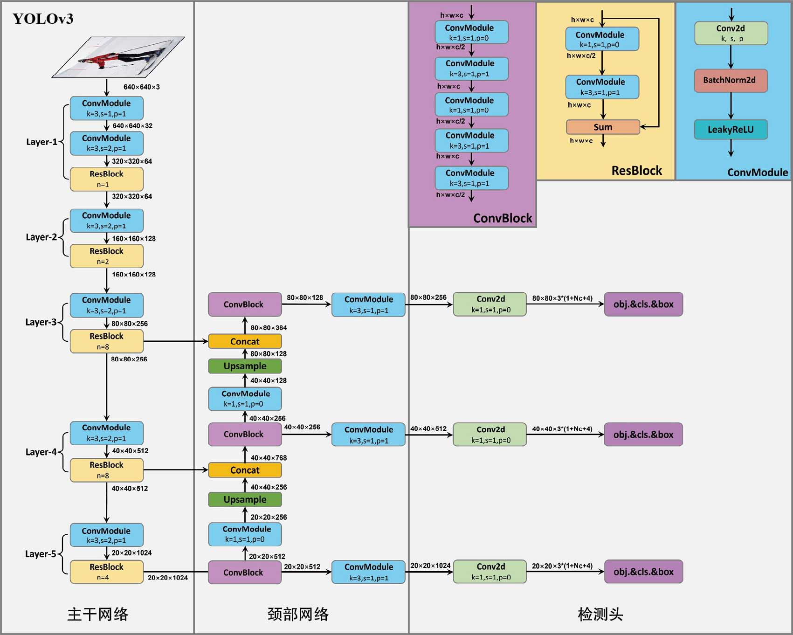

---

## loss function

bounding box 置信度： MSE → binary cross entropy

### 看似退化的地方：

- YOLOv3也不再为正负样本设置不同的平衡系数，尽管负样本的数量还是显著多于正样本，但二者的损失权重均为1。
- 不再使用预测框与目标框的IoU作为置信度的学习标签，而是采用了0/1离散值

classification loss：MSE → binary cross entropy

cross entropy 的老搭档：softmax 并没有使用，而是用Sigmoid函数将每个类别的置信度映射到0～1

YOLOv3考虑过使用Softmax函数来处理类别的置信度，但Softmax函数会保证所有类别的置信度的总和为1，且类别之间是互斥的关系，这样就无法泛化到多类别的场景中去（即一个目标可能会有多个类别的情况）。因此，从更好泛化的角度来考虑，YOLOv3选择了Sigmoid函数。

### bounding box's loss：

YOLOv3不再使用预测的偏移量来解算出边界框的坐标，然后去计算相关的损失，而是直接计算偏移量tx、ty、yw和th 的损失。

YOLOv3使用Sigmoid函数来处理tx、ty，并理所当然地使用BCE函数来计算中心点偏移量的损失。而对于宽高的偏移量yw和th ，YOLOv3采用普通的MSE函数来计算损失。

---

---

# 搭建 improved YOLOv1 network（一）

## 改进YOLOv1

### 目标蓝图

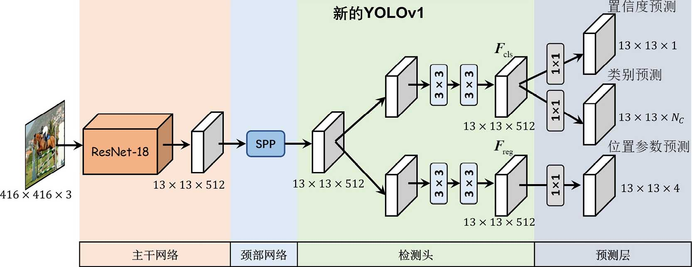

明显需求：不再设计全连接层（FC-L），优化复杂度，减少参数量

---

## 改进主干网络

使用传奇英雄：ResNet网络 代替原来GoogLeNet 风格的主干网络

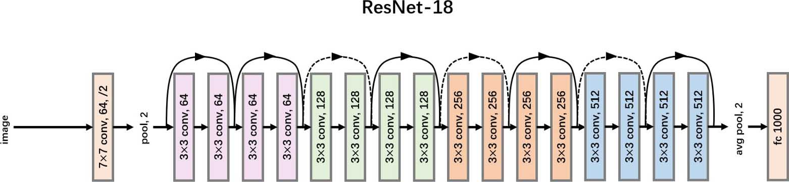

OD任务只需主干提取特征，ResNet-18降采样倍数为32，即会分成 14 × 14 个 grid


<p>明显需求：不再设计全连接层（FC-L）,优化复杂度，减少参数量</p>

<p>改进主干网络</p>

<p>使用传奇英雄：ResNet网络 代替原来GoogLeNet 风格的主干网络</p>


<p>OD任务只需主干提取特征，ResNet −18降采样倍数为32， 即会分成 14 × 14 个 grid</p>

```python
# YOLO_Tutorial/models/yolov1/yolov1_backbone.py
# --------------------------------------------------------
...
class ResNet(nn.Module):
    def __init__(self, block, layers, zero_init_residual=False):
        super(ResNet, self).__init__()
        self.inplanes=64
        self.conv1=nn.Conv2d(3, 64, kernel_size=7, stride=2, padding=3, bias=False)
        self.bn1=nn.BatchNorm2d(64)
        self.relu=nn.ReLU(inplace=True)
        self.maxpool=nn.MaxPool2d(kernel_size=3, stride=2, padding=1)
        self.layer1=self._make_layer(block, 64, layers[0])
        self.layer2=self._make_layer(block, 128, layers[1], stride=2)
        self.layer3=self._make_layer(block, 256, layers[2], stride=2)
        self.layer4=self._make_layer(block, 512, layers[3], stride=2)
    def forward(self, x):
        c1=self.conv1(x)     # [B, C, H/2, W/2]
        c1=self.bn1(c1)      # [B, C, H/2, W/2]
        c1=self.relu(c1)     # [B, C, H/2, W/2]
        c2=self.maxpool(c1)  # [B, C, H/4, W/4]
        c2=self.layer1(c2)   # [B, C, H/4, W/4]
        c3=self.layer2(c2)   # [B, C, H/8, W/8]
        c4=self.layer3(c3)   # [B, C, H/16, W/16]
        c5=self.layer4(c4)   # [B, C, H/32, W/32]
        return c5
```

```python
self.layer2=self._make_layer(block, 128, layers[1], stride=2)
        self.layer3=self._make_layer(block, 256, layers[2], stride=2)
        self.layer4=self._make_layer(block, 512, layers[3], stride=2)
    def forward(self, x):
        c1=self.conv1(x)     # [B, C, H/2, W/2]
        c1=self.bn1(c1)      # [B, C, H/2, W/2]
        c1=self.relu(c1)     # [B, C, H/2, W/2]
        c2=self.maxpool(c1)  # [B, C, H/4, W/4]
        c2=self.layer1(c2)   # [B, C, H/4, W/4]
        c3=self.layer2(c2)   # [B, C, H/8, W/8]
        c4=self.layer3(c3)   # [B, C, H/16, W/16]
        c5=self.layer4(c4)   # [B, C, H/32, W/32]
        return c5
```

---

## 特征图处理理解

~~、、、、输入的特征图会先被一层1 × 1卷积处理，其通道数会被压缩一半，随后再由一层5 × 5最大池化层连续处理三次，依据感受野的原理，该处理方式等价于分别使用5 × 5、9 × 9和 13 × 13 最大池化层并行地处理特征图。最后，将所有处理后的特征图沿通道拼接，再由另一层 1 × 1 卷积做一次输出的映射，将其通道映射至指定数目的输出通道。

---

## 修改检测头

在原YOLOv1中检测头部分为 FC-L ，现在我们希望改为CNN结构。

当前主流的检测头是解耦检测头，因此，我们也采用解耦检测头作为YOLOv1的检测头，由类别分支和回归分支组成，分别提取类别特征和位置特征（抄的，我没有深入了解过）。

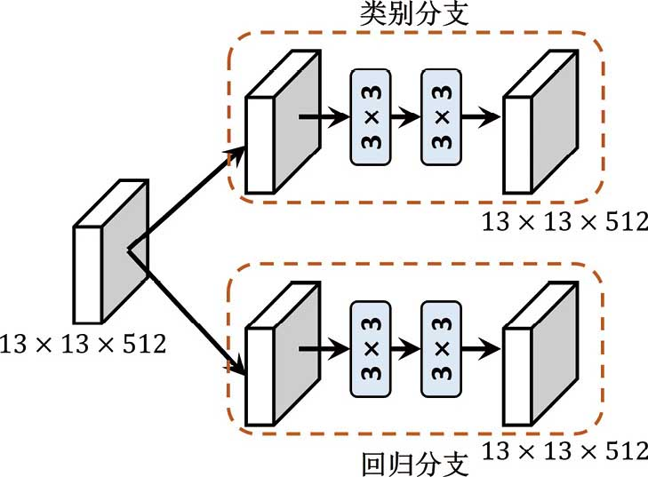

```python
# YOLO_Tutorial/models/yolov1/yolov1_head.py
# --------------------------------------------------------
...
class DecoupledHead(nn.Module):
    def __init__(self, cfg, in_dim, out_dim, num_classes=80):
        super().__init__()
        print('==============================')
        print('Head: Decoupled Head')
        self.in_dim=in_dim
        self.num_cls_head=cfg['num_cls_head']
        self.num_reg_head=cfg['num_reg_head']
        self.act_type=cfg['head_act']
        self.norm_type=cfg['head_norm']
        # cls head
        cls_feats=[]
        self.cls_out_dim=max(out_dim, num_classes)
        for i in range(cfg['num_cls_head']):
            if i==0:
                cls_feats.append(
                    Conv(in_dim, self.cls_out_dim, k=3, p=1, s=1,
                        act_type=self.act_type,
                        norm_type=self.norm_type,
                        depthwise=cfg['head_depthwise'])
                        )
            else:
                cls_feats.append(
                    Conv(self.cls_out_dim, self.cls_out_dim, k=3, p=1, s=1,
                        act_type=self.act_type,
                        norm_type=self.norm_type,
                        depthwise=cfg['head_depthwise'])
                        )
        # reg head
        reg_feats=[]
        self.reg_out_dim=max(out_dim, 64)
        for i in range(cfg['num_reg_head']):
            if i==0:
                reg_feats.append(
                    Conv(in_dim, self.reg_out_dim, k=3, p=1, s=1,
                        act_type=self.act_type,
                        norm_type=self.norm_type,
                        depthwise=cfg['head_depthwise'])
                        )
            else:
                reg_feats.append(
                    Conv(self.reg_out_dim, self.reg_out_dim, k=3, p=1, s=1,
                        act_type=self.act_type,
                        norm_type=self.norm_type,
                        depthwise=cfg['head_depthwise'])
                        )
        self.cls_feats=nn.Sequential(*cls_feats)
        self.reg_feats=nn.Sequential(*reg_feats)
    def forward(self, x):
        cls_feats=self.cls_feats(x)
        reg_feats=self.reg_feats(x)
        return cls_feats, reg_feats
```

```python
print('==============================')
        print('Head: Decoupled Head')
        self.in_dim=in_dim
        self.num_cls_head=cfg['num_cls_head']
        self.num_reg_head=cfg['num_reg_head']
        self.act_type=cfg['head_act']
        self.norm_type=cfg['head_norm']
        # cls head
        cls_feats=[]
        self.cls_out_dim=max(out_dim, num_classes)
        for i in range(cfg['num_cls_head']):
            if i==0:
                cls_feats.append(
                    Conv(in_dim, self.cls_out_dim, k=3, p=1, s=1,
                        act_type=self.act_type,
                        norm_type=self.norm_type,
                        depthwise=cfg['head_depthwise'])
                        )
            else:
```

```python
cls_feats.append(
                    Conv(self.cls_out_dim, self.cls_out_dim, k=3, p=1, s=1,
                        act_type=self.act_type,
                        norm_type=self.norm_type,
                        depthwise=cfg['head_depthwise'])
                        )
        # reg head
        reg_feats=[]
        self.reg_out_dim=max(out_dim, 64)
        for i in range(cfg['num_reg_head']):
            if i==0:
                reg_feats.append(
                    Conv(in_dim, self.reg_out_dim, k=3, p=1, s=1,
                        act_type=self.act_type,
                        norm_type=self.norm_type,
                        depthwise=cfg['head_depthwise'])
                        )
            else:
                reg_feats.append(
                    Conv(self.reg_out_dim, self.reg_out_dim, k=3, p=1, s=1,
                        act_type=self.act_type,
                        norm_type=self.norm_type,
                        depthwise=cfg['head_depthwise'])
                        )
        self.cls_feats=nn.Sequential(*cls_feats)
        self.reg_feats=nn.Sequential(*reg_feats)
    def forward(self, x):
        cls_feats=self.cls_feats(x)
        reg_feats=self.reg_feats(x)
        return cls_feats, reg_feats
```

---

## 修改预测层

在最后的预测层，采用当下主流的做法，即使用1 × 1 的卷积层在特征图上做预测。

使用卷积操作在特征图上做预测，恰好和YOLOv1的"逐网格找物体"这一检测思想对应。

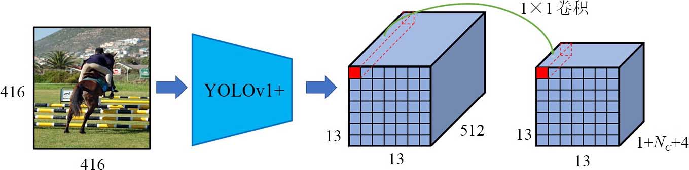

令每个grid只需输出1个边界框（完全没有问题）。

---

## 对应解耦检测头

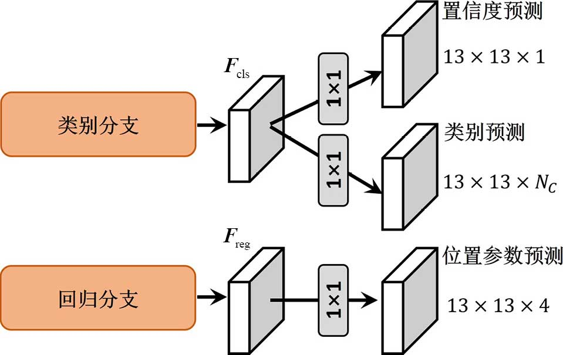

### 边界框置信度

我们暂时采用简单的二分类标签0/1作为置信度的学习标签。这样改进并不表示二分类标签比将IoU作为学习标签的方法更好，而仅仅是图方便，省去了在训练过程中计算IoU的麻烦。

避免输出超过值域，我们使用Sigmoid函数将网络的置信度输出映射到0～1范围内。

### 类别置信度

类别特征将分别被用于有无目标的检测和类别分类两个子任务中。类别置信度显然也在0～1范围内，因此我们使用Sigmoid函数来输出对每个类别置信度的预测。

### 边界框位置参数

边界框位置参数的预测。自然地，我们使用位置特征 Freg ∈R13×13×512 来完成边界框位置参数的预测。我们已经知道，边界框的中心点偏差 (tx, ty) 的值域是0～1，因此，我们也对网络输出的中心点偏差tx和ty使用Sigmoid函数。另外两个参数w和h是非负数，这也就意味着，我们必须保证网络输出的这两个量是非负数，否则没有意义。一种办法是用ReLU函数来保证这一点，然而ReLU的负半轴梯度为0，无法回传梯度，有"死元"的潜在风险。另一种办法则是仍使用线性输出，但添加一个不小于0的不等式约束。但不论是哪一种方法，都存在约束问题，这一点往往是不利于训练优化的。为了解决这一问题，我们采用指数函数来处理，该方法既能保证输出范围是实数域，又是全局可微的，不需要额外的不等式约束。两个参数w和h的计算如下所示，其中，指数函数外部乘了网络的输出步长S，这就意味着预测的tw和th都是相对于网格尺度来表示的。


公式优化如下：

$$
w = s \times e^{t_w}
$$

$$
h = s \times e^{t_h}
$$

---

## 修改 loss function

### 1. 置信度损失

<p>首先，修改置信度损失。由于置信度的输出经过Sigmoid函数的处理，因此我们采用二元交叉熵</p>

<p>（binary cross entropy, BCE）函数来计算置信度损失，如公式所示，其中，Npos 是正样本的数量。</p>


$$
L_{conf} = - \frac{1}{N_{pos}} \sum_{i=1}^{S^2} \left[ (1-\hat{C}_i) \log(1-C_i) + \hat{C}_i \log(C_i) \right]
$$

<p>2. 类别损失</p>

<p>接着是修改类别置信度的损失函数。由于类别预测中的每个类别置信度都经过Sigmoid函数的处理，因<br/>此，我们同样采用BCE函数来计算类别损失，如下所示。</p>


$$
L_{cls} = - \frac{1}{N_{pos}} \sum_{i=1}^{S^2} \sum_{c=1}^{N_C} I_{obj}^i \left[ (1-\hat{p}_{ci}) \log(1-p_{ci}) + \hat{p}_{ci} \log(p_{ci}) \right]
$$

<p>3. 边界框位置参数的损失</p>

<p>对于位置损失，我们采用更主流的办法。具体来说，我们首先根据预测的中心点偏差以及宽和高来得到</p>

<p>预测框 Bpred，然后计算预测框 Bpred 与目标框 Bgt 的GIoU (generalized IoU) ，最后，使用线性GIoU<br/>损失函数去计算位置参数损失，如下所示。</p>


$$
L_{reg} = \frac{1}{N_{pos}} \sum_{i=1}^{S^2} I_{obj}^i \left[ 1 - GIoU(B_{pred}, B_{gt}) \right]
$$

<p>4. 总的损失</p>

<p>最后，将公式加起来便得到完整的损失函数，如下所示，其中，λreg 是位置参数损失的权重，默认为</p>

<p>5。</p>


$$
L_{loss} = L_{conf} + L_{cls} + \lambda_{reg} L_{reg}
$$
